# 一 计算机系统概述

# 二 进程与线程

## 2.4 调度算法

### 2.4.1 先来先服务(FCFS)

- 算法思想：主要从公平角度考虑
- 算法规则：按照作业/进程到达的先后顺序进行服务

- 用于作业/进程调度：用于作业调度时，考虑的是哪个作业先到达后备队列；用于进程调度时，考虑的是哪个进程先到达就绪队列。


先来先服务调度算法：按照到达的先后顺序调度，事实上就是等待时间越久的越优先得到服务。

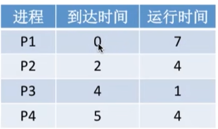

比如上如的调度顺序未：P1->P2->P3->P4

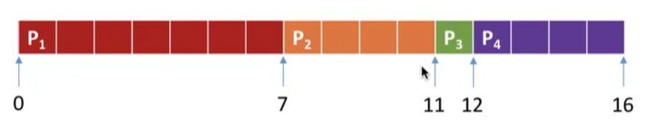

- **周转时间 = 完成时间 -到达时间**
  - P1 = 7 - 0 = 7
  - P2 = 11 - 2 = 9
  - P3 = 12 - 4 = 8
  - P4 = 16 - 5 = 11
- **带权周转时间 = 周转时间  / 运行时间 **
  - P1 = (7 - 0) / 7 = 1
  - P2 = (11-2) / 4 = 2.25
  - P3 = (12-4) /1 = 8
  - P4 = (16-5) / 4 = 2.75

- **等待时间 = 周转时间 - 运行时间 **
  - P1 = 7 - 7 = 0
  - P2 = 9 - 4 = 5
  - P3 = 8 - 1 = 7
  - P4 = 11 - 4 = 7

- 优点：公平，算法实现简单
- 缺点：排在长作业(进程)后面的短作业需要等待很长时间，带权周转时间很大，对短作业来说用户体验很不好。即FCFS算法对**长作业有利，对短作业不利**


- 是否会导致饥饿：先来先服务算法不会导致饥饿（某作业长期得不到服务）
- 是否可抢占：非抢占是算法


### 2.4.2 短作业优先(SJF)

- 算法思想：追求最少的平均等待时间，最少的平均周转时间、最少的平均带权周转时间
- 算法规则：最短的作业/进程优先得到服务（所谓：最短，是指要求服务时间最短）
- 用于作业/进程调度：既可用于作业调度，也可用于进程调度。用于进程调度时，称为“短进程优先算法”(SPF)

- 是否可抢占：SJF和SPF是**非抢占**算法。但是**也有抢占式的版本--最短剩余时间优先算法**（SRTN)

例题：求下图的等待时间、平均等待时间、周转时间、平均周转时间、带权周转时间、平均带权周转时间


短作业/进程优先调度算法：每次调度时选择**当前已到达**且运行时间最短的作业/进程

调度顺序为：P1 -> P3 -> P2 -> P4 ( p1是最先到达的，P1结束的时候P3和P2都在等待了，优先选P3)

- 周转时间 = 完成时间 - 到达时间
  - P1 = 7 - 0 = 7
  - P2 = 12 - 2 = 10
  - P3 = 8 -2 = 6
  - P4 = 16 - 5 = 11
- 带权周转时间 = 周转时间 / 运行时间
  - P1 = 7 / 7 = 1
  - P2 = 10 / 4 = 2.5
  - P3 = 6 / 1 = 6
  - P4 = 11 / 4 = 2.75
- 等待时间 = 周转时间 - 运行时间
  - P1 = 7 - 7 = 0
  - P2 = 10 - 4 = 6
  - P3 = 6 - 1 = 5
  - P4 = 11 - 4 = 7


如果该短作业优先是抢占式短作业优先算法那么调度的各个情况如下

- 0时刻 : **P1(7)**
- 2时刻:  P1(5)、**P2（4）**
- 4时刻：P1(5)、P2（2）、**P3（1）**
- 5时刻：P1(5)、**P2（2）**、P4（4）

- 7时刻：P1(5)、**P4(4)**
- 11时刻：P1(5)
- 16时刻；全部执行完 


注意几个小细节

- 如果题目中**未特别说明** ，所提到的短作业/短进程优先算法 默认都是**非抢占的**
- 很多书上都会说,SJF调度算法的平均等待时间、平均周转时间最少
- 其实通过上面的例子可以知道 最短剩余时间优先算法得到的平均等待时间和平均周转时间还少。


- 优缺点
  - 优点：”最短的“ 平均等待时间、平均周转时间
  - 缺点：不公平。对短作业有利，对长作业不利。可能产生饥饿现象。
- 是否会导致饥饿：会。如果源源不断的有短作业到来，可能让长作业长时间得不到服务，产生 饥饿 现象。如果一直得不到服务，则称之为 饿死

### 2.4.3 高响应比优先(HRRN)

- 算法思想：要综合考虑作业/进程的等待时间和要求服务的时间
- 算法规则：在每次调度时先计算各个作业/进程的**响应比**，选择**响应比最高的**作业/进程为其服务
  - 响应比 = (等待时间 + 要求服务时间) / 要求服务时间 ≥ 1
- 用于作业/进程调度 ： 既可以用于作业调度，也可以用于进程调度
- 是否可抢占 ： **非抢占式**算法。因此只有当前运行的作业/进程主动放弃处理及时，才需要调度，才需要计算响应比

高响应比优先算法：**非抢占**的调度算法，只有当前运行的进程**主动放弃CPU时**（正常/异常完成，或主动阻塞）才需要进行调度，调度时**计算所有就绪进行的响应比，选响应比最高的**进程上处理及。


0时刻：只有P1到达就绪队列，P1上处理机

7时刻：P1主动放弃CPU，就绪队列有P2 P3 P4 响应比分别为 ((7-2)+4)/4  ((7-4)+1/1)) ((7-5)+4)/4 得出p3是最大的8时刻：P3主动放弃CPU，就绪列队有P2（2.5） P4（1.75）

12时刻：P2主动放弃CPU，开始执行最后一个P4

16时刻：P4主动放弃CPU，结束 


- 优缺点：

  - 优点：综合了前两种算法的优点。对于短作业和长作业都得到了不错的处理，也避免了长作业饥饿问题

  - 缺点：无

- 是否饥饿：不会


知识点回顾和总结

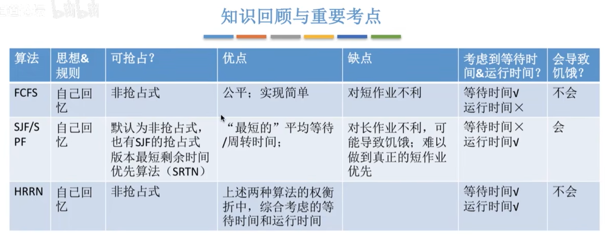

这三种算法主要关心对用户的公平性、平均周转时间、平均等待时间等评价系统整体性能的指标，但是不关系”响应时间“也不区分任务的”紧急程度“，因此对于用户来说，交互性很糟糕。因此这三种算法一般适合用于**早期的批处理系统**，当然，FCFS算法也常结合其他的算法使用。


### 2.4.4 时间片轮转(RR)

- 算法思想：公平地、轮流地为各个进程服务，让每个进程在一定时间间隔内都可以得到响应
- 算法规则：按照各进程到达就绪队列的顺序，轮流让各个进程执行一个**时间片**（如100ms）。若进程未在一个时间片内执行完。则掠夺处理器，将进程重新放到就绪队列队尾重新排队
- 用于作业/进程调度：用于进程调度（只有作业放入内存建立了相应的进程后，才能被分配处理机的时间片）
- 是否可抢占：若进程未能在时间片内运行完，将被强行掠夺处理机使用权，因此时间片轮转调度算法属于**抢占式**的算法。由时钟装置发出**时钟中断**来通知CPU时间片已到

时间片轮转调度算法常用于分时操作系统，更注重响应时间，一般不计算周转时间

例题：各进程到达就绪队列的时间、需要的运行时间如下表所示。使用**RR算法**分析时间片大小分别是2、5时的进程运行情况。

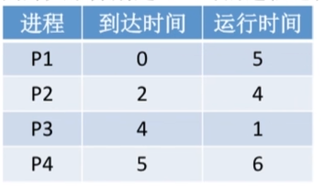

时间片轮转调度算法：轮流让就绪队列中的进程依次执行一个时间片（每次选择的都是排在就绪队列对头的进程）

时间片大小为2：

0时刻：P1(5)

2时刻：P2(4) -> P1(3)

4时刻：P1(3) -> P3(1) -> P2(2)

5时刻:   P1(2) -> P3(1) -> P2(2) -> P4(6)

6时刻：P3(1) -> P2(2) -> P4(6) -> P1(1)

7时刻：P2(2) -> P4(6) -> P1(1)

9时刻：P4(6) -> P1(1)

11时刻: P1(1) -> P4(4)

12时刻: P4(4)

14时刻: P4(2)

16时刻: P4(0) 

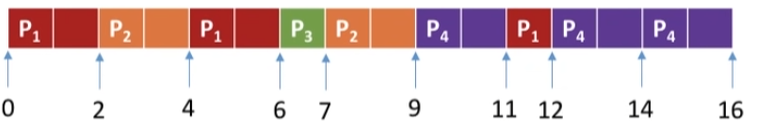

时间片大小为5：

0时刻：P1(5)

5时刻：P2(4) -> P3(1) -> P4(6)

9时刻：P3(1) -> P4(6)

10时刻：P4(6)

15时刻：P4(1)

16时刻：P4(0) 

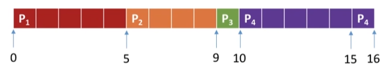

如果**时间片太大**，使得每个进程都可以在一个时间片内就完成，则时间片轮转调度算法**退化为先来先服务**调度算法，并且**会增大进程响应时间**。因此**时间片不能太大**

如果**时间片太小**，会导致**进程切换过于频繁**，系统会花大量的时间来处理进程切换，从而导致实际用于进程执行的时间比例减少。可见**时间片也不能太小**

- 优缺点
  - 优点：公平，响应快，适用于分时系统
  - 缺点：由于高频率的进程切换，因此有一定开销；不区分任务的紧急程度

- 是否会导致饥饿：不会
- 补充：时间片太大和时间片太小会有什么影响？

### 2.4.5 优先级调度算法

- 算法思想：随着计算机的发展，特别是实时操作系统的出现，越来越多的应用场景需要根据任务的紧急程度来决定处理顺序
- 算法规则：每个作业/进程有各自的优先级，调度时选择优先级最高的作业/进程
- 用于作业/进程调度：既可用于作业调度，也可以用于进程调度。甚至，还会用于在之后会学习的IO调度中
- 是否可抢占：抢占式、非抢占式都有。做题时的区别在于：非抢占式只需要在进程主动放弃处理机时进行调度即可，而抢占式还需要在就绪队列变化时，检测是否会发生抢占

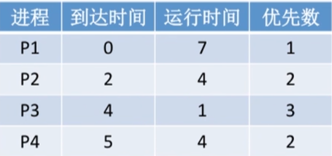

例题：各进程到达就绪队列的时间、需要的运行时间、进程优先数如下标所示。使用**非抢占式**的优先级调度算法，分析进程运行情况

非抢占式的优先级调度算法：每次调度时选择**当前已到达**且**优先级最高**的进程。当前进程**主动放弃处理机时**发生调度

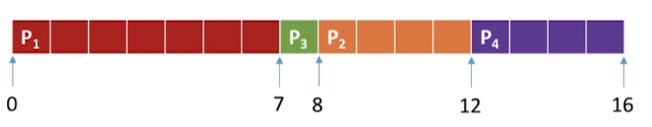


如果是抢占式的

抢占式的优先级调度算法：每次调度时选择**当前已到达**且**优先级最高**的进程。当前进程**主动放弃处理机时**发生调度。另外，当**就绪队列发生改变时**也需要检测是否会发生抢占

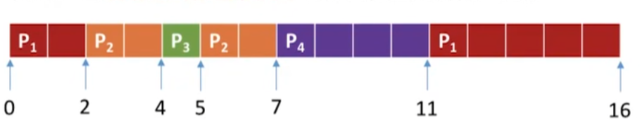

补充

就绪队列未必只有一个，可以按照不同优先级来组织。另外，也可以把优先级高的进程排在更靠近队头的位置

根据优先级是否可以动态改变，可以将优先级分为**静态优先级**和**动态优先级**两种。

静态优先级：创建进程时确定，之后一直不变

动态优先级：创建进程时有一个初始值，之后会根据情况动态地调整优先级

通常

​	系统进程优先级 高于 用户进程优先级

​	前台进程优先级 高于 后台进程优先级

​	操作系统更**偏好IO型进程**


- 优缺点
  - 优点：用优先级区分紧急程度、重要程度，适用于实时操作系统。可灵活地调整对各种作业/进程的偏好程度
  - 缺点：若源源不断地有高优先级进程到来，则可能导致饥饿
- 是否会导致饥饿：会，若源源不断地有高优先级进程到来，则可能导致饥饿


### 2.4.6 多级反馈队列调度算法

- 算法思想：对其他调度算法的折中权衡
- 算法规则：

- 用于作业/进程调度：用于进程调度
- 是否可抢占：**抢占式**的算法。在k级队列的进程运行过程中，若更上级的队列（1~k-1级）中进入了一个新进程，则由于新进程处于优先级更高的队列中，因此新进程会抢占处理机，原来运行的进程放回k级队列队尾。

例题：各进程到达就绪队列的时间、需要的运行时间如下表所示。使用**多级反馈队列**调度算法，分析进程运行的过程

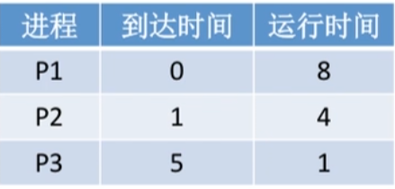

设置多级就绪队列，各级队列**优先级**从**高到低**，**时间片**从**大到小**


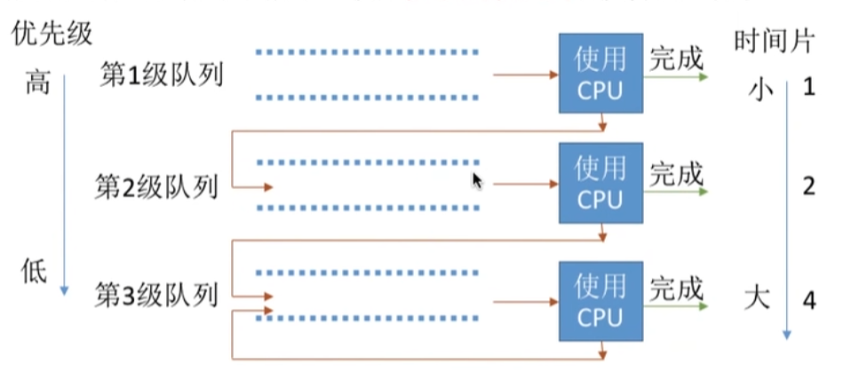

调度过程为

```
p1(1)->p2(1)->p1(2)->p2(1)->p3(1)->p2(2)->p1(4)->p1(1)
```

**新进程**到达时**先进入第1级**队列，按**FCFS原则**排队等待被分配时间片。若用完时间片进程还**未结束**。则进入**下一级**队列队尾。如果此时**已经在最下级**的队列，则**重新返回**最下级队列队尾

只有第**k级队列为空**时。才会**为k+1级**队头的进程**分配时间片被抢占处理机的**进程重新**放回原队列**队尾

- 优缺点
  - 优点：对各类进程相对公平（FCFS)；每个新到达的进程都可以很快得到响应（RR）；短进程只用较少的时间就可完成（SPF的优点）；不必实现估计进程的运行时间（避免用户作假）；可灵活地调整对各类进程的偏好程度，比如CPU密集型进程、IO密集型进程
  - 缺点：一般不说它有缺点，不过可能导致饥饿
- 是否会导致饥饿：会，最低级的队列的，可能会被新来队列的长期抢占


## 2.5 进程同步、进程互斥

- 什么是进程同步

并发必然导致异步性，在异步的时候无法确定顺序性，如何解决这种异步问题就是进程同步所要讨论的内容

**同步**也称**直接制约关系**，它是指为完成某种任务而建立的两种或多个进程，这些进程因为需要在某些位置上**协调**特们的**工作次序**而产生的制约关系。进程间的直接制约关系就是源于他们之间的相互合作

- 什么是进程互斥

进程的 并发 需要 共享的支持。各个并发执行的进程不可避免的需要共享一些系统资源（比如内存，又比如打印机、摄像头这样的io设备）

我们把**一个时间段内只允许一个进程使用**的资源称为**临界资源**。许多物理设备（比如摄像头，打印机）都属于临界资源。此外还有许多变量、数据、内存缓冲区等都属于**临界资源**

对临界资源的访问，必须**互斥**地进行。互斥，也称为**间接制约关系**。**进程互斥**指当一个进程访问某临界资源时，另一个想要访问临界资源的进程必须等待。当前访问临界资源的进程访问结束，释放该资源之后，另一个进程才能去访问临界资源。

**对临界资源的互斥访问，可以逻辑分为四个部分**

- 进入区：负责检查是否可以进入临界区，若可进入，则应该设置**正在访问临界资源的标志**，以阻止其他进程同时进入临界区
- 临界区：访问临界区资源的那段代码
- 退出区：负责解除**正在访问临界资源的标志**（可以理解为解锁）
- 剩余区：做其他处理

注意：

​	**临界区**是进程中**访问临界资源**的代码段

​	**进入区**和**退出区**是**负责实现互斥**的代码段

​	临界区也可称为临界段


- 为了实现对临界资源的互斥访问，同时保证系统整体性能，需要遵循以下原则（★★★★）
  - 空闲让进。 临界区空闲时，可以允许一个请求进入临界区的进程立即进入临界区
  - 忙则等待。当已有进程进入临界区时，其他试图进入临界区的进程必须等待
  - 有限等待。对请求访问的进程，应保证能在有限时间内进入临界区（保证不会饥饿）
  - 让权等待。当进程不能进入临界区，应立即释放处理机，防止进程忙等待


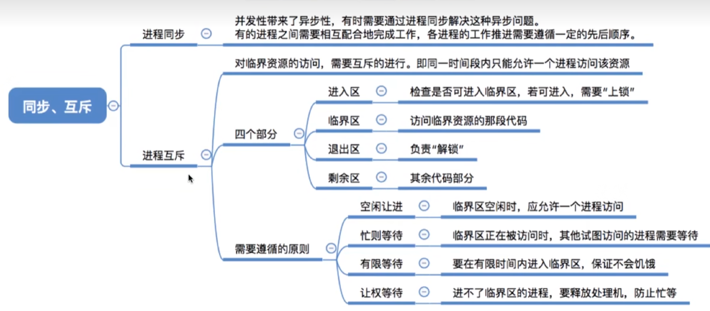

## 2.6 进程互斥的软件实现方法


### 2.6.1 单标志法

- 算法思想：两个进程在**访问完临界区后**会把使用临界区的权限转交给另一个进程。也就是说**每个进程进入临界区的权限只能被另一个进程赋予**

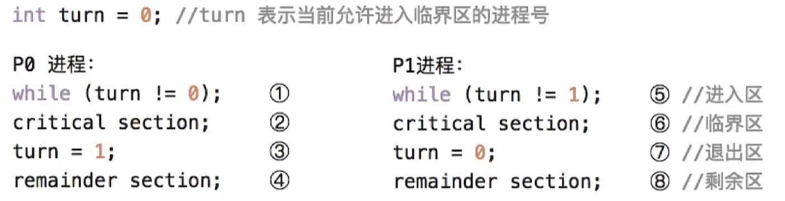

对于临界区分访问一定是P0 -> P1 -> P0 -> P1 这样轮流访问。这种轮流访问带来的问题是。如果此时允许进入临界区的是P0,而P0一直不访问临界区，那么虽然此时临界区空闲，但是不允许p1访问。

因此单标志法存在一个问题就是违背了 **“空闲让进”**原则

### 2.6.2 双标志先检测法

- 算法思想：设置一个布尔型数组flag[],数组中各个元素用来**标记各进程想进入临界区的意愿**，比如	“FLAG[0]=TRUE” 意味着0号进程P0现在想要进入临界区。每个进程在进入临界区之前先检查当前有没有别的进程想进入临界区，如果没有，则把自身对应的标志flag[i]设为true,之后开始访问临界区。

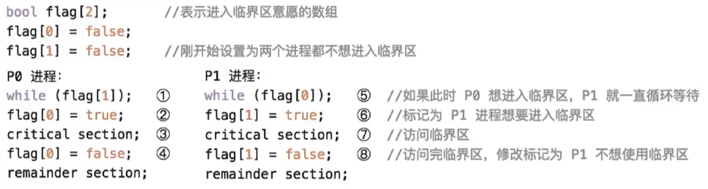

双标志先检查法的**主要问题**是：违反**忙则等待**原本则

如果是按照 1 5 2 6 3 7 顺序执行，那么将会同时访问临界区

原因在于 **检查**（5） 和 **上锁（6）** 两个处理不是一气呵成，在检查后，上锁前，可能会发生**进程切换**


2.6.3 双标志后检测法

- 算法思想：双标志先检查法的改版。前一个算法的问题是先 “检查” 后 “上锁”，但是这两个操作又没法一气呵成，因此出现了两个进程同时进入临界区的问题。因此，人们又想到先 “上锁” 后 “检查” 的方法来避免上述问题

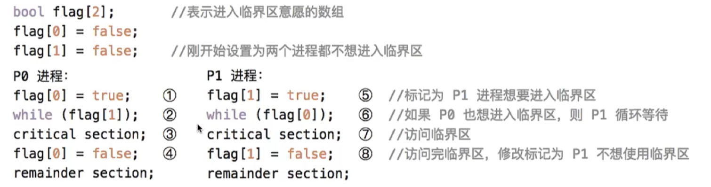

但是这种也不行，如果是按照 1 5 2 6 顺序执行，P0和P1都无法进入临界区

因此，虽然这种解决了 **忙则等待** 原则，但是又违背了 **空闲让进** 和 **有限等待**

会因各进程长期无法访问临界资源而产生 **饿死**现象


#### 2.6.4 Peterson算法

- 算法思想：双标志后检查法中，两个进程都想着进入临界区，但是谁也不让谁，最后谁也无法进入。Gray L.Peterson想到了一种方法，如果双方都争着想进入临界区，那可以让进程尝试 **孔融让梨**，主动让对方先使用临界区

Peterson算法用软件方法解决了进程互斥的问题，**遵循了空闲让进、忙则等待、有限等待**三个原则，但是未遵守**让权等待**原则

Peteson算法相较于之前的三种软件解决方案来说，是最好的，但是依然不够好

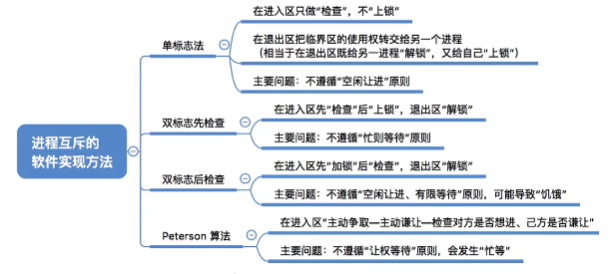


## 2.7 进程互斥的硬件实现方法


### 2.7.1 中断屏蔽方法

利用“开/关中断指令”实现（与原语的实现思想相同，即在某进程开始访问临界区到结束访问为止都不允许被中断，也就不能发生进程切换，因此也不可能发生两个同时访问临界区的情况）

- 优点：简单、高效

- 缺点：不适用于多处理机，只适用于操作系统内核进程，不适用于用户进程（因为开/关中断指令只能运行在内核态，这组指令如果能让用户随意使用会很危险）

### 2.7.2 TestAndSet(TS指令/TSL指令)

简称TS指令，也有地方称为TestAndLock指令，或TSL指令

TSL指令**是用硬件实现的**，执行的过程中不允许被中断，只能一气呵成。

相比软件的实现方法，TSL指令把 “上锁” 和 “检查” 操作用硬件的方式变成了一气呵成的原子操作。

- 优点：实现简单，无需像软件实现方法那样严格检查是否会有逻辑漏洞：适用于多处理机环境
- 缺点：不满足 ”让权等待“ 原则，暂时无法进入临界区的进程会占用CPU并循环执行TSL指令，从而导致”忙等“

### 2.7.3 Swap指令(XCHG指令) 

有的地方也叫**Exchange指令**，或者简称**XCHG**指令。

Swap指令**是用硬件实现的**，执行的过程中不允许中断，只能一气呵成。

逻辑上Swap和TSL并无大区别

- 优点：实现简单，无需像软件实现方法那样严格检查是否会有逻辑漏洞：适用于多处理机环境
- 缺点：不满足 ”让权等待“ 原则，暂时无法进入临界区的进程会占用CPU并循环执行TSL指令，从而导致”忙等“


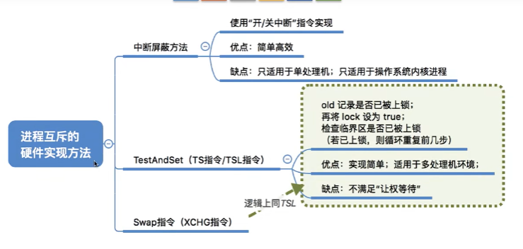

## 2.8 信号量机制

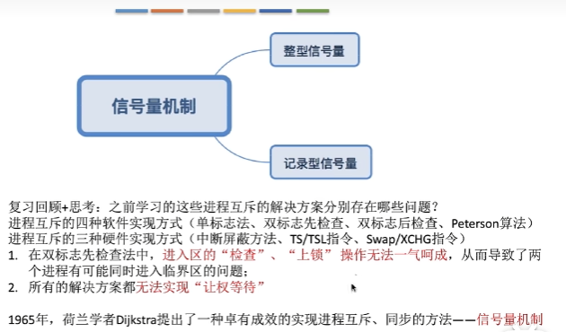

用户进程可以通过使用操作系统提供的**一对原语**来对**信号量**进行操作，从而很方便的实现了进程互斥、进程同步。

**信号量**其实就是一个变量（可以是一个证书，也可以是更复杂的记录型变量），可以用一个信号量来**表示系统中某种资源的数量**，比如：系统中只有一台打印机，就可以设置一个初值为1的信号量

**原语**是一种特殊的程序段，其**执行只能一气呵成，不可被中断**。原语是由**关中断/开中断指令**实现的。软件解决方案的主要问题是由”进入区的各种操作无法一气呵成“，因此如果能把进入区、退出区的操作都用 ”原语“ 实现，使这些操作能 ”一气呵成“ 就能避免问题。

**一对原语：wait(S)**原语和**signal(S)**原语，可以把原语理解为我们自己写的函数，函数名分别为 wait 和 signal，括号里的 **信号量S** 其他就是函数调用时传入的一个参数

wait、signal原语常常**简称PV操作** .因此，做题的时候常把wait(S)\signal(S) 分别写为**P(S) V(S)**

### 2.8.1 整型信号量

用一个**整数型的变量**作为信号量，用来**表示系统中某种资源的数量**

与普通整数变量的区别：对信号量的操作只有三种，即 **初始化** 、**P操作** 、**V操作**

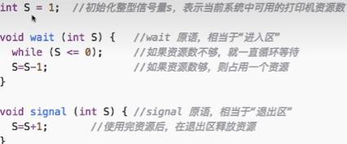

```c
void wait(int S){ //相当于进入区
    while(S <= 0); // wait 资源不足，一直等待
    S=S-1; // 资源足够，占用一个资源
}
void signal(int S){ //相当于退出区
    S=S+1; // 释放一个资源
}
```

### 2.8.2 记录型信号量

整型信号量的缺陷是存在 ”忙等“ 问题，因此人们又提出了 ”记录行信号量“，即用记录型数据结构表示的信号量。

```c
/*记录型信号量的定义*/
typedef struct{
    int value; 		   // 剩余资源数
    struct process *L; // 等待队列
}semaphore; 
```

```c
/*某进程需要使用资源时，通过wait原语申请*/
void wait(semaphore S){
    S.value--;
    if(S.value<0){
        block(S.L); // 如果剩余资源数不够，使用block原语使进程从运行态进入阻塞态，并把挂到信号量S的等待队列（即阻塞队列）中  
    }
}
```

```c
/*进程使用完资源后，通过signal原语释放*/
void signal(semaphore S){
    S.value++;
    if(S.value<=0){
        wakeup(S.L);//释放资源后，若还有别的进程再等待这种资源，则使用wakeup原语唤醒等待队列中的 **一个进程**，使进程从 **阻塞态变为就绪态**
    }
}

// 注意 S.value = 0 资源恰好分完
// S.value = -1 表示1个进程在等待
// S.value = -2 表示2个进程在等待
```

该机制**遵守了 ”让权等待“ 原则** 不会出现 ”忙等“

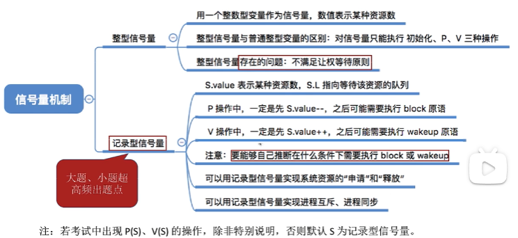

### 2.8.3 信号量机制实现进程互斥

- 1.**分析并发进程的关键活动，划定临界区（如：对临界资源打印机的访问就应放临界区）**

- 2.设置**互斥信号量**mutex，**初始值为1**

```c
/*信号量机制实现互斥*/
semaphore mutex=1; // 初始化信号量
P1(){
    ...
    P(mutex); // 使用临界资源前需要加锁
    临界区代码段...
    V(mutex); // 使用临界资源后需要解锁
    ...
}
P2(){
    ...
    P(mutex);
    临界区代码段...
    V(mutex);
    ...
}
```

- 3.在临界区之前执行P(mutex)
- 4.在临界区之后执行V(mutex)

注意：对**不同的临界资源**需要**设置不同的互斥信号量**。

**PV操作必须成对出现**。缺少P就不能保证临界资源的互斥访问。缺少V（mutex）会导致资源永不释放，等待进程永不唤醒

### 2.8.4 信号量机制实现进程同步

进程同步：要让各并发进程按要求有序地推进。

 由于存在异步性，进程交替执行的次序是不可确定的

我们有时候必须要保证这个顺序。就需要进程同步


- 用信号量实现进程同步：
  1. 分析什么地方需要实现”同步关系“，即必须保证 ”一前一后“执行的两个操作（或两句代码）
  2. 设置**同步信号量S，初始值为0**
  3. **在”前操作“之后执行V(S)**
  4. **在”后操作“之前执行P(S)**

```c
/*信号量机制实现同步*/
semaphore S=0; //初始化同步信号量，初始值为0
```

下列代码可以让**代码2一定比代码4先执行**，因为如果不执行V(S) ，是无法通过P(S)的，如果要执行V（S)必须要经过代码2，代码毕竟是从上往下走的。而走了V(S)才会唤醒P（S)才可以执行代码4

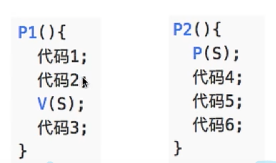


### 2.8.5 信号量机制实现前驱关系

进程P1中有句代码S1,P2中有句代码S2...P3...P6中有句代码S6.这些代码要求如下前驱图所示的顺序来执行

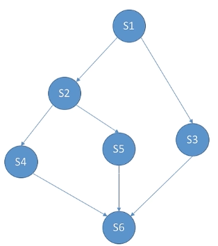

```c
P1(){
    ...
    S1;
    V(a);
    V(b);
    ...
}
P2(){
    ...
    P(a);
    S2
    V(c);
    V(d);
    ...
}
P3(){
    ...;
    P(b);
    S3;
    V(d);
    ...;
}
P4(){
    ...;
    P(c);
    S4;
    V(e);
    ...;
}
P5(){
    ...;
    P(d);
    S5;
    V(f);
    ...
}
P6(){
    ...;
    P(e);
    P(f);
    P(g);
    S6;
    ...
}
```


其实每一对前驱关系都是一个进程同步问题，因此

1. 要**为每一对前驱关系各设置一个同步变量**
2. **在”前操作“之后对相应的同步变量执行V操作**
3. **在”后操作“之前对相应的同步变量执行P操作**


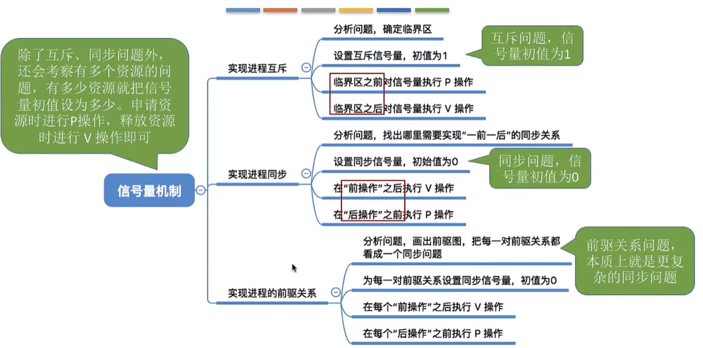


## 2.9 生产者-消费者问题 ★

- 问题描述：系统中有一组**生产者进程**和一组**消费者进程**，**生产者进程**每次生产一个产品放入**缓冲区**，消费者进程每次从**缓冲区**中取出一个产品并使用。（注：这里的”产品“理解为某种数据）

生产者、消费者共享一个**初始为空、大小为n**的缓冲区

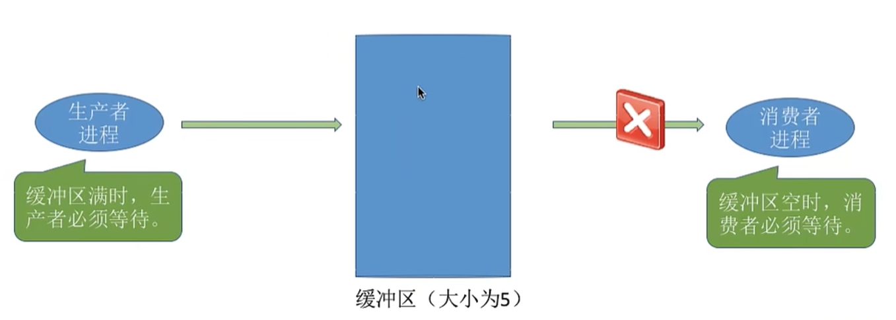

只有**缓冲区没满**时，生产者才能把产品放入缓冲区，否则必须等待

只有**缓冲区不空**时，消费者才能从中取出产品，否则必须等待

缓冲区是**临界资源**，各进程必须**互斥地访问**

如何用信号量机制（pv操作）实现生产者、消费者进程的这些功能呢？

信号量机制可实现互斥（设置初值为1的互斥信号量）、同步（设置初值为0的同步信号量实现”一前一后“）、对一类系统资源的申请和释放。

- PV操作题目分析步骤
  1. 关系分析。找出题目中描述的各个进程，分析他们之间的同步、互斥关系
  2. 整理思路。根据各进程的操作流程确定P、V操作的大致顺序。
     1. 生产者每次要消耗(P)一个空闲缓冲区，并生产（V)一个产品。
     2. 消费者每次要消耗(P)一个产品，并释放一个空闲缓冲区（V).
     3. 往缓冲区放入/取走产品需要互斥
  3. 设置信号量。设置需要的信号量，并根据题目条件确定信号量初始值。（互斥信号量初始值一般为1，同步信号量的初始值要看对应资源的初始值是多少）

```c
semaphore mutex = 1; // 互斥信号量，实现对缓冲区的互斥访问
semaphore empty = n; // 同步信号量，表示空闲缓冲区的数量
semaphore full = 0; // 同步信号量，表示产品的数量，也即非空缓冲区的数量

producer(){
    while(1){
        生产一个产品;
        P(empty); // 检查此时是否有空闲缓冲区，有则消耗一个空闲缓冲区
        P(mutex) // 实现互斥访问P
        把产品放入缓冲区;
        V(mutex) // 实现互斥访问V
        V(full);// 增加一个产品
    }
}

consumer(){
    while(1){
        P(full); // 查看此时是否有产品，有则消耗一个产品
        P(mutex); // 实现互斥访问P
        从缓冲区取出一个产品;
 		V(mutex); // 实现互斥访问V
        V(empty); // 释放（增加）一个空闲缓冲区
        使用产品;
    }
}
```

思考：**能否改变相邻PV操作的顺序？**

```c
producer(){
    while(1){
        生产一个产品;
        P(mutex); // 实现互斥访问P    1.
        P(empty); // 空闲区-1		 2.
        
      	把产品放入缓冲区;
        V(mutex); // 实现互访问V
        V(full); // 产品+1
    }
}

consumer(){
    while(1){
        P(mutex); // 实现互斥访问P		3.
        P(full); // 产品-1				4.
        从缓冲区取出一个产品;
        V(mutex); // 实现互斥访问V
        V(empty); // 空闲区+1
        使用产品;
    }
}
```

假设此时 empty = 0  full = n

那么按照 1234 的顺序执行

- 当执行到1时候 mutex由1改为0

- 当执行到2时候由于空闲区empty=0无法使用，需要等consumer的v(empty)才行，自动阻塞，跳转到3
- 当执行到3时候由于mutex本身是0无法进入，需要等待producer执行V(mutex)才行，所以也无法执行
- 这样producer 和 consumer 都无法执行，互相等待对方的释放，于是就照成了 **死锁**

因此，**实现互斥的P操作一定要在实现同步的P操作之后**否则可能发生**死锁**

**V操作不会导致问题，因此两个V操作的顺序可以交换**


- 思考：能否将 生产一个产品，和 使用产品 两段代码放到PV中间？
  - 可以是可以，但是不建议这样会浪费临界区的时间，进程之间的并发度会降低


## 2.10 多生产者-多消费者问题

问题描述：桌子上有一只盘子，每次只能向其中放入一个水果。爸爸专向盘子中放苹果，妈妈专向盘子中放橘子，儿子专等着吃盘子中的橘子，女儿转等着吃盘子中的苹果。只有盘子是空的时候，爸爸或者妈妈才可向盘子中放一个水果。仅当盘子中有自己需要的水果时，儿子或者女儿可以从盘子中取出水果。用PV操作实现上述过程

1. 关系分析。找出题目中描述的各个进程，分析他们之间的同步、互斥关系
   - 互斥关系：对缓冲区（盘子）的访问要互斥进行
   - 同步关系：
     - 父亲将苹果放入盘子后，女儿才能取苹果
     - 母亲将橘子放入盘子后，儿子才能取橘子
     - 只有**盘子为空**的时，父亲和母亲才能放水果
2. 整理思路。根据各进程的操作流程确定P、V操作的大致顺序
   - 互斥：在临界区前后分别PV
   - 同步：前V后P
3. 设置信号量。设置需要的信号量，并根据题目条件确定信号量初值。（互斥信号量初值一般为1，同步信号量的初始值要看对应资源的初值是多少）

```c
semaphore mutex = 1;
semaphore apple = 0;
semaphore orange = 0;
semaphore plate = 1; // 盘子还可以放多少个水果

dad(){
    while(1){
        准备一个苹果;
    	P(plate); // 检查盘子是否可以放； 盘子-1
        P(mutex);
    	把苹果放入盘子;
        V(mutex);
        V(apple); // 苹果+1
    }
    
}

mom(){
    while(1){
        准备一个橘子;
        P(plate); // 盘子-1
        P(mutex);
        把橘子放入盘子;
        V(mutex);
        V(orange); // 橘子+1
    }
}

daughter(){
    while(1){
        P(apple); // 苹果-1
        P(mutex);
        从盘中取出苹果;
        V(mutex);
        V(plate)： // 盘子+1
        吃掉苹果;
    }
}

son(){
    while(1){
        从盘中取出橘子;
        P(orange); //橘子-1
        P(mutex);
        吃掉橘子;
        V(mutex);
        V(plate); // 盘子+1
    }
}
```


思考:是否可以不设置 互斥变量mutex

结论：可以，在这个问题中，即使不设置互斥变量mutex,也不会出现多个进程同时访问盘子的现象

原因在于：本题中缓冲大小为1，在任何时刻，apple、orange、plate三个同步信号量最多只有1.因此在任何时刻，最多只有一个进程的P操作不会被阻塞，并顺利地进入临界区


总结：在**生产者-消费者问题中**。如果缓冲区**大小为1**，那么有可能不需要设置**互斥信号量**就可以实现互斥访问缓冲区的功能。当然，这不是绝对的，具体要看问题分析。

建议：在考试中如果来不及仔细分析，可以加上**互斥信号量**，保证各进程一定会互斥的访问缓冲区。但是需要注意的是，实现互斥的P操作一定要在同步的P操作之后，否则会引起**死锁**

## 2.11 吸烟者问题（欠）

- 问题描述：假设一个系统有**三个吸烟者进程**和**一个供应者进程**。每个抽烟者不停地卷烟并抽掉它，但是要卷起并抽掉一支烟，抽烟者需要有三种材料：烟草、纸、胶水。三个抽烟者中，**第一个拥有烟草、第二个拥有纸、第三个拥有胶水**。供应者进程无限地供应三种材料，供应者每次将两种材料放桌子上，**拥有剩下那种材料的抽烟者卷一根烟并抽调他**，并**给供应者进程一个信号告诉完成了**，供应者就会放另外两种材料在桌上，这个过程一直重复（**让三个抽烟者轮流地抽烟**）

本质上这题也属于**生产者-消费者**问题，更详细的说法应该是**”可生产多种产品的单生产者-多消费者“**

1. 关系分析。找出题目中描述的各个进程，分析他们之间的同步、互斥关系
2. 整理思路。根据各进程的操作流程确定P、V操作的大致顺序
3. 设置信号量。设置需要的信号量，并根据题目条件确定信号量初始值。


## 2.12 读者-写者问题（欠）

## 2.13 哲学家进餐问题（欠）

## 2.14 管程（欠）

## 2.15 死锁的概念

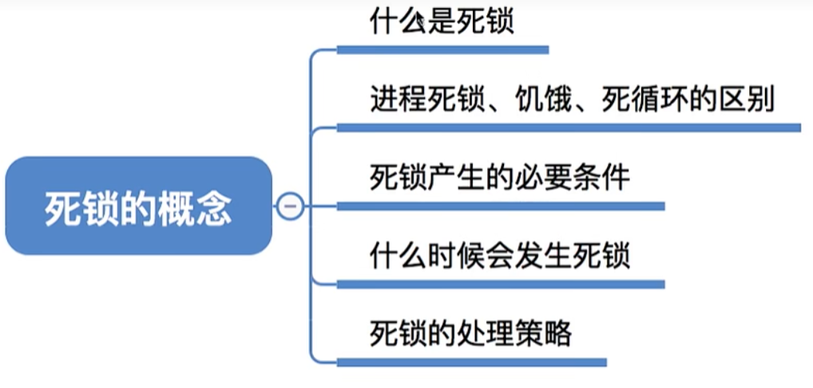

- 死锁：各进程互相等待对方手里的资源，导致各进程阻塞，无法向前推进的现象
- 饥饿：由于长期得不到想要的资源，某进程无法向前推进的现象。比如：在短作业优先（SPF）算法中，若有源源不断的短进程到来，则长进程将一直得不到处理机，从而发生长进程”饥饿“
- 死循环：某进程执行过程中一直跳不出某个循环的现象。有时是因为程序逻辑bug导致的，有时是程序员故意设计的。

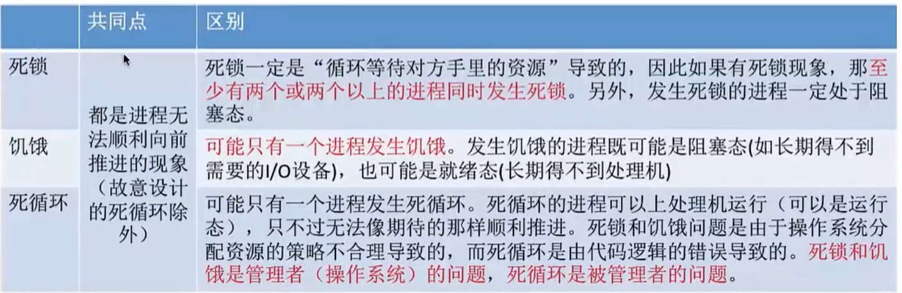


- 死锁产生的必要条件：产生死锁必须同时满足以下四个条件，只要其中一条不成立，死锁就不会发生

  1. **互斥条件**：只有对必须互斥使用的资源的争抢才会导致死锁
  2. **不剥夺条件**：进程所获得的资源在未使用完之前，**不能由其他进程强行夺走**，只能主动释放
  3. **请求和保持条件**：进程**已经保持了至少一个资源**，但又提出了新的资源**请求**，而该资源又被其他进程占有，此时请求进程被阻塞，但又对自己已有的资源**保持不放**
  4. **循环等待条件**：存在一种进程**资源的循环等待链**，链中的每一个进程已获得的资源同时被下一个进程所请求

  **注意！发生死锁时一定有循环等待，但是发生循环等待时未必死锁**

- 什么时候会发生死锁
  1. 对系统资源的竞争。各进程对不可剥夺的资源（如打印机）的竞争可能引起死锁，对剥夺的资源（cpu）的竞争是不会引起死锁的
  2. 进程推进顺序非法。请求和释放资源的顺序不当，也同样会导致死锁。例如：并发执行的P1,P1分别申请并占有了资源R1,R2，之后进程P1又紧接着申请资源R2,而进程P2又申请资源R1,两者会因为申请的资源被对方占有而阻塞，从而发生死锁。
  3. 信号量的使用不当也会造成死锁。如生产者-消费者问题中，如果实现互斥的P操作在实现同步的P操作之前，就有可能导致死锁
- 死锁的处理策略
  1. 预防死锁。破坏死锁产生的四个必要条件中的一个或者几个
  2. 避免死锁。用某种方法防止系统进入不安全状态，从而避免死锁（银行家算法）
  3. 死锁的检测和解除。允许死锁的发生，不过操作系统会负责检测出死锁的发生，然后采取某种措施解除死锁。


## 2.15 预防死锁

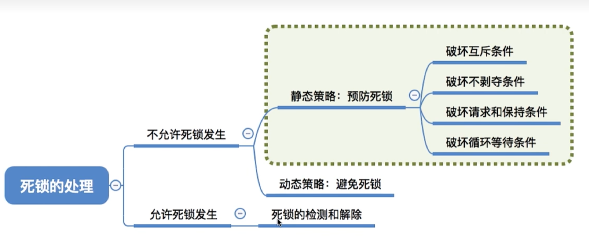


### 2.15.1 破坏互斥条件

互斥条件：只有对必须互斥使用的资源的争抢才会导致死锁

如果把只能互斥使用的资源改造成**允许共享使用**，则系统不会进入死锁状态。比如：**SPOOLing技术**

操作系统可以采用**SPOOLing**技术把独占设备在逻辑上改造成共享设备。

- 缺点：并不是所有的资源都可以改造为 可共享的资源。并且为了系统安全，很多地方还必须保护这种互斥性。因此，**很多时候都无法破坏互斥条件**


### 2.15.2 破解不剥夺条件

不剥夺条件：进程所获得的资源在未使用完之前，不能由其他进程强行夺走，只能主动释放。

破坏不剥夺条件：

​	方案一：当某个进程请求新的资源得不到满足时，他必须立即释放保持的所有资源，待以后需要时再重新申请。也就是说，即使某些资源尚未完使用完，也需要主动释放，从而破坏了不可剥夺条件

​	方案二：当某个进程需要的资源被其他进程所占有的时候，可以由操作系统协助，将想要的资源强行剥夺。这种方式一般需要考虑各个进程的优先级。

该策略的缺点：

1. 实现起来比较复杂
2. 释放已获得的资源可能造成前一阶段工作的失效。因此这种方法一般只适用于易保存和恢复状态的资源，如Cpu
3. 反复地申请和释放资源会增加系统开销，降低系统吞吐量
4. 若采用方案一，意味着只要暂时得不到某个资源，之前获得的那些资源都需要放弃，以后都要重新申请，如果一直发生这样的情况，会导致进程饥饿

### 2.15.3 破坏请求和保持条件

请求和保持条件：进程**已经保持了至少一个资源**，但又提出了新的资源**请求**，而该资源又被其他进程占有，此时请求进程被阻塞，但又对自己已有的资源**保持不放**

可以**采用静态分配方法**，即进程在运行前一次申请完它所需要的全部资源，在它的资源未满足前，不让它投入运行。一旦投入运行后，这些资源就一直归他所有，该进程就不会再请求别的任何资源了。

该策略实现起来简单，但也有明显的**缺点**：

有些资源可能只需要用很短的时间，因此如果进程的整个运行时间期间都一直保持着所有资源，就会造成严重的资源浪费，**资源利用率极低**。另外，该此略也可能**导致某些进程饥饿**

### 2.15.4 破坏循环等待条件

循环等待条件：存在一种进程**资源的循环等待链**，链中的每一个进程已获得的资源同时被下一个进程所请求。

可采用**顺序资源分配法**。首先给系统中的资源编号，规定每个进程**必须按照编号递增的顺序请求资源**，同类资源（即编号相同的资源）一次申请完。

原理分析：一个进程只有已占有小编号的资源时，才有资格申请更大编号的资源。按此规则，已持有大编号资源的进程不可能逆向地回来申请小编号的资源，从而就不会产生循环等待的现象。


该此略的缺点：

1. 不方便增加新的设备，因为可能需要重新分配所有的编号
2. 进程实际使用资源的顺序可能和编号递增顺序不一致，会导致资源浪费

3. 必须按照规定次序申请资源，用户编程麻烦

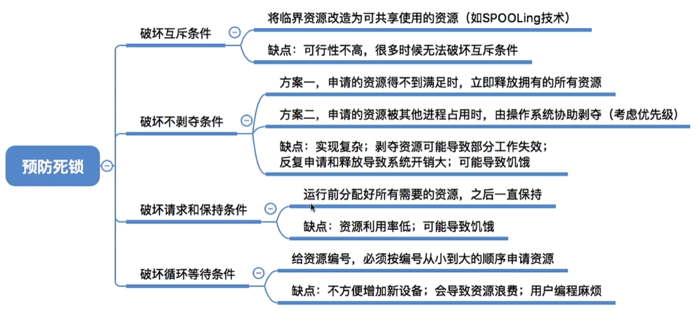


## 2.16 避免死锁

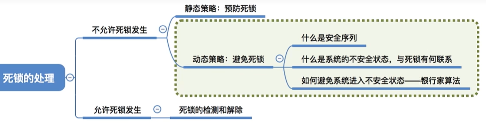


所谓**安全序列**，就是指如果系统按照这种序列分配资源，则每个进程都能顺利完成。只要能找出一个安全序列，系统就是**安全状态**。当前，**安全序列可能有多个**

如果分配了资源之后，系统中找不出任何一个安全序列，系统就进入了**不安全状态**。这就意味着之后**可能**所有进程都无法顺利的执行下去。当然，如果有进程提前归还了一些资源，那**系统也有可能重新回到安全状态**，不过我们在分配资源之前总是要考虑到最坏的情况。

如果系统处于**安全状态**，就**一定不会发生死锁**。如果系统进入**不安全状态**，就**可能**发生**死锁**

注意：处于不安全状态未必就是发生了死锁，但是发生了死锁一定是处于不安全状态

因此可以**在资源分配之前预先判断这次分配是否会导致系统进入不安全状态**，以此决定是否答应资源分配请求。

这就是**”银行家算法“**的核心思想

- **银行家算法**是荷兰学者Dijkstra为银行系统设计的，以确保银行在发放现金贷款时，不会发生不能满足所有客户需要的情况。后来该算法被用在操作系统中，**用于避免死锁**
- 核心思想：在进程提出资源申请时，先预判这次分配是否会导致系统进入不安全状态。如果会进入不安全状态，就暂时不答应这次请求，让该进程先阻塞等待。

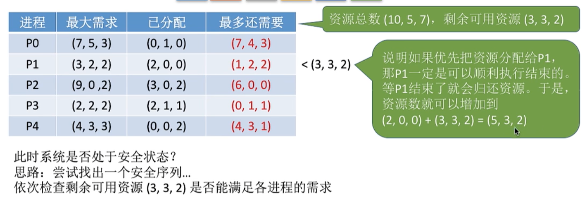

{p1,p3,p0,p2,p4}

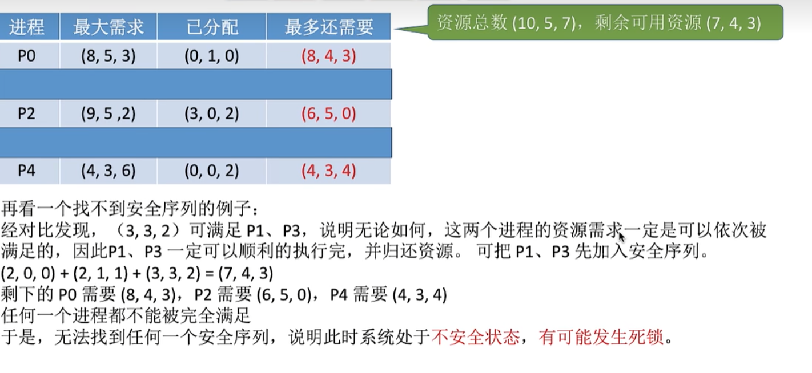

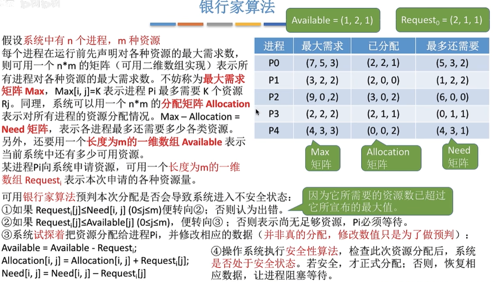

## 2.17 检测与解除死锁

如果系统中及不采取预防死锁，也不采取避免死锁，系统很可能就会发生**死锁**。在这种情况下，系统应该提供两个算法

1. 死锁检测算法：用于检测系统状态，以确定系统中是否发生了死锁
2. 死锁解除算法：当认定系统已经发生了死锁，利用该算法可将系统从死锁状态中解脱出来


### 2.17.1 死锁的检测

为了能对系统是否已发生了死锁进行检测，必须：

1. 用**某种数据结构**来保存资源的请求和分配信息
2. 提供**一种算法**，利用上述信息来检测系统是否已进入死锁状态

如果系统中剩余的可用资源数足够满足进程的需求，那么这个进程暂时是不会阻塞的，可以顺利地执行下去

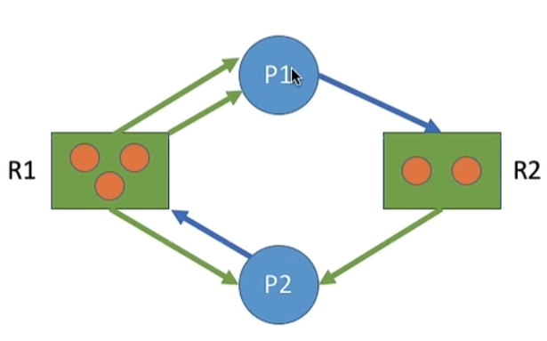


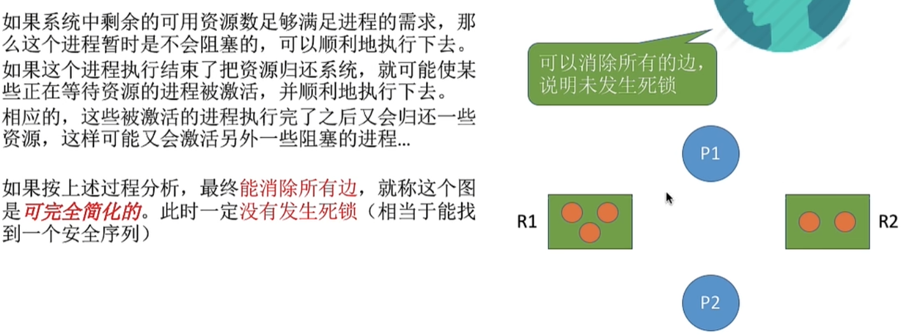

如果最终**不能消除所有边**，那么此时就是发生了**死锁**

比如此图

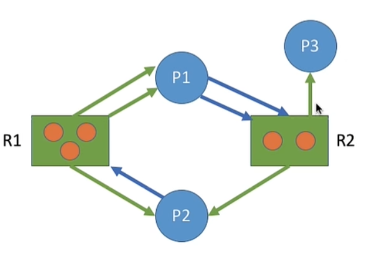

p1 申请了2个R2资源，然而R2资源都已经被分配出去了，所以P1被阻塞

p2 申请了1个R1资源，然而R1资源都已经被分配出去了，所以P2被阻塞

此时只有p3可以执行，p3执行结束后，会释放1个R2资源，但是此时p1只能得到1个R2资源，还差1个无法完成

还要等P2释放，但是P2也在等P1，于是就无法消除边了，等于发生了**死锁**

注意：这里只有P1和P2是死锁状态，P3不是

### 2.17.2 死锁的解除

一旦检测出死锁的发生，就应该立即解除死锁

补充：并不是系统中所有的进程都是死锁状态，用死锁检测算法**化简资源分配图后，还连着边的那些进程就是死锁进程**

解除死锁的主要方法有：

1. 资源剥夺法。挂起（暂时放到外存上）某些死锁进程，并抢夺它的资源，将这些资源分配给其他的死锁进程。但是应防止被挂起的进程长时间得不到资源而饥饿

2. 撤销进程法。强制撤销部分、甚至全部死锁进程，并剥夺这些进程的资源。这种方式的优点就是**实现简单**，但是付出的代价可能会很大。因为有些进程可能已经运行了很长时间，已经接近结束了。一旦被终止白费一切，以后还要从头再来

3. 进程回退法。让一个或者多个死锁进程退回到足以避免死锁的地步。这就要求系统要记录进程的历史信息，设置还原点

   如何决定对谁动手可以考虑以下四点

   1. 进程优先级
   2. 已执行多长时间
   3. 还要多久能完成
   4. 进程已经使用了多少资源
   5. 进程是交互式还是批处理式

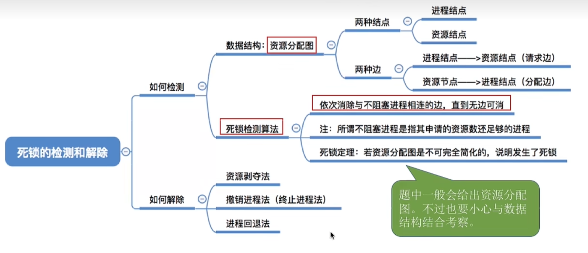

# 三 内存管理 

# 四 文件管理

# 五 输入输出管理

