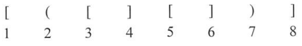
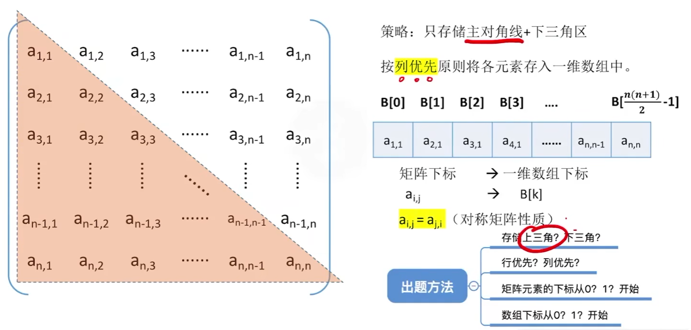
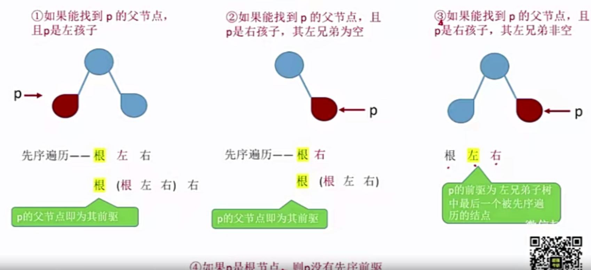

# 一 基本概念

本章内容是数据结构概述。读者可以通过对本章学习，初步了解数据结构的基本内容和基本方法。**分析算法的时间复杂度和空间复杂度是本章的重点**，一定要熟练掌握，算法设计题通常会要求分析时间复杂度、空间复杂度，同时会出现考察时间复杂度的选择题！！

## 1 基本概念和术语

数据：数据是**信息的载体**，是描述客观事物属性的数、字符及所有能输入到计算机中并被计算机程序识别和处理的集合。数据是计算机程序加工的原料。

---

数据元素：数据元素是**数据的基本单位**，通常作为一个**整体**进行考虑和处理。一个数据元素可由若干**数据项**组成，**数据项**是构成**数据元素**的**不可分割**的**最小单位**。

例如，学生记录就是一个数据元素，它由 学号、姓名、性别等 数据项组成。

---

数据对象：数据对象是具有**相同性质**的**数据元素**的集合，是**数据**的一个子集。

例如，整数数据对象是集合N={0,±1,±2}.

---

数据类型：数据类型是一个**值的集合**和定义在此集合上的**一组操作**的总称。

1）**原子**类型。其值**不可再分**的数据类型。

2）**结构**类型。其值**可以再分解**为若干成分(分量)的数据类型。

3）**抽象数据**类型。抽象数据组织及与之**相关的操作**。

---

数据结构：**相互之间存在一种或者多种特定关系的数据元素的集合**。在任何问题中，数据元素都不是孤立存在的，它们之间存在某种关系，这种**数据元素相互之间的关系称为结构**(Structure).数据结构包括三方面的内容：**逻辑结构**、**存储结构**和**数据的运算**。

数据的**逻辑结构**和**存储结构**是密不可分的两个方面，**一个算法的设计取决于所选定的逻辑结构，而算法的实现依赖于所采用的存储结构。**

## 2 数据结构三要素

### 2.1 数据的逻辑结构

数据的逻辑结构：逻辑结构是指**数据元素之间的逻辑关系**，即从逻辑关系上描述数据。它**与数据的存储无关**，是独立于计算机的。数据的逻辑结构分为  线性结构 和 非线性结构，线性表是典型的线性结构；集合、树和图是典型的非线性结构。数据的逻辑结构分类如图所示


---

集合：结构中的**数据元素**之间除“**同属一个集合**”外，别无其他关系

线性结构：结构中的数据元素之间只存在**一对一**的关系

树形结构：结构中的数据元素存在**一对多**的关系

图形结构或网状结构：结构中的数据元素之间存在**多对多**的关系


### 2.2 数据的存储结构

数据的存储结构：存储结构是指**数据结构在计算机中的表示（又称映像）**，也称为**物理结构**。它包括数据元素的表示和关系的表示。数据的**存储结构是用计算机语言实现的逻辑结构**，它依赖于计算机语言。数据的存储结构主要有**顺序存储、链式存储、索引存储和散列存储**

---

顺序存储：把**逻辑上相邻的元素存储在物理位置上页相邻的存储单元中**，元素之间的关系由**存储单元的邻接**关系来体现。

其优点是可以实现**随机存取**，每个元素占用最少的存储空间：缺点是**只能使用相邻的一整块存储单元**，因此可能产生**较多的外部碎片**

---

链式存储：**不要求逻辑上相邻的元素在物理位置上也相邻**，借助**指示元素存储地址的指针来表示元素之间的逻辑关系**。

其优点是可以**不会出现碎片现象**，能**充分利用所有存储单元**；缺点是**每个元素因存储指针而占用额外的存储空间**，且**只能实现顺序存取**

---

索引存储：在存储元素信息的同时，还**建立附加的索引表**。**索引表中的每项称为索引项，索引项的一般形式是(关键字,地址)**。其优点是**检索速度快**；缺点是附加的**索引表额外占用空间**。另外，**增加和删除数据时也要修改索引表，因而会花费很多的时间**。

---

散列存储：**根据元素的关键字**直接**计算出该元素的存储地址**，又称哈希(Hash)存储。其优点是**检索、增加和删除节点的操作都很快**；缺点是若散列函数不好，则可能出现元素存储单元的冲突，而解决冲突会增加时间和空间开销

### 2.3 数据的运算

施加在数据上的运算包括**运算的定义和实现**。运算的定义是**针对逻辑结构**的，**指出运算的功能**；运算的实现是针对**存储结构**的，指出运算的**具体操作步骤**。

### 2.4 试题精选

一、单项选择题


```python
2022/6/30{
    自写：1.D 2.A 3.C 4.A 5.A 6.A 7.C
    错误：4.D 6.C 7.A
    总结：{
        1.抽象数据类型可以构成完整的数据结构，因为ADT通常用（数据对象，数据关系，基本操作集）三元组来表示
        2.线性结构：字符串、队列、串、数组....
        3.顺序表、哈希表、单链表是三种不同的数据结构，即是逻辑结构，又描述存储结构和数据运算。而有序表指关键字有序的线性表，仅描述元素之间的逻辑关系，既可以链式存储，又可以顺序存储，所以是逻辑结构
        	考到了2.2中提到了存储结构=》（顺序存储、链式存储、散列存储）而有序表无关
        4.存储结构有  顺序存储、链式存储、散列存储、索引存储，这个题目做错的原因是不清楚  循环队列，循环队列是用顺序表表示的队列，可采用顺序存储或链式存储， 栈是典型的线性结构也是逻辑结构
        5.数据的存储结构是逻辑结构在计算机上的映射，它不能独立于逻辑结构而存在。 注意：数据结构包括的三个要素，缺一不可
        6.★ 存储数据的时候还要存储数据元素之间的关系
        7.链式存储各个结点的存储空间可以不连续，但是结点内的存储单元 地址必须连续
    }
}  
```

## 3.算法和算法评价

### 3.1 算法基本概念

算法：对**特定问题求解步骤的一种描述**，它是**指令的有限序列**，其中的每条指令表示一个或多个操作。此外，一个算法还具有下列5个重要特性

---

1）**有穷性**：一个算法必须总在执行**有穷步**之后结束，且每一步都可在**有穷时间**内完成。

---

2）**确定性**：算法中**每条指令必须有确切的含义**，对于**相同的输入只能得出相同的输出**。

---

3）**可行性**：算法中描述的操作都可以通过已经实现的基本运算执行有限次来实现。

---

4）**输入**：一个算法有零个或多个输入，这些输入取自于某个特定的对象的集合。

---

5）**输出**：一个算法有一个或多个输出，这些输出是与输入有着某种特定关系的量。

---

设计一个好算法应该考虑到以下目标

1）正确性：算法应能够**正确地解决求解问题**。

2）可读性：算法应具有**良好的可读性**，以帮助人们理解。

3）健壮性：输入**非法数据的时候能给出对应的处理**，而不会出现莫名其妙的输出结果。

4）效率与低存储量需求：效率是指**算法执行的时间**，存储量需求是指算法执行过程中所需要的**最大存储空间**，这两者都与问题的规模有关

### 3.2 算法效率的度量

算法效率的度量是通过时间复杂度和空间复杂度来描述的。

---

**时间复杂度**

一个语句的频度是指该语句在算法中被重复执行的次数。算法中所有语句的频度之和记为T(n) , 它是该算法问题规模n的函数，时间复杂度主要分析T(n)的数量级。算法中基本运算（最深层循环内的语句）的频度与T（n）同数量级，因此通常采用算法中基本运算的频度f(n)来分析算法的时间复杂度。因此，算法的时间复杂度记为

​														T（n）=O（f（n））

算法的时间复杂度不仅依赖于问题的规模n，也取决于待输入数据的性质（如输入数据元素的初始状态）。例如，在数组A[0...n-1]中，查找给定值k的算法大致如下:

c语言实现

```c
void main() {
	printf("%d",test());

}
int test(int k) {
	int i;
	int A[10] = { 5,7,2,3,1,0,8,4,11,22 };
	i = sizeof(A)-1; // 这里其实没必要，因为C语言不对对数组越界报错，会在内存中随机抽取一个值返回
	while (i >= 0 && (A[i] != k))
		i--;
	return i;
}
```

python实现

```python
def f(k):
    A = [5, 7, 2, 3, 1, 0, 8, 4, 11, 22]
    i = len(A) - 1
    while i >= 0 and A[i] != k:
        i -= 1
    return i
```

java实现

```java
static int f(int k) {
    int A[] = {5, 3, 4, 1, 2, 5, 5, 6, 7, 9};
    int i = A.length - 1;
    while (i >= 0 && (A[i] != k)) {
        i--;
    }
    return i;
}
```

该算法的频度不仅与问题规模n有关，而且与输入实例中A的个元素的取值以及K的取值有关：

①若A中没有与K相等的元素，则 i-- 的频度为 f(n) = n

②若A的最后一个元素等于k，则 i-- 的频度为 f(n)是常数0

---

最坏时间复杂度：指的是在最坏情况下，算法的时间复杂度

平均时间复杂度：指的是所有可能输入实例在等概率出现的情况下，算法的期望运行时间。

最好时间复杂度：指的是在最好情况下，算法的时间复杂度

一般总是考虑在最坏情况下的时间复杂度，以保证算法的运行时间不会比它更长。

---

常见的渐近时间复杂度为


---

```python
结论部分
结论1：顺序执行的代码只会影响常数项，可以忽略
结论2：只需挑循环中的【一个基本操作】分析它的执行次数与n的关系即可
结论3：如果有多层嵌套循环，只需关注最深层循环循环了几次
```


---


空间复杂度**

算法的空间复杂度 S(n)定义为该算法所耗费的存储空间，它是问题规模n的函数。记作为

​											S(n) = O(g(n))

程序执行时 需要  **存储空间来存放本身所用的指令、常数、变量和输入数据**

还需要一些对数据进行操作的工作单元和存储一些为实现计算所需信息的辅助空间。若输入数据所占空间只取决于问题本身，和算法无关，则只需要分析除输入和程序之外的额外空间。

算法原地工作是指算法所需的辅助空间为常量，即O（1）。

### 3.3 试题精选


```json
7月1日:{
    单项选择题:{
        1:B
        2:B X C
        3:D(特殊值法)
    	4:C(特殊值法) 
		5:
		6:A
		7:A  +
		8:C  +  x A
		9:B  +   
		10:未学
		11:C +   
		12:A +   X B
		13:B +
    }
	综合应用题:{
        1:{
            后续做
        }
        2:{
            1:O(n)
			2:O(n^(1/2))
			3:O(n^3) +
			4:O()
        }
    }
}
```


# 二 线性表

【考纲内容】

```
(一)线性表的基本概念
(二)线性表的实现
	顺序存储；链式存储
(三)线性表的应用
```

【知识框架】


## 1 定义和基本操作

### 1.1 **线性表的定义**

线性表是具有**相同**数据类型的 n (n>=0)个数据元素的 **有限序列**,其中n为表长，当n=0时线性表是一个空表。若用L命名线性表，则其一般表示为

线性表是一种**逻辑结构**，表示元素之间一对一的关系。

```
L = (a1,a2,.....,ai,ai+1,....,an)
```

除了第一个元素外，每个元素有且仅有一个直接前驱

除了最后一个元素外，每个元素有且仅有一个直接后继

### 1.2 **线性表的特点**

- 表中元素的**个数有限**
- 表中元素具有**逻辑上的顺序性**，表中元素有其先后次序
- 表中元素都是数据元素，每个元素都是单个元素
- 表中元素的**数据类型都相同**，这意味着每个元素占有**相同大小**的存储空间
- 表中元素具有抽象性，即仅讨论元素间的逻辑关系，而不考虑元素表达什么内容

**线性表的基本操作**

一个数据结构的基本操作是指其**最核心、最基本**的操作。

线性表的主要操作

```c
InitList(&L) : 初始化表。构造一个空的线性表
Length(L) : 求表长。返回线性表L的长度，即L数据元素的个数
LocateElem(L,e): 按值查找操作。在表L中查找具有给定关键字值的元素
GetElem(L,i)：按位查找操作。获得表L中第i个位置的元素的值
ListInsert(&L,i,e)：插入操作。在表L中的第i个位置上插入指定元素e
ListDelete(&L,i,&e):删除操作。删除表L中第i个位置的元素，并用e返回删除元素的值
PrintList(L):输出操作。按前后顺序输出线性表L的所有元素值
Empty(L):判断空操作。若L为空表，则返回true，否则返回false
DestroyList(&L):销毁操作。销毁线性表，并释放线性表L所占用的内存空间
```

### 1.3 试题精选


```json
2022/7/2{
    自写：1.C 2.B 3.A
    错误：
    总结：{
        1.C 线性表是具有相同数据类型的有限数据元素组成的，数据元素是由数据项组成
    	2.B 线性表定义的要求： 相同数据类型、有序序列。
    		A:没有说明有序
    		C:所有整数是无限的不是有限
    	3. 不解释
    }
}  
```

## 2 线性表的顺序表示

### 2.1 顺序表的定义

**线性表的顺序存储**又称顺序表。它是用一组**地址连续的存储单元**依次存储线性表中的数据元素，从而使得**逻辑上相邻的两个元素在物理位置上也相邻**。第1个元素存储在线性表的起始位置，第i个元素的存储位置后面紧跟着存储的是第i+1个元素，称i为元素ai 在线性表中的位序。因此，线性表的特点是表中元素的**逻辑顺序与其物理顺序相同**

假设线性表L存储的起始位置为LOC(A),sizeof(ElemType)是每个数据元素所占用存储空间的大小，则表L对应的顺序存储，则表L所对应的顺序存储如图所示


每个数据元素的存储位置都和线性表的起始位置相差一个和该数据元素的位序成正比的常数，因此，**线性表中的任一数据元素都可以随机存取**，所以线性表的顺序存储结构是一种**随机存取的存储结构**。通常用高级程序设计语言中的 数组来描述线性表的顺序存储结构。

> 注意：线性表中元素的位序是从1开始的，而数组中元素的下标是从0开始的。
>
> 地址计算方法
>
> LOC(ai) = LOC(a1) + (i-1) * c // c是存储单元

假定线性表的元素类型为ElemType，则线性表的顺序存储类型描述为

```c
#define MaxSize 50   // 定义线性表的最大长度
typedef struct{
    ElemType data[MaxSize];  // 顺序表的元素
    int length; 	// 顺序表的当前长度
}SqList;   // 顺序表的类型定义


```

一维数组可以是静态分配的，也可以是动态分配的。在静态分配时，由于数组的大小和空间先固定，一旦空间满了，再加入新的数据就会产生溢出，进而导致程序崩溃。

而在动态分配时，存储数组的空间是在程序执行过程中通过动态存储分配语句分配的，一旦数据空间占满，就另外开辟一块更大的存储空间，用以替换原来的存储空间，从而达到扩充存储数组空间的目的，而不需要为线性表一次性地划分所有空间。

```c
#define InitSize 100 // 表长度的初始定义
typedef struct{
    ElemType *data; // 指示动态分配数组的指针
    int MaxSize,length; // 数组的最大容量和当前个数
}SeqList; // 动态分配数组顺序表的类型定义

```

C的初始动态分配语句为

```c
L.data=(ElemType*)malloc(sizeof(ElemType)*InitSize);
```

> 注意，动态分配依然属于顺序存储结构，物理结构没变化，依然是随机存取方式，只是分配空间大小可以在运行时动态决定

- 顺序表**最主要的特点是随机访问**，即通过**首地址**和**元素序号**可在时间O(1)内找到指定的元素

- 顺序表的存储密度高，每个**结点只存储数据元素**。
- 顺序表逻辑上相邻的元素物理上也相邻，所以**插入和删除操作需要移动大量元素**。


C语言顺序表实现

```c
#define _CRT_SECURE_NO_WARNINGS
#include<stdio.h>
#define MaxSize 10 // 定义最大长度
typedef struct {
	int data[MaxSize]; //用静态的 数组 存放数据元素
	int length; //顺序表的当前长度
}SqList; // 顺序表的类型定义


// 初始化一个顺序表
void InitList(SqList *L) {
	for (int i = 0; i < MaxSize; i++) {
		(*L).data[i] = 0; // 将所有数据元素设置为默认初始值
	}
	(*L).length = 0; // 顺序表初始长度为0
}
int main() {
	SqList L; // 声明一个顺序表
	InitList(&L); // 初始化顺序表;
	
	for (int i = 0; i < 10; i++)
	{	
		printf("%d\n", L.data[i]);
	}
	
	return 0;
}
```


### 2.2 顺序表上基本操作的实现

这里仅讨论顺序表的插入、删除和按值查找的算法，其他基本操作的算法都比较简单

---

**插入操作**

在顺序表L的第i(1<=i<=L.length+1)个位置插入新元素e，若i的输入不合法，则返回false，表示插入失败；否则，将第i个元素及其后的所有元素依次往后移动一个位置，腾出一个空位置插入新元素e，顺序表长度增加1，插入成功，返回true

```c
bool ListInsert(SqList &L,int i,ElemType e){
    if(i<1 || i>L.length+1){ // 判断i的范围
        return false;
    }
    if(L.length>=MaxSize) // 当前存储空间已满，不能插入
        return false;
    for(int j=L.length;j>=i;j--) // 将第i个元素及之后的元素后移
        L.data[j] = L.data[j-1];
    L.data[i-1] = e; //在位置i处放入e
    L.length++; // 线性表长度加1
    return true;
}
```

> ★ 要求能熟练实现

```c
#define _CRT_SECURE_NO_WARNINGS
#include<stdio.h>
#include <stdbool.h>
#define MaxSize 10 // 定义最大长度
typedef struct {
	int data[MaxSize]; //用静态的 数组 存放数据元素
	int length; //顺序表的当前长度
}SqList; // 顺序表的类型定义


// 初始化一个顺序表
void InitList(SqList *L) {
	for (int i = 0; i < MaxSize; i++) {
		(*L).data[i] = 0; // 将所有数据元素设置为默认初始值
	}
	(*L).length = 0; // 顺序表初始长度为0
}

// *L 表示要做插入的顺序表
// i 表示插入的位置
// e 表示插入的值
// 整体步骤
//	   1.习惯性的先解决非法输入
//	   2.先将要插入的位置后面集体后移
//	   3.在插入的位置 赋值元素
//     4.顺序表长度加1
bool ListInsert(SqList * L, int i, int e) {
	//1习惯性的先解决非法输入
	if (i<1 || i >(*L).length + 1) { // 选的位置 小于第一处，和 大于最后一处加1
		return false;
	}
	if ((*L).length >= MaxSize)
		return false;// 说明存储空间已经满了
	
	//2.全部后移
	for (int j = (*L).length; j >= i; j--) { // 这里是 j >=i  因为 原本的i处也要移   注意 这个i不是说下标，是说第i处，下标是i-1
		(*L).data[i] = (*L).data[i - 1];  // 第i处的下标是 i-1 ，所有下标大于等于i-1的都要往后移一位
	}
	//3.在第i处添加新的值
	(*L).data[i - 1] = e;
	//4.顺序表的长度应该增加
	(*L).length++;
	return true;
}
int main() {
	SqList L;
	// 运行测试思路
	// 1.初始化顺序表
	InitList(&L);
	// 2.给顺序表随便赋6个值
	for (int i = 0; i < 6; i++)
	{	
		L.data[i] = i + 6;
		L.length++;
	}
	// 3.对指定位置进行插入操作
	ListInsert(&L, 3, 3);

	for (int i = 0; i < 10; i++)
	{	
		printf("%d\n", L.data[i]);
	}
	
	return 0;
}

```


>  注意：线性表的长度是线性表中数据元素的个数，随着线性表插入和删除操作的进行，这个量是变化的。
>
> 在任何时刻，线性表的长度都应该 小于等于 数组的长度

---

**删除操作**

删除顺序表L中第i(1<=i<=L.length)个位置的元素，用引用变量e返回。若i的输入不合法，则返回false；否则，将被删元素赋给引用变量e，并将第i+1个元素及其后的所有元素依次往前移动一个位置，返回true

```c
bool ListDelete(SqList &L,int i,Elementype &e){
    if(i<1||i>L.length) // 判断i的范围是否有效
        return false;
    e = L.data[i-1]; // 将被删除的元素赋值给e
    for(int j = i;i<L.length;j++) // 将第i个位置后的元素前移
        L.data[j-1] = L.data[j]
    L.length--; // 线性表长度-1
    return true
}
```

> 最好情况；删除表尾元素，则无需移动元素，时间复杂度为 O（1）
>
> 最坏情况；删除表头元素，需要移动除了表头以外所有元素，时间复杂度为O（n）

可见，顺序表的插入和删除操作的时间主要耗费在移动元素上，而移动元素的个数取决于插入和删除元素的位置。

> ★ 要求能熟练实现

```c
#define _CRT_SECURE_NO_WARNINGS
#include<stdio.h>
#include <stdbool.h>
#define MaxSize 10 // 定义最大长度
typedef struct {
	int data[MaxSize]; //用静态的 数组 存放数据元素
	int length; //顺序表的当前长度
}SqList; // 顺序表的类型定义


// 初始化一个顺序表
void InitList(SqList *L) {
	for (int i = 0; i < MaxSize; i++) {
		(*L).data[i] = 0; // 将所有数据元素设置为默认初始值
	}
	(*L).length = 0; // 顺序表初始长度为0
}


// *L 顺序表
// i 表示删除第i处
// *e 用来接受删除的值
bool ListDelete(SqList* L, int i, int* e) {
	// 1.习惯性的解决合法
	if (i<1 || i>(*L).length) {
		return false;
	}
	// 2.将删除的文件赋值给e
	*e = (*L).data[i - 1]; // 将被删除的文件赋值给e
	
	// 3.将删除的文件位置开始填充后面的值，整体前移
	for (int j = i; j < (*L).length; j++) { // j = 1~9
		(*L).data[j-1] = (*L).data[j];   // j-1 = 0=1,1=2   2=3 3=4 4=5 5=6 6=7 7=8 8=9 
	}
	// 4.顺序表长度减一
	(*L).length--;
	return true;
}

int main() {
	SqList L;
	// 运行测试思路
	// 1.初始化顺序表
	InitList(&L);
	// 2.给顺序表随便赋6个值
	for (int i = 0; i < 6; i++)
	{	
		L.data[i] = i + 6;
		L.length++;
	}
	// 3.对指定位置进行删除
	int e = -1;
	int index = 4;
	if(ListDelete(&L,index,&e)){
		printf("删除成功！，成功删除第%d个元素，值为%d\n", index, e);
	}
	else {
		printf("位置不合法，删除失败");
	}

	for (int i = 0; i < 10; i++)
	{	
		printf("%d\n", L.data[i]);
	}
	
	return 0;
}
```


按值查找**

在顺序表L中查找第一个元素值等于e的元素，并返回其位序

```c
// 注意 C语言中，结构体不能直接使用 == 判断相等
// 但是考研中，一般不会严格要求，主要是理解代码算法思想 ！
int LocateElem(SqList L,ElemType e){
    int i;
    for(i=0;i<L.length;i++){
        if(L.data[i]==e)
            return i+1 //返回的是下标 所以要加1
    }
    return 0 //循环结束了，说明查找失败
}
```

> 最好情况：查找的元素就在表头，仅需比较1次  O(1)
>
> 最坏情况：查找的元素在表尾或者不存在，需要比较n次，时间复杂度为 O(n)


```python
Tips:
    ① 对数据的操作(记忆思路) -- 创销、增删改查
```


### 2.3 试题精选


```python
2022/7/4{
    自写：1.D 2.B 3.B 4.B 5.B 6.C 7.B 8.B 9.C 10.B 11.D
    错误：1.A 2.A 4.D 5.A 7 C 8 C
    总结：{
        1.A 
        	顺序表不像链表那样要在结点中存放指针域，因此存储密度较大
        	B和C是链表的优点，我选的是D，D错了。。因为树形结构，顺序表不如链表表示更方便
        2.A
        	易错选B，注意！存取方式通常是指读写方式。
        	顺序表是可以支持随机存取的。根据 起始地址加上元素的序号。可以很方便的访问任意一个元素。这就是随机存取的概念
        3.B
        	顺序表所占的存储空间 = 表长 x sizeof(元素的类型)
        4.D
        	题干要求是最快存取 i-1 i i+1
        	ABC3个链表，只能从头结点依次顺序查找，时间复杂度是O(n)
        	**只有**顺序表 可以根据序号随机存取，时间复杂度为O（1）
        5.A
        	只有顺序表可以按照序号随机存取，且最后进行插入和删除操作时不需要移动任何元素？
        7.C
        	交换第3个元素和第4个元素的值，顺序表仅需3次操作
        	链表则需要分别找到两个结点前驱，第4个结点断链后再插入到第2个结点后，效率较低
        	对于 顺序输出n个值   。 需要顺序访问每个元素，时间复杂度相同
        8.C
        	眼瞎，注意是顺序表的长度-i
        
    }
}  
```


## 3.线性表的链式表示

顺序表可以随时存取表中的任意一个元素，它的存储位置可以用一个简单直观的**公式表示**

但是顺序存储方式在**除了最后一个位置以外**的地方做插入和删除 需要**移动大量元素**.

链式存储线性表时，**不需要使用地址连续的存储单元**，即**不要求逻辑上相邻的元素在物理上也相邻**,它通过“链”建立起元素之间的逻辑关系，因此 **插入和删除 操作不需要移动元素**，而只需要修改指针，但也会**失去顺序表可随机存取的优点**

### 3.1 单链表的定义

线性表的链式存储又称**单链表**，它是指通过一组**任意的存储单元**来存储线性表中的数据元素。

为了建立数据元素之间的线性关系，对**每个链表结点，除存放元素自身的信息外，还需要存放一个指向其后继的指针**。单链表结构如图所示


其中data为 数据域，存放数据元素；next为指针域，存放其后继结点的地址。

单链表结点类型的描述如下

```c
typedef struct LNode{ // 定义单链表结点类型
    ElemType data;	// 数据域
    struct LNode *next; // 指针域
}LNode,*LinkList;
```

利用单链表可以解决 **顺序表需要大量连续存储单元的缺点**,但是 **单链表附加了指针域，也存在浪费存储空间的缺点**。由于**单链表的元素离散地分布在存储空间中，所以单链表是非随机存储的存储结构**，即不能直接找到表中某个特定的结点。**查找某个特定的结点时，需要从表头开始遍历，依次查找**

通常用头指针来标识一个单链表，如单链表L，**头指针为NULL时表示一个空表**。此外，为了操作上的方便，**在单链表第一个结点之前附加一个结点，称为头结点**。**头结点的数据域可以不设任何信息，也可以记录表长等信息**。**头结点的指针域指向线性表的第一个元素结点**


头结点和头指针的区分：不管带不带头结点，头指针都始终指向链表的第一个结点，而头结点是带头结点的链表中的第一个结点，结点内通常不存储信息。

引入头结点后，可以带来两个优点

① 由于第一个数据结点的位置被存放在头结点的指针域中，因此在链表的第一个位置上的操作和在表的其他位置上的操作一致，无须进行特殊处理。

② 无论链表是否为空，其头指针都指向头结点的非空指针（空表中头结点的指针域为空），因此空表和非空表的处理也就得到了统一

### 3.2 单链表上基本操作的实现

**不带头结点的单链表**


```c
#define _CRT_SECURE_NO_WARNINGS
#include<stdio.h>
#include <stdbool.h>

typedef struct LNode{		// 定义单链表结点类型
	int data;				// 每个结点存放一个数据元素
	struct LNode* next;		// 指针指向下一个结点
}LNode, * LinkList;			// 取两个名字

// 初始化一个空的单链表
bool InitList(LinkList*L) {
	L = NULL; // 空表，暂时还没有任何结点   // 防止脏数据 
	return true;
}

void test() {
	LinkList L; // 声明一个指向单链表的指针
	// 初始化一个空表
	InitList(L);
}
```

**带头结点的单链表**


```c
typedef struct LNode{		// 定义单链表结点类型
	int data;				// 每个结点存放一个数据元素
	struct LNode* next;		// 指针指向下一个结点
}LNode, * LinkList;			// 取两个名字

// 初始化一个单链表(带头结点)
bool InitList(LinkList*L) {
	*L = (LNode *)malloc(sizeof(LNode)); // 分配一个头结点
	if (L == NULL) //内存不足，分配失败
		return false;
	(*L)->next = NULL; // 头结点之后暂时没有结点
	return true;
}

void test() {
	LinkList L; // 声明一个指向单链表的指针
	// 初始化一个空表
	InitList(L);
}
```

### 3.3 单链表的插入删除 ★

**按位序插入(带头结点)**

> ListInsert(&L,i,e) : 插入操作。在表L中的第i个位置上插入指定元素e。
>
> 思路：需要找到第i-1个结点，去修改它的next

```c
// 在第i个位置插入元素e (带头结点)
bool ListInsert(LinkList* L, int i, int e) {
	if (i < 1)
		return false;
	LNode * p;  // 指针p指向当前扫描到的结点
	int j = 0; // 当前p指向的是第几个结点
	p = *L; // L 指向头结点，头结点是第0个结点（不存数据）
	while (p != NULL && j < i-1) {  // 循环找到第i-1个结点 , 这个代码对于我来说很不习惯，我认为 j < i  ++j 更舒服
		p = p->next;
		j++;
	}
	if (p == NULL) // i的值不合法
		return false;
	LNode* s = (LNode*)malloc(sizeof(LNode));
	s->data = e;
	s->next = p->next; // 让 新结点 链接 p的下一个结点
	p->next = s;  // 再让新结点 成为 p的新下一个结点
	
	return true;
}

```

**按位序插入(不带头结点)**

> ListInsert(&L,i,e) : 插入操作。在表L中的第i个位置上插入指定元素e

```c
// 在第i个位置插入元素e (不带头结点)
bool ListInsert(LinkList* L, int i, int e) {
	if (i < 1)
		return false;
	if (i == 1) { // 插入第1个结点的操作与其他结点操作不同
		LNode* s = (LNode*)malloc(sizeof(LNode));
		s->data = e;
		s->next = L;
		L = s; // 头指针指向新结点
		return true;

	}
	LNode * p;  // 指针p指向当前扫描到的结点
	int j = 1; // 当前p指向的是第几个结点
	p = *L; // L 指向头结点，头结点是第0个结点（不存数据）
	while (p != NULL && j < i-1) {  // 循环找到第i-1个结点 , 这个代码对于我来说很不习惯，我认为 j < i  ++j 更舒服
		p = p->next;
		j++;
	}
	if (p == NULL) // i的值不合法
		return false;
	LNode* s = (LNode*)malloc(sizeof(LNode));
	s->data = e;
	s->next = p->next; // 让 新结点 链接 p的下一个结点
	p->next = s;  // 再让新结点 成为 p的新下一个结点
	
	return true;
}

// 不带头结点写代码更不方便，推荐使用带头结点，但是必须要写这种，或者说是学会这种了，带头结点的也会写了
// 就算我已经理解了，也建议此代码手写6遍以上

```

**指定结点的后插入操作**

```c
bool InsertNextNode(LNode *p,ElemType e){
    if(p==NULL)
        return false;
    LNode *s = (LNode *)malloc(sizeof(LNode));
    if (s ==NULL) //内存分配失败
        return false;
    s->data = e; //用结点s保存数据元素e
    s->next=p->next;
    p->next=s; //将结点s连到p之后
    return true;
}
时间复杂度：O(1)
    
bool ListInsert(LinkList* L, int i, int e) {
	if (i < 1)
		return false;
	if (i == 1) { // 插入第1个结点的操作与其他结点操作不同
		LNode* s = (LNode*)malloc(sizeof(LNode));
		s->data = e;
		s->next = L;
		L = s; // 头指针指向新结点
		return true;

	}
	LNode * p;  // 指针p指向当前扫描到的结点
	int j = 1; // 当前p指向的是第几个结点
	p = *L; // L 指向头结点，头结点是第0个结点（不存数据）
	while (p != NULL && j < i-1) {  // 循环找到第i-1个结点 
		p = p->next;
		j++;
	}
	return InsertNextNode(p,e);
}
```

**指定结点的前插入操作**

单链表只能往后找，不能往前找，咋办呢

思想：还是把这个结点往后插，但是交换2个结点的数据

```c
bool InsertPriorNode(LNode *p,ElemType e){
    if(p == NULL)
        return false;
    LNode *s == (LNode *)malloc(sizeof(LNode));
    if(s==NULL) //内存分配失败
        return false;
    s.next -> p.next;
    p.next -> s;  // 将新结点 s 连接到 p 之后
    s.data -> p.data; // 将p中元素复制到s中
    p.data -> e;   // p中元素覆盖为e
    return true;
};


挺有意思的,偷天换日，时间复杂度：O(1)
```

**按位序删除(带头结点)** ★★★★★★

> ListDelete(&L,i,&e)  ：删除操作。删除表L中第i个位置的元素，并用e返回删除元素的值。 

```c
bool ListDelete(LinkList* L, int i, int* e) {
	if (i < 1)
		return false;
	LNode* p; // 指针p指向当前扫描的结点
	int j = 0; //当前p指向的是第几个结点
	p = *L; // L指向头结点，头结点是第0个结点
	while (p != NULL && j < i - 1) {
		p = p->next;
		j++;
	}
	if (p == NULL) { // i值不合法
		return false;
	}
	if (p->next == NULL) { // 第i-1个结点之后已无其他结点
		return false;
	}
	// 整体思想
	// 1. 先指向被删除的结点   ps：因为需要用到它的next
	// 2. 将删除结点的数据传给e
	// 3. 前结点的指针域 = 删除结点的指针域
	// 4. 释放 删除结点
	LNode* q = p->next; // 令q指向被删除结点；
	e = q->data;
	p->next = q->next; // 主要思想，让前结点的指针 直接等于 自己的指针，也就是前一个结点指针连接自己连接的结点
	free(q);// 释放结点的存储空间
	return true;
}

最好时间复杂度：O(1)  删除第一个
最坏时间复杂度和平均复杂度：O(n) 
    
```


**指定结点的删除**

> bool DeleteNode(LNode *p)

```c
// 整体思想
// 将指定的结点的数据域换成 后继结点的数据，再指向后继结点所指向的，再删除后继结点。
// 1.先获得删除结点p的后继结点
// 2.将删除结点的数据域p 换为 后继结点的数据域q
// 3.将删除结点的后继结点 换位 后继结点的指针域
// 4.释放后继结点q

//删除指向结点p
bool DeleteNode(LNode *p){
    if (p==NULL)
        return false;
    LNode *q = p->next; // 令q指向*p的后继结点
    p->data = q->data; //和后继结点交换数据域
    p->next = q->next;
    free(q);
    return true;
}

时间复杂度: O(1)
BUG:如果p是最后一个结点。。。。那到了 p.next.data.就会报错。以后可以通过双向链表解决
所以这也是单链表的一个局限性，无法逆向索引，有时候不太方便，但是考试的时候还是可以这么写，最多扣1分，一般不扣分。

```

### 3.4 单链表的查找

> GetElem(L,i)  :  按位查找操作。获取表L中第i个位置的元素的值
>
> LocateElem(L,i) : 按值查找操作。在表L中查找具有给定关键字值的元素

**按位查找**

```c
// 按位序查找，返回第i个元素（带头结点）
LNode * GetElem(LinkList L,int i){
    if(i<0)
        return NULL;
    LNode *p; // 指针p指向当前遍历到的结点
    int j = 0; // 表示当前p指向第几个结点
  	p = L;    //  L指向头结点，默认是从头结点开始
    while(p!=NULL && j<i){// 循环找到第i个结点
        p = p ->next;
        j++;
    } 
    return p;
    
}
```

**按值查找**

```c
// 按值查找，找到数据域 == e 的结点
// e 要找的值
LNode * LocateElem(LinkList L,ElemType e){
    LNode * p = L->next;
    // 从第1个结点开始查找数据域为e的结点
    while(p != NULL && p->data != e) // 如果p的值和e的值是相等的，就退出循环执行return p
        p = p->next;
    return p;
}

时间复杂度 O(n)
```

**求表的长度**

```c
int Length(LinkList L){
    int len= 0; //统计表长
    LNode *p = L; // p指向头结点
    while(p->next != NULL){
        p = p.next;
        len++;
    }
    return len;
}

时间复杂度 O(n)
```

### 3.5 单链表的建立

如果给你很多个数据元素，要把它们存到一个单链表里边，怎么处理呢？

> Step1: 初始化一个单链表
>
> Step2: 每次取一个数据元素，插入到表尾/表头   

头插法、尾插法：核心就是初始化操作、指定结点的后插操作

#### 3.5.1 尾插法

> 尾插法建立单链表

```c
typedef struct LNode{   // 定义单链表结点类型
    ElemType data;	    // 每个结点存放一个数据元素
    struct LNode *next; // 指针指向下一个结点
}LNode,*LinkList;

// 重点理解 r->next = s; r = s;
LinkList List_TailInsert(LinkList &L){ 	// 正向建立单链表
    int x;			// 设ElemType为整型
    L=(LinkList)malloc(sizeof(LNode)); //建立头结点
    LNode *s,*r = L;	//r为表尾指针
    scanf("%d",&x);  // 输入结点的值
    while(x!=9999){   // 输入9999表示结束
        s = (LNode *)malloc(sizeof(LNode));
        s -> data=x;
        r->next=s; // 相对于让当前的尾巴结点的next指向新插入的尾巴结点
        r = s ; // 再更换r指针，让s成为新的r指针，也就是新的尾巴结点
        scanf("%d",&x)l
    }
    r->next=NULL; // 让尾结点指向NULL
    return L;//返回这个已经充满数据的链表
}
```


#### 3.5.2 头插法

思想：链表的逆置 

```c
// 头插法建立单链表
LinkList List_HeadInsert(LinkList &L){ // 逆向建立单链表
    LNode *s;
    int x;
    L = (LinkList)malloc(sizeof(LNode)); // 创建头结点
    L->next = NULL; // 初始化为空链表
    scanf("%d",&x); // 输入结点的值
    while(x!=9999){ // 输入9999表示结束
        s = (LNode*)malloc(sizeof(LNode)); // 创建新结点
        s->data = x;
        s->next = L->next;
        L->next = s; // 将新结点插入表中，L为头指针
        scanf("%d",&x);
    }
    return L;  
}
```

### 3.6 双链表

单链表结点中只有一个指向其后继的指针，使得单链表只能从头结点依次顺序地向后遍历。**要访问某个结点的前驱结点（插入、删除时），只能从头开始遍历，访问后继结点的时候复杂度为O（1），访问前驱结点的时间复杂度为O（n）**

为了克服单链表的上述缺点，引入了双链表，双链表结点中有两个指针 prior 和 next，分别指向其前驱结点和后继结点


双链表中结点类型的描述如下

```c
typedef struct DNode{ // 定义双链表结点类型
    ElemType data;  // 数据域
    struct DNode *prior,*next;  // 前驱和后继指针    
}DNode,*DLinklist;
```

双链表在单链表的结点中增加了一个指向其前驱的prior指针，因此**双链表中的按值查找和按位查找的操作与单链表的相同。但双链表在插入和删除操作的是现实上，与单链表有着较大的不同。**

这是因为“链”变化时也需要对prior指针做出修改，其关键是保证在修改的过程中不断链。此外，双链表可以很方便地找到其前驱结点，因此，插入、删除操作的时间复杂度仅为O（1）。

**双链表的初始化**

```c
typedef struct DNode{
    ElemType data;
    struct DNode *prior,*next;
}DNode,*DLinklist;


//初始化双链表
bool InitDLinkList(DLinklist *L){
    L = (DNode *)malloc(sizeof(DNode)); // 分配一个头结点
    if (L==NULL)
        return false; // 内存不足 分配失败
	L->next = NULL; // 头结点之后暂时还没有结点
	L->prior = NULL; // 头结点的prior永远指向NULL
    return true
}
void testDLinkList(){
    // 初始化双链表
    DLinklist L;
    InitDLinkList(L);
}

```


**双链表的插入操作**

```c
插入片段代码如下
s -> next = p - >next
s -> next -> prior = s
s -> prior = p
p -> next = s


// 更严谨的写法
// 在p结点的后面插入s结点
bool InsertNextDNode(DNode *p,DNode *s){
	if(p==NULL||s==NULL) // 非法参数
		return false;
	s->next = p->next;
	if(p->next != NULL) // 如果说p的后面是有结点的
		p->next->prior = s;  //如果p后面没有结点了 这行会报错误，所以放到这个分支里面来
	s->prior = p;
	p->next = s;
	return true
}
```

上述代码的语句顺序不是唯一的，但也不是故意的，第一步和第二步必须在第四步前面。

这个其实很好理解，但是为了加深理解，建议在纸上画一画示意图。


**双链表的删除操作**

```
删除双链表中结点*p  的后继结点 *q , 其指针的变化过程
```


```c 
这个很容易理解
p->next = q->next;
q->next->prior =p;
free(q) //释放
    
    
// 删除p的后继结点
bool DeleteNextDNode(DNode *p){
    if(p==NULL)
        return false;
    DNode *q = p->next;//找到p的后继结点q
	if(q==NULL)
        return false // p没有后继
    p->next = q->next;
    if(q->next != NULL) // q结点不是最后一个结点
    	q->next->prior = p;
    free(q)
}
```

若问题改成要求删除结点q的前驱结点p。请思考一下操作步骤

> 思考了一下可以这样，纯作者个人思考，没借鉴资料 


代码实现

```c
q->prior =  p ->prior
p->prior->next = p->next
free(p)
    
// 现在觉得数据结构思想还是很有意思的
```

在建立双链表的操作中，也可采用如同单链表的头插法和尾插法，但在操作上需要注意指针的变化和单链表有所不同。


**销毁双链表**

```c
void DestoryList(DLinklist *L){
    // 循环释放各个数据结点
    while(L->next != NULL)
        DeleteNextDNode(L);
	free(L); // 最后释放头结点
    L = null // 头指针指向NULL
}
```

**遍历双链表**

```c
//向后遍历
while(p!=NULL){
    // 对结点p做对应处理，如打印
    printf("%s",p->data);
    p = p->next;
}

//向前遍历
while(p!=NULL){
    // 对结点p做相应处理
    printf("%s",p->data);
    p = p->prior;
}
```

总结：**双链表不可以随机存储，按位查找、按值查找操作都只能用遍历的方式实现。时间复杂度O（n）**


### 3.7 循环链表

**循环单链表**

循环单链表和单链表的区别在于，**表的最后一个结点的指针不是NULL,而改为指向头结点**，从而整个链表形成一个环。

在循环单链表中，表尾结点 r 的next域指向L，故表中没有指针域为NULL的结点，因此，**循环单链表的判空条件不是头结点的指针是否为空，而是它是否等于头指针**


循环单链表的插入、删除算法与单链表几乎一样，所不同的是若操作是在表尾进行，则执行的操作不同，以让单链表继续保持循环的性质。当然，正是因为循环单链表是一个环，因此在任何一个位置上的插入和删除都是等价的。无需判断是否是表尾。

在**单链表中只能从表头结点开始往后顺序遍历整个链表**，而**循环单链表可以从表中的任意一个结点开始遍历整个链表**。有时**对单链表常做的操作是在表头和表尾进行**的，此时**对循环单链表不设头指针而仅设尾指针**，从而使得**效率更高**。其原因是，若设的是**头指针，对表尾进行操作需要O（n）的时间复杂度**，而若设的是尾指针r，r->next为头指针，对表头与表尾进行操作都**只需要O（1）的时间复杂度**。

> 总结：
>
> 单链表从一个结点出发，只能找到后续的各个结点
>
> 循环单链表从一个结点出发，可以找到其他任意一个结点
>
> 如果是经常对单链表做表头表尾操作时，此时可以对循环单链表不设头指针而设尾指针。因为效率更高
>
> 思考一下，如果是设置在最后的话，访问到第一步和最后的复杂度都是1，非常的爽 O（1）


**初始化**

```c

typedef struct LNode{ // 定义单链表结点类型
    ElemType data;  // 每个结点存放一个数据元素
    struct LNode *next; // 指针指向下一个结点
}LNode,*LinkList;

// 初始化一个循环单链表
bool InitList(LinkList *L){
    L = (LNode *)malloc(sizeof(LNode)); // 分配一个头结点
    if(L==NULL){
        return false;
    }
    L->next = L; //头结点next指向头结点
    return true；
}
```

**判断循环单链表为空**

```c
bool Empty(LinkList L){
    if(L->next == L)  // 头结点的指针指向头结点
        return true;
    else
        return false;
}
```

**判断结点p是否为循环单链表的表尾结点**

```c
bool isTail(LinkList L,LNode *p){
    if(p->next == L)
        return true;
    else
        return false;
}
```


**循环双链表**

由循环单链表的定义不难推出循环双链表。不同的是在循环双链表中，头结点的prior指针还要向表尾结


在循环双链表链表L中，某结点p为尾结点时,**p->next==L**;当循环双链表为空表时，其头结点的prior和next都等于L


双链表：

​	表头结点的prior指向NULL

​	表尾结点的next指向NULL

循环双链表：

​	表头结点的prior指向表尾结点

​	表尾结点的next指向头结点

**初始化循环双链表**

```c
// 初始化循环双链表
typedef struct DNode{
    ElemType data;
    struct Dnode *next,*prior;
}DNode,*DLinklist;

bool InitDLinklist(DLinklist *L){
    L = (DNode *)malloc(sizeof(DNode)); //分配一个结点
    if(L == NULL)
		return false;
    L->next = L;
    L->prior = L;
    return true;
}

// 判断循环双链表是否为空
bool Empty(DLinklist L){
    return L->next == L;
}
// 判断结点p是否为循环双链表的 表尾结点
bool isTail(DLinklist L,DNode *p){
    return p->next == L;
}
```


### 3.8 静态链表

静态链表**借助数组**来描述线性表的链式存储结构，结点也有**数据域data**和**指针域next**，当时和前面的链表的**指针不同**，**静态链表的指针是结点的相对地址(数组下标)**,又称为 **游标**。

和顺序表一样，**静态链表也要预先分配一块连续的内存空间** ★

单链表：各个结点在内存中星罗棋布、散落天涯

双链表：分配一整片连续的内存空间，各个结点集中安置 【next存的是下标】


**定义静态链表**

```c
#define MaxSize 10 //静态链表最大长度
struct Node{ // 静态链表结构类型的定义
    ElemType data; // 存储数据元素
    int next; //下一个元素的数组下标
}
typedef struct Node SLinkList[MaxSize]; // 数组a作为静态链表
// 之后比如声明一个 SLinkList a; 这个a其实就是数组且有MaxSize容量 a就是静态链表

//或者
#define MaxSize 10 //静态链表最大长度
typedef struct Node{ // 静态链表结构类型的定义
    ElemType data; // 存储数据元素
    int next; //下一个元素的数组下标
}SLinkList[MaxSize]
// 之后定义就是 SLinkList a; a就是静态链表 相对于定义了一个长度为 MaxSize的Node型数组
```


总结

- 静态链表：用数组的方式实现的链表
- 优点：增、删操作不需要大量移动元素
- 缺点
  - 不能随机存取，只能从头结点开始依次往后查找
  - 容量固定不变
- 使用场景
  - 不支持指针的低级语言
  - 数据元素数量几乎固定不变的场景

### 3.9 顺序表和链表的比较

- 逻辑结构：顺序表和链表都属于线性表
- 存储结构：
  - 顺序表优点是**支持随机存取、存取密度高**，缺点是**大片连续空间分配不方便，改变容量不方便**
  - 链表优点是**离散的小空间分配方便、改变容量方便**，缺点是**不可随机存取，存取密度低**

- 基本操作

  - 存
    - 顺序表需要预分配大片连续空间。若分配空间过小，则之后不方便拓展容量；若分配扩建过大，则浪费内存资源
    - 链表只需要分配一个头结点（也可以不要头结点，只声明一个头指针），之后方便拓展
  - 销
    - 顺序表首先需要length改为0
      - 静态分配：系统自动回收空间
      - 动态分配：需要手动free
    - 链表就是根据结点依次销毁free

  - 增/删

    - 顺序表增删都需要将数据元素后移/前移，时间复杂度O（n）元素开销主要是移动元素
      - 若数据元素很大，则移动的时间代价很高
    - 链表对插入和删除元素只需要修改指针即可，链表也是O（n），时间开销主要是来自查找目标元素
      - 查找元素的时间代价更低

  - 查

    - 顺序表

      - 按位查找：O（1），具有随机存取的特性
      - 按值查找：O（n），若表内元素有序，可在O（log2n）时间内找到

    - 链表

      - 按位查找：O（n），只能从第一开始找
      - 按值查找：O（n），只能从第一开始

    - > 查找的效率肯定是顺序表要高得多 

- 用顺序表or链表？

  - 
  - 表长难以估计、经常要增加和删除元素  ------链表
  - 表长可预估、查询（搜索）操作较多     -------顺序表

- 

### 3.10 试题精选

```python
1.B 2.B 3.C 4.D 5.A 6.C 7.A 8.A 9.C 10.B 11.B,A 12 C 13 D 14.A 15 B 16D 17D 18D 19A
20C 21C 22B 23D 24B 25C 26D

错误：
	7.D
    8.C
    18.A
	19.C
    24.D
    25.D
    # 26个对20个
    
分析:
    1.B
    	Ⅰ:各种存储结构都有不同的适合场景，不能简单说谁好谁坏
        Ⅱ:链式存储用指针表示逻辑结构，而指针的设置是任意的，可以很方便的表示各种逻辑结构
        Ⅲ:在顺序存储中，插入和删除需要大量移动元素，效率较低
        Ⅳ：★顺序存储结构既可以随机存取也可以顺序存取，而链式只能顺序存取
    2.B
    	不解释肯定是B
    3.C
    	A:对n个元素进行排序的时间复杂度最小也要O（n），即使初始有序时通常也为O（nlog2n）或O（n^2)
        B:BD显然错误，要移动很大元素
        C:随机存取方式 O（1）
    4.D
    	I:图和树也是顺序存储方式
        Ⅱ:线性表采用顺序存储时，才和大小有关
        Ⅲ:对的对的，很明显了
        Ⅳ:有序单链表中只能依次查找插入位置，时间复杂度为O（n）
        Ⅴ:队列需要在表头删除元素，表尾插入元素，采用带尾指针的循环链表较为方便
    5.A
    	A:两者的时间复杂度都是O（n），但是顺序表要移动很多元素！，因此单链表效率更高
        B:顺序表要高，因为单链表找最后一个元素还得从头开始找，插入的话两者一样，因为对于顺序表，最后一个元素不需要移动
        C:两者一样 都是从头开始遍历
        D:顺序表随机存取，更高
    6.不解释，画图
    7.若先建立链表，然后依次插入建立有序表，则每插入一个元素就需要遍历链表寻找插入位置，即直接插入排序，时       间复杂度为O（n^2)
      若先将数组排序，然后建立链表，建立链表的时间复杂度为O（n）数字排序的最好复杂度为O（nlog2n），总时       间复杂度为(nlog2n)
    8.C
      先遍历长度为m的单链表，找到该单链表的尾结点，然后将其next指向另一个单链表的首结点，其时间复杂度为O（m），因为需要遍历到尾结点，所以时间复杂度就是他的长度m
    9.C
      单链表设置头结点的目的是方便运算的实现，主要好处体现在：
        第一，有头结点后，插入和删除数据元素的算法统一了，不再需要判断是否在第一个元素之前插入或删除第一个元素；
        第二，不论链表是否为空，其头指针是指向头结点的非空指针，链表的头指针不变，因此空表和非空表的处理也统一了
    10.B
    	A:单链表又有头结点，跟表长无关
        B:删除最后一个元素，需要得到它的前一个结点。所以需要从头开始遍历
        C:不解释，有头结点
        D:在最后的元素后面新加，由于已经有 尾指针了，不需要从头开始遍历
    11.B,A
    	不解释
    12.C
        A:删除最后一个元素，需要得到它的前一个结点。所以需要从头开始遍历
        B:不解释
        C:不解释
        D:这个要看是不是顺序存储结构
    13.D
    	自己画图 基操
    14.A
    	自己画图 基操
    15.B
    	设单链表递增有序，首先要在单链表中找到第一个大于x的结点的直接前驱p，在p之后插入该结点。
查找的时间复杂度为O（n），插入的时间复杂度为O（1），总时间复杂度为O(n)
	16.D
    	A:都很方便,但是双链表的修改指针操作更复杂
        B:不解释，都不行
        C:有什么关系？
        D：双链表可以快速访问任意一个结点的前驱和后继
    17.D
    	不解释，送分题
    18.A
        容易错选C
        在链表的末尾插入和删除一个结点时，需要修改其相邻结点的指针域。而寻找尾结点及尾结点的前驱结点时，只有带头结点的双循环链表要的时间最少
        如果是C的话，它无法快速找到 尾指针的前驱结点，因为删除操作需要用到前一个
    19.C
        易错A
        由于删除最后一个元素，需要用到最后一个元素的前一个结点，这就涉及到访问前驱了。所以双链表更好
        为什么可以不要尾结点呢？由于是 循环双链表，然后又有头结点，头结点的上个就是尾结点
    20.C
    	不解释 送分
    21.C
    	不解释 送分
    22.B
    	不解释 送分
    23.D
    	画图，把自己指向自己的可能也讨论一下，别直接就画错了
    24.D
    	错选B,纯粹是看错了，这题很简单，画图
    25.D
        妈的玩套路，做题目认真点
        a     f     e
        1014 1010 1004
        所以直接就选了C， 但是题目问 a e f的分别地址，结果当然就是 1014 1004 1010了 
```


# 三 栈、队列和数组

**知识框架**


## 1 栈

### 1.1 栈的基本概念

**栈的定义**

栈(Stack)是**只允许在一端**进行插入或删除操作的线性表。首先**栈是一种线性表**，但**限定这种线性表只能在某一端进行插入和删除操作**


栈顶(Top):**线性表允许进入插入删除的那一端**。

栈底(Bottom):**固定的，不允许进入插入和删除的另一端**。

空栈。不含任何元素的空表。

假设**某个栈S=（a1,a2,a3,a4,a5),如上图，则a1为栈底元素，a5为栈顶元素**。由于栈只能在栈顶进行插入和删除操作，进栈的次序是a1,a2,a3,a4,a5.而出栈的顺序是a5,a4,a3,a2,a1. 由此可见，栈的操作特性可以明显的概括为**先进后出** 或者 **后进先出(Last in First Out,LIFO)**.

> 我们每接触一种新的数据类型，都应该分别从逻辑结构、存储结构和对数据的运算三个方面着手，以加深对定义的理解。

栈的数学性质：

​	n个不同元素进栈，出栈元素不同排列的个数为 

称为卡特兰数

### 1.2 栈的基本操作

各种辅导书中给出的基本操作的名称不尽相同，但所表达的意思大致是一样的。这里以严蔚敏编写的教材为准给出栈的基本操作，希望读者能熟记下面的基本操作。

```c
InitStack(&S) : 初始化一个空栈s。
StackEmpty(S) : 判断一个栈是否为空，若栈S为空则返回true，否则返回false
Push(&S,x):进栈，若栈S未满，则将x加入使之称为新栈顶
Pop(&S,&x):出栈，若栈S为空，则弹出栈顶元素，并用x返回
GetTop(S,&x):读栈顶元素，若栈s非空，则用x返回栈顶元素
DestroyStack(&S):销毁栈，并释放栈S占用的存储空间
在解答算法题时，若题干未做出限制，则可直接使用这些基本的操作函数
```

### 1.3 栈的顺序存储结构

栈是一种**操作受限**的线性表，类似于线性表，它也有对应的两种存储方式。

**顺序栈的实现**

采用**顺序存储**的栈称为**顺序栈**，它利用**一组地址连续的存储单元存放自栈底到栈顶的数据元素**，同时**附设一个指针(top)指示当前栈顶元素的位置。**

栈的顺序存储类型可描述为

```c
#define MaxSize 50  // 定义栈中元素的最大个数
typedef struct{
    Elemtype data[MaxSize]; // 存放栈中元素
    int top;  // 栈顶指针
}SqStack：
```

**栈顶指针**：S.top , **初始时设置 S.top = -1**;  **栈顶元素：S.data[S.top]** 

**进栈操作**：栈不满时，栈顶指针先加1，再送值到栈顶元素。

**出栈操作**：栈非空时，先取栈顶元素值，再将栈顶指针减1。

**栈空条件**：S.top==-1 ; 

**栈满条件**：S.top == MaxSize -1 ;  

**栈长**: s.top + 1

由于**顺序栈的入栈操作受数组上界的约束，当对栈的最大使用空间估计不足时，有可能发生栈上溢**，此时应该处理报错信息

> 注意：栈和队列的判空、判满条件，会因实际给的条件不同而发生变化，上面提到的方法以及下面的代码实现只是在栈顶指针设定的条件下的相应方法，而其他情况则需具体问题具体分析

**顺序栈的基本运算**


**顺序栈初始化**

```c
#define MaxSize 10 //定义栈中元素的最大个数
typedef struct{
    ElemType data[MaxSize]; // 静态数组存放栈中的元素
    int top; //栈顶指针
}SqStack;

// 初始化栈
void InitStack(SqStack *S){
    (*S).top=-1; // 初始化栈顶指针
}
void testStack(){
    SqStack S; //声明一个顺序栈
    InitStack(S);//初始化栈
    // .... 后续操作...
}
```

**判栈空**

```c
bool StackEmpty(SqStack S){
    return S.top == -1
}
```

**进栈**

```c
bool Push(SqStack &S,ElemType x){
    if(S.top==MaxSize-1) //栈满，报错
		return false;
    S.top += 1;
    S.data[S.top] = x; //指针先加1，再入栈
    return true
}

// 当栈不满时，top加1，再入栈。若初始时将top定义为0，进栈和出栈如何写？
```

**出栈**

```c
bool Pop(SqStack &S,ElemType &x){
    if(S.top==-1) //栈空 报错
        return false;
    x = S.data[s.top];
    S.top-=1;  // 先出栈，再减1
    return true
}
```

**读栈顶元素**

```c
bool GetTop(SqStack S,ElemType &x){
    if(S.top==-1) // 栈空，报错
        return false;
    x = S.data[S.top]; // x 记录栈顶元素
	return true;
}

// 仅为读取栈顶元素，并没出栈操作，因此原栈顶元素依然保留栈中

```


**共享栈**

利用**栈底位置相对不变**的特性，可让两个顺序栈**共享一个一维数组空间**，将两个栈的**栈底分别设置在共享空间的两端**，两个**栈顶向共享空间的中间延申**


两个栈的栈顶指针都指向栈顶元素，**top0 = -1 时候 0号栈为空，top1=MaxSize时 1号栈为空**；

仅当**两个栈顶指针相邻时(top1-top=1)**时 ，判断为栈满。当0号栈进栈时，top0先加1再赋值，1号栈进栈时top1先减1再赋值；出栈时则相反

**共享栈是为了更有效地利用存储空间**，两个栈的空间互相调节，只有再整个存储空间被占满时才会发生上溢。其**存取数据的时间复杂度均为O（1**），**所以对存取效率没有什么影响**。


### 1.4 栈的链式存储结构

采用链式存储的栈称为**链栈**，链栈的**优点是便于多个栈共享存储空间和提高其效率，且补存在栈满上溢的情况**。通常采用单链表实现，并规定所有操作都是在单链表的表头进行的。这里规定**链栈没有头结点**，Lhead指向栈顶元素，如图所示


**栈的链式存储类型可描述为**

```c
typedef struct LinKnode{
    ElemType data; //数据域
    struct Linknode *next; // 指针域
}*LiStack; // 栈类型定义

```

采用链式存储，便于结点的插入与删除。链栈的操作与链表类似，**入栈和出栈的操作都在链表的表头进行**。

需要注意的是，对于带头结点和不带头结点的链栈，具体的实现会有所不同。

### 1.5 试题精选

```
1.C 2.C 3.B 4.C 5.A 6.A 7.B 8.C(易错B) 9.D(A会取出指针,这个不需要) 10.A
11.B 12.D 13.D 14.D 15.(无思路) 16.C 17.C 18.C 19.C 20.B 21.A
22.无思路(不懂队列) 23.D 24.B 25.C 26.C 27.B 28.D

错误：
	1.B
	7.C
	15.D
	17.C
	22.C
分析:
    1.B
    	栈和队列的逻辑结构是相同的，都是线性表，只是它们对数据的运算不同
    2.C
    	首先栈是一种线性表，所以B和D错误。
    	栈限制了存取点，只能从TOP处存取
   	3.B
   		不解释，栈只能从头部做操作
   	4.C
   		入栈是先加再入
   		出栈是先出在减
   	5.A
   		不解释，自己推  入一次+1 出一次-1
   	6.A
   		顺序栈采用数组存储，数组的大小是固定的，不能动态地分配大小。和顺序栈相比，链栈的最大优势在于可以动态分配存储空间
   	7.C
		我觉得链栈只能用单向链表存储，都怪没认真听把。
        其实对于双向链表， 链栈也是可以实现的。
        对于双向循环链表，不管是表头指针还是表尾指针，都可以很方便地找到表头结点，方便在表头做插入或删除		操作。而单循环链表通过尾指针可以很方便地找到表头结点，但通过头指针找尾结点需要遍历一次链表。对于C插入和删除结点后，找尾结点需要花费O（n）的时间
    8.C
    	易错B
  		注意，栈只能说是从头的前面插，而不是后面
 		B的话 只能说是在头的后面插入，栈没有这种操作，那就不是栈了。还有就是要改变top指针
 	9.D
 		可能会纠结A
 	10.A
 		很简单，但是注意Top的意思是取栈顶元素
 	11.B
 		用公式算
 	12.D
 	13.不解释画图
 	14.D
 		送分
 	15.D
 		当第i个元素第一个出栈时，则i之前的元素可以依次排在i之后出栈，但剩余的元素可以在此时进栈并且也会排在i之前的元素出栈，所以j个出栈的元素是不确定的	
 	16.不解释画图
 	17.C
 		画图，一定不可能是2
    	入栈是P1,P2,...PN 由于P3 = 1 ,所以p1 p2 p3 连续入栈后，第一个出栈元素是P3，说明p1p2是顺序进栈。
    	所以p2必定在p1之前出栈。而第二个出栈就是2，所以不可能p1是2.
    	D就不解释了。。。
    18.C
    	逐个判断每个选项可能的入栈出栈顺序
    	A。入出入出入出入出
    	B。入入入出出入出出
    	D。入出入入出出入出
   	19.C
   		标识符只能以英文字母开头
   		使公式
   		1/(3+1) 的排列 C(n,2n) = 5
   		然后再减去特别的1数字开头, 1_n 和 1n_ 结果是5-2=3
   	20.B
		存取栈中的元素都只需要O(1)的时间，所以减少存取时间无从谈起，排除AC，另外，栈的插入和删除操作都是在栈顶进行的。
		所以栈 不可能下溢。排除CD
	21.A
		这个公式画画图就可以了
		Top1+1=Top2 =》top2-top1=1
	22.C
        错了，还没学过队列，就害怕了，但是这个题和队列没关系
        其实非常简单，接题目就是把对应出栈的一个过程列表画出来，就知道栈内最多的时候有3个，所以至少要3个容量
        图解可以去错题集看
    23.D
    	画图
    24.B
    	送分
    	deabc
    	daebc
    	dabec
    	dabce
    25.c
    	除了3本身其他都可以取
    	所以是n-1
    	结论得出可以 设n=5 再举例
    26.C
        觉得第二个是对的，只是觉得
        三四必然是错的。所以选了C 侥幸对了
        分析
            I：计算斐波拉契数列迭代实现只需要一个循环即可
            Ⅱ：函数调用时，系统都是使用栈保存必要的信息
     27.B
     	送分
     28.D
     	送分
```


## 2 队列

### 2.1 队列的基本概念

**队列的定义**

队列 简称 队，也是一种**操作受限**的线性表，只允许在**表的一端进行插入**，而在**表的另一端进行删除。**

向队列中插入元素称为**入队或进队**；删除元素称为**出队或离队**。这和我们日常生活中的排队是一致的，最早的排队也是最早离队的，其操作的特性是**先进先出**


队头(Front). **允许删除的一端，又称队首**

队尾(Rear). **允许插入的一端**

空队列。不含任意元素的空表

**队列常见的基本操作**

```c
InitQueue(&Q): 初始化队列，构造一个空队列Q
QueueEmpty(Q):判队列空，若队列Q为空返回true，否则返回false
EnQueue(&Q,x):入队，若队列Q未满，将x加入，使之成为新的队尾。
DeQueue(&Q,&x):出队，若队列Q非空，删除队头元素，并用x返回。
GetHead(Q,&x):读对头元素，若队列Q非空，则将队头元素赋值给x。

QueueEmpty(Q): 判队列为空，若队列Q为空返回True，否则返回False 
```

需要注意的是，**栈和队列是操作受限的线性表**，因此不是任何队线性表的操作都可以作为栈和队列的操作。

比如，不可以随便读取栈或队列中间的某个数据

### 2.2 队列的顺序存储结构

#### 2.2.1 **队列的顺序存储**

队列的顺序实现是指**分配一块连续的存储单元**存放队列中的元素，并**附设两个指针**：

**队头指针front指向对头元素**，**队尾指针rear指向队尾元素的下一个位置**，对于不同教材队front和rear的定义可能不同，例如，可以让rear指向队尾元素。对于不同定义，出队入队的操作是不同的。


队列的顺序存储类型可用C描述为

```c
#define MaxSize 50 // 定义队列中元素的最大个数
typedef struct{
    ElemType data[MaxSize];//存放队列元素
    int front,rear; // 对头指针和队尾指针
}SqQueue;
```

- 初始状态（队空判断）：Q.front == Q.rear == 0
- 进队操作：队不满时，先送值到队尾元素，再将队尾指针加1
- 出队操作：队不空时，先取对头元素值，再将对头指针加1

```c
// 初始化队列
void InitQueue(SqQueue &Q){
    // 初始时 队头、队尾指针指向0
    Q.rear=Q.pront=0;
}

// 判断队列是否为空
bool QueueEmpty(SqQueue Q){
    return Q.rear == Q.front;
}
```


- 关于入队出队的图像和解释 ★


#### 2.2.2 循环队列

前面已指出了顺序队列的缺点，这里引入循环队列的概念。**将顺序队列臆造为一个环状的空间，即把存储队列元素的表从逻辑上视为一个环，称为循环队列**。当队首指针 **Q.front=MaxSize-1**后【如上图d】，再前进一个位置就自动到0，这可以利用取余运算(%)来实现。

- 初始时：Q.front = Q.rear = 0.
- 队首指针进1：Q.front = (Q.front + 1) % MaxSize  ☆
- 队尾指针进1：Q.rear = (Q.rear + 1) % MaxSize ☆
- 队列长度：(Q.rear  - Q.front + MaxSize) % MaxSize ☆

出队入队时：指针都按顺时针方向进1

那么，循环队列 队空和队满的判断条件是什么呢？显然，队空的条件是Q.front == Q.rear.

若入队元素的速度快于出队元素的速度，则队尾指针很快就会赶上队首指针。

此时可以看出队满时也有Q.front==Q.rear .循环队列出入队如图所示


为了区分是**队空还是队满**的情况，有三种处理方式

1）**牺牲一个单元**来区分队空和队满，入队时少用一个队列单元，这是一种较为普遍的做法，约定以“队头指针在队尾指针的下一个位置作为队满的标志”如图 d2 所示

队满条件：（Q.rear + 1）%MaxSize == Q.front

队空条件仍：Q.front == Q.rear

队列中元素的个数：**(Q.rear-Q.front+MaxSize) % MaxSize**

2）类型中**增设表示元素个数的数据成员**。这样，**队空的条件为Q.size == 0**;**队满的条件为Q.size == MaxSize**. 这两种情况都有Q.front == Q.rear

```c
#define MaxSize 50 // 定义队列中元素的最大个数
typedef struct{
    ElemType data[MaxSize];//存放队列元素
    int front,rear; // 对头指针和队尾指针
    int size; //队列当前长度  初始化时设置0  插入成功 size++ 删除成功size--
}SqQueue;

// 队满条件 size == Maxsize
// 队空条件 size == 0
// 这个方法脱离了用 front 和 rear来判断
```


3）类型中**增设tag数据成员**，以区分是队满还是队空。当tag等于0时，若因删除导致Q.front == Q.rear,则为队空；tag等于1时，若因插入导致Q.front==Q.rear.则为队满

```c
#define MaxSize 50 // 定义队列中元素的最大个数
typedef struct{
    ElemType data[MaxSize];//存放队列元素
    int front,rear; // 对头指针和队尾指针
    int tag; // 最近进行的是删除0/插入1
}SqQueue;

// 每次删除成功，tag=0
// 每次插入成功，tag=1
// 只有删除 会 导致队空
// 只有插入 会 导致队满
// 队满条件：front == rear && tag = 1
// 队空条件：front == rear && tag = 0
```


#### 2.2.3 循环队列的操作

---

当队尾指针指向是 队尾元素+1时

**初始化**

```c
void InitQueue(SqQueue &Q){
    Q.rear=Q.front=0; //初始化队首、队尾指针
}
```

**判断空**

```c
bool isEmpty(SqQueue Q){
    return Q.rear == Q.front; //队空条件
}
```

**入队**

```c
bool EnQueue(SqQueue &Q,ElemType x){
    if((Q.rear+1)%MaxSize==Q.front)
        return false ; //队满则报错
    Q.data[Q.rear] = x;
    Q.rear = (Q.rear+1)%MaxSize;  // 队尾指针加1 取模
    return true;
}
```

**出队**

```c
bool DeQueue(SqQueue &Q,ElemType &x){
    if(Q.rear==Q.front)
        return false; // 队空则报错
    x = Q.data[Q.front];
    Q.front = (Q.front+1)%MaxSize; // 队头指针加1取莫
    return true;
}


```

---

当队尾指针指向队尾元素时

- 队空：(Q.rear+1)%MaxSize == Q.front

- 队满：会发现判断不了，所以需要牺牲一个空间，建议添加size和tag变量

**入队**

```c
注意，如果题目是说  队尾指针 指向队尾元素，代码应该不同
bool EnQueue(SqQueue &Q,ElemType x){
	if(Q.rear-1==Q.front)
		return false;//队空则报错
	Q.rear = (Q.rear+1)%MaxSize;
	Q.data[Q.rear] = x;
	return true 
}
```


### 2.3 队列的链式存储结构

#### 2.3.1 队列的链式存储

队列的链式表示称为**链队列**，它实际上是一个同时带有**队头指针和队尾指针**的**单链表**。**头指针指向队头结点，尾指针指向队尾结点**，即单链表的最后一个结点（注意与顺序存储的不同），

队列的链式存储示意图【不带头结点】


**队列的链式存储类型C语言描述**

```c
typedef struct LinkNode{ // 链式队列结点
    ElemType data;
    struct LinkNode *next;
}LinkNode;
typedef struct{ // 链式队列
    LinkNode *front,*rear; // 队列的队头和队尾指针
}LinkQueue;
```

当Q.front == NULL 且 Q.rear == NULL , 链式队列为空

出队时，首先判断队是否为空，**若不为空，则取出队头元素，将其从链表中摘除，并让Q.front指向下一个结点**（若该结点就已经是最后一个结点，则Q.front和Q.rear都为NULL）。

入队时，**建立一个新结点，将新结点插入到链表的尾部，并改让Q.rear指向这个新插入的结点**（若原队列为空队，则令Q.front也指向该结点）。

不难看出，不带头结点的链式队列在操作上往往比较麻烦。因此通常将链式队列设计成一个**带头结点的单链表**，这样插入和删除就统一了，如图所示。


用单链表表示的链式队列特别**适合于数据元素变动比较大的情形**，而且**不存在队列满且产生溢出的问题**。另外，假如程序中要使用多个队列，与多个栈的情形一样，最好使用链式队列。这样就不会出现**存储分配不合理和溢出的问题**

#### 2.3.2 链式队列的基本操作


```c
typedef struct LinkNode{
    ElemType data;
    struct LinkNode *next;
}LinkNode;
typedef struct{
    LinkNode *front,*rear;
}LinkQueue;
```


**初始化** ★

```c
// 头结点版本
void InitQueue(LinkQueue &Q){
    // 初始时，front、rear都指向头结点
    Q.front = Q.rear = (LinkNode*)malloc(sizeof(LinkNode)); // 建立头结点
    Q.front->next =NULL;//初始为空
}

// 不带头结点
void InitQueue(LinkQueue &Q){
    // 初始时 front、rear 都指向NULL
    Q.front = NULL;
    Q.rear=NULL;
}
```

**判队空**

```c
// 头结点版本
bool IsEmpty(LinkQueue Q){
    return Q.front==Q.rear
}

// 不带头结点
bool IsEmpty(LinkQueue Q){
    return front==NULL;
}
```

**入队**

```c
// 带头结点
void EnQueue(LinkQueue &Q,ElemType x){
    LinkNode *s = (LinkNode *)malloc(sizeof(LinkNode));
    s->data = x;
    s->next = NULL;//创建新结点
    Q.rear->next = s; // 在尾指针的后面放入新结点
    Q.rear = s;//再设置新的尾指针
}
// 不带头结点
void EnQueue(LinkQueue &Q,ElemType x){
    LinkNode *s=(LinkNode *)malloc(sizeof(LinkNode));
    s->data = x;
    s->next = NULL;
    if(Q.front == NULL){ // 在空队列中插入第一个元素
        Q.front = s;//修改队头队尾指针
        Q.rear =s;
    }else{
        // 和带头结点操作一样了
        Q.rear->next = s; // 新结点插入到rear结点之后
        Q.rear = s; // 修改rear指针
    }
}
```

**出队** ★

```c
// 带头结点
bool DeQueue(LinkQueue &Q,ElemType &x){
    if(Q.front==Q.rear){
        return false; //空队
    }
    LinkNode *p = Q.front->next;
    x = p->data;
    Q.front->next=p->next;
    if(Q.rear==p)
        Q.rear==Q.front; // 若原队列中只有一个结点，删除后变空
    free(p);
    return true;
}

// 不带头结点
bool DeQueue(LinkQueue &Q,ElemType &x){
    if(Q.front==NULL)
       	return false; // 空队
    LinkNode *p = Q.front; // p指向此次出队的结点
    x = p->data;//用变量x返回队头元素
    Q.front = p->next; //修改front指针
    if(Q.rear==p){ // 如果此次就是最后一个结点出队
        Q.front = NULL;
        Q.rear = NULL;
    }
    free(p); // 释放结点空间
    return true;
}
```

### 2.4 双端队列

双端队列是指**允许两端都可以进行入队和出队操作的队列**。如图所示


其元素的**逻辑结构仍是线性结构**.将队列的两端分别称为**前端**和**后端**，两端都可以入队和出队。

在双端队列进队时，前端进的元素排列在队列中后端进的元素的前面，后端进的元素排列在队列中前端进的元素的后，。

在双端队列出队时，无论是前端还是后端出队，先出的元素排列在后厨的元素前面。

**思考：如何由入队序列a，b，c，d得到出队序列d，c，a，b？**

**输出受限**的双端队列：**允许在一端进行插入和删除**，但在**另一端只允许插入**的双端队列称为**输出受限的双端队列**，如图所示


**输入受限**的双端队列：**允许在一端进行插入和删除**，但在**另一端只允许删除**的双端队列称为**输入受限的双端队列**，如图所示


若限定双端队列从某个端点插入的元素只能从该端点删除，则该双端队列就脱变为两个栈底相邻的栈。


考点：判断输出序列合法性

> 判断栈错误技巧：
>
> 看出栈的数字
>
> 如果说出栈的数是4，那么它前面一定是123按顺序来的
>
> 那么也一定会是3比2比1先出栈，但是可能5先出栈吗，也是可以的
>
> 后面的数全部都由可能，但是小于4的数一定是要按照3比2比1先出栈的顺序。


### 2.5 精选试题

```python
1.D 2.B 3.D 4.B 5.D 6:C 7.B(★) 8.C 9.B(A) 10.A 11.A 12.D 13.D 14B 15.C
16.C 17.D 18.B 19.C  20.C [验证了ABD正确] 21.D

错误：
	14:A
    17.B
    18.A
分析:
    1.D
    	A：栈和队列的逻辑结构都是线性结构
        B：都可以采用顺序存储或链式存储
        C:显然错误
        D:栈只能从栈顶进行 插入和删除，而队列是一端删除一端插入
   	2.B
    	先进先出：先进队列的先出队列，后进队列的后出队列。进队列是插入，出队列是删除
    3.D
    	删除队头元素即出队，是队列的基本操作
        A 队列没有排序这么一说
        B 最后进队的肯定是最后出队，不能直接取
        C 插队是没素质的行为噢，队列不允许
    4.B
    	队列的入队顺序和出对顺序是一致的。
    5.D
    	数组下标范围 0 ~ n，因此容积是n+1  故选D
    6.C   3-8+21=16;16%21=16
    7.B   画图理解最好;用画图作对的
    	  文字计算，稳定
    	  循环队列中，每删除一个元素，队首指针+1%6,每插入一个元素队尾指针+1%6
          (front+1)%6 = (5+1)%6 = 0  # 删除一次
          (rear+1)%6 = (1+1)%6 = 2  # 插入一次
          (rear+1)%6 = (2+1)%6 = 3  # 插入二次
          故答案 rear=3,front=0
    8.C   
    	不能附加任何其他数据成员 =》采用牺牲法
    9.B
    	选项A在进队出队后还要修改为循环的，对于队列来说这是多余的（画蛇添足）
        CD显然错误，队列需要双端操作
    10.A
    	A找队尾指针的时间复杂度是O(n)
        BCD都是O（1）
    11.A
    	出队操作是在队头，为了便于删除队头元素，故总是选中链头作为队头
    12.D
    	队列用链式存储时，删除元素从表头删除，通常仅需要修改头指针，但若队列中仅有一个元素，则尾指针也需要修改，当仅有一个元素时，删除后队列为空。需要修改尾指针 rear=front.
    13.D
    	不解释，
    14.A
    	本题的数据结构是采用了  循环单链表，并且 只有头指针，没有头结点和尾指针。
	所以在只带头指针的循环单链表中要寻找 表尾结点，需要时间复杂度O(n).
    15.C
    	通过排除法，将每个选项 给 2种双端队列测试，结果发现只有C不行。建议以后排除法从D开始，一般答案比较靠后
   	16.C
    	不解释，直接每个排除法。 对于 输出受限的双端队列其实非常简单。排除也很简单，反而对于输入受限的可能失误
    17.B
	第一个元素进入队列后存储在A[0]处，===》推出此时 front=0  rear=0 【因为题目说非空时front和rear指的就是队头和队尾元素】
    由于是做的入队操作，所以 rear=(rear+1)%n=0  ==> rear 之前是 n-1
    入队操作，改变的是rear，不会改变front.故front原本的值也是0
    18.A
	队空都是  front=rear
    注意这里队满有坑，公式的 front=(rear+1) %MaxSize
    即使他说了 最多能容纳M-1个元素，但是注意MaxSize指的是空间大小 就是M-1+1=M
    19.C 好题目，值得多次思考

		  98
		7654
		  32
		   1
		这样的四条轨道是最优次数
		规律：
		先按照842539167的插
    	①
    		8
    	②
    		8
    	    4 # 因为4比8小，所以要开新列 如果跟8同列，一定是8比4先出， 这不符合出队顺序从小到大
    	③
    		8
    	    4
    	    2 #同理  2比前2条都小，开新轨道
    	④
    		8
    	   54 # 5比4和2都要大，优先插更大的4后面
    	    2
    	⑤
    		8
    	   54
    	   32 # 3比2大，比8和5小
    	⑥
    	   98 #9比8大
    	   54
    	   32
    	⑦
    	   98
    	   54
    	   32
    	    1 # 1比9，5，3都小，开新轨道
    	⑧
    	   98
    	  654 # 6比5，3，1都大，优先插最近的后面
    	   32
    	    1
    	⑨
    	   98
    	 7654 # 7比6,3,1大，优先插在6后面
    	   32
         	1
    20.C，好题 ，画图排除
	A:①①②②①①③③
    B:②①①①①①③
    D:②②②②②②③③③③③③
        
   	21.D 
    	送分，只要是 输出受限的双端链表的非合法问题都是送分
```


## 3 栈和队列的应用

要熟悉掌握栈和队列，必须学习栈和队列的应用，把握其中的规律，然后举一反三。解析来讲简单介绍栈和队列的一些常见问题。

### 3.1 栈在括号匹配中的应用

假设表达式中**允许包含两种括号**：**圆括号**和**方括号** ，其**嵌套的顺序任意**，其嵌套的顺序任意即 

```
([]()) 或者 [([][])]等均为正确的格式
[(]) 或者 ([()) 或者 (()]均为不正确的格式。
```

考虑下列括号序列:



分析如下

1. ###### 计算机接收第1个括号"[" 后，期待与之匹配的第8个括号 "]" 出现。

2. 获得了第2个括号 "(" , 此时第1个括号 "[" 暂时先放一边，而急迫期待与之匹配的第七个括号")"出现。

3. 获得了第3个括号"[",此时第2个括号"("暂时先放一边，而急迫期待与之匹配的第4个括号"]"出现。第3个括号的期待得到满足。消解之后，第2个括号的期待匹配又成为了当前最急迫的任务。

4. 以此类推，可见该处理过程与栈思想吻合

**算法思想如下**：

1. 初始设置一个空栈，**顺序**读入括号。
2. 若是右括号，则或者使**置于栈顶的最急迫期待得以消解**，或者是不合法的情况(括号序列不匹配，退出程序)。
3. 若是左括号，则作为一个**新的更急迫的期待压入栈中**，自然使原有的在栈中的所有未消解的期待的急迫性降了一级。**算法结束时，栈为空，否则括号序列不匹配**。


**算法实现**

```c
#define MaxSize 10 // 定义栈中元素的最大个数
typedef struct{
    char data[MaxSize]; // 静态数组存放栈中元素
	int top; //栈顶指针
}SqStack;

//初始化栈
void InitStack(SqStack &S);
//判断栈是否为空
bool StackEmpty(SqStack S);
//新元素入栈
bool Push(SqStack &S,char x); // x注意是char类型，因为是括号是字符
//栈顶元素出栈，用x返回
bool Pop(SqStack &S,char &x);

// 括号匹配检查
bool bracketChek(char str[],int length){ // str 表示括号字符串数组，length 数组长度
    SqStack S;
    InitStack(S); // 初始化一个栈
    for(int i = 0;i<length;i++){
        // 遍历全体括号字符，如果说括号是左括号入栈
        if(str[i]=='(' || str[i]=='[' || str[i]=='{'){
            Push(S,str[i]);
        }else{
            // 右括号则进行匹配
            // 首先看栈里面是否空
            if(StackEmpty(S)){
                //如果扫描到右栈时候，栈是空的，说明右括号单身  "(())]"
            	return false;
            }
            // 将栈顶的括号取出
            char topElem;
            Pop(S,topElem); 
            // 进行和右括号比较
            if(str[i]==")" && topElem != '('){
                return false;
            }
            if(str[i]=="]" && topElem != '['){
                return false;
            }
            if(str[i]=="}" && topElem != '{'){
                return false;
            }
        }
    }
}
```


### 3.2 栈在表达式求值中的应用


表达式求值是程序设计语言编译中一个最基本的问题，它的实现是栈应用的一个典型范例。

中缀表达式不仅依赖运算符的优先级，而且还要处理括号。

后缀表达式的运算符在操作数后面，在后缀表达式中已考虑了运算符的优先级，没有括号，只有操作数和运算符。

```
中缀表达式：A+B*(C-D)-E/F 所对应的后缀表达式为 ABCD-*+EF/- 

中缀表达式转化为后缀表达式的过程
① 先确定中缀表达式中各个运算符的运算顺序
② 选中下一个运算符，按照[左操作数 右操作数 运算符] 的方式组成一个新的操作数
③ 如果还有运算符没被处理，就继续②


注意：中缀表达式的运算顺序也不是唯一的，因此后缀表达式也不唯一

★ 左优先原则：由于可以得出不同的后缀表达式，我们可以采用左右先原则，只要左边的运算符能先计算，就优先算左边的，可以保证到运算顺序唯一	
```


- 左优先原则

  


**中缀表达式转后缀表达式**（计算）

```c
初始化一个栈，用于保存**暂时还不能确定运算顺序的运算符**
从左到右处理各个元素，直到末尾。可能遇到三种情况
① 遇到操作数。 直接加入后缀表达式
② 遇到界限符。 遇到 ( 直接 入栈： 遇到 ) 则依次弹出栈内运算符并加入后缀表达式，直到弹出 ( 为为止。
③ 遇到运算符。依次弹出栈中优先级高于或等于当前运算符的所有运算符，并加入后缀表达式，若碰到 ( 或者空栈情况则停止。之后再把当前运算符入栈

按照上述方法处理完所有字符串之后，将栈中剩余运算符依次弹出并加入后缀表达式
```

★★★★★★


**后缀表达式的计算**

- 手算方法

- 从**左往右**扫描,每遇到一个**运算符**,就让**运算符前面最近的两个操作数**执行对应运算，**合体为一个操作数**

- 机算方法

  ```c
  用栈实现后缀表达式的计算：
  ① 从左往右扫描下一个元素，直到处理完所有元素
  ② 若扫描到操作数则入栈，并回到①，否则执行③
  ③ 若扫描到运算符，则弹出两个栈顶元素，执行相应运算，运算结果压回栈顶，回到①
  ```

  


**中缀表达式转前缀表达式**

**手算方法**

```python
中缀转前缀的手算方法：
① 确定中缀表达式中 **各个运算符的运算顺序**
② 选中下一个运算符，按照 [运算符 左操作数 右操作数] 的方式组合成一个新的操作数
③ 如果还有运算符没被处理，就继续②

# "右优先" 原则：只要右边的运算符能先计算，就优先算右边的
```


**前缀表达式的计算**

```python
用栈实现前缀表达式的计算
① 从右往左扫描下一个元素，直接处理完所有元素
② 若扫描到操作数则压入栈，并回到①；否则执行③
③ 若扫描到运算符，则弹出两个栈顶元素，执行相应的运算，运算结果压回栈顶，回到①
```


### 3.3 栈在递归中的应用

函数递归调用的特点：最后被调用的函数最先执行结束（LIFO)

函数调用时，需要用一个栈存储：

1. 调用返回地址
2. 实参
3. 局部变量


适合用”递归“算法解决：可以把原始问题转换为**属性相同**，但**规模较小**的问题。

- 比如计算正整数的阶乘

  ```c
  int factorial(int n){
      if(n==0 || n==1)
          return 1;
      else
          return n * factorial(n-1);
  }
  
  int main(){
      //。。。其他代码
      int x factorial(10);
      printf("奥里给！ ")
  }
  ```

  

- 求斐波拉契数列


### 3.4 队列的应用场景

- 树的层次遍历
  - 后续会在tree中详细学习
- 图的广度优先遍历
  - 后续会在Graph中详细学习
- 队列在操作系统中的应用 
  - 多个进程争枪着使用**有限**的系统资源时，FCFS（先来先服务）是一种常用策略。FCFS可用队列实现


### 3.5 试题精选

```python
1.B 2.B 3.C 4.D 5.B 6.B 7.C 8.B 9.D 10.B
11.A 12.D 13.B

错误：
	1.D
    4.B
    9.A
    12.B
    13.A
分析:
    1.D
    	栈的应用包括：递归、进制转换、迷宫求解，括号匹配、表达式求值、浏览器 
    2.B
    	不解释
    3.C
    	队列的应用：页面替换算法、队列、图的广度优先搜索、树的层序遍历
    4.B
    	错选D  ★ 要会画2个栈来记录
        利用栈求表达式的值时，可以分别设立运算符栈和运算数栈，其原理不变。选项B中A入栈，B入栈，计算的R1,
        C入栈，计算的R2，D入栈，计算的R3，由此的栈深为2.
        ACD依次计算栈深为4、3、3，因此选B
    5.B
    	分段函数
        f(x) = x * f(x-1) , x>0
             = 2 ， x<=0
        求 f((1))
        f(1) = 1 * f(0) = 1 * 2 = 2
        f(f(1)) = f(2) =  2 * f(1) = 2 * 2 = 4
    6.B
    	通常情况下，递归算法在计算机上会执行很多重复计算，效率很低
    7.C
    	调用函数时，都会用到栈
    8.B
    	广度优先搜索
    9.A
    	A: 斐波拉契数列可以通过判断语句来实现
        B: 不解释
        C: 栈
        D: 栈只有一端可以
    10.B
    	打印机-缓冲区 无脑队列
    11.A
    	重要题，画图
    12.B
    	重要题，画图
    13.A
    	注意审题，不是说出栈顺序
        所以D反过来是A
```


## 4 数组和特殊矩阵

矩阵在计算机图形学、工程计算中占有举足轻重的地位。在数据结构中考虑的是如何用最小的内存空间来存储同样的一组数据。所以，我们不研究矩阵及其运算等，而把精力放在如何将矩阵更有效地存储在内存中，并能方便地提取矩阵中的元素。

### 4.1 数组的定义

**数组是由n(n>=1)**个**相同类型**的数据元素构成的有限序列，每个数据元素称为一个**数组元素**，每个元素在n个线性关系中的序号称为该元素的**下标**，**下标的取值范围称为数组的维界。**

数组与线性表的关系：数组是线性表的推广。**一维数组可视为一个线性表；二维数组可视为其元素也是定长线性表的线性表**，以此类推。**数组一旦被定义，其维数和维界就不再改变**。因此，除结构的初始化和销毁外，**数组只会有存取元素和修改元素的操作** 

### 4.2 数组的存储结构

大多数计算机语言都提供了数组数据类型，逻辑意义上的数组可采用计算机语言中的数组数据类型进行存储，一个**数组的所有元素在内存中占用一段连续的存储空间**。

以一维数组A[0....n-1]为例，其存储结构关系式为

> LOC(ai) = LOC(a0) + i * L(0<=i<n)

其中,L是每个数组元素所占的存储单元。

对于多维数组，有两种映射方法：按行优先和按列优先。以二维数组为例，按行优先存储的基本思想是：先行后列，先存储行号较小的元素，行号相等先存储列号较小的元素。

```python
b[i][j] = LOC + (i*N +j) * sizeof(ElemType)

i:行
N:一行的最大列数
j:第几列
```


按列优先方式存储时，得出存储结构关系是为：


```python
b[i][j]的存储地址 = LOC + (j*M + i) * sizeof(ElemType)
```

### 4.3 特殊矩阵的压缩存储


**压缩存储**：指为多个**值相同**的元素只分配**一个存储空间**，对**零元素不分配**存储空间。其目的是**节省**存储空间。

**特殊矩阵**：指具有许多**相同矩阵元素或零元素**，并且这些**相同矩阵元素或零元素的分布有一定规律性的矩阵**。常见的特殊矩阵有**对称矩阵**、**上下三角矩阵**、**对角矩阵**等。

**特殊矩阵的压缩存储方法**：找出**特殊矩阵中指相同的矩阵元素的分布规律**，把那些呈现规律性分布的、值相同的多个矩阵元素压缩存储到一个存储空间中。

**1.对称矩阵**

若对于一个 **n阶方阵A\[1....n\]\[1....n\]中的任意一个元素 a(i,j) 都有 a(i,j) = a(j,i)** (1<= i, j<=n), 则称其为 对称矩阵

对于一个n阶方阵，其中的元素可以划分为3个部分，即上**三角区、主对角线区和下三角区**

对于一个n阶对称矩阵，**上三角区的所有元素和下三角区的对应元素相同**，若仍采用二维数组存放，则会浪费几乎一半的空间，为此将对称矩阵 A\[1....n\]\[1....n\]存放在**一维数组 B\[n\(n+1\)/2\] 中 **，即元素 a(i,j)存放在bk中。只存放下三级部分（含主对角）的元素



**2.三角矩阵**

三角矩阵可以分为上三角矩阵和下三角矩阵

上三角区的所有元素均为同一常量。其存储思想与对称矩阵类似，不同之处在于存储完下三角区和主对角线上的元素之后，紧接着存储对角线上方的常量一次，故可以将下三角矩阵A\[A..n\]\[1...n\]压缩存储在B\[n(n+1)/2+1]中。


 

**3.三对角矩阵**

特点：第一行2个，最后一行2个，其余都是3个


**4.稀疏矩阵**

**稀疏**矩阵：非零元素**远远少于**矩阵元素的个数

压缩存储策略：顺序存储---三元组 <行，列，值>


显然用这种形式存储稀疏矩阵只能顺序的依次扫描三元组，会**失去随机存储的特性**,再来看一种

链式存储---十字链表法


### 4.4 试题精选

```python
分析:
    1.D
    	因为是压缩存储，当然是为了减少存储空间
    2.C
    	梯形法：(上底+下底) x 高 x 1/2
        (1,1)
        (2,1)(2,2)
        (3,1)(3,2)(3,3)
        ....
        (n,1)(n,2)(n,3)(n,4)....(n,n)
        
        上底 = 1
        下底 = n
        高  = n
        => (1+n)n/2
    3.A
    	梯形法：(上底+下底) x 高 x 1/2
```


```python
	4.D
    	要弄清楚起始地址，注意用三存储单元
```


```python
	5.B
    	画图
        注意：三对角矩阵
        	先算其只有3个的行
            然后加上首或尾是只有2个的。这个画图观察
            最后判断是否要加1，看下标是从0开始还是从1开始
```


```python
	6.c
    
```


```python
	7.B
    小难，需要反复练习
```


```python
	8.B
    注意，下面部分 是 30,29   30,30 30,30 不要加2了
    还有就是下标是从0开始的不用加一
```


```python
	9.A
    不解释，背好的东西
    
    10.A
    易错题：注意 第五行应该是12 - 4
    建议可以推
    1:12
    2:11
    3:10
    4:9
    5:8
        
```


```python
	11.c
    非常好的题目
```


```python
	12.B
    易错题
    为什么最后是加5不是加6？
    
    通过3N+4去验证确实得不到220
    但是考试很容易301就填了
    结果如果直接算301要记得减一，因为是从0开始的
```


# 四 串

## 1 串的定义与实现

字符串简称**串**，计算机上非数值处理的对象基本都是字符串数据。我们常见的信息检索系统（如搜索引擎）、文本编辑程序（如Word）、问答系统、自然语言翻译系统等，都是以字符串数据作为处理对象的。

### 1.1 串的定义

串(String)是由零个或多个字符组成的有限序列。一般记为

> ​			S='a1a2a3.....an'(n≥0)

其中,S是串名，单引号括起来的字符序列是串的值：ai 可以是字母、数字或其他字符；串中字符的个数n称为串的长度。n=0时的串称为**空串**

串中任意**多个连续的字符**组成的**子序列**称为该串的**子串**，**包含字串的串称为主串**。某个字符在串中的**序号**称为该字符在串中的位置。字串在主串中的位置以**字串的第一个字符**在主串中的位置来表示。当两个串的长度相等且每个对应位置的字符都相等时，称这两个串是相等的。

**串的逻辑结构和线性表极为相似**，区别仅在于串的数据对象**限定为字符集**。在**基本操作上 串和线性表有很大区别**

线性表的基本操作主要是以单个元素作为操作对象，如 查找、插入或删除某个元素等待；而串的基本操作通常以**子串作为操作对象**，如 查找、插入或者删除一个 字串等。

### 1.2 串的存储结构

---

**1.定长顺序存储表示**

类似于线性表的顺序存储结构，用**一组地址连续的存储单元**存储串值的字符序列。在串的定长顺序存储结构中，为**每个串变量分配一个固定长度的存储区，即定长数组。**

```c
#define MAXLEN 255 // 预定义最大串长为255
typedef struct{
    char ch[MAXLEN];  //每个分量存储一个字符
    int length; // 串的实际长度
}SString;
```

串的**实际长度只能小于等于MAXLEN**,**超过预定义长度的串值会被舍去，称为截断**。

串长有两种表示方法：一是如上述定义描述的那样，用一个额外的变量len来存放串的长度；二是在串值后面加一个不计入串长的结束标记字符 "\0" ，此时的串长为隐含值。

在一些串的操作（如插入，联接等）中，若串值序列的长度超过上界MAXLEN,约定用”截断“法处理，要克服这种弊端，只能不限定串长的最大长度，即采用动态分配的方式

**2.堆分配存储表示**

堆分配存储表示仍然以一组地址连续的存储单元存放串值的字符序列，但它们的存储空间是在程序执行过程中动态分配得到的。

```c++
typedef struct{
    char *ch;  // 按串长分配存储区，ch指向串的基地址
    int length;  // 串的长度
}HString;
```

在c语言中，存在一个称之为“堆”的自由存储区，并用 malloc() 和 free() 函数来完成动态存储管理。利用malloc()为每个新产生的串分配一块实际串长所需的存储空间，若分配成功，则返回一个指针起始地址的指针，作为串的基地址，这个串由ch指针来指示；若分配失败，则返回Null。已分配的空间可用free()释放掉。

上述的两种存储表示通常为高级程序设计语言所采用。块链存储表示仅做简单介绍。


**串的链式存储**

类似于线性表的链式存储结构，也可采用链表方式存储串值。由于串的特殊性（每个元素只有1个字符），在具体实现时，每个结点既可以存放一个字符，也可以存放多个字符。每个结点称为块，整个链表称为**块链结构**

```c++
typedef struct StringNode{
    char ch;	//每个结点存1个字符
    struct StringNode * next;
}StringNode,*String;

// 上面这种做法 存储密度低，每个字符存储1B，每个指针指向4B 
// 更推荐下面这种做法
typedef struct StringNode{
    char ch[4]; // 每个结点存多个字符
    struct StringNode * next;
}StringNode,*String;

// 如果最后一个结点没有占满字符，通常用 '#' 补充上
```

串的链式存储有什么优缺点：

- 采用链式存储在增加和删除是很方便的
- 缺点是不具备随机存取的特性


### 1.3 串的基本操作

假设有串 T = "", S = "iPhone 11 Pro Max?"   W= "Pro"

```c++
StrAssign(&T,chars);	赋值操作。把串T赋值为chars
StrCopy(&T,S);	复制操作。由串S复制得到串T。
StrEmpty(S);	判空操作。若S为空串，则返回True，否则返回False
StrLength(&S);	求串长。返回串S的元素个数
ClearString(&S);	清空操作。将S清为空串
DestroyString(&S);	销毁串。将串S销毁(回收存储空间)
Concat(&T,S1,S2);	串联接。用T返回由S1和S2联接而成的新串
SubString(&Sub,S,pos,len);	求字串。用Sub返回S的第pos个字符起长度为len的字串。
index(S,T);	定位操作。若主串S中存在与串T值相同的字串，则返回它在主串S中第一次出现的位置；否则函数值为0
StrCompare(S,T);	比较操作。若S>T,则返回值>0;若S=T，则返回值=0;若S<T，则返回值<0
```


```c++
#define MAXLEN 255
typedef struct{
    char ch[MAXLEN]; //  每个分量存储一个字符
    int length;	// 串的实际长度
}SString;

//求子串
bool SubString(SString &Sub,SString S,int pos,int len){
    // 字串范围越界
    if (pos+len -1 > S.length)  // 4+4=8=>gdao   8 - 1 = 7 > 7 可以
        return false;
    for(int i = pos;i<pos+len;i++)
        Sub[i-pos+1] = S.ch[i];
    Sub.length = len;
    return true;
}


//比较操作	若S>T，则返回值>0,若S=T，则返回值=0，若S<0，则返回值<0
int StrCompare(SString S,SString T){
    for (int i = 1;i<S.length+1 && i<T.length+1 ;i++){
        if(S.ch[i]!=T.ch[i])
            return S.ch[i] - T.ch[i];
    }
    // 扫描过的所有字符都相同，则长度长的串更大
    return S.length-T.length;
}
    

//定位操作。若主串S中存储与串T值相同的字串，则返回值他在主串S中第一次出现的位置，否则返回0
int index(SString S,SString T){
    int i = 1, n = StrLength(S),m=StrLength(T); // StrLength():返回数组的长度
    SString sub; //用于暂存子串
    while(i<=n-m+1){
        SubString(sub,S,i,m); // 获得S字符串中从i开始长度为3的字符串 
    	if (StrCompare(sub,T) != 0) // 比较子串是否相等，如果相等一定是返回0
            ++i
        else
            return i; // 返回子串在主串中的位置
    }
    return 0; //S中不存在与T相等的子串
}
    
```


 


## 2.串的匹配模式


### 2.1 朴素模式匹配算法

字符串模式匹配：在**主串**中找到与该**模式串**相同的**子串**，并**返回其所在位置**

- 子串：主串的一部分，一定存在
- 模式串：不一定能在主串中找到

朴素模式匹配算法，说白了就是暴力解决问题


主串长度为n，模式串长度为m

朴素模式匹配算法：将主串中**所有长度为m的子串**依次与模式串对比，直到找到一个完全匹配或所有的子串都不匹配为止。

- 在长度为n的主串中最多会有多少个长度为m的子串？
  - 最多对比**n - m + 1**个子串

**使用字符串的基本操作版本**

```c
int Index(SString S,SString T){
    int i = 1,n=StrLength(S),m=StrLength(T);
    SString sub;
    while(i<=n-m+1){
        SubString(sub,S,i,m);
        if(StrCompare(sub,T) != 0){
            i++;
        }else{
            return i; 
        }
    }
    return 0;
}
```

**使用数组下标实现** ★★★

```c
int Index(SString S,SString T){
    int i=1,j=1;
    while(i<=S.length && j<=T.length){
        if(S.ch[i]==T.ch[i]){
            i++;
            j++;
        }else{
            i=i-j+2;
            j=1;
        }
    }
    if(j>T.length)
        return i - T.length;
    else
        return 0;
}


设主串长度为n，模式串长度为m
最坏情况：每个子串要对比m个字符，共n-m+1个子串  复杂度 = O((n-m+1)m) = O(nm)// n的数量级一般远大于m 注意，不要写 m^2
```


### 2.2 KMP算法


```c++
// KMP思想 
int Index_KMP(SString S,SString T,int next[]){
    int i=1,j=1;
    while(i<=S.length && j<=T.length){
        if(j==0||S.ch[i]==L.ch[j]){
            ++i;
            ++j	//继续比较后继字符
        }
        else
            j=next[j];//模式串向右移动
    }
    if(j>T.length)
        return i-T.length; //匹配成功
    else
        return 0;
}

朴素模式匹配算法，最坏时间复杂度 O(mn)
KMP算法，最坏时间复杂度 O(m+n)
    求next数组时间复杂度O(m)
    模式匹配过程最坏时间复杂度O(n)
    
在408中重点是求next数组，这一块主要是可能出现在选择题
```


**求模式串的next数组（手算练习）**

next数组的作用：当模式串的第j个字符失配时，从模式串的第 next[j] 的继续往后匹配


- next[1]

  > 任何模式串都一样，第一个字符不匹配时，只能匹配下一个子串，因此
  >
  > 往后余生，next[1] 都 无脑写 0 

- next[2]

  > 任何模式串都一样，第二个字符不匹配时，应尝试匹配模式串的第1个字符，因此
  >
  > 往后余生，next[2] 都 无脑写 1

- next[x]

  > 在不匹配的位置前边，划一根美丽的分界线模式串一步一步往后退，直到分界线之前能对上
  >
  > 或模式串完全跨过分界线，此时j指向哪儿，next[x]的值就是哪儿


  


**nextval数组**

这个是对kmp算法的进一步优化，主要是改动next数组

如果说新比较的值和之前比较的值是相等则再次变动，不需要再比

如何手算求nextval数组

```
先求next数组，再由next数组求nextval数组
```


```c++
nextval[1]=0; // 第一个直接写0
for(int j=2;j<=T.length;j++){
    if(T.ch[j]==T.ch[next[j]])
        nextval[j]=nextval[next[j]];
    else
        nextval[j]=next[j];
}
```


### 2.3 试题精选

```python
7/25{
    1.C		√
    2.B	    √
    3.CD    √
    4.A     √
    5.C     √
    6.？？   ×
    7.C     √
    8.C     √
    9.B     √
} 
错误{
    6.C
}
分析{
    1.C
    	A：求子串操作是从串S中截取第i个字符起长度为l的子串
    	BD明显错误
   	2.送分题
    3.送分题
    4.送分题，画图
    5.送分题，画图
    6.C
    	注意，next数组是否整体加1都正确，需要根据题意分析
    	实际在KMP算法中，为了使公式简洁，计算简单，如果串的位序都是从1开始的
    	则next数组需要整体加1，如果串的位序是从0开始的，则next数组不需要整体加1
    	而这里的答案是整体-1
}
```


```python
{
    7.送分题，画图
    8.送分题，要草稿
    9.送分题，打草稿， 但是要注意，位序这里是从0开始的
}
```


# 五 树与二叉树


> 本章内容多以**选择题**的形式考察，但也会涉及到  **树的遍历**相关算法题。
>
> 树和二叉树的性质、遍历操作、转换、存储结构和操作特性等，满二叉树、完全二叉树、线索二叉树、哈夫曼树的定义和性质，二叉排序树和二叉平衡树的性质和操作等，都是选择题**必然**会涉及的内容。

## 1.树的基本概念

### 1.1 树的定义

树是n(n≥0)个结点的有限集。当n=0时，称之为**空树**。在任意一棵非空树中应满足：

- 有且仅有一个特定的称为**根**的结点。
- 当 n > 1 时，其余结点可分为m（m>0）个互不相交的有限集T1，T2，T3......Tm，其中每个集合本身又是一棵树，并称为**根的子树**

显然，树的定义是**递归的**，即在树的定义中有用到了其自身，树是一种**递归的数据结构**。树作为一种**逻辑结构**，同时也是一种**分层结构**。具有以下两个特点：

- 树的**根结点没有前驱**，除根结点外的所有结点**有且仅有**一个前驱
- 树中**所有结点可以有零个或多个后继**

树适合于表示具有**层次结构的数据**。树中的某个结点（除了根结点外）最多只和上一层的一个结点（也可以叫做**父结点**）有直接关系，根结点没有直接上层结点，因此**在n个结点的树中有n-1条边**。而树中每个结点与其下一层的零个或多个结点（即其子女结点）有直接关系。

### 1.2 基本术语

结合下图来说明树的基本术语和概念


1. 考虑结点K。根据A到结点K的唯一路径上的**任意结点**，称为**结点K的祖先**。
   1. **结点B就是结点K的祖先，而结点K是结点B的子孙**。
   2. 路径上**最接近**结点K的**结点E**称为**K的双亲**，而**结点K**为**结点E**的**孩子**
   3. **根A**是树**唯一没有爸妈的结点**
   4. 有**相同双亲**的结点称为**兄弟**，结点K和结点L有同一个双亲E，所以**K和L是兄弟**

2. 树中**一个结点的孩子个数**称为该结点的**度**，树中结点的**最大度数**称为**树的度**。如结点B的度为2，结点D的度3所以树的度就是为3

3. 度**大于0**的结点称为**分支结点**（又称非终端结点）；度为0（没有子女结点）的结点称为**叶子结点**（又称终端结点）。在分支结点中，每个结点的分支数就是该结点的度。

4. 结点的深度、高度和层次

   1. 结点的**层次**从树根开始定义，根结点为第1层，它的子结点为第2层，依次类推。双亲在同一层的结点互为**堂兄弟**。如图 EF,H,I,J互为堂兄弟
   2. 结点的**深度**是从**根结点开始自顶向下逐层增加**的
   3. 结点的**高度**是从**叶结点开始自底向上逐层增加**的
   4. 树的**高度(或深度)**是树中**结点的最大层数**。如图，树的高度是4

5. 有序树和无序树。树中结点的各子树从左到右是有次序的，不能互换，称该树为有序树，否则为无序树。如图表示的是有序树，若将结点位置互换，则变成一颗不同的树。

6. 路径和路径长度。树中**两个结点之间的路径**是由这两个结点之间所**经过**的结点序列构成的，而**路径长度是路径上所经过的边的个数**

   注意：由于树的分支是有向的，即从双亲指向孩子，所以树中的路径是从上向下的。**同一双亲的两个孩子之间不存在路径**

7. 森林。**森林是m(m≥0)棵互不相交的树的集合**。森林的概念与树的概念十分相近，因为只要把树的根节点删去就成了森林。反之，**只要给m棵独立的树加上一个结点，并把这m棵树作为该结点的子树，则森林就变成了树**

### 1.3 树的性质

树具有如下最基本的性质，需要熟练掌握，倒背如流

1. 结点数 = 总度树 + 1

2. 度为m的树、m叉树的区别

   - 度为m的树  ： 树的度---各结点的度的最大值
     - 任意结点的度 ≤ m
     - 至少有一个结点度 = m
     - 一定是非空树
   - m叉树  ：每个结点最多只能有m个孩子的树
     - 任意结点的度≤m
     - 允许所有结点的度都＜m
     - 可以是空树

   

3. 度为m的树中第**i层**上**至多有 m^(i-1) 个结点（i≥1)**，**m叉树有i层至多有m^(i-1)个结点**

4. 高度为h的m叉树**至多**有**（m^h-1）/ (m-1) **个结点
5. 高度为h的m叉树**至少**有**h**个结点
6. **高度为h、度为m的树至少**有**h+m-1个结点**

7. 具有n个结点的m叉树的最小高度为 **[logm(n(m-1)+1)].**


### 1.4 试题精选

```python
7/25{
    1.D 2.C 3.C 4.D 5.A 6.C 7.D
}
错误{
    2.A
    3.A
    4.A
    7.B
}
分析{
    1.D
    	树是一种分层结构，特别适合组织那些具有分支层次关系的数据
   	2.A
    	n = x + 1
    	x = n - 1
    3.A
    	树的路径长度是指 树根到每个结点的路径长的总和。
    4.A
    	A: 树最高是n-3
    		取极限情况就是每层都只有1个，然后最后会有4个
    		0
    		0
    		0
    		..
    		0
    		0000
    		要画图，可以得到是n-3是这种最高的情况
    		所以B也错误
    	C：最多有4^(i-1)
    	错选D，树的度为4只能说明存在某结点正好（也最多）有4个孩子结点，D错误。
    	这个在混淆概念，不是得每层4个，而是说一定会有一个结点有4个儿子，不能说层
    5.A
    	画图
    	A：至少有h+3个结点
    		0
    		0
    		..
    		0000  h+3
   		BCD错误 最多是4^(i)个结点，指数关系
    6.C
    	算每层极限情况
    	层	结点数
    	1	1
    	2	3
    	3	9
    	4	27
    	5	81
    	显然第4层的时候还少于50，第五层的最多情况超过了81，所以最小高度是第五层
    7.B
    	求叶节点个数
    	问度为0的结点有多少个
    	结论：总结点数=总度数+1
    	=》 总结点数=122+1=123
    	然后再减去题目告诉你的
    	度为4的有20个
    	度为3的有10个
    	度为2的有1个
    	度为1的有10个
    	123-41=82
}
```


## 2.二叉树的概念

### 2.1 二叉树的定义及其主要特性

**1.二叉树的定义**

二叉树是另一种树形结构，其特点是**每个结点至多只有两颗子树**（即二叉树中不存在度大于2的结点），并且二叉树的子树有左右之分，其次序不能任意颠倒。

与树类似，二叉树也以**递归**的形式定义。二叉树是n（n≥0）个结点的有序集合：

1. 或者为空二叉树，即n=0
2. 或者由**一个根结点和两个互不相交的被称为根的左子树和右子树组成**。左子树和右子树又分别是一棵二叉树。

二叉树是**有序树**，若将其左右树颠倒，则成为另一棵不同的二叉树。即使树中结点只有一棵子树，也要区分它是左子树还是右子树。二叉树的5种基本形态如图所示。


**2.几个特殊的二叉树**

1）满二叉树。一棵高度为h，且含有 2^h-1个结点的二叉树称为**满二叉树**，即树中的每层都含有最多的结点。如图所示


满二叉树的叶子结点都集中在二叉树的最下一层，并且**除叶子结点之外的每个结点度数均为2**

可以对满二叉树按层序编号：约定编号从根结点（根节点编号是1）起，自上而下，自左向右。这样，每个结点对应一个编号，对于编号为i的结点，若有双亲，则**双亲为[i/2]**.若有左孩子，则**左孩子为2i**;若有右孩子，则**右孩子为2i+1**.

2）完全二叉树。高度为h、有n个结点的二叉树，当且仅当其每个结点都与高度为h的满二叉树中编号为1~n的结点一一对应时，称为**完全二叉树**，如图所示


① 若 i ≤ [n/2] , 则结点i为分支结点，否则为叶子结点

② 叶子结点只可能在层次最大的两层上出现。对于最大层次中的叶子结点，都依次排列在该层最左边的位置上。

③ 若有度为1的结点，则只可能有一个，且该结点只有左孩子而无右孩子（**重要特征**）

④ 按层序编号后，一旦出现某结点（编号为i）为叶子结点或只有左孩子，则编号大于i的结点均为叶子结点。

⑤ 若n为奇数，则每个分支结点都有左孩子和右孩子；若n为偶数，则编号最大的分支结点(n/2) 只有左孩子，没有右孩子，其余分支结点左孩子有孩子都有。


3）二叉排序树。左子树上的所有结点的关键字均小于根结点的关键字；右子树上的所有结点的关键字均大于根结点的关键字；左子树和右子树又各是一棵二叉排序树。

4）平衡二叉树。树上任一结点的左子树和右子树的深度之差不超过1.

**3.二叉树的性质**

1）非空二叉树的叶子结点数等于度为2的结点树加1，即**n0=n2+1**

​	设非空二叉树中度为0、1、2的结点个数分别为n0、n1、n2  总结点数为n

​	① n = n0 + n1 + n2

​	② n = n1 + 2n2 + 1  # n2 # 重要结论  度数为2个结点 乘 2 加上度数为1的+1 是总结点数

2）非空二叉树上第k层上至多有2^(k-1)个结点

3）高度为h的二叉树至多有2^h-1个结点，当为2^h-1时叫满二叉树

​	  至少有 2^(h-1)个结点

4）对于完全二叉树按从上到下、从左到有的顺序依次编号1,2,.....,n, 则有以下关系

​	① 当 i > 1 时，结点i的双亲的编号为[i/2] , 即当i 为偶数时，其双亲的编号为i/2，它是双亲的左孩子；当i是奇数时，其双亲的编号为(i-1)/2 ,它是双亲的右孩子。

​	② 当 2i ≤ n 时， 结点i的左孩子编号为2i，否则无左孩子。

​	③ 当 2i + 1 ≤ n 时，结点i的右孩子编号为 2i+1 ,否则无右孩子。

​	④ 结点i所在层次(深度)为  [log2i] + 1

5）具有n个（n>0）结点的完全二叉树的高度为 [log2(n+1)] 或者 [log2n] + 1

6）对于完全二叉树，可以由结点数n推出 度为0、1、2的结点数n0、n1、n2

```
完全二叉树最多只有一个度为1的结点
n1 = 0 或 1

若完全二叉树有(2k)偶数个结点，则必有
n1 = 1 , n0 = k  n2 = k-1

若完全二叉树有(2k-1)奇数个结点，则必有
n1 = 0 , n0 = k  n2 = k-1
```


### 2.2 二叉树的存储结构

**1.顺序存储结构**

二叉树的顺序存储是是指用**一组地址连续**的存储单元依次**自上而下、自左至右**存储完全二叉树上的结点元素，即将完全二叉树上**编号为i的结点元素**存储在**一维数组**下标为**i-1**的分量中。

依据二叉树的性质，**完全二叉树和满二叉树采用顺序存储比较合适**，树中结点的序号可以**唯一地反映结点之间的逻辑关系**，这样既能最大可能地**节省存储空间**，又能**利用数组元素的下标值**确定结点在二叉树中的位置，以及**结点之间的关系**

但是对于**一般**的二叉树，为了让**数组下标能反应二叉树结点之间的逻辑关系**，只能**添加一些并不存在的空结点**，

让其每个结点与完全二叉树上的结点相对照，再存储到一维数组的相应分量中。然而，在最坏情况下，一个高度为h且只有h个结点的单支树却需要占据2^h-1个存储单元。二叉树的顺序存储结构如图所示，其中0表示并不存在的空结点


> 注意：这种存储结构建议从 数组**下标1**开始存储树中的结点，若从数组**下标0**开始存储，则不满足性质4的描述（比如结点A存储在0下标位置时，无法根据性质4来计算出其孩子结点在数组的位置）


```c
#define MaxSize 100
struct TreeNode{
    ElemType value; // 结点中的数据元素
    bool isEmpty; // 结点是否为空
};
TreeNode t[MaxSize];
// 定义一个长度为MaxSize的数组t，按照从上至下、从左至右的顺序依次存储 完全二叉树 中的各个结点

注意数组初始化时所有结点标记为空
for(int i=0;i<MaxSize;i++){
	t[i].isEmpty = true;
}
```


**2.二叉树的链式存储**

```c
struct Elemtype{
    int value;
};

typedef struct BiTNode{
    ElemType data; // 数据域
    struct BiTNode *lchild,*rchild; // 左右指针
}BiTNode,*BiTree;

//定义一棵空树
BiTree root = NULL; // 指向根结点的指针，初始化为Null

//插入根节点
root = (BiTree)malloc(sizeof(BiTNode));
root->data = {1};
root->lchild = NULL;
root->rchild = NULL;

// 插入新节点
BiTNode * p = (BiTNode *)malloc(sizeof(BiTNode));
p->data = {2};
p->lchild = NULL;
p->rchild = NULL;
root->lchild = p; // 作为根节点的左孩子
```

》 现在找到指定节点的 左右孩子 非常简单，但是如何找到指定节点的父节点呢？

》 很麻烦，只能从根开始遍历寻找，所以建议使用下面这种 三叉链表

》 根据实际应用需求决定要不要加父节点指针

```c
typedef struct BiTNode{
    Elemtype data; //数据域
    struct BiTNode *lchild,*rchild; // 左右指针域
    struct BiTnode *parent;	// 父节点指针
}
```


选择题性质考察：n个节点的**二叉链表**共有**n+1个空链域**

### 2.3 试题精选

```python
7/28{
    1.CD 2.A 3.B 4.B 5.C 6.? 7.C 8.C 9.C 10.A 11.A 12.B 13.C 14.B 15.B 16.A(特殊值)
    17.C 18.D 19.D(特殊值) 20.A 21.C 22.A 23.D
}
错误{
    1.C
    6.C
    7.C
    12.D
    20.C
    23.A
}
值得反复练习{
    1.C
	6.C
    7.C
    10.A
    11.A
    12.D
    13.C
    14.B
    15.B
    18.D
    20.C
    23.A
}
分析{
    1.C
    	A:二叉树可以是空树，可以没度，度为2个有序树至少至少有3个结点
    	B.应该是具有n个结点是 完全二叉树。
    	D.如果删的是叶子结点，再插回来，是相同的，但是如果删除的是度为2的结点，回来不相同
    2.A
    	A：完全二叉树，叶子结点的双亲的左兄弟若存在，则左兄弟的儿子一定是生完的了
		B：n0 = n2 - 1
    		推导： 总结点数 = 总度数 + 1
    			=> n2 + n1 + n0  = n1 + 2n2 + 1 # 总度数 = n1 + 2n2
    			=> n0 = n2 + 1 # 总要结论！ 所以这题错了 是 + 1 不是 -1
    	C：完全二叉树和满二叉树都适合顺序存储结构
    	D：完全二叉树中，第i个结点的左孩子如果存在，则编号就是2i # 前期是存在左孩子，否则不适用，感觉有点牵强
    3.B
    	n0=n2+1 => n2=n0-1=9
   	4.B 画图 ，易
    		0
    	  0   0
    	 0 0
    5.C
    	1 2 4 8 16 32 64 128 256 512 1024
    	显然
    	1+2+4+8+16+32 时超过50
    	故选C
    6.C
    	这个题对2n要敏感，得出总结点数是偶数
    	从数学方面思考，这种题目考研不太可能考
    	2n = n0 + n1 + n2 = n1 + 2n2 + 1
    	=> 2n - 2n2 - 1 = n1
    	=> 2(n - n2) - 1 = n1
    	看成 2t - 1 = n1
    	由于2t一定是偶数，偶数减1一定是奇数，所以度为1的一定是奇数个
    	故选C， 不可能有2m个度为1，一定是2m-1个度为1
    7.C
    	注意：二叉树不是非要有度为2，可以理解为度小于等于2，所以可以是垂直的一对一 故最高是1025
    	那最小的高度怎么求呢？ 
    		1.方法一：自己加
    			最小高度就需要每层填满
    			1 2 4 8 16 32 64 128 256 512 1024
    			1+2+4+8+16+32+64+128+256+512 = 1023
    			所以当
    			1+2+4+8+16+32+64+128+256+512+1024 > 1025 成立
    			故最小高度是11
    		2.方法二：现成公式
    			[log2(n+1)]=[log2(1026)]=11
    8.C
    	2n-1 = 15
    	n = 8
    9.C
    	公式
    10.A ★
    	解题思路是要明白，前5层是满二叉树，所以是
    	2^5-1=31;31+8=39
    11.A
    	叶子节点分为两个部分
   		下层部分叶子节点为3
    	上层满结点时为 2^4 = 16  
    	由于下层是3个叶子结点可以推出上层有2个非叶子节点，故有14个叶子结点
    	所以 14 + 3 = 17个叶子节点
    12.D
    	方法一：
    		n = 1001 所以 n1 =0
    		完全二叉树，总结点数是偶数，说明有 度为1的
    				  总结点数是奇数，说明没有度为1的
    		故 n = n0 + n1 + n2 = 2n0 + n1 - 1
    		=> n0 = (n - n1 + 1)/2
    		=> n0 = (1002 - n1)/2 = 501
    	方法二：
    		完全二叉树的性质，最后一个分支结点的序号为 [1001/2] = 500 故 叶子节点数为1001 - 500 = 501
    13.C	
    	前6层 至多有 2^i-1 = 2^6-1 = 63
    	所以第7层 最多放63个，因为63+63 = 126 
    14.B
    	n0 = 124
    	n = n0 + n1 + n2
    	  = 2n0 + n1 - 1
    	  = 247 + n1
    	n1 最多取1
    	故 n = 248
   	15.B
    	性质
    16.A 
    	方法1，特殊值
    		令p=4 q=5来测试
    		A：2=2 对
    		B：错
    		C：3=2错
    		D：2=3错
    	方法2 性质
    		由完全二叉树的性质
    		编号i的结点所在层次为 [log2(i)]+1
    		若两个结点位于同一层，则一定有 [log2p]+1 = [log2q]+1 =>[log2p]=[log2q] ★
    17.C
    	送分
    18.？
    	过，树转二叉树的方法，后续有教学
    19.D
    	方法一：特殊值
    		n = 3  m = 2 h = 2
    		排除ABC
    	方法二：显然有公式就是D
    20.C
}
```


```python
        考虑最多结点情况应该考虑叶子结点在上层，也就是树的高为7
        所以如上图所示，8个叶子结点在第六层的情况
        由于 第六层的数量是 2^5 = 32 所以非叶子结点有24个
        这24个结点都不是叶子结点，度有可能为1也有可能为2
        由于本题目是说最多的情况，直接让24个普通结点都生2个
        故 第七层有48个
        答案：2^6-1 + 48 = 63 + 48 = 111
    21.C
    	n0+n1+n2 = 768
        显然 n1 = 1
        	n2 = n0 - 1
        => 2n0 = 768
        => n0 = 384
    22.A
        	显然这是一棵满二叉树
        	特殊值，K=4 T=7
            推出A正确
    23.A
    	这是一棵任意的二叉树，也就是说 度小于等于2的树都可以
        由于说最多，那就先想象是一棵满二叉树
        如果说右边的一条边都是占用的，那还采用顺序存储结构的话，就需要 2^5-1=31个空间
        所以不推荐 非 完全二叉树和满二叉树采用这种方式 很浪费空间
        	
```


## 3.二叉树的遍历和线索二叉树

### 3.1 二叉树的遍历

二叉树的遍历是指**按某条搜搜路径访问树的每个结点**，使得每个**结点均被访问一次**，而且仅被访问一次。由于二叉树是一种非线性结构，每个结点都可能有两颗子树，因而需要寻找一种规律，以便使二叉树的结点能排列在一个线性队列上，进而便于遍历。

由二叉树的递归定义可知，遍历一棵二叉树便要决定对**根结点N**、**左子树L**和**右子树R**的访问顺序。按照先遍历左子树再遍历右子树的原则，常见的遍历次序有**先序（NLR）**、**中序（LNR）**和**后序（LRN）**三种遍历算法，其中”序“指的是根结点在何时被访问。

先序遍历：**根**左右

中序遍历：左**根**右

后序遍历：左右**根**

**1.先序遍历**

先序遍历的操作如下。

若二叉树为空，则什么也不做；否则，

1）访问根结点；

2）先序遍历左子树

3）先序遍历右子树

对应的递归算法如下：

```c
typedef struct BiTNode{
    ElemType data;
    struct BiTNode *lchild,*rchild;
}BiTNode,*BiTree;

void PreOrder(BiTree T){
    if(T!=NULL){
        visit(T); // 访问根结点
        PreOrder(T->lchild); // 递归遍历左子树
        PreOrder(T->rchild); // 递归遍历右子树
    }
}
```

**2.中序遍历**

中序遍历的操作过程如下。

若二叉树为空，则什么也不做；否则，

1）中序遍历左子树；

2）访问根结点；

3）中序遍历右子树；

对应递归算法如下：

```c
void InOrder(BiTree T){
    if(T!=NULL){
        InOrder(T->lchild); // 访问遍历左子树
        visit(T); // 访问根结点
        InOrder(T->child); // 访问遍历右子树
    }
}
```

**3.后序遍历**

后序遍历的操作过程如下。

若二叉树为空，则什么也不做；否则，

1）后序遍历左子树；

2）后序遍历右子树；

3）访问根结点。

对应的递归算法如下：

```c
void PostOrder(BiTree T){
    if(T!==NULL){
        PostOrder(T->rchild); // 递归遍历左子树
        PostOrder(T->lchild); // 访问根结点
        visit(T); // 递归遍历右子树
    }
}
```


**4.层序遍历**

 算法思想

1. 初始化一个**辅助队列**
2. 根结点入队
3. 若队列非空，则队头结点出队，访问该结点，并将其左、右孩子插入队尾（如果有的话）
4. 重复3直至队列为空

代码实现

```c
// 二叉树的结点 （链式存储）
typedef struct BiTNode{
    char data;
    struct BiTNode *lchild,*rchild;
}BiTNode,*BiTree;
// 链式队列结点
typedef struct LinkNode{
    BiTNode * data;
    struct LinkNode *next;
}LinkNode;

typedef struct{
    LinkNode *front,*rear;
}LinkQueue;


//层序遍历
void LevelOrder(BiTree T){
    LinkQueue Q; 
    InitQueue(Q); // 初始化辅助队列  这里使用链队列更好
    BiTree p;
    EnQueue(Q,T); //将根结点入队
    while(!IsEmpty(Q)){ // 队列不空则循环
        DeQueue(Q,p); //队头结点出队
        visit(p); //访问出队结点
        if(p->lchild != NULL)
            EnQueue(Q,p->lchild); // 左孩子入队
        if(p->rchild != NULL)
            EnQueue(Q,p->rchild); // 右孩子入队
    }
}
```

**5.由遍历序列构造二叉树**

中序遍历：中序遍历 左子树、根结点、中序遍历右子树

有可能同一种 中序遍历序列 可以能对应多种二叉树形态，如图所示


不仅是中序遍历，前序后序遍历序列 以及 层序遍历 结果 都可能对应多种 二叉树形态

结论：**若只是给出一棵二叉树的 前/中/后/层 序遍历序列中的一种，不能唯一确定一棵二叉树**

而如果给出这3个两两对应的遍历序列可以得到唯一的 二叉树

- 前序 + 中序 遍历序列
- 后序 + 中序 遍历序列
- 层序 + 中序 遍历序列


前序+中序验证


后序+中序遍历序列


层序+中序遍历序列


### 3.2 线索二叉树

**1.线索二叉树的基本概念**

遍历二叉树是以一定的规则将二叉树中的结点**排序成一个线性序列**，从而得到几种遍历序列，使得该序列中的**每个结点**（**第一个和最后一个结点除外**）都有一个**直接前驱**和直**接后继**.

传统的二叉链表存储仅能体现一种父子关系，不能直接得到结点在遍历中的前驱或后继。前面提到，在**含n个结点的二叉树中，有n+1个空指针**。这是因为**每个叶节点有2个空指针**，**每个度为1的结点有1个空指针**，空指针总数为：**2n0+n1**. 又 n0 = n2 + 1 , 所以空指针总数为 **n0 + n1 + n2 + 1 = n + 1**,由此设想能否利用这些空指针来存放指向其前驱或后继的指针？这样就可以像遍历单链表那样方便地遍历二叉树。引入**线索二叉树正是为了加快 查找结点前驱和后继的速度**

规定：**若无左子树，令lchild指向其前驱结点；若无右子树，令rchild指向其后继结点。**

如图所示，还需增加两个标志域标识指针域是指向左（右）孩子还是指向前驱（后继）。


其中，标志域的含义如下:

```

ltag{
	0,	# lchild域指示结点的左孩子
	1,	# lchild域指示结点的前驱		
}

rtag{
	0,	# rchild域指向结点的右孩子
	1,	# rchild域指向结点的后继
}
```

线索二叉树的存储结构描述如下

```c
typedef struct ThreadNode{
    ElemType data; // 数据元素
    struct ThreadNode *lchild,*rchild; // 左、右孩子指针
    int ltag,rtag; // 左、右线索标志

}ThreadNode,*ThreadTree;
```

这种结点结构构成的二叉链表作为二叉树的存储结构，称为**线索链表**，其中**指向结点前驱和后继的指针称为线索**。加上**线索**的二叉树被称为**线索二叉树**。


**2.二叉树线索化**


**中序线索化**

```c
// 线索二叉树结点
typedef struct ThreadNode{
    ElemType data;
    struct ThreadNode *lchild,*rchild; // 左指针和右指针
    int ltag,rtag; //左右线索标志
}ThreadNode,*ThreadTree;

// 全局变量 pre 指向当前访问结点的前驱
ThreadNode *pre = NULL

// 中序遍历二叉树，  同时遍历同时线索化， 线索化的操作是在visit里面
void visit(ThreadNode *q){
    if (q->lchild==NULL){ // 左子树为空，建立前驱线索
        q->lchild = pre;
        q->ltag = 1; // 表示现在左结点是线索
    }
   	if(pre!=NULL&&pre->rchild==NULL){
   		pre->rchild=q; // 建立前驱结点的后继线索
   		pre->rtag=1;
   	}
   	pre=q;
}
void InThread(ThreadTree T){
	if(T!=NULL){
		InThread(T->lchild); // 中序遍历左子树
		visit(T); // 访问根节点
		InThread(T->rchild); // 中序遍历右子树
	}
}


// 中序线索化二叉树T
void CreateInThread(ThreadTree T){
	pre = NULL; // pre初始化为NULL
	if(T!=NULL){ // 非空二叉树才能线索化
		InThread(T); //中序线索化二叉树
		if(pre->rchild==NULL){
			pre->rtag=1; // 处理遍历的最后一个结点
		}
	}
}
```

**先序线索化**

```python
大体和中序没有区别
注意在这个地方有区别，会出现  爱的魔力转圈圈问题

void PreThread(ThreadTree T){
    if(T!=NULL){
        visit(T); // 先处理根结点
        PreThread(T->lchild);
        PreThread(T->rchild)
    }
}
// 上面这种问题会出现 爱的魔力转圈圈问题，所以要改为下面的写法

void PreThread(ThreadTree T){
    if(T!=NULL){
        visit(T); // 先处理根结点
        if(T->ltag==0) // lchild 不是前驱线索
        	PreThread(T->lchild)
        PreThread(T->rchild);
    }
}
```


**后序线索化**

```C
后序不会出现转圈问题
// 全局变量 pre , 指向当前访问结点的前驱
ThreadNode *pre = NULL;

void visit(ThreadNode *q){
    if(q->lchild==NULL){//左子树为空，建立前驱线索
    	q->lchild = pre;
        q->ltag=1;
    }
    if(pre!=NULL&&pre->rchild==NULL){
        pre->rchild=q; // 建立前驱结点的后继线索
        pre->rtag=1;
    }
    pre=q;
}

// 后序遍历二叉树，一边遍历一边线索化
void PostThread(ThreadTree T){
    if(T!=NULL){
        PostThread(T->lchild); // 后序遍历左子树
        PostThread(T->rchild); // 后序遍历右子树
        visit(T);//访问根节点
    }
}

//后序线索化二叉树T
void CreatePostThread(ThreadTree T){
    pre=NULL; //pre初始为NULL
    if(T!=NULL){ // 非空二叉树才能线索化
        PostThread(T); // 后序线索化二叉树
        if(pre->rchild==NULL)
            pre->rtag=1; // 处理遍历的最后一个结点
    }
}
```


**3.线索二叉树找前驱/后继**


 **中序线索二叉树找中序后继 ** ★

```c
在中序线索二叉树中找到指定结点 *p 的 中序后继 next 分两种情况

① 若 p->rtag ==1 , 则 next = p->rchild  // 若 右标志是1，则 next 就是 右指针
② 若 p->rtag ==0
    p的右子树的最左下角的结点，就是p的后继结点
    // 找到以p为根的子树中，第一个被中序遍历的结点
    ThreadNode *Firstnode(ThreadNode *p){
    	//循环找到最左下结点(不一定是叶结点)
    	while (p->ltag==0){
    		p = p->lchild;
    	}
    	return p;
    }
    ThreadNode *Nextnode(ThreadNode *p){
    	// 右子树中最左下结点
    	if(p->rtag==0){
    		return Firstnode(p->rchild);
    	}else{
    		return p->rchild; // rtag==1 直接返回后继线索
    	}
    }
    
	//对中序线索二叉树进行中序遍历（利用线索实现的非递归算法）  
	void Inorder(ThreadNode *T){
        for(ThreadNode *p=Firstnode(T);p!=NULL;p=Nextnode(p)){
            visit(p)
        }
    }
	空间复杂度 O(1) 非常好
```

 **中序线索二叉树找中序前驱 ** ★

```c
在中序线索二叉树中找到指定结点 *p 的 中序前驱 pre 分两种情况

① 若 p->ltag == 1, 则 pre = p->lchild
② 若 p->rtag == 0,


//找到以P为根的子树中，最后一个被中序遍历的结点
ThreadNode *Lastnode(ThreadNode *p){
    //循环找到最后一个右下结点(不一定是叶子结点)
    while (p->rtag==0){
        p = p->rchild;
    }
    return p;
}
//在中序线索二叉树中找到结点p的前驱结点
ThreadNode *Prenode(ThreadNode *p){
    //左子树中最右下结点
    if(p->latg==0){
        return Lastnode(p->lchild);
    }else{
        return p->lchild; // ltag==1直接返回前驱线索
    }
}

//对中序线索二叉树进行逆向中序遍历
void RevInorder(ThreadNode *T){
    for(ThreadNode *p=Lastnode(T);p!=NULL;p=Prenode(p)){
        visit(p);
    }
}
```


 **先序线索二叉树找先序后继 ** 

```python
在先序线索二叉树中找到指定结点*p的 先序后继 next

① 若p->rtag==1,则next=p->rchild
② 若p->rtag==0
	若p有左孩子，则先序后继为左孩子
    若p没有左孩子，则线序后继为右孩子
    ThreadNode *Nextnode(ThreadNode *p){
        if (p->ltag==0){
            if(p->lchild != NULL){
                return p->lchild;
            }else{
                return p->rchild;
            }
        }
    }


```

 **先序线索二叉树找先序前驱 ** 

```c
在先序线索二叉树中找到指定结点*p的 先序前驱 pre

① 若p->rtag==1,则next=p->lchild
② 若p->ltag==0  可以分为四种情况
    若如果能找到p的父节点，且p是左孩子。
    	p的父节点就是前驱
   	若如果能找到p的父节点，且p是有孩子，其左兄弟为空。
   		p的父节点就是前驱
   	若如果能找到p的父节点，且p是有孩子，其左兄弟非空。
   		p的前驱为左兄弟子树中最后一个被先序遍历的结点。不一定是最右边的
   	若如果p是根结点，其p没有先序前驱
思考：如何找到父节点呢？
	改用三叉链表可以找到父节点
```




 **后序线索二叉树找后序前驱 ** 

```c
在后序线索二叉树中找到指定结点*p的后序前驱 pre
① 若p->ltag==1,则pre = p->lchild
② 若p->ltag==0
     
若p有右孩子，则后序前驱为右孩子
若p没有右孩子，则后序前驱为左孩子
```

 **后序线索二叉树找后序后继 ** 

```c
在后序线索二叉树中找到指定结点*p的后序后驱 next
① 若p->rtag==1,则next = p->rchild
② 若p->rtag==0
     
p的后序结点不可能是它的孩子结点。

如果能找到p的父节点，且p是右孩子，则p的父节点即为后继
如果能找到p的父节点，且p是左孩子，其右兄弟为空，则p的父节点即为后继
如果能找到p的父节点，且p是左孩子，其有兄弟非空，则p的后继为右兄弟子树中第一个被后序遍历的结点
如果p是根结点，则p没有后序后继
```


### 3.3 试题精选

```python
值得反复练习{
    1.C
    4.D
    10.C
    11.C
    12.B
    21.D
    22.D
    24.C
    29.c
    30.A
}
分析{
    
```

```python
1.C
	是中序遍历结果序列的最后一个结点那就一定右下角，在右下角无非就是这3种形式，如下图，设三种形式为①，②，③
    A:	中序最后一个结点是前序的最后一个结点，  ①③是满足的 中序和前期最后一个都是3 但②不满足
    同理B也错误了，A和B其实是一个意思
    C： 中序遍历的最后一个结点是叶子结点的情况 只有①和③中的3，同时也确实是前序遍历的最后一个结点 C正确
    D： 前序遍历的最后一个结点是叶子结点的情况 ①②③的323,显然②不满足，②中序遍历最后一个结点是1
```


```python
2.C
	先：abc
    中：bac
    后：bca
    显然c在b后面
```

```PYTHON
3.C
	中序是左根右
    显然左和根都在右的左边
    所以n要一直在m中序前，就一直在物理位置的左边就行了
    详细推理看图
```


```python
4.D
	后序遍历：左右根  
    设树
     A
    B C
    n在遍历序列中在m的前条件是
    A：n在m右边 。 显然n是B  m是A的时候  不成立
    B：n是m祖先 。 显然n是B  m是C的时候  不成立
    C：n在m左方 。 显然n是C  m是A的时候  不成立
    D：n是m子孙 。 显然如果m是A，那么B和C一定在后序序列中是后者关系。
```


```PYTHON
5.略
6.B
```


```PYTHON
7.C 显然是左右根
8.D 前序和后序相反 一定是度为1的树，只有3个结点，所以可能性是4
9.C	同理，只是一个度为1的树
10.C
```


```PYTHON
11.C
```


```PYTHON
12.
	前序遍历可以看成进栈顺序
    中序遍历可以看成出栈顺序
    先B
```

```PYTHON
13.D
14.D
```


```PYTHON
15.A
16.B
17.A
18.B
19.C 也可以直接记忆结论
```


```python
20.C
21.D
```


```PYTHON
22.D
```


```PYTHON
23.D
24.C
```


```PYTHON
25.C
26.B
27.D
28.D
```


```PYTHON
29.c
```


```python
30.A
```


```python
31.A
```


```PYTHON
32.D
33.B
```


```PYTHON
34.B
```


```PYTHON
35.C
```


## 4.树、森林

### 4.1 树的存储结构

树的逻辑结构回顾

树是n（n≥0）个**结点**的有限集合，n=0时，称为**空树**，这是一种特殊情况。在任意一棵**非空树**中应满足：

1）有且仅有一个特定的称为**根**的结点。

2）当**n>1**时，其余结点可分为m(m>0)个**互不相交的有限集合T1，T2，.....，Tm，其中**每个集合本身又是一棵树，并且称为根结点的**子树**。


树的存储方式有多种，即可采用**顺序存储结构**，又可采用**链式存储结构**，但无论采用何种存储方式，都要求能**唯一**地反应树中各结点之间的逻辑关系，这里介绍3种常见的存储结构。


**1.双亲表示法(顺序存储)**

双亲表示法：每个结点中保存指向双亲的**指针**

```c
#define MAX_TREE_SIZE 100 // 树中最多结点数
typedef struct{ //树的结点定义
    ElemType data; // 数据元素
    int parent; // 双亲位置域
}PTNode;
typedef struct{ //树的类型定义
	PTNode nodes[MAX_TREE_SIZE]; // 双亲表示
    int n; // 结点数
}PTree;  
```


```python
# 增
想要增加的话，直接往数组里面添加对应的data和parent，随便写都行数组中没有先后顺序
# 删
	删除的叶子节点，将数组中对应的值改为 ，数组中最后的值覆盖，比如删除4，就将12移动到4，12变为空
    删除的非叶子节点，还需要将其所有的孩子都删除，可以
```


**2.孩子表示法(顺序+链式存储)**

孩子表示法：顺序存储各个结点，每个结点中保存孩子链表头指针

```c
struct CTNode{
    int child; //孩子结点在数组中的位置
    struct CTNode *next; //下一个孩子
}；
typedef struct{
	ElemType data;
	struct CTNode *firstChild; //第一个孩子
}CTBox;
typedef struct{
    CTBox nodes[MAX_TREE_SIZE];
    int n,r;//结点数和根的位置
}CTree;
```


优缺点：找孩子很方便，但是找双亲不方便


**3.孩子兄弟表示法**(链式存储)

```c
// 树的存储---孩子兄弟表示法
typedef struct CSNode{
    ElemType data; // 数据域
    struct CSNode *firstchild,*nextsibling; // 第一个孩子和右兄弟指针；
}CSNode,*CSTree;  
```

> 其实本质就是树转二叉树

### 4.2 树、森林与二叉树的转换

**树转二叉树**


> 转化为二叉树以后，我们就可以用熟悉的二叉树操作来处理树

**二叉树转树**


**森林转二叉树**

森林：是m(m≥0)棵互不相交的树的集合

```python
先将各科树转为二叉树，再将分开的二叉树根结点再看成兄弟连接
```


**二叉树转森林**


### 4.3 树和森林的遍历


 

 **树的先根遍历**

先根遍历：若树非空，先访问根结点，再依次对每棵子树进行先根遍历 。

```c
//树的先根遍历
void PreOrder(TreeNode *R){
    if(R!=NULL){
        visit(R); //访问根结点
        while(R还有下一个子树T)
            PreOrder(T); // 继续先根遍历下一棵子树  递归
    }
}
```


> 先根遍历序列： A  BEKF  CG  DHIJ

> 如果将树转为二叉树后，会发现树的先根遍历和二叉树的先序遍历结果是一样的

**树的后根遍历**

后根遍历：若树非空，先依次对每棵子树进行后根遍历 ，最后再访问根结点

```c
//树的后根遍历
void PostOrder(TreeNode *R){
    if(R!=NULL){
        while(R还有下一个子树T)
            PostOrder(T); // 后根遍历下一棵子树
       	visit(R); // 访问根结点
    }
}
```

**树的层次遍历**

层次遍历(**队列**)  ： 要求能模拟队列的入队和出队

- 若树非空，则根结点入队
- 若队列非空，队头元素出队并访问，同时将该元素的孩子依次入队
- 重复②直到队列为空

特性：尽可能的横向遍历，也可以叫做**广度优先遍历**，同样的后根遍历也可以叫**深度优先遍历**

**森林的先序遍历**

森林是m(m≥0)棵互不相交的树的集合。每棵树去掉根结点后，其各个子树又组成森林。

先序遍历森林

- 若森林非空，则按如下规则进行遍历
- 访问森林中第一棵树的根结点
- 先序遍历第一棵树中根结点的子树森林
- 先序遍历除去第一棵树之后剩余的树构成的森林


> 先序遍历森林：直接对各个子树做先根遍历，然后将排出的结果拼凑

或者可以将森林转为对应的二叉树

> 对森林的先根遍历 效果 等同于 二叉树的先序遍历

**森林的中序遍历**

森林是m(m≥0)棵互不相交的树的集合。每棵树去掉根结点后，其各个子树又组成森林。

中序遍历森林

- 若森林为非空，则如下规则进行遍历
- 中序遍历森林中第一棵树的根结点的子树森林
- 访问第一棵树的根节点
- 中序遍历除去第一棵树之后剩余的树构成的森林


> 注意森林的中序遍历，就把其他树进行**后根遍历**再组合

 或者可以将 森林 转化为 二叉树

> 效果等同于依次对二叉树的中序遍历

 ### 4.4 试题精选

```python
值得反复练习{
    2.D
   	3.D
    4.A
    11.B
    12.D
    17.C
}
分析{
    本章节掌握，但需要反复记忆结论
}

```

```python
1.D
```


```PYTHON
2.D
```


```PYTHON
3.D
```


```PYTHON
4.A
```


```PYTHON
5.B
	结论
    AC错误
    D第一句话就错了

6.C
```


```python
7.B
```


```PYYHON
8.C
```


```PYTHON
9.D
```


```
10.B
```


```PYTHON
11.B
```


```PYTHON
12.D
```


```PYTHON
13.C
```


```PYTHON
14,C
```


```PYTHON
15.B
```


```PYTHON
16.C
```


```PYTHON
17.C
```


## 5.树与二叉树的应用

### 5.1 哈夫曼树


 **1.带权路径长度**

结点的权：有某种现实含义的数值（如：表示结点的重要性等）

结点的带权路径长度：从树的**根**到该**结点**的**路径长度（经过的边数）**与该结点上**权值**的**乘积**

树的带权路径长度：树中所有**叶结点**的带权路径长度之**和**


在含有n个带权叶结点的二叉树中，其中**带权路径长度最小的二叉树**称为哈夫曼树，也称**最优二叉树**


**2.哈夫曼树的构造**

给定n个权值分别为w1、w2、。。。。wn的结点，构造哈夫曼树的算法描述如下

1. 将这n个结点分别作为n棵仅含一个结点的二叉树，构成森林F
2. 构造一个新结点，从F中选取两颗根结点权值最小的树作为新结点的左、右子树，并且将新结点的权值置为左、右子树上根结点的权值之和。
3. 从F中删除刚才选出的两棵树，同时将新得到的树加入F中
4. 重复步骤2和步骤3，递归操作。直至F中只剩下一棵树为止

图解哈夫曼树的构造

 


总结

- 每个初始结点最终都会称为**叶节点**，且**权值越小**的结点到根结点的**路径长度越大**
- 哈夫曼树会构造**n-1**次,所以非叶子结点是**n-1**个
- 哈夫曼树的结点总数为**2n-1**
- 哈夫曼树中不存在**度为1**的结点
- 哈夫曼树并**不唯一**，但是WPL必然相同且为**最优解**


**3.哈夫曼编码**

由哈夫曼树得到**哈夫曼编码**--字符集中的每个字符作为一个**叶子节点**。各个字符出现的**频度**作为结点的**权值**，根据之前介绍的方法构造**哈夫曼树**


### 5.2 并查集


说到并查集，要讲到一个逻辑结构 --- **集合**

集合就和我们高中数学中的差不多

将各个元素划分为若干个**互不相交的子集**

回顾森林：森林是m(m≥0)棵**互不相交**的树的集合

其实互不相交的树，就是表示多个 “集合”


如何“查”一个元素到底属于哪一个集合？

- 从指定元素除法，一路向北，找到根节点

如果判断两个元素是否属于同一个集合？

- 分别查到两个元素的根，判断根结点是否相同即可

如何把两个集合"并"为一个集合？

- 让一棵树成为另一棵树的子树即可


这就是并查集，表示并和查2个操作

在合并2个集合的情况有3个选则

- 双亲表示法
- 孩子表示法
- 孩子兄弟表示法

这里更适合使用**双亲表示法**，使用双亲表示法更好做 并 和 查 这2个操作

只需要让根节点指向另一棵的根节点就好了。


- 集合的两个基本操作 -- 并 和 查
  - 查：确定一个指定元素所属集合
  - 并：将两个不相交的集合合并为一个

并查集是逻辑结构 -- 集合的一种具体实现，只进行“并”和“查”

```c
#define SIZE 13
int UFSets[SIZE]; //集合元素数组

//初始化并查集
void Initial(int S[]){
    for(int i=0;i<SIZE;i++)
        s[i]=-1; // 初始化为-1
}


//查(find)：输入一个下标，返回该下标的根节点的下标  x 就是下标   最坏时间复杂度:O(n)
int Find(int S[],int x){
    while(S[x]>=0) // 循环寻找x的根
        x = S[x];
    return x; //根的S[]小于0
}
 
//并(union): 将2个集合合并为1个，传入2个集合的根节点下标   时间复杂度:O(1)
void Union(int S[],int Root1,int Root2){
    // 要求Root1与Root2是不同的集合
    if(Root1==Root2) return;
    // 将根Root2连接到另一根Root1下面
    S[Root2]=Root1;//将root2所存的父亲下标-1 改为Root1
}
```


查的最坏时间复杂度O（n）的这个n其实就是树的高度。

那我们应该如何保证在 **并** 的时候不让树长高呢？

优化思路

1. 用根节点的绝对值表示树的结点总数
2. Union操作，让小树合并到大树 


```c
//Union 并操作 ，小树合并到大树    时间复杂度:O(log2n)
void Union(int S[],int Root1,int Root2){
    if(Root1==Root2) return;
    if(S[Root2]>S[Root1]){//Root2结点更少
    	S[Root1] += S[Roo2]; //累加结点总数
        S[Root2] = Root1;//小树合并到大树
    }else{
        S[Root2] += S[Root1];//累加结点总数
        S[Root1] = Root2;//小树合并到大树
    }
}

// 该方法构造的树高度不超过  [log2n] + 1

```


****

### 5.3 试题精选

```python
值得反复练习{
    1.A
    2.C
    3.B
    4.C
    5.B
    7.C
    9.C
    13.D
    15.A
    16.C
    
}
分析{
   1.
```


```python
2.C
```


```PYHON
3.B
```


```PYTHON
4.C
```


```PYTHON
5.B
```


```PYTHON
6.D 略

7.C
```


```PYTHON
8.B

9.C
```


```PYTHON
10 略 还没学到图

11 A
```


```PYTHON
12 D  110,1100

13.D
```


```PYTHON
14.D
	0100 011 001
    a     f   e
    
15.A
```


```PYTHON
16.C
```


```PYTHON
17.B
```


