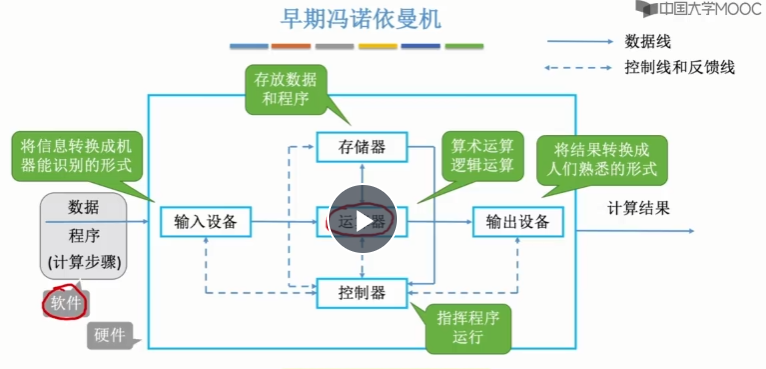
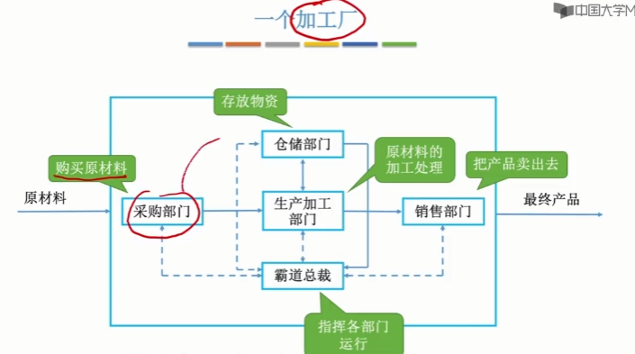
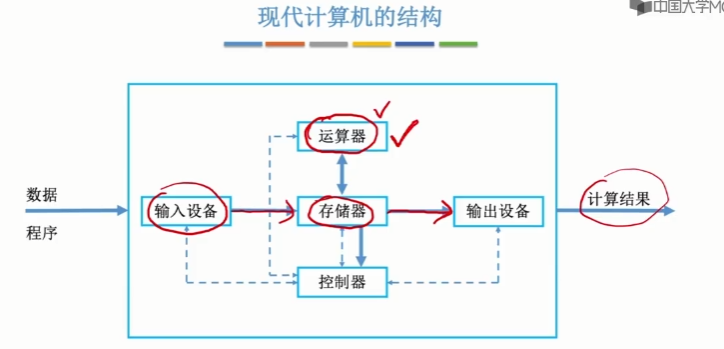
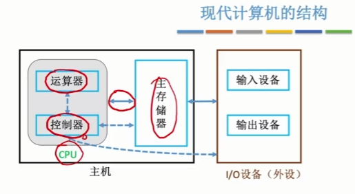
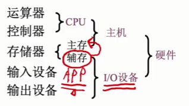
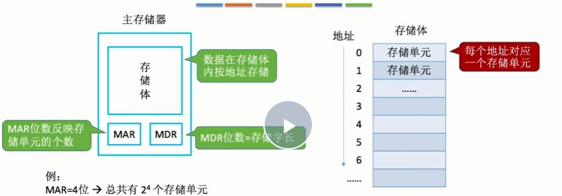
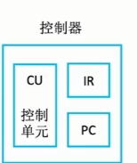
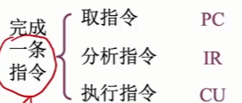

# 一 计算机系统概述

 ## 1.1 计算机发展历程

- 什么是计算机系统
  
- 计算机系统 = 硬件（计算机的实体，如主机、外设） + 软件（具有各类特殊功能的程序组成） - 
  
- 软件
  - 系统软件：用来管理整个计算机系统
    - eg：操作系统、数据库管理系统、标准程序库、网络软件、语言处理程序、服务程序
  - 应用软件：按任务需要编制成的各种程序
    - eg：抖音、英雄联盟、王者荣耀、最终幻想14...

- 计算机发展历程
  - 1946年第一台**电子数字**计算机：ENIAC
    - 缺点：体积超大、耗电量超大、使用机器语言编程
    - 逻辑元件：**电子管**
  - 1958年第二代诞生
    - 逻辑元件：**晶体管**
    - 特点：出现了面向过程的编程设计语言：FORTRAN、体积功耗得到了降低
  - 1964年第三代诞生
    - 逻辑元件：中小规模**集成电路**
    - 特点：高级语言迅速发展、开始有了分时操作系统
  - 1972年-现在
    - 逻辑元件：大规模、超大规模集成电路
    - 特点：开始出现 微处理器 、 微型计算机、个人计算机（PC），操作系统：Windows、MacOS、Linux

- 目前的发展趋势：**”两极“** 分化：

  一极是微型计算机向**更微型化**、网络化、高性能、多用途方向发展；

  另一极是巨星机向**更巨型化**、超高速、并行处理、智能化方向发展

  

## 1.2 计算机硬件的基本组成

### 1.2.1 早期冯诺依曼机

在计算机系统中，**软件和硬件在逻辑上是等效的**

芬诺伊曼计算机的特点

1. 计算机由五大部件组成
2. 指令和数据以同等地位存于存储器，可按**地址寻访**
3. 指令和数据用**二进制表示**
4. 指令由**操作码**和**地址码**组成（操作码就是指明是加法还是减法，地址码指明了要操作的数据它存放在内存的什么地址当中）
5. 存储程序（会提前把指令和数据存储到存储器当中）
6. **以运算器为中心**（输入/输出设备与存储器之间的数据传送通过 **运算器** 完成

用现实来对应结构

现代计算机的结构

现代计算机：以存储器为中心，和冯诺依曼结构中，运算器和存储器调换了一个位置

在大规模集成电路出现了后，其实 运算器和控制器两个部位通常都是在一个芯片上的。

整合了运算器和控制的的芯片就是我们的CPU

CPU = **运算器 + 控制器 **

所以更加形象的图如下

注意：存储器可以分为主存和辅存，主存属于主机，而辅存是属于IO设备的

## 1.3 各个硬件的工作原理

### 1.3.1 主存储器的基本组成

- MAR： 存储**地址寄存器**    （MAR位数反应存储单元的个数）
- MDR： 存储**数据寄存器** 
- 存储体：数据在存储体内按地址存储
  - 存储单元：每个存储单元存放一串二进制代码
  - 存储字word：存储单元中二进制代码的组合
  - 存储字长：存储单元中二进制代码的位数，比如每个存储元可存1bit
  - 存储元：即存储二进制的电子元件，每个存储元可存1bit

例：MAR=4位  =》 总共有 2^4 个存储单元

​	    MDR=16位 =》每个存储单元可存放16bit，1个字(word)=16bit

### 1.3.2 运算器的基本组成

运算器：用于实现 **算术运算**（如：加减乘除）、**逻辑运算**（如：与或非）

运算器中由4个部分组成

- ACC:累加器，用于存放操作数 或 运算结果
- MQ: 乘商寄存器，在乘、除运算时，用于存放操作数或运算结果
- X:通用的操作数寄存器，用于存放操作数
- **ALU**（核心部件）:算术逻辑单元，通过内部复杂的电路实现算数运算、逻辑运算

### 1.3.3 控制器的基本组成

- CU:控制单元，分析指令，给出**控制信号**
- IR:指令寄存器，**存放当前执行的指令**
- PC:程序计数器，存放**下一条指令**地址，有**自动加1功能**

