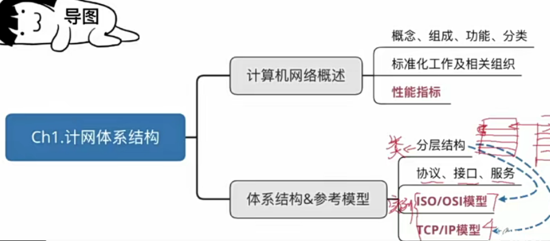
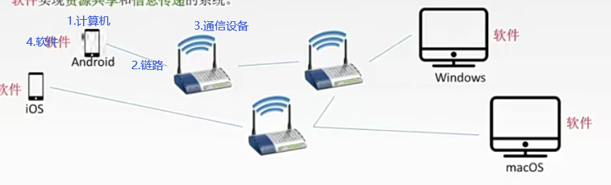

# 一 计算机网络体系结构

## 1.1 概念和功能

**一些概念**

- 计算机网络：是一个将分散的、具有独立功能的**计算机系统**，通过**通信设备**与**线路**连接起来，由功能完善的**软件**实现**资源共享**和**信息传递**的系统

- 计算机网络是**互连**的、**自治**的计算机集合
  - 互连：通过通信链路互联互通
  - 自治：无主从关系

**计算机网络的功能**

- **资源共享**：同一个计算机网络上的其他计算机可使用某台计算机的计算机资源的行为，可共享**硬件**、**软件**、**数据**
- **信息传递(数据通信)**：电脑之间传递pdf类
- 分布式处理：多台计算机各自承担同一工作任务的不同部分：Hadoop平台
- 提高可靠性：替代机（高可用中的NameNode一样）

-  负载均衡：各计算机之间更加亲密

**因特网发展阶段**

- ARPAnet -> internet -> internet
- 三级结构的因特网
- 多层次ISP结构因特网

## 1.2 组成

- 组成部分：**硬件、软件、协议**（一系列规则和约定的集合）
- 工作方式（★）
  - **边缘**部分：由一系列端系统组成，不仅可以是计算机，还可以是服务器、大型计算机、网络摄像头等等
  - **核心**部分：实现端系统与端系统的通信，注意，端系统的通信**强调进程之间的通信**。
    - 两个端系统的进程通信主要包括两种
      - C/S方式：客户/服务器方式
      - P2P方式：peer-to-peer(对等的连接)，

