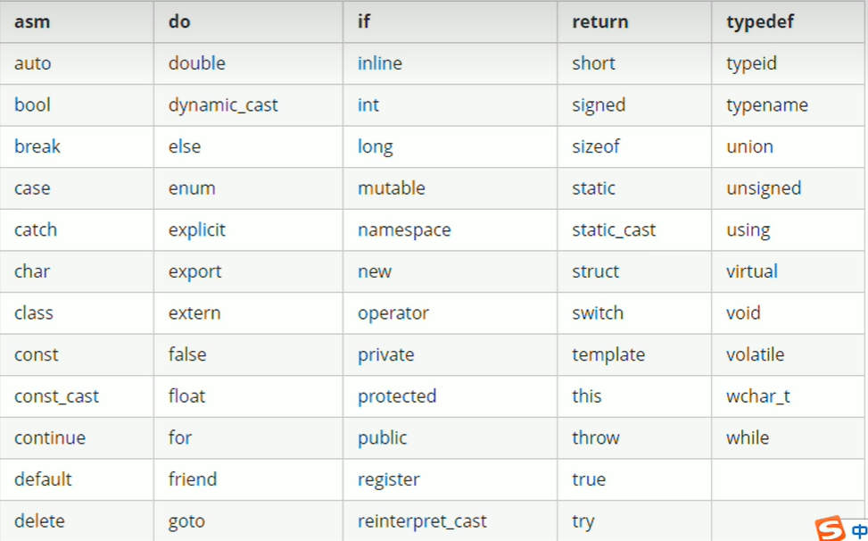
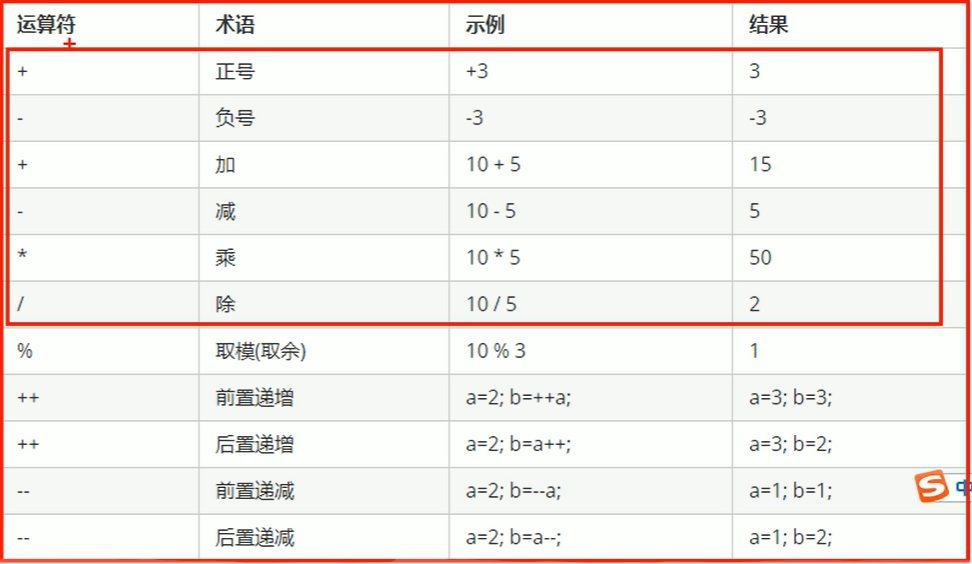
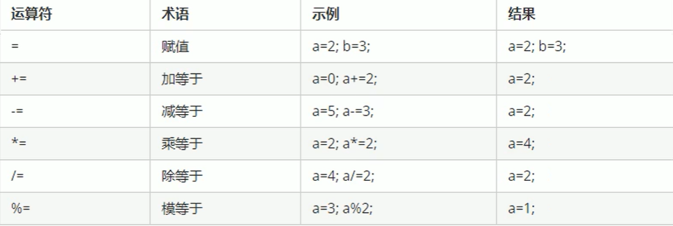
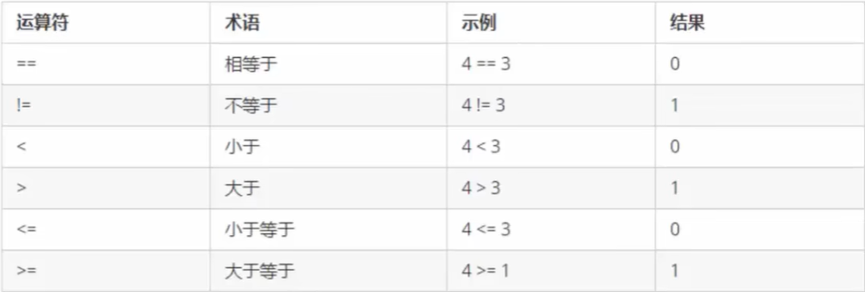
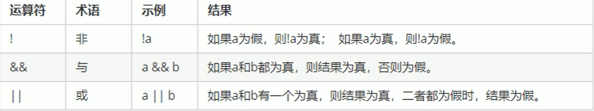

# C++基础入门

## 1 C++初识

### 1.1 Hello,Wolrd

```c++
#include <iostream>
using namespace std;

int main() {

	cout << "hello C++" << endl;

	system("pause");
	return 0;
}
```

### 1.2 注释

作用：在代码中加一些说明和解释，方便自己或其他程序员阅读代码

两种格式

1. 单行注释： //  内容
2. 多行注释:   /* 呢日哦你 */

> 提示：编译器在编译代码时，会忽略注释的内容

```c++
/*
	main是一个程序的入口
	每个程序都必须有这么一个函数
	有且只有一个
*/
```


### 1.3 变量

变量存在的意义：方便我们管理内存空间

作用：给一段指定的内存空间起名，方便操作这段内存

语法：数据类型 变量名 = 初始值;

实例

```c++
#include <iostream>
using namespace std;

int main() {
	
	// 变量的定义
	// 语法： 数据类型 变量名 = 初始值

	int a = 10;

	cout << "a = " << a << endl;

	system("pause");
	return 0;
}
```

### 1.4 常量

作用：用于记录程序中不可更改的数据

C++定义常量两种方式

1. #define 宏常量 

   - 通常在文件上方定义，定义一个常量

     ```c++
     #include <iostream>
     #define day 7
     using namespace std;
     
     int main() {
     	
     	cout << "day = " << day << endl;  // 7
     
     	system("pause");
     	return 0;
     
         
         // 错误写法
     #include <iostream>
     #define day 7
     using namespace std;
     
     int main() {
     	day = 10; // 报错 不可以修改
     	cout << "day = " << day << endl;  // 
     
     	system("pause");
     	return 0;
     ```

2. const修饰的变量

   - 通常在变量定义前加关键字const，修饰该变量为常量，不可修改

     ```c++
     #include <iostream>
     using namespace std;
     
     int main() {
     	const int day = 7;
     	cout << "day = " << day << endl;  // 7
     
     	system("pause");
     	return 0;
     }
     
     // 试图修改
     
     int main() {
     	const int day = 7;
     	day = 10; // 报错
     	cout << "day = " << day << endl; 
     
     	system("pause");
     	return 0;
     }
     ```

     

### 1.5 关键字

租用：关键字是C++中预先保留的单词（标识符）

- 在定义变量或者常量时候，不要使用关键字




### 1.6 标识符命名规则

作用：c++规定标识符（变量、常量）命名时，有一套自己的规则

- 标识符不能是关键字
- 标识符只能由  数字 字母 下划线组成
- 标识符不能由数字开头
- 标识符字母区分大小写

> 建议取名字的时候 见名知意， 下划线命名法，驼峰命名法


## 2 数据类型

C++规定在创建一个变量或者常量时，必须要指出对应的数据类型，否则无法给变量分配内存

### 2.1 整型

作用：整型变量表示的是 **整数类型** 的数据

C++中能够表示整型的类型有以下几种方式，**区别在于所占用内存空间不同**

```
数据类型		占用空间									取值范围
short			2字节										-2^15 ~ 2^15-1
int				4字节										-2^31 ~ 2^31-1
long			win为4字节，Linux为4字节或者8字节(64位)		 -2^31 ~ 2^31-1 
long long		8字节										-2^63 ~ 2^63-1
```

### 2.2 sizeof关键字

作用：利用sizeof关键字可以**统计数据类型所占内存大小**

语法

```c++
sizeof(数据类型 / 变量)
    
int main() {
	cout << "short 类型所占内存空间为：" << sizeof(short) << "字节" << endl;  // 2
	cout << "int 类型所占内存空间为：" << sizeof(int) << "字节" << endl;	// 4
	cout << "long 类型所占内存空间为："<< sizeof(long) << "字节" << endl;	// 4
	cout << "long long 类型所占内存空间为：" << sizeof(long long) << "字节" << endl; // 8
	system("pause");
	return 0;
}
```

### 2.3 浮点型(实型)

作用：用于**表示小数**

浮点型变量分为两种

1. 单精度float
2. 双精度double

两者的**区别在于表示的有效数字分为不同**

```c++
数据类型	占用空间	有效数字分为
float		4字节		7位有效数字
double		8字节		15~16位有效数字
```

实例

```c++

int main() {
	// 1、单精度 float
	float f1 = 3.1415926; // 3.14后不带f，编译器会认为3.14是double类型, 会多做一个事情将 double -> float
	float f2 = 3.1415926f; // 3.14后带f ，编译器认为3.14就是float类型，不用转换
	
	cout << "f1 = " <<f1<< "\nf2 = "<< f2 << endl;
	// 2、双精度
	double d1 = 3.1415926;
	cout << "d1 = " << d1 << endl; 

	


	system("pause");
	return 0;
}
```

> f1 f2 d1 的结果都是 3.14159
> **默认情况下 无论是double还是float，只会显示出6位有效数字**


```c++
// 统计float和double占用内存空间
cout << "float占用内存空间为:" << sizeof(float) << endl; // 4
cout << "double占用内存空间为:" << sizeof(double) << endl; // 8

// 科学计数法
float f2 = 3e2; // 3 * 10 ^ 2;
```


### 2.4 字符型

作用：字符型变量用于显示单个字符

语法

```c++
char ch = 'a';
```

> 注意1：在显示字符型变量时，用单引号将字符括起来，不要用双引号
>
> 注意2：单引号只能有一个字符，不可以是字符串

- C和C++中字符型变量只占用**1个字节**
- 字符型变量并不是把字符本身放到内存中存储，而是将对应的**ASCII编码**放入到存储单元

```c++
// 1.字符型变量创建
char ch = 'a';
// 2.输出字符型变量
cout << ch << endl; // 'a'
// 3.查看所占内存大小
cout << sizeof(ch) << endl; // 1
// 4.字符型变量对应ascii编码查看  : 强转int
cout << (int)ch << endl; // 97
```

### 2.5 转义字符

作用：用于表示一些**不能显示出来的ASCII字符**

现阶段我们常用的转义字符有

```python
\n 换行
\\ 转转义符
\t 制表符
```

### 2.6 字符串型

作用：用于表示一串字符

**两种风格**

1. C风格字符串: char 变量名[] = "字符串值"

   ```c++
   int main() {
       // 注意:C风格的字符串要用双引号括起来
       // 使用char类型数组 实现字符串
   	char str1[] = "hello,world";
   	cout << str1 << endl;
   
   
   	system("pause");
   	return 0;
   }
   ```

2. C++风格字符串：string 变量名 = "字符串值"

   ```c++
   
   int main() {
       // 注意:c++风格必须要加入头文件 #include<string>
       // 使用string类型 就是字符串
   	string str1 = "hello,world";
   	cout << str1 << endl;
   
   
   	system("pause");
   	return 0;
   }
   ```

   


### 2.7 布尔类型 bool

作用：布尔数据类型代表真或假的值

boll类型只有两个值：

- true -- 真 -- 1
- false -- 假 -- 0

bool类型占**1个字节大小**

```c++
bool flag = true;

cout << flag << endl; // 1  表示true
cout << flag + 1 << endl; // 2   可用作数值计算
cout << (1 > 2) << endl; // 0   可以用于比较运算符
cout << (2 > 1) << endl; // 1   可以用于比较运算符
```

> 注意，在编写代码的时候，可以写true和false
>
> 但是在输出结果里面，是0和1表示


### 2.8 数据的输入

作用：用于从键盘获取数据

关键字：cin

语法：cin >> 变量

```c++
int main() {
	// 1、输入整型
	int a = 0;
	cout << "请给整型变量a赋值: " << endl; // 提示语句，并无逻辑意义
	cin >> a;
	cout << "a = " << a << endl;
	// 2、输入浮点型
	float f = 3.14f;
	cout << "请给浮点变量f赋值: " << endl;
	cin >> f;
	cout << "f = " << f << endl;

	// 3、输入字符型
	char ch = 'a';
	cout << "请给字符变量ch赋值：" << endl;
	cin >> ch;
	cout << "ch = " << ch << endl;


	// 4、输入字符串型  记得引入string
	string str = "hello";
	cout << "请给字符串 str赋值" << endl;
	cin >> str;
	cout << "字符串str = " << str << endl;


	// 5、输入布尔类型 只要是非0的值都代表真
	bool flag = false;
	cout << "请给布尔类型 flag赋值" << endl;
	cin >> flag;
	cout << "flag = " << flag << endl;

	system("pause");
	return 0;
}
```


## 3 运算符

作用：用于执行代码的运算

### 3.1 算术运算符

作用：处理四则运算



> 注意，在除法过程中，分母不为0


### 3.2 赋值运算符





### 3.3 比较运算符

作用：用于表达式的比较，并返回一个真或假值

符号和python基本相同




### 3.4 逻辑运算符

作用：用于逻辑判断，返回的也是布尔值

注意短路知识噢




## 4 流程控制

C/c++ 支持最基本的三种程序运行结构：顺序结构、选择结构、循环结构

- 顺序结构：瀑布
- 选择结构：会拐弯
- 循环结构：会杀回马枪

### 4.1 选择结构

#### 4.1.1 if语句

作用：执行满足条件的语句

if语句的三种形式

- 单行格式if语句
- 多行格式if语句
- 多条件的if语句


- 小练习  单向分支

  ```cpp
  // 用户输入分数，如果分数大于600，视为考上一本大学，在屏幕上输出
  
   
  int main() {
  	// 1、用户输入分数
  	int score = 0;
  	cout << "请输入一个分数：" << endl;
  	cin >> score;
  
  	// 2、打印用户的分数
  	cout << "您输入的分数为：" << score << endl;
  
  	// 3、进入条件语句
  	if (score > 600)
  		cout << "恭喜你上了一本" << endl;
  
  	system("pause");
  	return 0;
  }
  ```

  

- 小练习 双向分支

  ```c++
  // 用户输入分数，如果分数大于600，打印1本，否则打印 未考上1本
  
  int main() {
  	// 1、用户输入分数
  	int score = 0;
  	cout << "请输入一个分数：" << endl;
  	cin >> score;
  
  	// 2、打印用户的分数
  	cout << "您输入的分数为：" << score << endl;
  
  	// 3、进入条件语句
  	if (score > 600)
  		cout << "恭喜你上了一本" << endl;
  	else
  		cout << "你落榜一本了" << endl;
  	system("pause");
  	return 0;
  }
  ```

  

- 小练习 多向分支

  ```cpp
  // 用户输入分数，如果分数大于600，打印1本
  // 大于500分，打印2本
  // 大于400分，打印3本
  // 小于等于400分，打印大专
  
  
  int main() {
  	// 1、用户输入分数
  	int score = 0;
  	cout << "请输入一个分数：" << endl;
  	cin >> score;
  
  	// 2、打印用户的分数
  	cout << "您输入的分数为：" << score << endl;
  
  	// 3、进入条件语句
  	if (score > 600)
  		cout << "一本" << endl;
  	else if (score > 500)
  		cout << "二本" << endl;
  	else if (score > 400)
  		cout << "三本" << endl;
  	else
  		cout << "大专混大专人大专都是人上人" << endl;
  	system("pause");
  	return 0;
  }
  ```

  


- 小练习 嵌套if

  ```c++
  // 用户输入分数，如果分数大于600，打印1本
  // 大于500分，打印2本
  // 大于400分，打印3本
  // 小于等于400分，打印大专
  
  // 在一本中，如果大于了700分，考入北大，大于650分考入清华，大于600分考入人大
  
  
  int main() {
  	// 1、用户输入分数
  	int score = 0;
  	cout << "请输入一个分数：" << endl;
  	cin >> score;
  
  	// 2、打印用户的分数
  	cout << "您输入的分数为：" << score << endl;
  
  	// 3、进入条件语句
  	if (score > 600){
          if (score > 700)
  			cout << "北大" << endl;
  		else if (score > 650)
  			cout << "清华" << endl;
  		else
  			cout << "人大" << endl;
      }else if (score > 500)
  		cout << "二本" << endl;
  	else if (score > 400)
  		cout << "三本" << endl;
  	else
  		cout << "大专混大专人大专都是人上人" << endl;
  	system("pause");
  	return 0;
  }
  ```

  

- 练习：输入3个数，输出最大的数

  ```c++
  int main() {
  	int A, B, C;
  	cout << "请输入A：" << endl;
  	cin >> A;
  	cout << "请输入B：" << endl;
  	cin >> B;
  	cout << "请输入C：" << endl;
  	cin >> C;
  
  	if (A > B) {
  		if (A > C)
  			cout << A << endl;
  		else
  			cout << C << endl;
  	}
  	else {
  		if (B > C)
  			cout << B << endl;
  		else
  			cout << C << endl;
  	}
  
  
  	system("pause");
  	return 0;
  }
  ```

#### 4.1.2 三目运算符

作用：简洁if语句

语法

```java
表达式1 ? 表达式2 : 表达式3
```

- 小练习：使用三目运算符求3个数的最大值

  ```cpp
  int main() {
  	int A, B, C;
  	cout << "请输入A：" << endl;
  	cin >> A;
  	cout << "请输入B：" << endl;
  	cin >> B;
  	cout << "请输入C：" << endl;
  	cin >> C;
  
  	cout << (A > B ? (A > C ? A : C) : (B > C ? B : C)) << endl;
  
  
  	system("pause");
  	return 0;
  }
  ```

  

#### 4.1.3 switch语句

作用：执行多条件分支语句

语法

```cpp
switch(表达式){
    case 结果1:
        执行语句;
        break;
    case 结果2:
        执行语句;
        break;
    case 结果3;
        执行语句;
        break;
  	default;
        执行语句;
        break；
}
```

> 注意1：switch语句中表达式类型只能是整型或者字符串
>
> 注意2：case里如果没有break，那么程序会一直向下执行
>
> 总结：与if相比，对于多条件判断时，switch结果清晰，执行效率高，缺点是**switch不能判断区间**


### 4.2 循环结构

#### 4.2.1 while循环

作用：满足循环条件，执行循环语句

语法：while(循环条件){循环语句}

解释：只要循环条件的结果未真，就执行循环语句

- 小练习：在屏幕中打印 0 ~ 9 

  ```cpp
  int main() {
  	int a = 0;
  
  	while (a < 10){
  		cout << a << endl;
  		a++;
  	}
  		
  
  	system("pause");
  	return 0;
  }	
  ```

  

- 练习：猜数字

  ```cpp
  // 系统随机生成1~100的数字，玩家进行猜测，如果猜错，提示玩家过大或者国小，如果才对恭喜玩家胜利，并且退出游戏
  
  #include <iostream>
  using namespace std;
  // ctime 系统时间头文件包含
  #include<ctime>
  int main() {
  	// 每次都是42，如果要真随机，需要添加随机数种子，利用当前系统时间生成随机数
  	srand((unsigned int)time(NULL));
  
  	// 1、系统生成随机数  rand()%100 表示生成0~99随机整数   rand()%100 + 1 => 1~100
  	int num = rand() % 100 + 1; 
  
  	int user;
  	// 3、判断玩家的猜测
  	while (1) {
  		// 2、玩家进行猜测
  		cout << "猜一猜:" << endl;
  		cin >> user;
  		if (user == num) {
  			cout << "猜对了" << endl;
  			break;
  		}
  		else if (user > num) {
  			cout << "猜大了" << endl;
  			continue;
  		}
  		else {
  			cout << "猜小了" << endl;
  			continue;
  		}
  	}
  
  	system("pause");
  	return 0;
  }
  ```

  


#### 4.2.2 do...while循环

作用：满足循环条件，执行循环语句

语法

```
do{循环语句}while(循环条件)
```

- 小练习：打印0~9

  ```cpp
  int main() {
  	int i = 0;
  	do {
  		cout << i << endl;
  		i++;
  	} while (i < 10);
  
  	system("pause");
  	return 0;
  }
  ```

  


- 练习：水仙花数

  ```cpp
  // 利用do..while语句，求出所有3位数的水仙花数
  
  int main() {
  	int i = 100;
  	int g, s, b;
  	do {
  		g = i % 10;
  		s = i / 10 % 10;
  		b = i / 100;
  		if (g * g * g + s * s * s + b * b * b == i)
  			cout << i << endl;
  		i++;
  	} while (i < 1000);
  
  	system("pause");
  	return 0;
  }
  ```

  

#### 4.2.3 for循环语句

作用：满足循环条件，执行循环语句

语法

```python
for(起始表达式;条件表达式;末尾循环体){
    循环语句;
}
```


- 小练习：打印0~9

  ```cpp
  int main() {
  	
  	for (int i = 0; i < 10; i++) {
  		cout << i << endl;
  	}
  
  	system("pause");
  	return 0;
  }
  ```

- 练习：敲桌子

  ```cpp
  int main() {
  	
  	for (int i = 1; i < 101; i++) {
  		// 数字个位含有7
  		bool flag1 = i % 10 == 7;
  		// 数字十位含有7
  		bool flag2 = i / 10 == 7;
  		// 数字是7的倍数
  		bool flag3 = i % 7 == 0;
  		if (flag1 || flag2 || flag3)
  			cout << "\t\t\t敲桌子\t\t\t" << endl;
  		else
  			cout << i << endl;
  
  	}
  
  	system("pause");
  	return 0;
  }
  ```

  

#### 4.2.4 嵌套循环

作用：在循环体中嵌套一层循环，解决一些实际问题


- 小练习：输出99乘法表

  ```cpp
  
  int main() {
  
  	for (int i = 1; i < 10; i++) {
  		for (int j = 1; j < i + 1; j++)
  			cout << i << "*" << j << "=" << i * j << "\t";
  		cout << endl;
  	}
  	system("pause");
  	return 0;
  }
  ```

  

### 4.3 跳转语句

break：退出整个循环

continue：退出本次循环


goto：可以无条件跳转语句

语法：goto 标记

解释：如果标记的名称存在，执行到goto语句，会跳转到标记的位置

```cpp
int main() {

	cout << "1、xxxx" << endl;
	cout << "2、xxxx" << endl;
	goto FLAG; // 跳转标记 ： goto 标记名

	cout << "3、xxxx" << endl;
	cout << "4、xxxx" << endl;

	FLAG: // 定义标记:   标记名:
	cout << "5、xxxx" << endl;
	system("pause");
	return 0;
}
```


## 5 数组

### 5.1 概述

所谓数组，就是一个集合，里面存放了相同类型得数据元素

特点1：数组中的每个元素都是相同的数据类型

特点2：数组是由**连续的内存**位置组成的 (下标)

### 5.2 一维数组

#### 5.2.1 一维数组定义方式

一维数组定义的三种方式

1. 数据类型 数组名[数组长度];
2. 数据类型 数组名[数组长度] = {值1,值2,....};
3. 数据类型 数组名[] = {值1,值2,...};
   		

例子

```c++
int main() {
	//1.数据类型	数组名[数组长度];
	int arr[5];
	//赋值
	for (int i = 0; i < 5; i++)
		arr[i] = (i + 1) * 10;
	//遍历
	for (int i = 0; i < 5; i++) {
		cout << arr[i] << endl;
	}
	
	//2. 数据类型 数组名[数组长度] = {值1,值2,....};
	// 如果在初始化数据时候，没有全部填写完，会用0填充
	int arr2[6] = { 10,20,30,40,50 };
	//遍历
	for (int i = 0; i < 6; i++) {
		cout << arr2[i] << endl;
	}

	//3. 数据类型 数组名[] = {值1,值2,...};
	int arr3[] = { 98,99,100 };
	for (int i = 0; i < 5; i++) {
		cout << arr3[i] << endl;
	}
	system("pause");
	return 0;
}
```


#### 5.2.2 一维数组数组名

一维数组名称的**用途**

1. 可以通过数组名统计整个数组占用内存大小
2. 可以通过数组名查看数组首地址


实例

```cpp

int main() {
	// 1. 可以通过数组名统计整个数组占用内存大小
	int arr[10] = { 1,2,3,4,5,6,7,8,9,0 };
	
	cout << "整个数组占用内存空间为:" << sizeof(arr) << endl;
	cout << "每个元素占用内存空间为:" << sizeof(arr[0]) << endl;
	cout << "数组中元素的个数为:" << sizeof(arr)/sizeof(arr[0]) << endl;

	// 2. 可以通过数组名查看数组首地址
	cout << "数组首地址为：" << arr << endl;
	cout << "数组中第一个元素地址为：" << &arr[0] << endl;

	// 数组名是常量，不可以进行赋值操作
	arr = 100 //报错

	system("pause");
	return 0;
}
```


- 小练习：五只小猪称体重

  ```cpp
  // 在一个数组中记录了五只小猪的体重，如 : int arr[5] = {300,350,200,400,250};
  // 找出并打印体重最小的体重
  
  int main() {
  	int arr[5] = { 300,350,200,400,250 };
  	int min = arr[0];
  	for (int i = 1; i < sizeof(arr) / sizeof(arr[0]); i++) {
  		if (min > arr[i]) {
  			min = arr[i];
  		}
  	}
  	cout << "最轻的小猪为：" << min << "kg";
  
  	system("pause");
  	return 0;
  }
  ```

- 数组元素逆置 ☆

  ```cpp
  // 声明一个5个元素的数组，并且将元素反转；
  int main() {
  	int arr[5] = { 300,350,200,400,250};
  	int lengArr = sizeof(arr) / sizeof(arr[0]);
  	int t1=0, t2=lengArr-1,temp;
  	while (t1 < t2) {
  		temp =arr[t1];
  		arr[t1] = arr[t2];
  		arr[t2] = temp;
  		t1++, t2--;
  	}
  
  	
  	// 遍历
  	for (int i = 0; i < lengArr; i++) {
  		cout << arr[i] << endl;
  	}
  	system("pause");
  	return 0;
  }
  ```

  

#### 5.2.3 冒泡排序

```c++
int main() {
	int arr[6] = { 300,350,200,400,250,100 };
	int lengArr = sizeof(arr) / sizeof(arr[0]);
	for (int i = 0; i < lengArr - 1; i++) {
		for (int j = 0; j < lengArr - i - 1; j++) {
			if (arr[j+1] < arr[j]) {
				int temp = arr[j+1];
				arr[j+1] = arr[j];
				arr[j] = temp;
			}
			
		}
	}

	
	// 遍历
	for (int i = 0; i < lengArr; i++) {
		cout << arr[i] << endl;
	}
	system("pause");
	return 0;
}
```

### 5.3 二维数组

#### 5.3.1 二维数组定义

```c++
二维数组定义方式
1. 数据类型 数组名[行数][列数];
int arr[2][3];
arr[0][0] = 1;
arr[0][1] = 2;
arr[0][2] = 3;
arr[1][0] = 4;
arr[1][1] = 5;
arr[1][2] = 6;
2. 数据类型 数组名[行数][列数] = {{数据1,数据2},{数据3,数据4}};
int arr2[2][3] = {
    {1,2,3},
    {4,5,6}
}; // 可读性高


3. 数据类型 数组名[行数][列数] = {数据1,数据2,数据3,数据4};
int arr3[2][3] = {1,2,3,4,5,6};
// 123就是第一组，456就是第二组，程序自动划分


4. 数据类型 数组名[][列数] = {数据1,数据2,数据3,数据4};
int arr4[][3] = {1,2,3,4,5,6};
// 123还是为1列，456为2列，自动划分


```

#### 5.3.2 二维数组组名

- 查看二维数组所占内存空间
- 获取二维数组首地址

```cpp
//1.可以查看内存空间大小
int arr[2][3] = {
    {1,2,3},
    {4,5,6}
};
cout << "二维数组占用内存空间为：" << sizeof(arr) << endl;  // 6*4=24
cout << "二维数组第一行占用内存为：" << sizeof(arr[0]) << endl; // 3*4 = 12
cout << "二维数组第一个元素占用内存为: " << sizeof(arr[0][0]) <<endl; // 4

cout << "二维数组的行数为：" << sizeof(arr) / size(arr[0]) <<endl
cout << "二维数组的列数为：" << sizeof(arr[0]) / size(arr[0][0]) <<endl

//2.可以查看二维数组的首地址
cout << "二维数组首地址为: " << arr << endl;
cout << "二维数组第一行首地址为：" << arr[0] << endl;
cout << "二维数组第一行第一个首地址为：" << &arr[0][0] << endl; //这3个结果一样
```


- 案例

```cpp
// 有3名同学，统计它们的总乘积

张三 100,100,100;
李四 90,50,100;
王五 60,70,80;

```


## 6 函数

### 6.1 概述

作用：将一段经常使用的代码封装起来，减少重复代码

一个较大的程序，一般分为若干个程序块，每个模块实现特定的功能

### 6.2 函数的定义

函数的定义一般主要5个步骤

1. 返回值类型
2. 函数名
3. 参数列表
4. 函数体语句
5. return 表达式

语法

```
返回值类型 函数名 (参数列表){
	函数体语句
	return表达式
}
```


- 定义一个加法函数，实现2个数相加

  ```cpp
  int add(int x, int y) {
  	return x + y;
  }
  ```

  


### 6.3 函数调用

```
函数名(实参列表)
```


> 注意：实参传递给形参时，后面形参的改变不会影响实参。

### 6.4 函数声明

作用：告诉编译器函数名称以及如何调用函数。函数的实际主体可以单独定义。

- 函数的声明可以多次，但是函数的定义只有一次。

实例

```c++
// 比较函数，实现两个整型数字进行比较，返回较大的值
int max(int a,int b); // 函数的声明


int main() {
	
	cout << max(5, 6) << endl;
	system("pause");
	return 0;
}

int max(int a, int b){
	return a > b ? a : b;
}


```

### 6.5 函数分文件编写

作用：让代码结构更清晰

函数分文件编写一般有4个步骤

1. 创建后缀为h的头文件
2. 创建后缀名为cpp的源文件
3. 在头文件中写函数的声明
4. 在源文件中写函数的定义


## 7.指针

### 7.1 指针的基本概念

指针的作用：可以通过指针间接访问内存

- 内存编号是从0开始记录的，一般用 十六进制 数字表示
- 可是利用指针变量保存地址


### 7.2 指针定义和使用

```cpp
int main() {
	
	// 1、定义指针
	int a = 10;
	//指针定义的语法: 数据类型 * 指针变量名;
	int* p;
	// 让指针记录变量a的地址
	p = &a;
	cout << "a的地址为:" << &a << endl;
	cout << "指针p为:" << p << endl; // 其实指针就是地址，相对于是地址的别名

	// 2、使用指针
	// 可以通过 解引用 的方式来找到指针指针的内存
	// 指针前加 * 代表解引用，找到指针指向的内存中的数据
	*p = 1000;
	cout << "a = " << a << endl;
	cout << "*p = " << *p << endl;


	system("pause");
	return 0;
}
```


> 注意，指针也是会占内存空间的
>
> 在32位下，指针是占4个字节空间大小
>
> 在64位下，指针是占8个字节空间大小
>
> 不管是什么类型的指针，都是如此

### 7.3 空指针和野指针

空指针：指针变量指向内存中编号为0的空间

用途：初始化指针变量

注意：空指针指向的内存是不可以访问的

例子

```cpp
// 空指针
// 1.空指针用来给指针变量初始化
int* p = NULL;
// 2.空指针是不可以访问的
```


野指针：指针变量指向非法的内存空间

```cpp
// 野指针
// 在程序中，避免出现野指针，占用非法空间
int *p = (int *)0x1100;
```

> 总结：空指针和野指针 尽量不要去访问


### 7.4 const修饰指针

const修饰指针有三种情况

1. const修饰指针 --- 常量指针
2. const修饰常量 --- 指针常量
3. const即修饰指针，又修饰常量

例子

```cpp
int a = 10;
int b = 20;
const int * p = &a; //常量指针
// 特点：指针的指向可以修改，但是指针指向的值不可以改

*p = 20; 错误，指针指向的值不可以改
p = &b; 正确，指向的指向可以改


int * const p = &a; //指针常量
// 特点：指针的指向不可以改，指针指向的值可以改
*p = 20; 正确，指针指向的值可以改
p = &b; 错误，指针的指向不可以改


const int * const p = &a;  
//特点：指针的指向和指针的值都不可以改。锁死
```


### 7.5 指针和数组

作用：利用指针访问数组每个元素

示例

```cpp
// 指针和数组
// 利用指针访问数组中的元素 


int main() {
	
	int arr[10] = {1,4,3,4,5,6,7,8,9,10};

	cout << "第一个元素："<< arr[0] << endl;

	int* p = arr; // arr 就是数组的首地址
	cout << "利用指针访问第一个元素：" << *p << endl;
	cout << "利用指针访问第二个元素：" << *(p + 1) << endl;

	system("pause");
	return 0;
}

```


### 7.6 指针和函数

例子

```cpp
// 值传递 : 无法修改值


// 地址传递 ： 可以真正的修改
```


- 案例：封装一个函数，利用冒泡排序，实现对整数数组的升序排序

  ```cpp
  // 参数1 数组的首地址  参数2  数组长度
  void sorts(int * arr,int len) {
  	for (int i = 0; i < len - 1; i++) {
  		for (int j = 0; j < len - 1 - i; j++) {
  			if (arr[j] > arr[j + 1]) {
  				int temp = arr[j];
  				arr[j] = arr[j + 1];
  				arr[j + 1] = temp;
  			}
  		}
  	}
  }
  int main() {
  	
  	int arr[10] = {11,4,3,4,5,2,7,9,8,1};
  	int len = sizeof(arr)/sizeof(arr[0]);
  	sorts(arr, len); // 这里arr本质上就是地址。所以就是可以用指针接收
  
  	for (int i = 0; i < len; i++) {
  		cout << arr[i] << endl;
  	}
  	
  
  	system("pause");
  	return 0;
  }
  
  
  ```

  


## 8 结构体

### 8.1 结构体基本概念

结构体属于用户**自定义的数据类型**,允许用户存储不同的数据类型


### 8.2 结构体定义和使用

语法：struct 结构体名 {结构体成员列表};

通过结构体创建变量的方式有三种

- struct 结构体名 变量名
- struct 结构体名 变量名 = {成员1，成员2}
- 定义结构体时顺便创建变量

```cpp
int main() {
	struct Student {
		string name;
		int age;
		int score;
	}s3;

	// 方式1：struct Student s1;
	struct Student s1;
	s1.name = "张三";
	s1.age = 18;
	s1.score = 100;

	cout << " 姓名:" << s1.name << " 年龄;" << s1.age << " 分数:" << s1.score << endl;

	// 方式2：struct Student s1 = {...};
	struct Student s2 = { "李四",19,80 };
	cout << " 姓名:" << s2.name << " 年龄;" << s2.age << " 分数:" << s2.score << endl;

	// 方式3：struct Student{...}s3;
	s3.name = "王五";
	s3.age = 22;
	s3.score = 33;
	cout << " 姓名:" << s3.name << " 年龄;" << s3.age << " 分数:" << s3.score << endl;


	system("pause");
	return 0;
}

```


### 8.3 结构体数组

作用：将自定义的结构体放入到数组中方便维护

语法：struct 结构体名 数组名[元素个数] = {{},{},{},...,{}}

```cpp
struct Student {
	string name; // 姓名 
	int age; // 年龄
	int score; // 分数
};
int main() {
	// 结构体数组
	struct Student arr[3] = {
		{"张三",18,100},
		{"李四",10,22},
		{"王五",22,33}
	};


	// 遍历结构体数组
	for (int i = 0; i < 3; i += 1) {
		struct Student st = arr[i];
		cout << " 姓名:" << st.name << " 年龄:" << st.age << " 分数:" << st.score << endl;
	}


	system("pause");
	return 0;
}


```


### 8.4 结构体指针

作用：通过指针访问结构体中的成员

- 利用操作符 -> 可以通过 结构体指针 访问结构体属性

```cpp
struct Student {
	string name; // 姓名 
	int age; // 年龄
	int score; // 分数
};
int main() {
	// 1、创建学生结构体遍历
	Student s = { "张三" ,18,100};

	Student *p = &s;

	// 2、通过指针指向结构体变量
	cout << (&s)->name << endl;
	cout << p->name << endl;


	system("pause");
	return 0;
}

```


### 8.5 结构体嵌套结构体

作用：结构体中的成员可以是另一个结构体

例如：每个老师辅导一个学员，一个老师的结构体中，记录一个学生的结构体

```cpp
 struct Student {
	string name; // 姓名 
	int age; // 年龄
	int score; // 分数
};

struct Teacher {
	int id; //职工编号
	string name; // 老师姓名
	int age; //老师年龄
	struct Student stu; // 辅导的学生
};

int main() {
	// 创建学生
	Student s = { "张三" ,18,100 };
	// 创建老师
	Teacher t;
	t.name = "老王";
	t.age = 50;
	t.id = 10000;
	t.stu = s;

	cout << "老师姓名: " << t.name << " 老师编号: " << t.id << " 老师年龄: " << t.age << " 老师辅导的学生名: " << t.stu.name << " 学生年龄:"
		<< t.stu.age << " 学生分数: " << t.stu.score << endl;

	system("pause");
	return 0;
}


```


### 8.6 结构体做函数参数

作用：将结构体作为参数向函数传递

传递方式两种：

- 值传递
- 地址传递


