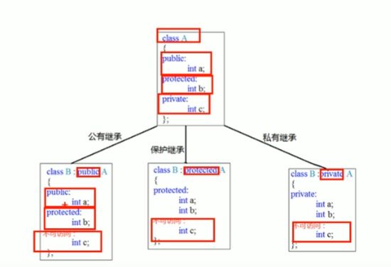

# *定义常量

```c++
#define day 7 
const int day = 7;
```

# 浮点型

```c++
1.单精度float值，后面需要带f，为什么？因为编译器会认为不带f的数是double类型，会多做一个事情，double->float
2.默认情况下，无论是double还是float，只会显示六位有效数字
3.//科学计数法
	float f2 = 3e2; // 3*10^2
```

# 字符型

```c++
注意1：在显示字符型变量时，用单引号将字符括起来，不要用双引号
注意2：单引号只能有一个字符，不可以是字符串
C和C++中字符型变量只占用1个字节
字符型变量并不是把字符本身放到内存中存储，而是将对应的ASCII编码放入到存储单元

想看对应的ascii编码值，只需要强行转换为 int类型就行
```

# 字符串型

两种风格

```c++
c语言风格
char str1[] = "hello,world";
c++ 语言风格
string str2 = "hello,world"; // 但是注意，必须要引入头文件 <string> 
    
```

# 三目运算符

```c++
表达式1 ? 表达式2 : 表达式3

// 找3个数最大值
cout << (A>B ? (A>C? A:C):(B>C?B:C));
```

# 数组

```c++
一维数组定义的三种方式

数据类型 数组名[数组长度];
数据类型 数组名[数组长度] = {值1,值2,….};
数据类型 数组名[] = {值1,值2,…};

// 如果在初始化数据时候，没有全部填写完，会用0填充


一维数组名称的用途

可以通过数组名统计整个数组占用内存大小
可以通过数组名查看数组首地址

比如
int arr[10] = { 1,2,3,4,5,6,7,8,9,0 };

// 1. 可以通过数组名统计整个数组占用内存大小
cout << "整个数组占用内存空间为:" << sizeof(arr) << endl;
cout << "每个元素占用内存空间为:" << sizeof(arr[0]) << endl;
cout << "数组中元素的个数为:" << sizeof(arr)/sizeof(arr[0]) << endl;

// 2. 可以通过数组名查看数组首地址
cout << "数组首地址为：" << arr << endl;
cout << "数组中第一个元素地址为：" << &arr[0] << endl;

// 数组名是常量，不可以进行赋值操作
arr = 100; //报错;
    
    
    
二维数组定义方式
int arr2[2][3] = {
    {1,2,3},
    {4,5,6}
}; // 可读性高
二维数组组名
//1.可以查看内存空间大小
cout << "二维数组占用内存空间为：" << sizeof(arr) << endl;  // 6*4=24
cout << "二维数组第一行占用内存为：" << sizeof(arr[0]) << endl; // 3*4 = 12
cout << "二维数组第一个元素占用内存为: " << sizeof(arr[0][0]) <<endl; // 4

cout << "二维数组的行数为：" << sizeof(arr) / size(arr[0]) <<endl
cout << "二维数组的列数为：" << sizeof(arr[0]) / size(arr[0][0]) <<endl

//2.可以查看二维数组的首地址
cout << "二维数组首地址为: " << arr << endl;
cout << "二维数组第一行首地址为：" << arr[0] << endl;
cout << "二维数组第一行第一个首地址为：" << &arr[0][0] << endl; //这3个结果一样
```


# 指针

指针的作用：可以通过指针间接访问内存

- 内存编号是从0开始记录的，一般用 十六进制 数字表示
- 可是利用指针变量保存地址

```c++
空指针：指针变量指向内存中编号为0的空间
用途：初始化指针变量
注意：空指针指向的内存是不可以访问的

野指针：指针变量指向非法的内存空间
// 在程序中，避免出现野指针，占用非法空间
int *p = (int *)0x1100;
总结：空指针和野指针 尽量不要去访问
```


```c++
const修饰指针

const修饰指针有三种情况
const修饰指针 —- 常量指针
const修饰常量 —- 指针常量
const即修饰指针，又修饰常量

const 在前的情况
int main() {
   	int a =10;
   	int b =20;
   	const int * p = &a; // 常量指针 : 锁值，不锁指向，指向可以改 
	// 特点：指针的指向可以修改，但是指针指向的值不可以改
//	*p= 10;  // 报错
	p = &b; // 把p的地址改成了 &b 
	cout << *p; 
    return 0;
}

const 在后的情况
int main() {
   	int a =10;
   	int b =20;
   	int * const p = &a; // 指针常量
	*p = 20;//true
	// p = &b // 错误 
	cout << *p; 
    return 0;
}

const又在前又在后就不用说了，全锁，即锁指针的指向，又锁指向的值
```

```c++
指针和数组

作用：利用指针访问数组每个元素


int main() {
   	int arr[5] = {1,2,3,4,5};
   	int *p = arr;
   	cout << *(p+1); //2
    return 0;
}

```

# 结构体

```c++
语法：struct 结构体名 {结构体成员列表};

通过结构体创建变量的方式有三种
- struct 结构体名 变量名
- struct 结构体名 变量名 = {成员1，成员2}
- 定义结构体时顺便创建变量
```

# 函数占位参数

感觉没啥意义啊。知道这个东西算了

```cpp
void func(int a,int);
```

# 函数重载

作用：函数名可以相同，提高复用性

函数重载满足条件

- 同一个作用域下
- 函数名称相同
- 函数参数三不同 **类型不同** or **个数不同** or **顺序不同**

注意：函数返回值不可以作为函数重载的条件


# 类和对象

面向对象三大特性：封装、继承、多态

## 封装

封装的意义

- 将属性和行为作为一个整体，表现生活的事物
- 将属性和行为加以权限控制

封装意义一：在设计类的时候，属性和行为写在一起，表现事物

```c++
语法：class 类名{访问权限: 属性 / 行为};
```

例:设计一个圆类，方法有求圆的周长和圆的面积

模板

```cpp
// 设计一个圆类，求圆的面积和周长 
class Circur{
	//访问权限 
	publie:
	//属性
	
	//方法 
};
```

```cpp
#include <iostream>
using namespace std;
const double PI = 3.14;
// 设计一个圆类，求圆的面积和周长 
class Circur{
	//访问权限 
	public:
	//属性
		int r; // 半径
		 
	//方法
		double getZC(){
			// 求圆的周长 
			return 2 * PI * r;
		} 
		double getS(){
			// 求圆的面积
			return PI * r * r; 
		}
};


int main() {
   	// 通过圆类，创建具体的圆
	Circur c1;
	// 给圆属性赋值
	c1.r = 5;
	cout << c1.getS() << endl; 
	cout << c1.getZC() << endl; 
    return 0;
}

```

例子2：设计一个学生类，属性有姓名和学号，可以给姓名和学号赋值，可以显示学生的姓名和学号

```cpp
#include <iostream>
using namespace std;

class Student{
	public:
		string name;
		int id;

		void showName(){
			cout <<name;
		}
		void showId(){
			cout <<id;
		}
};


int main() {
   	Student s1;
   	s1.id = 10;
   	s1.name = "傻逼";
   	s1.showName();
    return 0;
}

```


封装意义二：类在设计时，可以把属性和行为放在不同的权限下，加以控制

访问权限有三种

- public 公共权限 ： 都可以访问
- protected 保护权限 ：类内可以访问，类外不可以访问
- private 四有权限 ： 类内可以访问，类外不可以访问

protected和private有什么区别？

在继承中protected儿子也可以继承，但是private儿子继承不了


- class和struct区别


唯一区别： 默认的访问权限不同

- struct 默认权限为公共
- class 默认权限为私有

## 构造函数和解析函数

对象的**初始化和清理**也是两个重要的东西

- 一个对象或者变量没有初始状态，对其使用后果是未知
- 同样的使用完一个对象或变量，没有及时清理，也会造成一定的安全问题

而 构造函数 和 解析函数可以解决上面问题 ，这2个函数会被解析器自动调用，完成对象的初始化和清理工作


注意：对象的初始化和清理工作是编译器强制要我们做的事情，所以**就算我们不提供这2个函数，编译器也会提供编译器提供的构造函数和析构函数，并且是空实现的**

- 构造函数：创建对象时为对象的成员属性赋值，构造函数由编译器自动调用，无需手动调用
- 析构函数：对象销毁前系统自动调用，执行一些清理工作

**构造函数语法：类名(){}**

1. 构造函数，**没有返回值也不写void**
2. 函数名和类名相同
3. 构造函数可以有参数，因此可以发生重载
4. 程序在调用对象时会自动调用构造，无需手动调用，而且只会调用一次

**析构函数语法：~类名(){}**

1. 析构函数，**没有返回值也不写void**
2. 函数名称和类名相同，在名称前加上~
3. 析构函数**不可以有参数，因此不发生重载**
4. 程序在调用对象时会自动调用构造，无需手动调用，而且只会调用一次

```cpp
class Person{
	public:	
		// 构造函数	
		Person(){  // 参数可有可无 
			cout << "构造函数的调用" << endl;
		}
		// 析构函数
		~Person(){ // 不可以有参数 
			cout << "析构函数的调用" << endl; 
		} 
};
```

更多构造函数

```cpp
class Person{
	public:	
		// 构造函数	
		Person(){  // 参数可有可无 
			cout << "构造函数的调用" << endl;
		}
		Person(int a){
			cout << "构造函数的调用2" << endl;
		}
		Person(Person &p){ // 拷贝构造函数
			cout << "构造函数的调用3" << endl;
		}
		// 析构函数
		~Person(){ // 不可以有参数 
			cout << "析构函数的调用" << endl; 
		} 
};

void test01(){
    // 调用-括号法
	Person p1; // 默认构造函数调用 	注意，调用默认构造函数的时候不要加小括号 会被误解为函数的声名
	Person p2(10); // 默认构造函数调用 
	Person p3(p2);
    
    // 调用-显示法
    Person p1;
	Person p2 = Person(10); // 调用有参构造 
	Person p3 = Person(p2); // 调用有参构造 
    
    // 调用-隐式转换法
    Person p4 = 10; // Person p4 = Person(10);
}
```


## 初始化列表

作用：C++提供了初始化列表语法，用来初始化属性

语法：构造函数():属性1(值1),属性2(值2)....{}

传统的初始化操作

```cpp
class Person{
	public:
		Person(int a,int b,int c){
			m_A =a;
			m_B =b;
			m_C =c;
		}
		int m_A;
		int m_B;
		int m_C;
		
		
};

void test01(){
	Person p1 = Person(10,20,30);
	cout << p1.m_A << endl;
}

```


初始化列表的操作

```c++
class Person{
	public:
		Person(int a,int b,int c):m_A(a),m_B(b),m_C(c){
			
		}
		int m_A;
		int m_B;
		int m_C;
		
		
};

void test01(){
	Person p1 = Person(10,20,30);
	cout << p1.m_A << endl;
	
};
```

## 类对象作为类成员

```cpp
#include <iostream>
using namespace std;
class Phone{
	public:
		Phone(string pName){
			m_PName = pName;
		}
		string m_PName;
};

class Person{
	public:
		Person(string name,string pName):m_Name(name),m_Phone(pName){
			
		}
		string m_Name;
		Phone m_Phone;
};

void test01(){
	Person p("张三","苹果Max");
	cout <<p.m_Name <<"拿着：" << p.m_Phone.m_PName << endl;	
}
```


思考：在创建Person的时候，是先有人还是先有手机？

只需要在2个构造函数里面进行打印，通过测试可以发现，是先有手机，后有人

同样，满足栈的规则，先进后出，所以手机也是最后销毁

## 静态成员

静态成员就是在 成员变量 和 成员函数 前加上关键字 static 称为 静态成员

静态成员分为：

- 静态成员变量
  - 所有对象共享一份数据
  - 在编译阶段分配内存
  - 类内声明，类外初始化

- 静态成员函数
  - 所有对象共享同一个函数
  - 静态成员函数只能访问静态成员变量

```cpp
class Person{
	public:
		// 1 所有对象都共享同一份数据
		// 2 编译阶段就分配了内存
		// 3 类内声明，类外初始化操作
		static int m_A; 
};

int Person::m_A = 100;

void test01(){
	Person p1;
	cout << p1.m_A << endl;
}
```

需要注意，静态成员变量，不属于某个对象，因此可以用两种方式访问静态成员

```c++
//1.通过对象访问
Person p1;
cout << p1.m_A <<endl;
//2.直接通过类名访问
cout << Person::m_A<<endl;
```

注意：静态成员变量也是有**访问权限**的

静态成员函数的用法和静态成员变量也没有区别

```cpp
//1.通过对象访问
Person p1;
cout << p1.call() <<endl;

//2直接通过类名访问
Person p1;
cout << Person::call()<<endl;
```

## 成员变量和成员函数分开存储

在c++中，类内的成员变量和成员函数分开存储，**只有非静态成员变量才属于类的对象上**

```
在c++ 中空对象占用内存空间：1
给类加上静态成员，并不会增加类的占用大小，因为静态并不在类中存储
```

## this指针

this指针指向被调用的成员函数所属的对象

this指针是隐含每一个非静态成员函数的一种指针

this指针不需要定义，直接使用

- this指针的用途
  - 当形参和成员变量同名时，可用this来区别
  - **在类的非静态成员函数中返回对象本身，可使用return *this**

```c++
class Person{
	public:
		Person(int age){
            // 解决名称冲突
			this->age = age;
		}
		Person& PersonAddPerson(Person &p){
			this->age += p.age;
			return *this;
		}
};


void test01(){
	Person p1(10);
	cout << p1.age << endl;
	
}
```

注意：空指针的 this 也是空，所以空指针是无法访问 成员属性的


## const修饰成员函数 ★

- 常函数
  - 成员函数后加const后我们称这个函数为**常函数**
  - **常函数内不可以修改成员属性**
  - **成员属性声明加关键字mutabel后，在常函数中依然可以修改**
- 常对象
  - 声明对象前加const称该对象是常对象
  - **常对象只能调用常函数**

```c++
class Person{
	public:
		void showPerson() const{
			m_A = 100; // 报错
			// 为什么不能修改？ this指针的本质是  指针常量。 是不可以被修改方向的。但是可以修改值
			// 但是常函数中就不同了。 
			// 因为 m_A = 100 等价于 this->m_A = 100 
			// 而 常函数中的 this 还是 常量指针 也就是 const Person const *this 了; 双锁 
			
			m_B = 100; // 不报错，就因为他加了 mutable 
		}
		int m_A;
		mutable int m_B; 
};


void test01(){
	Person p1;
	p1.showPerson();
	
}
void test02(){
	const Person p1;
	p1.m_A = 100; // 报错，常对象不允许直接修改值。只能通过常函数中去修改 mutable的值
	// 或者 常函数可以直接改 mutable
	p1.m_B = 100 ; //函数可以直接改 mutable 可以 
}
```


## 友元

关键字：friend

在程序里面，有些私有属性，也想让类外一些好朋友函数或者类进行访问，就需要使用到友元技术，友元的目的就是：让一个函数或者类，访问一个类中私有成员 

友元的三种实现

- 全局函数做友元
- 类做友元
- 成员函数做友元


```c++
// 建筑物类 
class Building{
	// goodGay全局函数是Building的好朋友 
	friend void goodGay(Building *building);
	public:
		Building(){
			m_SittingRoom = "客厅";
			m_BedRoom = "卧室";
		} 
	public:
		string m_SittingRoom;//客厅
	private:
		string m_BedRoom; // 卧室 
};

// 全局函数
void goodGay(Building *building){
	cout <<"好基友全局函数，正在访问：" << building->m_SittingRoom << endl;
	cout <<"好基友全局函数，正在访问：" << building->m_BedRoom << endl; // 原本是访问碧聊的，但是，只要在Building上方建立友元就可以 
} 


void test01(){
	Building building;
	goodGay(&building);
	
}
```


## 运算符重载 ★

c++将运算符重载扩展到自定义的数据类型，它让对象操作更加美观

例如字符串 string 用加号(+)拼接、cout 用 << 输出

运算符重载函数的语法：**返回值 operator 运算符(参数列表)**

非成员函数版本的重载运算符函数：形参个数与运算符的操作数个数相同

成员函数版本的重载运算符函数：形参个数与运算符的操作数个数少一个，其中的一个操作数隐式传递了调用对象

如果同时重载了 非成员函数 和 成员函数版本，会出现歧义

注意：

- 返回自定义数据类型的引用可以让多个运算符表达式串联起来。
- 重载函数参数列表中顺序决定了操作数的位置
- 重载函数的参数列表中至少有一个是用户自定义的类型，防止程序员为内置数据类型重载运算符
- 如果运算符重载即可以是成员函数也可以是全局函数，应该优先考虑成员函数
- 重载函数不能违背运算符原来的含义和优先级和结合性

## 重载 new&delete运算符

重载new和delete运算符的目的是为了自定义内存分配的细节（内存池：快速分配和回收，无碎片）

在C++中。使用new时，编译器做了2个事情

- 调用标准库函数 operator new()分配内存
- 调用构造函数初始化内存；

使用delete时，也做了2个事情

- 调用析构函数
- 调用标准库函数 operator delete() 释放内存

构造函数和析构函数由编译器的调用，我们无法控制

但是，可以重载内存分配函数operator new() 和 释放函数 operator delete()

1. 重载内存分配函数的语法： void* operator new(size_t size);
   - **参数必须是 size_t, 返回值必须是void***
2. 重载内存释放函数的语法：void operator delete(void* ptr);
   - **参数必须是 void*,返回值必须是void**

重载的 new 和 delete 可以是全局函数，也可以是类的成员函数

为一个类重载 new 和 delete时，尽管不必显示地使用static，但实际上仍在创建static成员函数

编译器看到使用new创建自定义的类和对象时，它选择成员版本的 operator new() 而不是全局版本的new()


- **new[] 和 delete[] 也可以重载**

## 继承

- 继承的基本语法：class 子类:继承方式 父类

  ```c++
  class Java:public BasePage{
      ...
  }
  ```

- 子类 也称 派生类

- 父类 也称 基类


- 继承的方式
  - **公共继承**：除了private,其他属性一模一样的给儿子
  - **保护继承**：除了private,其他属性作为protected传给儿子
  - **私有继承**：除了private,其他属性作为private传给儿子

一图搞懂三种继承方式




注意：继承中的构造和析构顺序如下

- 先构造父类，再构造子类。
- 先析构子类，再析构父类。  保持栈的特性，先构造，后析构 


## 多继承

c++ 允许 **一个类继承多个类**

语法：class 子类 : 继承方式1 父类1, 继承方式2 父类2...

- 多继承可能会引发父类中有同名成员。需要加作用域区分

- c++实际开发中并不建议使用多继承

## 多态 ★

多态分为两类

- **静态**多态：**函数重载 和 函数运算符重载 属于静态多态**。复用函数名
- **动态**多态：**派生类** 和 **虚函数** 实现 **运行时多态**

静态多态和动态多态区别：

- 静态多态的函数地址**早绑定**（编译时期）
- 动态多态的函数地址**晚绑定**（运行时期）

```cpp
// 动物类
class Animal{
	public:
		// 虚函数 
		virtual void speak(){
			cout << "动物再说话" <<endl;
		}
}; 

// 猫类
class Cat:public Animal{
	public:
		void speak(){
			cout <<"小猫猫在说话" <<endl;
		}
}; 

// 狗类
class Dog:public Animal{
	public:
		void speak(){
			cout <<"小狗狗在说话" <<endl;
		}
}; 

// 执行说话的函数
// 正常情况下是地址早绑定，在编译阶段确定函数地址，所以它无论如何一定是输出 ”动物在说话” 
// 如果想执行让猫说话，那么这个函数的地址就不能提前绑定，需要在运行阶段进行绑定，地址晚绑定 
void doSpeak(Animal &animal){ // Animal & animal = cat; //向上转型; 
	animal.speak();
} 

void test01(){
	Cat cat;
	Dog dog;
	doSpeak(cat);
	doSpeak(dog);
	
}
```

动态多态满足条件

1. 有继承关系
2. 子类重写父类的虚函数

动态多态使用

- **父类的指针或者引用 执行 子类对象（其实就是java中的向上转型）**


## 纯虚函数和抽象类 ★

**在多态中，通常父类中虚函数的实现是毫无意义的。主要都是调用子类重写的内容**

因此可以将 **虚函数 改为 纯虚函数**

纯虚函数语法

```c++
virtual 返回值类型 函数名(参数列表) = 0;
```

当类中有了纯虚函数，这个类也称为**抽象类**


抽象类的特点：

- **无法实例化对象**
- **子类必须重写抽象类的纯虚函数，否则也属于抽象类**


