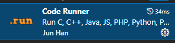
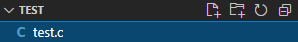

作者：乃荣

使用环境:win10-64位,vscode-Community2022,mingw644(gcc)

适合：习惯vscode的，本教程不含有vscode使用教程，更推荐使用vs

**第一步：下载VSCODE**

官网地址：https://code.visualstudio.com/Download

技巧：

​	由于官网下载过慢可以将域名改为国内的


​	改为[vscode.cdn.azure.cn](https://link.zhihu.com/?target=http%3A//vscode.cdn.azure.cn/)速度会飞起来

​	

**第二步：安装vscode**

这一步无脑下一步就可以了非常简单


第三步：安装gcc 

https://sourceforge.net/projects/mingw-w64/files/Toolchains%20targetting%20Win64/Personal%20Builds/mingw-builds/8.1.0/threads-posix/seh/x86_64-8.1.0-release-posix-seh-rt_v6-rev0.7z/download


第四步：将gcc解压出来后配置系统环境变量path到gcc的bin

这一步省略

终端能where gcc 就说明成功了

第五步：打开vscode，下载扩展包

​	a) c/c++

​	

​	b) 

第六步：下载后建立一个hello.c



执行代码能测试以下结果,注册输出helloworld说明目前没问题

执行操作：右击编辑区点击Run Code

```c
#include<stdio.h>
void main(){
    printf("hello,worldn");
}
```

第七步：由于目前是在输出的，无法进行输出操作，所以将结果转换到终端

文件-》首选项--》设置 --》文本编辑器--》Code Actions On Save 编辑settings.json

settings.json增加字段

```python
"code-runner.runInTerminal": true,
```

再回去运行一次，结果是在终端就说明无问题了


更多扩展功能请自行百度。