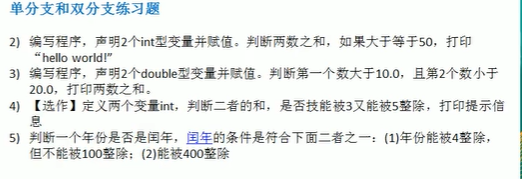
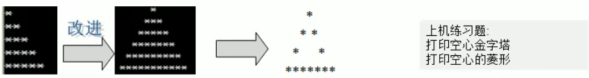
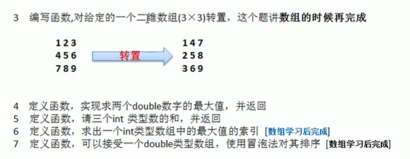
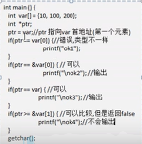

# 一 概述与搭建

- 什么是程序

程序：为了让计算机执行某些操作或**解决某个问题而编写的一系列有序指令的集合**

- C语言发展历程

```
1) 为什么发明C语言：C语言的诞生是和UNIX操作系统的开发密不可分的，原先的UNIX操作系统都是用汇编语言写的，1973年UNIX操作系统的核心用C语言改写的，从此以后，C语言成为编写操作系统的主要语言
2) C语言队其他语言的影响:很多编程语言都深受C语言的影响，比如C++(原先是C语言的扩展)、C#、java、PHP、Javascript、Perl、LPC和UNIX的C Shell等。
3) 掌握C语言的人，再学其他编程语言，大多能很快上手。
```

1972年11月 --》C语言诞生

1978年11月 --》贝尔实验室正式发布C语言

1983年		 --》ANSI开始指定C语言标准

1989年12月 --》ANSI完成标准的指定

1990年09月 --》ANSI C被ISO采纳为国际标准

1999年08月 --》ISO发布了C99标准增加了不少内容

```
ps{
	ANSI:美国国家标准局,
	ISO:国际化标准组织
}
目前比较主流的版本是 C89  和 C99

```


- C语言的特点

```python
- '代码级别的跨平台'：由于标准的存在，使得几乎同样的C代码可用于多种操作系统，如Windows、DOS、UNIX等，也适用于多种机型
- '使允许直接访问物理地址，对硬件进行操作'；由于C语言允许直接访问物理地址，可以直接对硬件进行操作，因此它既具有高级语言的功能，又具有低级语言的许多功能;C语言可用来写系统软件
- C语言是一个有结构化程序设计、具有变量作用域以及递归功能的'过程式'语言
- C语言传递的参数可以是 '值' 传递，也可以传递 '指针'
- C语言中，'没有对象'，不同的变量类型可以用'结构体'组合在一起
- '预编译'处理，生成目标代码质量高，程序执行效率高
```

- C程序开发环境搭建

工具介绍

```python
1) Microsoft Visual C++
2) Microsoft Visual Studio
3) DEV C++、Code::Blocks
4) Borland C++、Borland C++ Builder
5) High C、Turb C 、gcc 、 C-Free 、win - T 
等等
从2018年3月开始，全国二级C语言平台更改为VC++2010 Express版
因此我们选择 VC++2010 Express版
```


安装 VC++2010 Express版

```python
基本介绍
1）vc2010是微软的一款产品
2）vc2010是一款集成开发环境（IDE）可用于开发c或者c++
3）vc2010安装后，会安装Visual C++库的运行时组件，使用户能够在计算机上运行使用Visual C++开发的应用程序
```

安装流程

1.下载安装软件

2.


到了这个界面恭喜你安装成功


- C程序开发快速入门

  ```c
  需求说明:
  	开发一个hello.c程序，功能是输出hello,world!
  开发步骤:
  	1)创建一个空项目
      2)将c代码编写到文件名hello.c文件中
      3)点击执行(不调试)按钮运行程序
  ```

  

  项目建立:

  文件->新建->项目->空项目


代码文件建立

源文件(右击) -> 添加-->新建项-->选中c++文件，名字叫hello-->重命名将cpp改为c

```c
//开发项目
#include <stdio.h>
void main(){ //这是一个main函数，是程序的执行入口
    // 1.printf是一个函数，需要引入头文件才能使用
    // 2.printf是在<stdio.h>,需要引入该文件
    // #include <stdio.h>
    printf("hello,world!");
}
```

如何运行它？

需要配置一个按钮。

1.

添加或者移除按钮--》自定义--》添加命令--》调试--》开始执行（不调试）--》确定

此时在左上角文件下面多了一个小箭头


这个小箭头就是运行的地方

这个项目已经过期了需不需要重新生成？--》是

你会发现成功运行了，会有一个黑色的窗口一闪而过

这里是因为程序执行完就关掉了我们需要再来一行代码

```c
getchar(); // 让窗口停留的一个函数
```


这就是第一个快速入门案例，同学们知道开发了嘛？欢迎继续收听乃荣老师的课程

然后讲一下这个C程序运行机制

- C程序运行机制

  ```python
  # 简述
  1) 编辑:编写我们的.c文件，就是源代码
  2) 编译:将.c程序翻译成目标文件(.obj) //注意23步骤是在计算机底层执行的
  3) 链接:将目标文件obj生成可执行文件exe
  4) 执行:.exe文件，得到运行的结果
  ```

  怎么找到obj 和exe文件？进入目录下2个Debug可以找到，给大家看一看

- C程序运行机制流程图

  

- 编译、链接和运行详解

什么是编译

1）有了C源文件，通过编译器将其编译成obj文件

2）如果程序没有错误，没有任何提示，但在Debug目录下会出现一个Hello.obj文件，该文件为目标文件

什么是链接

1）有了目标文件(obj)，通过’链接程序将其和运行需要的c库文件链接成exe文件(可执行文件)‘

2）如果程序没有错误，没有任何提示，但在Debug目录下会出现一个Hello.exe文件，该文件称为可执行文件

3）为什么需要链接库文件呢？因为我们的C程序中会使用C程序库的内容，比如

<stdio.h><stdlib.h>中的函数printf() systen() 等等，这些函数都不是程序员自己写的，而是c程序库中提供的，因此需要链接

4）你会发现链接后，生成的.exe文件比obj文件大了很多

什么是运行

1) 有了可执行的exe文件，也可称为可执行程序（二进制文件）
2) 在控制台下可以直接运行exe文件

C程序开发注意事项

对修改后的hello.c源文件 需要 重新编译链接，生成新的exe文件，再执行，才能生效

```python
1) c程序的主体结构说明
2) c程序文件以 'c' 为扩展名
3) c程序的执行入口是main()方法
4) c程序严格区分大小写
5) c程序由一条条语句构成，每个语句以';'结束
6) 大括号都是成对出现的，缺一不可
```

# 二 转义字符

常用转义字符

```c
\t : 一个制表符，实现对其的功能
\n : 换行符
\\ : 一个\
\" : 一个"
\' : 一个'
\r : 一个回车
说明
#include<stdio.h>
void main(){
	// 转义字符的使用
	printf("北京上海天津\n");
	printf("北京\t上海\t天津\n");
	printf("hello,\\world\n");

	// 分析\r 表示回车 不是换行
	//输出后面的，前>后则，前面负责补后面的超出长度。如 1234\r123 = 1234 123\r1234 = 1234
	printf("12345\r123456\n");
	getchar();
}

课堂练习
输出如下格式
姓名	年龄	籍贯	住址
乃荣	12	 湖南	 衡阳
#include<stdio.h>
void main(){
	printf("姓名\t年龄\t籍贯\t住址\n");
	printf("乃荣\t20\t湖南\t衡阳");
	getchar();
}
```

# 三 常见问题和注释

## 3.1 常见问题

```python
1) fatal erro LNK1104 无法打开文件“.exe”
上次一次文件没关闭
2) 缺少分号
```

## 3.2 注释

注释：用户解释程序的文字，注释提高了代码的可读性

- 单行注释

  ```c
  基本格式
  格式: //注释文字
  ```

- 多行注释

  ```python
  基本格式
  /* 
  	嘻嘻嘻
  */
  ```

  ```python
  '''
  使用细节
  1)对于单行和块注释，被注释的文字，不会被执行
  2)块注释里面不允许有块注释嵌套
  3)快捷键可以直接配置，成自己的习惯
  '''
  ```

## 3.3 代码规范

```c
正确的注释和注释风格
1)如果注释一个函数，可以用块注释
2)如果注释函数中的某一个语句，可以使用单行
正确的缩进和空白
1)使用一次tab操作，实现缩进，默认整体向右，shflt+tab向左
2)运算符两边习惯各加一个空格，比如2 + 4 * 5
3)也可以使用代码格式化快捷键 Ctrl + alt + l
```

## 3.4 标注库

介绍:C标准库是一组C内置函数、常量和头文件，比如<stdio.h>、<stdlib.h>

<math.h>等等,这个标准库可以作为C程序员的参考手册

# 四 变量与数据类型

## 4.1 基本介绍

变量：相当于内存中一个数据存储空间的表示，你可以把变量看作是一个房间的门牌号，通过门牌号我们可以找到房间，而通过变量名可以访问到变量值

变量使用的基本步骤

​	1.声明变量

​		int num;

​	2.赋值

​		num = 60;

​	3.使用

​		printf('num=%d',num);

1和2可以一步到位  int num = 60

```c
#include<stdio.h>
void main(){
	int num = 1;
	double score = 2.3;
	char gender = 'A';
	char name[] = "乃荣神";
	printf("num=%d,score=%.2f,gender=%c,name=%s",num,score,gender,name);
	getchar();
}

变量使用注意事项：
    1.变量表示内存中的一个存储区域（不同的数据类型，占用的空间不一样）
    2.该区域有自己的名称和类型
    3.变量必须先声明，后使用
    4.该区域的数据可以在同一类型范围内不断变化
    5.变量在同一个作用域内不能重名
    6.变量三要素（变量名+值+数据类型）
    7.C89中 变量必须定义在一块儿，否则也会报错
    
```

- 变量的数据类型

每一种数据都定义了明确的数据类型，在内存中分配了不同大小的内存空间

```python
基本类型
	- 数值类型
    	- 整数
        	- 短整型 short
            - 整型 int
            - 长整型 long
        - 浮点数
        	- 单精度型 float
            - 双精度型 double
    - 字符类型 char

构造类型
	- 数组
    - 结构体 struct
    - 共用体 unicon
    - 枚举类型 enum
指针类型
空类型 void

# ps：
	1.在c中，没有字符串类型，使用的是字符数组表示字符串String
    2.在不同系统上，部分数据类型字节长度不一样
    	比如说int类型，有些系统可能是2个字节 也有些是4个字节
```

## 4.2 整数类型

整数类型就是用于存放 整数值 的 比如12 30 3456 等等

```c
int num = 10;
```

- 整型扩展

	int 整数         int在不同的操作系统可能表示的字节不一样，有可能是2也有可能是4，4的范围表示的也就更大

	signed int 默认带符号的，等价于int

	unsigned int 不带符号的

	对于short 和long 也一样有以上两种扩展

	```c
	unsigned int numb1 = -1;
	unsigned int numb2 = 1;
	printf("int 的字节数=%d",sizeof(int));
	// 运行完可以发现win32的字节数是4
	
	
	printf("%u\n", numb1);
	printf("%u\n", numb2);
	```

	整数使用注意细节

	1）各种类型的存储大小与**操作系统、系统位数和编译器**有关，目前通用的以64位系统为主。

	2）在实际工作中，c程序通常运行在linux/unix操作系统下

 	3）整型的使用 分为 有符号 和 无符号的 默认是 signed

​	4）整型通常声明为int型，除非不足以表示大数，采用long

​	5）bit：计算机中的最小存储单位。

​			byte：计算机中最基本的存储单元

​			1 bit = 8 byte


👆这里面就有2个字节 2个bit 占了 16个位


int 由于是 4个字节，所以应该有32位  也就是 -2^31 ~ 2^31-1,因为第一个叫符号位，要保留下来

## 4.3 浮点型

c语言的浮点类型可以表示一个小数，比如123.4,7.8,0.12

案例演示

```c
void main(){
    double salary = 10000.56;
    double num1 = 1.3;
    double num2 = 4.5;
    double sum = sum1 + sum2;
    printf(" sum = %.2f",sum);
    getchar();
}
```

浮点型的分类：

​	float 单精度			4个字节		精度6位小数

​	double 双精度		8个字节		精度15位小数 

说明一下:

​	1)关于浮点数在机器中存放形式的简单说明，浮点数=符号位+指数位+尾数位，浮点数是一个近似值

​	2)尾数部分可能丢失，造成精度丢失

浮点数的使用细节:

​	1)浮点型常用默认为double型，声明float型常量时，必须后加'f' 或者 'F'

​	2)浮点型常量有两种表示形式

​		十进制 如：5.12	512.0f .512

​		科学计数法 如：512e2	512E-2

​	3)通常情况下，应该使用double型，因为它比float更精准

​	4)printf("d1=%f",d1) ; 在输出时，默认保留小数点6位

```c
void main() {
	float f1 = 1.1;
	float f2 = 1.1f;
	double f3 = 1.3;
	double f4 = .512; // 0.15   如果是0.xx 可以省略成 .xx
	double f5 = 5.12e2; // 等价于5.12 x 10^2 = 512
	double f6 = 5.12e-2; // 等价于5,12 x 10^-2 = 5.12/100 = 0.0512
	printf("%.1f,%.1f,%.1f,%f",f1,f2, f3,f4);
}

```

## 4.4 字符型

字符类型可以表示单个字符，字符类型是char，char是一个字节（可以存字母或者数字）

多个字符称为字符串。在C语言中，使用char数组表示，数组不是基本数据类型，而是构造类型。

```c
void main(){
    char c1 = 'A';
    char c2 = '0';
    char c3 = '\t';
    printf("c1 = %c c3 = %c c2 = %c",c1,c3,c2); // %c 表示以字符形式输出
    getchar();
}
```


字符类型使用细节

a) 字符常量是使用单引号括起来的字符

b)c中还允许使用转义字符 '\\'来将其后的字符转变为特殊字符型常量，

c) char的本质是一个整数，在输出时。是ASCII码对应的字符

d)可以直接给char赋值一个整数，然后输出时，会按照对应的ascii字符输出

e)char类型是可以进行运算的，相当于一个整数，因为它都有对应的Unicode码


```c
	char a = 'a';
	char b = 'b';
	char c = 97; // 97会自动转为字符a

	int num = b + 10; // 98 + 10  说明 char可以进行数值运算
	// c89 要求 变量的定义在语句之前
	printf("a=%c,b=%c,c=%c,num=%d", a, b, c,num);
```

字符类型本质探讨

1) 字符型 存储到计算机中，需要将字符对应的码值(整数)找出来

	存储：字符'a' --> 码值(97) ---> 二进制(1100001) --> 存储()
	
	读取：二进制(1100001) --> 码值(97) --> 字符'a' ---> 读取(显示)

2. 字符和码值的对应关系是通过字符编码表决定的，是规定好的

## 4.5 布尔类型 

boolean

1）c语言标准(c89)没有定义布尔类型，所以c判断真假的时候0是假，非0是真

2）但这种做法不直观，所以我们可以借助c语言的宏定义

3）c语言标准（c99）提供了_Bool型，但是仍是整数类型，但与一般整型不同的是，Bool变量只能赋值为0或者1，非0都会被存储为1，C99还提供了一个头文<stobool.h> 定义了bool代表\_bool,true代表1，false代表0。只要导入stdbool.h 就能方便操作布尔类型了。比如bool flag = false；


C89普通做法

```c
void main() {
	int isPass = 1;
	if (isPass) {
		printf("通过考试");
	}
	getchar();
}
```


宏定义

```c
//宏定义
#define BOOL int
#define TURE 1
#define FALSE 0

void main() {
	BOOL isPass = TURE;
	if (isPass) {
		printf("通过考试");
	}
	getchar();
}
```

C99

```c
#include<stdio.h>
#include<stdbool.h>

void main() {
	bool isPass = true;
	if (isPass) {
		printf("通过考试");
	}
	getchar();
}
```

## 4.6 基本数据类型转换

### 4.6.1 自动类型转换

> 介绍：当C程序在进行赋值或者运算时，精度小的类型自动转换为精度大的数据类型，这个就是自动类型转换
>
> 数据类型按 精度 大小 排序为
>
> short < int < unsigned int < long < unsigned long < float < double < long double 

```c
	char c1 = 'a';
	int num1 = c1;
	double d1 = num1;

细节说明:
1) 有多种类型的数据混合运算时，系统首先自动将所有数据转换成精度最大的那种数据类型
    然后再进行计算（如int和short运算的时候，先把short转成int后再进行运算）
2) 若两种类型的字节数不同，转换成字节数大的类型，若两种类型的字节数相同，且一种有符号，一种无符号，则转换成无符号的类型
3) 在赋值运算中，赋值号两边量的数据类型不同时，赋值号右边量的类型将转换为左边量的类型，如果右边变量的数据类型长度比左边长时，将丢失一部分数据，这样会降低精度，丢失的部分按四舍五入向前舍入
    
    float f1 = 1.1f;
	double d2 = 4.58667435;
	f1 = d2; // 出现精度丢失（double ——》 float）
	printf("f1=%.8f",f1); // 期望： 4.58667435
	getchar();
```


  ### 4.6.2 强制类型转换

> 介绍：将精度高的数据类型转换为精度小的数据类型。使用时要加上强制转换符(),但可能造成精度降低或溢出，格外要注意

强制类型转换一般格式如下：

```c
(类型名)表达式
这种强制类型转换操作并不改变操作数本身
```

案例演示

```c
void main() {
	double d1 = 1.234;
	int num = (int)d1;
	printf("num=%d", num);// ps: 不是四舍五入，是向下取整
}

细节说明:
1) 当进行数据的从数据高 --> 数据低，就需要使用到强制转换
2) 强制符号只针对于最近的操作数有效，往往会使用小括号提升优先级
    int x = (int)3.5*10+1.5
    int x = (int)(3.5*10+1.5)
```

小练习

```c
判断编译是否会通过？
char c = 'a';
int i = 5;
float d = .314F;
double result = c + i + d // 97.0+5.0+0.314 =102.314000
    
分析：先全部转成float计算，最终再转double
```

# 五 指针入门

## 5.1 基本介绍

> 本章正对指针入门讲解，后续会详细简介
>
> 简单的说，指针表示一个地址，距离说明

```
int num = 1;
num的地址是?

int i = 999;
int *ptr = &i;
```

```c
void main() {
	//指针入门
	int num = 1;
	// num的地址是多少
	// 如果要输出一个变量的地址，使用格式是%p
	// &num 表示取出num这个变量对应的地址
	printf("num 的值=%d num 地址=%p",num,&num);
}

重点！
int num = 1;
// 定义一个指针变量，指针
// 1.int * 表示类型为指针类型（执行一个int类型指针）
// 2.名称 ptr , ptr 就是一个 int * 类型
// 3. ptr 指向了一个 int 类型的变量的地址
int* ptr = &num;
printf("num的地址是:%p\n", &num);
printf("ptr表示的是num的地址:%p\n", ptr);
// 指针变量，本身也有地址
printf("ptr 的地址是 %p\n",&ptr);
```


```c
// 1.指针变量，存放的地址 ptr
// 2.获取指针指向的值 *ptr 
printf("ptr指向的值是=%d",*ptr);
```

## 5.2 应用案例

案例

```python
1)写一个程序，获取一个int变量num的地址，并显示到终端
2)将num的地址赋给指针ptr，并通过ptr去修改num的值
3)并画出案例的内存布局图
```

```c
#include<stdio.h>
void main() {
    int num = 1;
    int* ptr = &num;
    printf("num的值=%d\nnum的地址为%pln", num, ptr);
}
 
```

```c
void main() {
    int num = 1;
    int * ptr = &num;
    *ptr = 10; // 通过ptr去修改numb的值，num变量的值也就相应的被修改
    printf("num的值=%d\nnum的地址为%pln", num, ptr);
}
```


课堂练习


## 5.3 细节说明

 ```python
 1) 基本类型，都有对应的指针类型，形式为数据类型 *,比如int的对应的指正就是int *,float对应的指针类型就是 float *,以此类推
 2) 此外还有指向数组的指针、指向结构体的指针，指向共用体的指针，后面会继续讲解 
 ```

## 5.4 值传递和地址传递

**值传递和地址传递使用特点**

1）值传递：将变量指向的存储内容，在传递/赋值时，拷贝一份给接收变量.

说简单就就是将值 复制一变 过去


2）地址传递也叫作指针传递：如果是指针，就将指针变量存储的地址，传递给接收变量，如果是数组，就将数组的首地址传递给接收变量

```c
void main() {
	int num = 100;
	int *p = &num;
	int* p2 = p;
	*p2 = 55;
	printf("num=%d *p=%d *p2=%d", num, *p, *p2);
}
// 55 55 55

```

- 练习题


```c
// 1
// a.
char name[] = "乃荣";
int age = 18;
double score = 380;
char sex = 'M'; //男生
char ah[] = "学习";
printf("姓名\t年龄\t成绩\t性别\t爱好\n");
printf("%s\t%d\t%.2f\t%c\t%s\n", name, age, score, sex, ah);

//2

#include<stdio.h>
#include<stdbool.h>

void main() {
	int number1;
	int number2;
	int number3;
	int number4 = 50;
	int number5;
	number1 = 10;
	number2 = 20;
	number3 = number1 + number2;
	printf("\nNumber3=%d", number3);
	number5 = number4 - number3;
	printf("\nNumber5=%d", number5);
	getchar();
}
```

3:判断一个整数是偶数还是奇数

```c
if(num % 2 == 0){
    printf("\n%d 是偶数",num);
}else{
    printf("\n%d 是奇数",num);
}
```

# 六 常量

## 6.1 基本介绍

1）常量是固定值，在程序执行期间不能改变。这些固定的值，又叫字面量。

2）常量可以是任何的基本数据类型，比如整数常量、浮点常量、字符常量或者字符串字母量，也有枚举常量

3）常量的值在定义后**无法进行修改**

**整数常量**

1) 整数常量可以是十进制、八进制或十六进制的常量。前缀指定基数：0x或者0X 表示 十六进制，0表示八进制，不带前缀则默认表示十进制。整数常量也可以带一个后缀，后缀是U和L的组合，U表示无符号整数（unsigned），L表示长整数(long).后缀可以是大写，也可以是小写。U和L的顺序任意

2) 整数常量举例说明

	```
	85  十进制
	0213 八进制
	0x4b  十六进制
	30    整数
	30u    无符号整数
	30l		长整数
	30ul	无符号长整数
	```


​	

浮点常量

1）浮点常量由整数部分、小数点、小数部分和指数部分组成。可以使用小数形式或者科学计数法来表示

2）浮点常量距离说明

```
3.141592  double常量
31415926E-6  科学计数
3.14f		float常量

```


字符常量

1）字符常量是括在单引号中，例如 'x' 可以存在char类型的变量。字符常量可以是一个普通的字符、一个转移序列 例如 '\t'

2) 字符常量举例说明

```c
'x'
'y'
'a'
'b'
'\t'
'1'
```


字符串常量

1）字符串字面值或常量是括在 双引号中的。一个字符串包含类似于字符串常量的字符：普通的字符、转移序列和通用的字符。可以使用空格做分隔符，把一个很长的字符串常量进行分行

2）字符串常量举例说明

```c
"hello,world"

"北京"

"hello \
world"
```

## 6.2 定义

常量定义的两种方式

1) 使用 #define 预处理器
2) 使用 const 关键字

### 6.2.1 #define预处理器

语法

```c
#define 常量名 常量值
```

案例演示

```c
#define PI 3.14
int main(){
    // PI = 3.1415 不可以修改
    double area;
    double r = 1.2;
    area = PI * r *r;
    printf("面积: %.2f",area);
    getcahr();
    return 0;
}
```

### 6.2.2 const关键字

1）可以使用const声明指定类型的常量

```c
const 数据类型 常量名 = 常量值;
```

2）案例演示

```c
const double PI = 3.14;
int main(){
    // PI = 3.1415 不可以修改
    double area;
    double r = 1.2;
    area = PI * r *r;
    printf("面积: %.2f",area);
    getcahr();
    return 0;
}
```

## 6.3 定义区别

```c
1)const定义的常数带类型，define不带类型
2)const是在编译、运行的时候起作用，而define是在编译的预处理阶段起作用
3)define只是简单的替换，没有类型检查。简单的字符串替换会导致边界效应
    边界效应
    #define A 1
    #define B A+3
    #define C A/B*3
    define其实就是一个简单的替换所以C的值其实是多少？
    C = A/B*3 = A/A+3*3 = 1+9 = 10
    printf("c=%d",C);

	可以解决
    #define A 1
    #define B (A+3)
    #define C A/B*3 # C = 1/3*3  这时候结果是？ 答案是0
        					为什么？ 因为右边的最高精度是int，所以1/3 = 0
        					0*3 为0 那怎么办？提高最高精度
        					# define A 1.0 就可以得到0.75
    printf("c=%.2f",C);
4)const常量可以进行调试，define是不能进行调试的，主要是预编译阶段就已经替换掉了，调试的时候就没它了。
5)const不能重定义，不可以定义两个一样的，而define通过under取消某个符号的定义，再重新定义
    #define PI 3.14
    #under PI
    #define PI 3.1415
6)define可以配合#ifder 、#ifnder、#endif 来使用 可以让代码更加灵活，比如我们可以通过#define 来 启动或者关闭 调试信。
    #define DEBUG
    void main(){
    #ifdef DEBUG // 如果定义过 DEBUG
        printf("ok，调试信息");
    #endif
    #ifnder DEBUG // 如果没有定义过DEBUG
        printf("hello,另外的信息");
    #endif        
	}
```

# 七 运算符等

## 7.1 算术运算符


取余万能公式

```
a % b = a - a/b * b 

-10 % 3 = -10 - (-10)/3 * 3 = -10 - (-3) * 3 = -10 + 9 = -1
10 % 3 = 10 - 3 * 3 = 1
10 % -3 = 10 - (10/-3) * (-3) = 10 - 9 = 1
-10 % -3 = -10 - 3 * (-3) = -10 + 9 = -1

又总结一个小技巧：只要第一个数是负数，那么就可以无视符号，判断结果是负数
```

```
k++; ++k 还可以独立使用
// k++  等价于 k = k + 1
// ++k  等价于 k = k + 1
独立使用时 k++ 和++k是完全一样的
但是赋值的时候需要考虑顺序
```

细节说明

```
1) 对于 除号 "/" 它的整数除和小数除是有区别的；整数之间做除法的时候只保留整数部分。
小数就正常来
2) 当对一个数取余时，底层其实是 a%b = a-a/b*b .
3) 当自增 作为一个独立语句时，++i 和i++ 是一样的
4) 当自增 作为一个表达式注意区分 ++i 和 i++ 的执行顺序不同
	j = ++i => i = i + 1 , j = i
	j = i++ => j = i , i = i + 1
```

课堂练习


```
i =	10		i1 = 11
i =	12		i1 = 12
i =	20		i2 = 19
i =	18		i2 = 18
```


```c
1)
int main() {
	int numb = 97;
	int day = numb % 7;
	int Tcount = (numb - day) / 7;
	printf("一共有%d个星期，%d天", Tcount, day);
}
2)
int main() {
	double huaShi = 146.7;
    double sheShi = 5.0/9*(huashi-100);
	printf("一共有%d个星期，%d天", Tcount, day);
}
```


## 7.2 赋值运算符

赋值运算符就是将某个运算后的值，赋给指定的变量


## 7.3 比较运算符


介绍

```
1) 关系运算符要么是真，要么是假
2) 关系表达式 经常用在 if结构条件 或者 循环结构条件中
```

```c
int a = 8;
int b = 7;
printf("\na>b=%d",a>b); // 1
printf("\na>=b=%d",a>=b); // 1
printf("\na<b=%d",a<b); // 0
printf("\na<=b=%d",a<=b); // 0
```


## 7.4 逻辑运算符


介绍

```
用于连接多个条件，最终的结果要么是真，要么是假
```

```c
int a = 10,b=99;
if (a < 2 && ++b > 99){
    printf("ok100");
}
printf("b=%d\n",b); //99

为什么？
说明:
1) 在进行 && 操作时，如果第一个条件为false，则后面的条件不在判断
2) 该现象称为 短路现象，所以逻辑与 也称之为 短路逻辑与
    
int a = 10,b=99;
if (a < 2 || ++b > 99){
    printf("ok100");
}
printf("b=%d\n",b); //100

说明：a<2 是错的， 但是还不能就决定 表达式的真假，所以还会往后走
    
int a = 10,b=99;
if (a > 2 || ++b > 99){
    printf("ok100");
}
printf("b=%d\n",b); //99
说明：a < 2 是对了，不需要往后走了，结果肯定是对的，所以b不会增加
```


```
x和y是多少
短路了：x= 2 y = 1
```


```c
x=7,y = 1
```


```
# 注意 条件运算符中 y=1 其实就是当做1来判断，1就是True
z 44 y 1
x 0 z 45
46
所以z = 46
```


## 7.5 位运算符


本章节到 八进制解释

## 7.6 三元运算符

```c
表达式 ? 表达式1:表达式2
1) 如果条件表达式为非0，运算后的结果是表达式1
2) 如果条件表达式为0，运算后的结果是表达式2
3) 口诀：一灯大师 =》一真大师
    
int a = 10;
int b = 99;
int res = a>b ? a++:b--; //res = 99 b = 98 a = 10

使用细节
1) 表达式1和表达式2要为可以赋给接收变量的类型（或可以自动转换），否则会有精度丢失
2) 三元运算符可以转成if--else语句
int res = a > b ? a++ : --b;

练习:
a) 实现两个数的最大值
	int a = 1;
	int b = 2;
	int res = a>b?a:b;
b) 实现三个数的最大值
    int a = 1;
	int b = 2;
	int c = 3;
	int res = a>b? (a>c?a:(c>b?c:b)):(b>c?b:c);
```

## 7.7 运算符优先级


```python
1) 结合的方向只有三个是从右到左，其余都是从做到右
2) 所有的双目运算符中只有赋值运算符的结合方向是从右到左
3) 另外两个从右到左的结合运算符，一个是单目运算，还有一个是三目运算符
4) 逗号的运算符优先级最低
5) 优先级大概顺序  算术运算符 > 关系运算符 > 逻辑运算符 > 赋值运算符 > 逗号运算符
```

## 7.8 标识符的规则和规范

标识符概念

```
1) C语言对各种变量 函数等命名时使用的字符序列称为标识符
2) 凡是自己可以起名字的地方都叫标识符
```

标识符的命名规则

```
1) 由26个英文字母大小写，0-9,_或$组成
2) 数字不能开头
3) 不可以使用关键字和保留字
4) c语言中严格区分大小写，长度无限制
5) 标识符不能包含空格
```

规范

```

```

## 7.9 键盘输入语句

**介绍**

在编程中，需要接受用户输入的数据，就可以使用键盘输入语句来获取。

InputDemo.c

步骤：

1） include<stdio.h>

2）使用scanf函数

3）使用适当的格式参数接收输入

案例演示：

要求：可以从控制台接收用户信息【姓名，年龄，薪水，性别】

```c
#define _CRT_SECURE_NO_WARNINGS
#include<stdio.h>
void main() {
	char name[10]="";
	int age = 0;
	double sal = 0.0;
	char gender = ' ';

	printf("请输入姓名：");
	scanf("%s", name);
	printf("请输入年龄：");
	scanf("%d", &age);
	printf("请输入薪资：");
	scanf("%lf", &sal);
	printf("请输入性别：");
	scanf("\n%c", &gender);

	printf("姓名: %s \n 年龄: %d \n 薪资: %.2f \n 性别: %c",name,age,sal,gender);
	getchar();
}
```

## 7.10 综合练习


```c
// 定义变量保存秒数，打印输出 xx小时xx分钟xx秒
// 思路
// 1.定义变量保存秒数 second
// 2.定义变量保存小时 hour
// 3.定义变量保存分钟 min
// 4.定义变量保存剩余描述 msg
#define _CRT_SECURE_NO_WARNINGS
#include<stdio.h>
void main() {
	int second = 894567;
	int hour = second / 3600;
	int min = second % 3600 / 60;
	int s = second % 60;

	printf("%d 秒 合%d小时%d分钟%d秒",second,hour,min,s);
}

//2.
	int a = 8;
	int b = 10;
	int c = 5;
	int temp = 0;

	// 思路，冒泡
	// a 和 b 比 如果 a > b  两者交换
	// b 和 c 比 如果 b > c 两者交换
	// a 和 b 比 如果 a > b  两者交换
	printf("最初的顺序 a = %d, b = %d, c = %d", a, b, c);
	if (a > b) {
		temp = a;
		a = b;
		b = temp;
	}
	printf("\n第一次处理的结果 a = %d, b = %d, c = %d", a, b, c);
	if (b > c) {
		temp = b;
		b = c;
		c = temp;
	}
	printf("\n第二次处理的结果 a = %d, b = %d, c = %d", a, b, c);
	if (a > b) {
		temp = a;
		a = b;
		b = temp;
	}
	printf("\n第三次处理的结果 a = %d, b = %d, c = %d", a, b, c);
```


# 八 进制

## 8.1 介绍

对于整数，有四种表示方式

1）二进制：0，1 满2进1，C语言中没有二进制常数的表示方法

2）十进制：0 - 9 满10进1

3）八进制：0 - 7 满8进1，以数字0开头

4）十六进制：0-9及A-F,满16进1，以0x或者0X开头表示。此处A-F不区分大小写

​	[A->10 B->11 C->12 D->13 ....]

​	如 0x21AF +1 =0X21B0


## 8.2 转十进制

- 二转十

  - 规则：从最低位开始，将每个位上的数提取出来，乘以2的（位数-1）次方，然后求和

  - 案例：将 1011 转为 十进制

    1011 = 2^0 + 2^1 + 2^3 = 1+2+8=11

- 八转十

  - 规则：从最低位开始，将每个位上的数提取出来，乘以8的（位数-1）次方，然后求和

  - 案例：将 0123转成十进制

    ```
    0123 = 3*8^0 + 2*8^1 + 1*8^2 = 3 + 16 + 64 = 83
    ```

- 十六转十

  - 规则：从最低位开始，将每个位上的数提取出来，乘以16的（位数-1）次方，然后求和

  - 案例：请将0x34A转成十进制

    ```
    0x34A = 10*16^0 + 4*16^1 + 3*16^2 = 10 + 64 + 768 = 842
    ```

    

## 8.3 十进制转

- 十转二

  - 规则：将该数不断除以2，直到商为0为止，然后将每步得到的余数倒过来，就是对应的二进制。

  - 案例：请将56转成二进制

    ```
    56 => 111000
    ```

- 十转八

  - 规则：将该数不断除以8，直到商为0为止，然后将每步得到的余数倒过来，就是对应的八进制。

  - 案例：请将156转成八进制

    ```
    156 => 234
    ```

- 十转十六

  - 规则：将该数不断除以16，直到商为0为止，然后将每步得到的余数倒过来，就是对应的十六进制。

  - 案例：请将356转成十六进制

    ```
    356 => 164
    ```

## 8.4 二进制转

- 二转八

  - 规则：从低位开始，将二进制数每三位一组，转成对应的八位数即可。

  - 案例：请将11010101 转成 八进制

    ```
    11010101 = 011 010 101 = 325
    ```

- 二转十六

  - 规则：从低位开始，将二进制数每四位一组，转成对应的十六位数即可。

  - 案例：请将11010101 转成 十六进制

    ```
    11010101 = 1101 0101 = 0xD5
    ```

    

## 8.6 转二进制

- 八转二

  - 规则：将八位数每一位，转成对应的一个3位的二进制数

  - 案例：请将0237 转成 二进制

    ```
    0237 =10 011 111 = 10011111
    ```

- 十六转二

  - 规则：将十六进制每一位，转成对应的4位的一个二进制数即可

  - 案例：请将0x23B 转成 二进制

    ```
    0x23B = 1111 = 0010 0011 1011 = 1000111011 
    ```

## 8.7 原码反码补码

网上对原码，反码，补码的解释过于复杂，我这里精简几句话

对于有符号的而言（★背下来）

1）二进制的最高位是符号位:0表示正数，1表示负数

2）正数的原码、反码、补码都一样（三码合一）

3）负数的反码=它的原码符号位不变，其他位取反（0->1 1->0）

4）负数的补码=它的反码+1

5）0的反码，补码都是0

6）在计算机运算的时候，都是以补码的方式来运算的。


其他学习：https://www.bilibili.com/video/BV1oy4y1r7Ky?spm_id_from=333.1007.top_right_bar_window_default_collection.content.click


## 8.8 位运算符


```c
void main() {
	int a = 2 ^ 3;
	// ~-5
	// 原码
	// 10000000 00000000 00000000 00000101
	// 负数补码 = 负数反码 + 1
	// 11111111 11111111 11111111 11111011
	// 取反
	// 00000000 00000000 00000000 00000100  => 4

	// 2 | 3
	// 2的补码 00000000 00000000 00000000 00000010
	// 3的补码 00000000 00000000 00000000 00000011
	// 2|3     00000000 00000000 00000000 00000011 =>3

	// 2 ^ 3  同0不1
	// 00000010
	// 00000011
	// 00000001 => 1
	printf("a = % d", a);
	getchar();
}

// 位移运算  
	// 8 >> 2   正补0  负补-1   << 全0
	// 00000000 00000000 00000000 00001000
	// 00000000 00000000 00000000 00000010 => 2

	// 8 << 2
	// 00000000 00000000 00000000 00001000
	// 00000000 00000000 00000000 00100000 => 32
```


# 九 流程控制

在程序中	，程序运行的流程控制决定程序是如何执行的，是我们必须掌握的，主要有三大流程控制语句

1）顺序控制

2）分支控制

3）循环控制

## 9.1 分支控制

### 9.1.1 单分支

基本语法

```c
if(条件表达式){
    执行代码块;
}
说明:当条件表达式为真(非0)时，就会执行{}的代码，返回假(0)时，不会执行{}的代码
```

案例说明

编写一个程序，可以输入人的年龄，如果该同志的年龄大于18岁，则输出”你年龄大于18，要对自己的行为负责！“

```c
#define _CRT_SECURE_NO_WARNINGS
#include<stdio.h>
void main() {
	int age = 0;
	printf("请输入您的年龄:");
	scanf("%d",&age);

	if (age >= 18) {
		printf("你年龄大于18，要对自己的行为负责");
	}
}

```

### 9.1.2 双分支

基本语法

```c
if(条件表达式){
    执行代码块1
}else{
    执行代码块2
}
```

案例

编写一个程序可以输入人的年龄，如果该同志年龄大于18，则输出”你的年龄大于18，要对自己的行为负责！“否则输出”你的年龄不大这次放过你了“

```c
#define _CRT_SECURE_NO_WARNINGS
#include<stdio.h>
void main() {
	int age = 0;
	printf("请输入您的年龄:");
	scanf("%d",&age);

	if (age >= 18) {
		printf("你年龄大于18，要对自己的行为负责");
	}else{
		printf("你的年龄不大，这次放过你了");
	}
}
```


```
atguigu
```



```c
	int a = 30, b = 20;
	if (a + b >= 50) {
		printf("hello,world!");
	}

	double a = 11, b = 19;

	if (a > 10 && b < 20) {
		printf("%.2f+%.2f=%.2f",a,b, a + b);
	}

	int a = 11, b = 4;
	int c = a + b;
	if (c % 3 == 0 && c % 5 == 0) {
		printf("%d 可以被3和5整除", c);
	}

	int year = 0;
	printf("请输入年份:");
	scanf("%d", year);
	if ((year % 4 == 0 && year % 100 != 0) || year % 400 == 0) {
		printf("我是闰年");
	}
```

### 9.1.3 多分支

if - else if - else

案例演示


```c
#define _CRT_SECURE_NO_WARNINGS
#include<stdio.h>
void main() {
	double score = 0.0;
	printf("请给岳小鹏打分:");
	scanf("%lf", &score);
	if (score ==100.0){
		printf("奖励一辆BMW");
	}
	else if (80.0 < score && score<= 99.0) {
		printf("奖励一台iphone7plus");
	}
	else if (60.0 <= score && score <= 80.0) {
		printf("奖励一个iPad");
	}
	else {
		printf("没有奖励！");
	}
	getchar();
	getchar();
}

```

### 9.1.4 嵌套分支

基本介绍

在一个分支结构中又完整的嵌套了另一个完整的分支结构，里面的分支的结构称为内层分支外面的分支结构称为外层分支

基本语法

```c
if(){
    if(){//被包含的可以是单双多分支
        
    }else{
        
    }
}
```

### 9.1.5 switch

基本语法

```c
switch(表达式){
    case 常量1:
        语句块1;
    	break;
    case 厂里2:
        语句块2;
        break;
    case 常量3:
        语句块3；
       	break;
    default:
        语句块;
        break;
}
```


```c
#define _CRT_SECURE_NO_WARNINGS
#include<stdio.h>
void main() {
	char t = ' ';
	printf("请输入字符:");
	scanf("%c", &t);
	switch (t) {
		case 'a':
			printf("星期一");
			break;
		case 'b':
			printf("星期二");
			break;
		case 'c':
			printf("星期三");
			break;
		case 'd':
			printf("星期四");
			break;
		case 'e':
			printf("星期五");
			break;
		case 'f':
			printf("星期六");
			break;
		case 'g':
			printf("星期天");
			break;
		default:
			printf("您的输入有误!");
			break;
	}
}
```

### 9.1.6 switch细节

```python
switch细节讨论
1) switch 语句中的expression是一个常量表达式，必须是一个整型（char、short、int、long等）或枚举类型
2）case子句中的值必须是常量，而不能是变量
3）default子句是可选的，当没有匹配的case时，执行default
4）break语句用来在执行完一个case分支后使程序跳出switch语句块
5）如果没有写break，会直接执行下一个case语句块，直到遇见braek或者执行到swsich结尾，这个现象叫做穿透。
```


## 9.2 循环控制

基本介绍：让你的代码可以重复执行

### 9.2.1 for

基本语法

```c
for(循环变量初始化;循环条件;循环遍历迭代){
    循环操作(语句);
}
```

```c
void main() {
    for (int i = 1; i <= 5; i++) {
        printf("你好，世界\n");
    }
}
```


for循环注意事项

```c
1）循环条件是 返回一个表示真（非0）或者假（0）的表达式
2）for(;循环判断条件;)中的初始化和变量迭代可以不写（写到其他地方），但是两边的分号不能省略。
3）循环初始值可以有多条初始化语句，但要求类型一样，并且中间逗号隔开，循环变量迭代也可以有多条变量迭代语句，中间用逗号隔开
    
    
int i = 1;
for(;i<=5;){
    printf("\n你好，世界");
    i++;
}

for(i = 0,j=0;j<count;i++,j+=2)
```

```
// 打印1~100中所有是9的倍数的整数的个数
void main() {
    int count = 0;
    for (int i = 1; i <= 100; i++) {
        if (i % 9 == 0) {
            count++;
        }
    }
    printf("%d",count);
}
```


```c
#define _CRT_SECURE_NO_WARNINGS
#include<stdio.h>
void main() {
    int numb = 0;
    printf("请输入一个整数:");
    scanf("%d", &numb);
    for (int i = 0; i <= numb; i++) {
        printf("\n%d + %d = %d", i, numb-i, numb);
    }
}

```

### 9.2.2 while

基本语法

```c
循环变量初始化;
while(循环条件){
    循环体(语句);
    循环变量迭代;
}
```

```c
void main() {
	int i = 1;
	while (i <= 5) {
		printf("\n 你好，世界");
		i++;
	}
}
```


```c
void main() {
    int i = 1;
    while (i < 101) {
        if (i % 3) {

        }
        else {
            printf("%d\n", i);
        }
        i++;
    }
}
```

```c
void main() {
    int i = 40;
    while (i < 201) {
        if (!(i % 2)) {
            printf("%d\n", i);
        }
        i++;
    }
}
```

```c
void main(){
    int flag = 1;
    char name[10] = "";
	while (flag){
        printf("请输入姓名:");
        scanf("%s",name);
        if (name == "exit"){
            flag = 0;
        }
    }
}
```

```c
#define _CRT_SECURE_NO_WARNINGS
#include<stdio.h>
#include<string.h>
void main() {
    int flag = 1;
    char name[10] = "";
    while (flag) {
        printf("请输入姓名:");
        scanf("%s", name);
        printf("%s\n",name);
        if (strcmp(name,"exit")==0) {
            flag = 0;
        }
    }
}
```

### 9.2.3 do..while

```c
基本语法
    ①循环变量初始化
    do{
        ②循环体(语句);
        ③循环变量迭代;
    }while(④循环条件);


#define _CRT_SECURE_NO_WARNINGS
#include<stdio.h>
#include<string.h>
void main() {
	int i = 1;
	int max = 5;
	do {
		printf("你好，世界\n");
		i++;
	} while (i <= max);
	printf("%d", i);
}
```

细节注意

```python
1）do...while 是先执行再判断
```

案例


```c
//1
int i = 1;
do{
    printf("%d",i);
    i++;
}while(i<=100);

//2
int i = 1;
int sum = 0;
do{
    sum+=i;
    i++;
}while(i<=100);
printf("%d",sum)
    
//3 
int i = 1;
int count = 0;
do{
    if (i%5==0 && i%3!=0){
        count++;
    }
    i++;
}while(i<=200);
printf("%d",count);

//4
#include<stdio.h>
#include<string.h>
int flag = 1;
char cos[10] = "";
do{
    printf("老婆问：我可以继续购物吗(yes/no)");
    scanf("%s",cos);
    if (strcmp(cos,"no") == 0){
        flag = 0;
    }
}while(flag);
```

### 9.2.4 循环嵌套

介绍

就是套娃

设外层循环m次，内层循环n次 那么内层需要执行m*n次


案例

```c
// 统计3个班成绩情况，每个班有5名同学，求出各个班的平均分和所有班级的平均分【学生成绩从键盘录入】
#include<stdio.h>
#include<string.h>
int sum,score;
double avg,s_avg=0.0;
for(int i = 1 ;i<=3;i++){
    sum = 0;
    for(int j = 1;j<=5;j++){
        printf("请输入第%d个学生成绩:",j);
        scanf("%d",&score);
        sum+=score;
    }
    avg = sum/5.0;
    s_avg+=avg;
    printf("%d班的总分是%d,平均分是%.2f",i,sum,avg);
}
s_avg /= 3.0;
printf("所有班级的平均分:%.2f",s_avg);

// 再统计3个班的及格人数
#include<stdio.h>
#include<string.h>
int sum,score,count=0;
double avg,s_avg=0.0;
for(int i = 1 ;i<=3;i++){
    sum = 0;
    for(int j = 1;j<=5;j++){
        printf("请输入第%d个学生成绩:",j);
        scanf("%d",&score);
        sum+=score;
        if (score>=60){
            count++;
        }
    }
    avg = sum/5.0;
    s_avg+=avg;
    printf("%d班的总分是%d,平均分是%.2f",i,sum,avg);
}
s_avg /= 3.0;
printf("所有班级的平均分:%.2f,总及格人数:%d",s_avg,count);
```

打印九九乘法表

```c
void main() {
	for (int i = 1; i < 10; i++) {
		for (int j = 1; j < i + 1; j++) {
			printf("%d * %d = %d\t",i,j,i*j);
		}
		printf("\n");
	}
}
```



```c
int n = 0;
printf("请输入n:");
scanf("%d",&n);
for(int i = 1;i<=n;i++){
    for(int j = 1 ; j<=i;j++){
        printf("*");
    }
    printf("\n");
}


int s = 0;
printf("请输入s:");
scanf("%d", &s);
for (int i = 1; i <= s; i++) {
    for (int n = s-i; n >= 0; n--) {
        printf(" ");
    }
    for (int m = 1; m <= 2 * i - 1; m++) {
        printf("*");
    }
    printf("\n");
}


// 空心三角自创1
void main() {
    int s = 0;
    printf("请输入s:");
    scanf("%d", &s);
    for (int i = 1; i <= s; i++) {
        for (int n = s - i; n >= 0; n--) {
            printf(" ");
        }
        for (int m = 1; m <= 2 * i - 1; m++) {
            if (i > 1 && i < s) {
                printf("*");
                for (int z = 1; z <= 2 * (i - 1) - 1; z++) {
                    printf(" ");
                }
                printf("*");
                break; 
                /*
                //为什么需要break？ 因为外面的整个for循环都相当于 这个行的操作，
                而我这里实际上是在m第一次循环的时候就操作完了，可以说是和外面的for毫无关系，直接break即可，否则影响结果
                */
            }
            printf("*");
            
        }
        printf("\n");
    }
}

// 空心三角自创1改良 增加可读性  性质一样
void main() {
    int s = 0;
    printf("请输入s:");
    scanf("%d", &s);
    for (int i = 1; i <= s; i++) {
        for (int n = s - i; n >= 0; n--) {
            printf(" ");
        }
        if (i > 1 && i < s) {
            printf("*");
            for (int z = 1; z <= 2 * (i - 1) - 1; z++) {
                printf(" ");
            }
            printf("*");
        }
        else {
            for (int m = 1; m <= 2 * i - 1; m++) {
                printf("*");
            }
        }
        printf("\n");
    }
}

// 空心菱形

   *
  * *
 *   *
*     *
 *   *
  * *
   *
void main() {
    int x,x2;
    printf("请输入菱形层数(输入奇数):");
    scanf("%d", &x);
    x2 = x / 2 + 1;
    for (int i = 1; i <= x; i++) {
        if (i <= x2) {
            for (int n = 1; n <=x2 -i; n++) {
                printf(" ");
            }
            for (int m = 1; m <= 2 * i - 1; m++) {
                if (m==1 || m == 2*i-1) {
                    printf("*");
                }
                else {
                    printf(" ");
                }
            }
            printf("\n");
        }
        else {
            for (int n = 1; n <= (i-x2); n++) {
                printf(" ");
            }
            for (int m = 1; m <= x - 2 * (i-x2); m++) {
                if (m == 1 || m == x - 2 * (i - x2)) {
                    printf("*");
                }
                else {
                    printf(" ");
                }
                
            }
            printf("\n");
        }
    }
}
```

### 9.2.5 break


```
0
1
0
1
0
1
0
1
```


```
2)
void main() {
	int sum = 0;
	for (int i = 0; i <= 100; i++) {
		sum += i;
		if (sum > 20) {
			printf("%d,%d", sum, i);
			break;
		}
	}
}

3)
void main() {
    char userName[10] = "";
    int password = 0;

    for (int i = 2; i >= 0; i--) {
        printf("请输入姓名:");
        scanf("%s", userName);
        printf("请输入密码:");
        scanf("%d", &password);
        if (strcmp(userName,"乃荣")==0 && password == 123) {
            printf("登陆成功!");
            break;
        }
        printf("登录失败,你还有%d次机会\n", i);
    }
}
```

### 9.2.6 continue

基本介绍

用于跳过本次循环，继续执行下次循环


```c
0 1 3 4 5 6 7 8 9 # 其实每个数字会换行，懒得换了
0 1 3 4 5 6 7 8 9
0 1 3 4 5 6 7 8 9
0 1 3 4 5 6 7 8 9
```

注意事项

```
1) continue 只能和循环使用 不能和switch/if 使用

```


```c
int positive =0,negative=0,numb;
for(;;){
   	printf("请输入整数:");
    scanf("%d",&numb);
    if (numb == 0){
        break;
    }
    if (numb % 2){
        positive++;
        continue;
    }
    negative++;
}
printf("正数的数量是:%d\n负数的数量是:%d",positive,negative);
```

### 9.2.7 goto

```
1) c语言的goto语句可以无条件地转移到程序中指定的行
2) goto语句通常与条件语句配合使用。可用来实现条件转移，跳出循环体等功能。
3) 在C程序设计中一般不主张使用goto语句，避免造成程序流程的混乱，使理解和调试程序都产生困难

基本语法：
goto label
....
label:statement
```


```c
printf("start\n");
goto lable1;
printf("ok1\n");
printf("ok2\n");
lable1;
printf("ok3\n");
printf("ok4\n");
getchar();
输出
   	start
    ok3
    ok4
```

### 9.2.8 return

介绍

return使用在函数，表示跳出所在的函数，在讲解函数的时候。

会详细的介绍，这里简单提一下

### 9.2.9 综合练习


```c
void main() {
    int numb = 0, bai, shi, ge;
    printf("请输入一个整数:");
    scanf("%d", &numb);
    bai = numb / 100;
    shi = numb / 10 % 10;
    ge = numb % 10;
    if (bai * bai * bai + shi *shi*shi + ge * ge * ge == numb) {
        printf("这是水仙花数");
    }
}


```

# 十 枚举


案例：一个星期有7天，请定义数据表示星期一到星期天

传统的方法

```c
#define Mon 1
#define Tue 2
#define Wed 3
#define Thu 4
#define Frl 5
#define Sat 6
#define Sun 7
这个代码多，并且不好管理 => 枚举
```

## 10.1 基本介绍

```c
1）枚举是c语言的一种构造数据类型，它可以让数据更简洁，更易读，对于只有几个有限的特定数据，可以使用枚举
2）枚举对于的英文（enumeration 简写 enum）
3）枚举是一组常量的集合，包含一组 有限 的特定的数据
4）枚举语法定义格式为
enum 枚举名 {枚举元素1,枚举元素2,....}


void main() {
	enum DAY {
		MON=1,TUE=2,WED=3,THU=4,FRI=5,SAT=6,SUN=7
	};
	enum DAY day = WED;
	printf("%d", day);
}
```

## 10.2 枚举遍历

C语言中，枚举类型是被当作 int 或者 unsigned int 类型来处理的，枚举类型**必须连续** 	是可以实现有条件的遍历。

```c
enum DAY{
    A=1,B,C,D,E,F,G
}day;// 表示 定义了一个枚举类型 enum DAY ,同时定义了变量day
void main(){
    // 遍历枚举元素
    // day++会给出警告，但是可以运行
    for(day = A; day <=G;day++){
        printf("枚举元素：%d\n",day)；
    }
}
```

```c
void main() {
	enum SEE{
		A=1,B,C,D
	}seaon;
	printf("请输入你喜欢的季节:");
	scanf("%d", &seaon);
	switch (seaon) {
	case A:
		printf("我喜欢春天");
		break;
	case B:
		printf("我喜欢夏天");
		break;
	case C:
		printf("我喜欢秋天");
		break;
	case D:
		printf("我喜欢冬天");
		break;
	default:
		printf("你输入有误");
	}
}
```

使用细节

```
1）第一个枚举成员的默认值为0，后续枚举成员的值会跟着加1
2）在定义枚举类型时改变枚举元素的值
3）枚举变量的定义的形式1-先定义枚举类型，再定义枚举变量
4）枚举变量的定义的形式2-定义枚举类型的同时再定义枚举变量
5）枚举变量的定义的形式3-省略枚举名称，直接定义枚举变量
enum{
	A=1,B,C,D
}day;
6）可以把整数转为枚举类型
```


```
enum DAY{
	A,B,C,D=9,E,F,G
}day;
// 现在枚举值是 0 1 2 9 10 11 12

for (day = A;day <=G;day++){
	printf("%d\n",dat)
}
//但是用之前的遍历依然会输出0~12 想想为什么？
因为A是0 G是12 ，这里不是在next 而是在用默认增1的规律
从头到尾来
// 所以这种遍历 要求 枚举类型 是连续的
```

# 十一 函数

## 11.1 基本介绍

为什么要函数？

传统写法

1）代码有过多重复的

2）不利于代码维护

解决方法

1）为完成某一功能的程序指令（语句）的集合，称为函数

2）在c语言中，函数分为：自定义函数，系统函数

3）函数还有其他叫法，比如方法等。

基本语法

```c
返回类型 函数名(形参列表){
    代码块;
    return 返回值; //可选
}
1） 形参列表；表示函数的参数
2） 函数可以有返回值，也可以没有。如果没有返回值 声明返回类型为void
```

## 11.2 头文件的工作原理和案例

- 头文件

  先看一个需求

  在实际的开发中，我们往往需要在不同的文件中，去调用其他文件的定义的函数，比如hello.c,去使用myfuns.c文件中的函数，如何实现？-》头文件

- 头文件基本概念

1) 头文件是扩展名为.h的文件，包含了c函数声明和宏定义，被多个源文件中引用共享。有两种类型的头文件：程序员编写的头文件和c标准库自带的头文件
2) 在程序中要使用头文件，需要使用c预处理指令#include来引用它。
3) #include叫做文件包含命令，用来引入头文件(.h),#include也是c语言预处理命令的一种

test.c

```c
#include<stdio.h>
void show_hello(char name[10]) {
	printf("你好,%s",name);
}
```

test.h

```c
void show_hello(char name[10]);
```

main.c

```c
#include"test.h"
void main() {
	show_hello("乃荣");
}
// 你好,乃荣
// 成功调用方法
```

头文件注意事项

```
1）引用头文件相当于复制头文件的内容
2）源文件的名字可以不和头文件一样，但是为了好管理，一般头文件名和源文件名一样
3）c语言中include<>与include""的区别
	- include <>:引用的是编辑器的类库路径里面的头文件，用于引用系统头文件
	- include "":引用的是你程序目录的相对路径中的头文件，如果在程序目录没有找到引用的头文件则到编辑器的类库路径的目录下找该头文件，常用于引用用户头文件
	- 所以，引用 系统头文件 两种形式都可以，include<>效率高；引用用户头文件，只能使用 include ""
```

## 11.3 函数调用机制


```c
// 传入一个数+1
// 计算两个数，并返回
int f1(int x) {
	return x + 1;
}
int f2(int x, int y) {
	return x + y;
}

void main() {
	int a, b, c,sum;
	printf("请输入一个整数:");
	scanf("%d", &a);
	a = f1(a);
	printf("%d\n", a);
	printf("请输入第一个整数:");
	scanf("%d", &b);
	printf("请输入第二个整数:");
	scanf("%d", &c);
	sum = f2(b, c);
	printf("%d\n", sum);
	getchar();
}
```


## 11.4 递归函数

一个函数在函数体内又调用了本身，称之为递归

快速入门

```c
void test(int n ){
    if(n>2){
        test(n-1);
    }
    printf("n=%d\n",n)
}

test(10);
// n = 2  这个函数到n=2的时候结束递归，打印n=2 但是test(3) 等 还没结束还在挂着
// n = 3  test(3) 
// n = 4
// n = 5 , 6...7..8.9..10

```

练习

```c
// 斐波拉契数列
// 给你一个整数n，求出斐波拉契数是多少
int fib(int n) {
	if (n == 1 || n == 2){
		return 1;
	}
	return fib(n - 1) + fib(n - 2);
}
// 已知 f(1)=3;f(n)=2*f(n-1)+1
// 请用递归 求出f(n)的值
int f(int n) {
	if (n == 1) {
		return 3;
	}
	return 2 * f(n - 1) + 1;
}

// 猴子吃桃
// 有一堆猴子，猴子第一天吃了其中的一半，并再多吃了一个！以后每天猴子都吃其中的一半，然后再多吃一个。当到第十天，想再吃时，发现只有1个桃子了。
// 问：最初多少个桃子？
// 设第一天 x个桃子
// fn(9) = (fn(10)+1)*2
int f2(int n) {
	if (n == 10) {
		return 1;
	}
	return (f2(n + 1) + 1) * 2;
}
```

```
递归原则
1）执行一个函数时，就创建一个新的受保护的独立空间（新函数栈）
2）函数的局部变量是独立的，不会互相影响
3）递归必须向退出递归的条件逼近，否则就会死龟
4）当一个函数执行完毕，或者遇到return就会返回，遵守谁调用谁就返回谁
```

## 11.5 函数细节

```c
1） 函数的形参列表可以是多个
2） 传递参数可以是 值 传递，也可以是 指针 传递
3） 基本数据类型默认是值传递的，即进行值拷贝。在函数内修改，不会影响到原来的值
4） 如果希望函数内的变量能修改函数外的变量，可以传入变量的地址&，函数内以指针的方式操作变量。从效果来看类似于引用 （即传递指针）
int f3(int* p) {
	printf("%u\n", p);
	(* p)++;
}
void main() {
	int n = 10;
	printf("%u\n", &n);
	f3(&n);
	printf("%d\n", n);
	getchar();
}
5） c语言不支持函数重载
6） c语言支持可变参数  了解即可 是用...
    
    
```


- 练习

  ```c
  //1.编写一个函数swap(int *n1,int *n2)可以交换n1和n2的值
  void swap(int* n1, int* n2) {
  	int temp = *n1; // 将n1 这个指针 指向的变量复制给temp
  	*n1 = *n2;
  	*n2 = temp;
  }
  ```

## 11.6 函参传递

基本介绍

我们已经知道c语言的参数可以是值 也可以是指针

两种传递方式:

	1. 值传递
	1. 引用传递（传递指针、地址）

不同的是 值传递的是值的拷贝 引用传递的是地址的拷贝 ，一般来说 地址拷贝效率高，因为数据量小，而值拷贝决定拷贝的数据大小，数据越大，效率越低


如果希望函数内的变量能修改函数外的变量，就可以 引用传递 &, 函数内部就用 * .

从效果看类似引用

## 11.7 作用域

变量的作用域

所谓变量作用域，就是指变量的有效范围

```
1）函数内部声明/定义的局部变量，作用域仅限于函数内部
2）函数的参数，形式参数，被当作该函数内的局部变量，如果与全局变量同名它们会优先使用
3）在一个代码块，比如for和if中的局部变量，那么这个变量的作用域就在该代码块
4）在所有函数外部定义的变量叫做全局变量，作用域在整个程序有效。
```


初始化局部变量和全局变量

```
1) 局部变量，系统不会对其初始化，必须对局部变量初始化后才能使用，否则程序运行后会抛出异常
2) 全局变量，系统会自动对其自动化。
	int 0
	char '\0'
	float 0.0
	double 0.0
	pointer NULL
3) 正确地初始化变量是一个良好的编程习惯，否则有时候程序可能会产生意想不到的结果，因为未初始化的变量会导致一些在内存位置中已经可用的垃圾值
```

作用域注意事项

```
1）全局变量保存在内存的全局存储区中，占用静态的存储单元，它的作用域默认是整个程序，也就是所有的代码文件，包括源文件（.c文件）和头文件（.h文件）
2）局部变量保存在栈中，函数被调用时才动态地为变量分配存储单元，它的作用域仅限于函数内部
3）c语言规定，只能从小的作用域向大的作用域寻找变量，有点类似于python
4）在同一个作用域，变量名不能重复，不同的作用域时变量名可以重复，编译器采用就近原则
5）由{}包围的代码块也拥有独立的作用域
```


```
200.00
200.00
250.00 
250.00 # 注意 和python还是有点区别，test02里面的price就是直接修改全局的price不需要global

200.00
200.00
250.00
200.00
```


```
20
30
10
40
30
```

## 11.8 static*

static关键字在c语言中比较常用，使用恰当能够大大提高程序的模块化特性，有利于扩展和维护

局部变量使用static修饰

```
1）局部变量被static修饰后，我们称为静态局部变量
2）对应静态局部变量在声明时未赋值初始值，编译器也会把它初始化为0
3）静态局部变量存储于进程的静态存储区（全局性质），只会被初始化一次，即使函数返回，它的值也会保持不变
```


```c
代码理解👇

aaa.c
int num = 10; //普通全局变量
static int num2 = 20; // 静态全局变量，只能在本文件使用，不能在其他使用

bbb.c
//在一个文件中，使用另外一个文件的全局变量,使用extern 引入即可
extern int num;//可以正常输出
// extern int num2; 运行报错
void main(){
    printf("\nnum=%d",num);
}


```

除了static变量外还可以修饰函数

```
函数使用static修饰
1）函数的使用方式与全局变量类似，在函数的返回类型前加上static，就是静态函数
2）非静态函数可以在另一个文件中通过extern引用
3）静态函数只能在声明它的文件中使用，其他不可以引用
4）不同的文件可以使用相同名字的静态函数，互不影响
```

## 11.9 常用的系统函数


```
#include<string.h>

1) 得到字符串的长度
strlen(str) -> int
2) 拷贝字符串
strcpy(str,"hello") -> void
3) 连接字符串
strcat("hello","world") -> 将world字符串内容连接到hello，不会覆盖

#include <time.h>

获得当前时间
time_t curtime; //结构体
time(curtime); // 初始化

1) ctime 返回一个表示当地时间的字符串，当地时间是基于参数timer

time_t curtime; // time_t 结构体类型
time(&curtime); // 初始化
printf("%s", ctime(&curtime));

2) 统计函数的执行时间
	time_t start_t, end_t;
	time(&start_t);
	for (int i = 0; i < 9999; i++) {
		for (int j= 0; j < 9999; j++) {
			for (int z = 0; z < 100; z++) {

			}
		}
	}
	time(&end_t);
	printf("%.2f", difftime(end_t, start_t));

#include<math.h>

// 返回 e的x次幂
emp(double x) ->double

// 返回 x的自然对数 
log(double x) -> double

// 返回 x的y次幂
pow(double x,double y) -> double

// 返回x的平方根
sqrt(double x) -> double

// 返回x的绝对值
fabs(double x) -> double


基本数据类型 -》 字符串

sprintf函数的用法
1) sprintf和平时我们常用的printf函数的功能相似。sprintf函数打印到字符串中，而printf函数打印输出到屏幕上。sprintf函数在我们完成其他数据类型转换成字符串类型的操作中应用广泛
2) 该函数包含在stdio.h的头文件中
	char str1[20];
	char str2[20];
	char str3[20];
	int a = 2331650;
	int b = 385;
	double d = 32.1415926;
	//说明
	//sprintf是一个系统函数，可以将结果放到字符串中
	//格式化的结果，会存放到str1中
	sprintf(str1,"%d_%d", a,b);
	sprintf(str2, "%.2fhhh", d);
	sprintf(str3, "%8.2f",d);
	printf("str1=%s,str2=%s,str3=%s", str1, str2, str3);

字符串 -》 基本数据类型
#include<stdlib.h>
// 字符数组
char str[10] = "123456";
char str2[10] = "12.3456";
char str3[3] = "ab";
char str4[4] = "111";

//1. atoi(str) 转为整数
int num1 = atoi(str);
short s1 = atoi(str4);
//2. atof(str) 转为浮点数
double d = atof(str2);

// 3. str3[0]  类似python下标
char c = str3[0];
printf("numb1=%d,d=%f,c=%c,s1=%d", num1+1, d, c, s1);

注意事项
1）char数组	类型转成 基本数据类型时 要确保能够转成有效的数据，比如我们可以把"123" 转成一个整数，但是不能把"hello" 转成一个整数
2）如果格式不正确，会默认转成0
	这可能是个考点，如果转型不正确的话，并不会报错，别的语言会，但是c会输出0
```

## 11.10 练习


```c
void jzt(int x) {
	for (int i = 1; i <= x; i++) {
		for (int n = 1; n <= x-i; n++) {
			printf(" ");
		}
		for (int m = 1; m <= 2*i-1; m++) {
			printf("*");
		}
		printf("\n");
	}
}


```



```c
double fmax(double a, double b) {
	return  a > b ? a : b;
}


int fsum(int a, int b, int c) {
	return a + b + c;
}
```

# 十二 预处理命令

```c
1）使用库函数之前，应该用#include引入对应的文件。这种以#号开头的命令称为预处理命令
2）这些在编译之前对源文件进行简单加工的过程，就称为预处理
3）预处理主要是处理以#开头的命令，例如#include<stdio.h>等。预处理命令要放在所有函数之外，而且一般都放在源文件的前面
4）预处理是c语言的一个重要功能，由预处理程序完成。当对一个源文件进行编译时，系统将自动调用预处理程序对源程序中的预处理部分做处理，处理完毕自动进行对源程序的编译
5）c语言提供了多种预处理选择，如宏定义、文件包含、条件编译等，合理地使用它们会使编译的程序便于阅读、修改、移植和调试；也有利于模块化程序设计
```


## 12.1 预处理命令快速入门

开发一个c程序，让它暂停5秒再输出hello，并且要求跨平台，在windows和linux都可以运行

提示

```c
1）windows平台下的暂停函数的原型是void Sleep(DWORD dwMillisecond),参数的单位是毫秒。位于 <windows.h>头文件
2）linux平台下的暂停函数是unsigned int sleep(unsigned int seconds),参数的单位是 “秒” ，位于<unistd.h>头文件
3）#if #elif #endif 就是预处理命令，它们都是在编译之前由预处理程序来执行的

#if _WIN32
#include<windows.h>
#elif __linux__
#include<unistd.h>
#endif
void main() {
	// 不同平台下条用不同的函数
#if _WIN32
	Sleep(5000);
#elif __linux__
	sleep(5);
#endif
	puts("hello,徐继辉");
	getchar();

}
```

## 12.2 宏定义

基本介绍

```
1）#define 叫做宏定义命令，它也是c语言预处理命令的一种。所谓宏定义，就是用一个标识符来表示一个字符串，如果在后面的代码中出现了该标识符，那么全部替换成指定的字符串
2）宏定义我们在讲解常量时，做过介绍，这系统的讲解一下


```


## 12.3 注意事项

```
1）宏定义是用宏名来表示一个字符串，在宏展开时又以该字符串取代宏名，这只是一种简单的替换。字符串中可以含任何字符，它可以是常数、表达式、if语句、函数等，预处理程序对它不作任何检查，如有错误，只能在编译已被宏展开后的源程序时发现
2）宏定义不是说明或语句，在行末不必加分号，如果加上分号，连分号都会替换噢
3）宏定义必须写在函数之外，其作用域为宏定义命令起到源程序结束。如果终止其作用域可使用#under命令

```


## 12.4 带参的宏定义

```
基本介绍
1）c语言运行宏带有参数。在宏定义中的参数称为“形式参数”，在宏调用中的参数称为“实际参数”，这点和函数有些类似
2）对带参数的宏，在展开过程中不仅要进行字符串替换，还要用实参去替换形参
3）带参宏定义的一般形式为
	#define 宏名(形参列表)字符串
	在字符串中可以含有各个形参
4）带参宏调用的一般形式为：宏名(实参列表);

```


```
注意事项和细节
1）带参宏定义中，形参之间可以出现空格，但是宏名和形参列表之间不能有空格出现
#define MAX(a,b)(a>b)?a:b 如果写成了#define MAX (a,b)(a>b)?a:b
将被认为是无参宏定义，宏名MAX代表字符串(a,b)(a>b)?a:b
2）在带参宏定义中，不会为形式参数分配内存，因此不必指明数据类型。而在宏调用中，实参包含了具体的数据，要用它们去替换形参，因此实参必须指明数据类型
```


带参宏定义和函数的区别

```
1）宏展开仅仅是字符串的替换，不会对表达式进行计算；宏在编译之前就被处理掉了，没有机会参与编译，也不会占用内存
2）函数是一段可以重复使用的代码，会被编译，给他分配内存，每次调用函数就是执行这块内存中的代码


案例：使用宏定义计算一个数的平方
#define SQ(x) x*x
void main() {
	int a = 5;
	printf("%d", SQ(a));
}
```


## 12.5 小结


# 十三 数组

## 13.1 数组介绍

```
数组可以存放多个 同一类型 数据。数组也是一种数据类型，是构造类型。传递是以引用的方式传递（即传递的是地址）
```

- 数组的定义

  ```c
  数据类型 数组名[数组大小];
  int a[5];
  初始值 a[0] = 1; a[1] = 30;....
  ```

- 数组细节说明

  ```
  1.数组名就代表该数组的首地址，即a[0]地址
  2.数组的各个元素是连续分布的，假如a[0]地址0x1122 a[1] 地址 a[0]的地址+int的字节数[4] = 0x1126
  a[2]地址 = a[1]地址 + int字节数[4]
  ```

- 快速入门

  ```c
  //从终端循环输入5个成绩，保存到double数组，并输出
  void main() {
  	double arr[5];
  	int arr_length;
  	arr_length = sizeof(arr) / sizeof(double);
  	for (int i = 0; i < arr_length; i++) {
  		printf("请输入第%d个成绩:", i+1);
  		scanf("%lf", &arr[i]);
  	}
  
  	
  
  	for (int i = 0; i < arr_length; i++) {
  		printf("%.2f\t", arr[i]);
  	}
  	getchar();
  }
  ```

## 13.2 定义数组

```
//1
int arr1[3];
arr1[0]=1;
arr1[1]=2;
arr1[2]=3;

//2
int arr2[3] = {4,5,6};


//3
int arr3[] = {7,8,9,10,2,2,2,2,2}	
```

## 13.3 注意事项

```
1）数组是多个相同类型数据的组合，一个数组一旦声明/定义了，其长度是固定的，不能动态变化
2）数组创建后，如果没有赋值，则遵守如下原则
	全局数组默认值0
	非全局数组初值是机器垃圾值
3）c的数组属于构造类型，是引用传递（传递的是地址），因此当把一个数组传递给一个函数的时候，函数操作数组会影响原数组
```


- 案例

```
1）创建一个char类型的26个元素的数组，分别 放置'A-Z'.使用for循环访问所有元素并打印出来。提示：字符数据运算 'A'+1 = 'B'
	char english[26];
	english[0] = 'A';
	int english_len = sizeof(english) / sizeof(char);
	for (int i = 1; i < english_len; i++) {
		english[i] = english[i - 1] + 1;
	}
	for (int i = 0; i < english_len; i++) {
		printf("%c ", english[i]);
	}
2）请求出一个数组的最大值，并得到对应的下标
	int arr[] = { 2,4,5,10,8 };
	int max = 0,index;

	for (int i = 0; i < sizeof(arr) / sizeof(int); i++) {
		if (arr[i] > max) {
			max = arr[i];
			index = i;
		}
	}
	printf("%d_%d", max,index);
```

## 13.4 字符数组与字符串

字符数组基本介绍

```
用来存放字符的数组称为字符数组
char a[10]; // 一维字符数组
char b[5][10]; //二维字符数组
char c[20]={'c','b','a'}; //给部分数组元素赋值

字符数组实际上是一系列字符的集合，也就是字符串，在c语言中，没有专门的字符串变量，没有string类型，通常就用一个字符数组来放一个字符串
```

```c
void main(){
    char c[7] = {'t','o','m'};
    char str[3] = {'a','b','c'}; // 会变成并且乱码
    char str2[4] = {'a','b','c','\0'}; // 手动结束
    char str3[4] = {'a','b','c'}; // 空间没用完自动填充\0
    char str4[] = {'a','b','c'}; // 可能乱码 可能不乱码，看运气
    printf("\nc=%s",c);
    printf("\nc=%s",str);
    printf("\nc=%s",str2);
    printf("\nc=%s",str3);
    printf("\nc=%s",str4);
    getchar();
}
```

## 13.5 字符指针

```
使用字符指针变量和字符数组两种方法表示字符串的讨论
1）字符数组由若干个元素组成，每个元素放一个字符；而字符指针变量中存放的是地址（字符串/字符数组的首地址），绝不是将字符串放到字符指针变量中（是字符串的首地址）
2）对字符数组只能对各个元素赋值，不能用以下方法对字符数组赋值
	char str[14];
	str = " hello tom";
	str[0] = 'i';
3）对于字符指针变量，采用下面的方法赋值是可以的
	char* a="yes";
	a = "hello tom"
	
```

```

// char str[14]; //str是一个常量
// str = "hello tom"; //错误 改变了本身的内存地址
// str[0] = "i"; // ok 没有改变本身的地址，改的是空间里面的地址

char *a = "yes"
printf("\na本身的地址是%p , 指向的地址是%p",%a,a);
a = "hello,tom";
printf("\na本身的地址是%p , 指向的地址是%p",%a,a);
printf("\na=%s",a);
```


## 13.6 字符串相关函数

```c
strcpy(s1,s2); //复制字符串s2到s1

strcat(s1,s2); //连接字符串s2到字符串s1的末尾

strlen(s1); //返回字符串s1的长度

strcmp(s1,s2); // 判断s1和s2是否相同，相同则返回0

strchr(s1,ch); // 返回一个指针，指向字符串s1中字符ch第一次出现的位置
strstr(s1,s2); // 返回一个指针，指向字符串s1中字符串s2的第一次出现的位置
```


## 13.7 排序与查找

```c
// 冒泡排序
void main(){
    int arr[]= {2,4,-1,5,10,6};
    int arr_len = sizeof(arr) / sizeof(int),temp;
    for(int i = 0 ; i<arr_len -1 ;i++){
        for(int j = 0 ;j<arr_len -1 - i; j++){
            if (arr[j]>arr[j+1]){
                temp = arr[j];
                arr[j] = arr[j+1];
                arr[j+1] = temp;
            }
        }
    }
    for(int i = 0;i<arr_len;i++){
        printf("%d ",arr[i]);
    }
}

// 顺序查找
//有一个数列 {23,1,34,89,101}
//从键盘中输入一个数，判断这个数是否在数列里面，找到了就返回下标值，找不到返回-1
void main(){
    int arr[] = {23,1,34,89,101};
    int numb,arr_len;
    printf("请输入一个数:");
	scanf("%d",&numb);
    arr_len = sizeof(arr) / sizeof(int);
    for(int i = 0 ; i<arr_len;i++){
        if(arr[i]==numb){
            printf("%d",i);
            exit(0);
        }
    }
    printf("-1");
}


// 二分查找
// {1,8,10,89,1000,1234};
// 有就返回下标，没有就返回-1

int find_numb(int arr[], int start, int end, int x) {
    int mind = (end + start) / 2;
    int mindValue = arr[mind];
    if (start > end) {
        return -1;
    }

    if (x < arr[mind]) {s
        end = mind - 1;
        find_numb(arr, start, end, x);
    }
    else if (x > arr[mind]) {
        start = mind + 1;
        find_numb(arr, start, end, x);
    }
    else {
        return mind;
    }
}
```

## 13.8 二维数组

```c
int a[4][6];
a[1][2] = 1;
a[2][1] = 2;
a[2][3] = 3;

// 看看二维数组的内存布局
printf("\n二维数组a的首地址=%p",a);
printf("\n二维数组a[0]的首地址=%p",a[0]);
printf("\n二维数组a[0][0]的地址=%p",&a[0][0]);
printf("\n二维数组a[0][1]的地址=%p",&a[0][0]);
// 你会发现前三个的地址相同

// 输出各个地址
printf("\n");
for(int i = 0;i<4;i++){
    printf("a[%d]的地址=%p",i,a[i]);
    for(int j = 0 ;j<6;j++){
        printf("a[%d][%d]的地址=%p",i,j,&a[i][j]);
    }
    printf("\n");
}
```


```c
void main() {
	// 请使用灵活的方式遍历如下数组,并得到和
	int map[3][3] = { {0,0,1},{1,1,1},{1,1,3} };
	int map_size, map_size_size,sum=0;
	map_size = sizeof(map) / sizeof(int[0]);
	for (int i = 0; i < map_size; i++) {
		map_size_size = sizeof(map[i]) / sizeof(int);
		for (int j = 0; j < map_size_size; j++) {
			printf("%d\t", map[i][j]);
			sum += map[i][j];
		}
		printf("\n");
	}
	printf("%d", sum);
}
```

- 注意事项

```
1）可以只对部分元素赋值，未赋值的元素自动取‘零’值
2）如果对全部元素赋值，那么第一维的长度可以不给出
	int a[][3] = {1,2,3,4,5,6,7,8,9}
3）二维数组可以看作是由一维数组嵌套而成的；如果一个数组的每一个元素又是一个数组，那么它就是二维数组
```

# 十四 断点

```
断点调试的快捷键
f5:开始调试、执行到下一个断点
f11:逐句执行代码，会进入到函数体中
f10:逐过程执行（函数当作整体执行）
shift+f11:跳出（跳出某个函数）
shift+f5:终止调
```

# 十五 指针

## 15.1 基本介绍

```
1）指针是c语言的精华，也是c语言的难点
2）指针，也就是内存的地址；所谓指针变量，也就是保存了内存地址的变量。关于指针的基本使用，在讲变量的时候做了入门级的介绍
3）获取变量的地址，用&，比如：int num = 10,获得num的地址 &num
4）指针类型，指针变量存的是一个地址，这个地址指向的空间存的才是值
比如：int *ptr = &num; ptr就是指向int类型的指针变量，即ptr是int*类型
5）获取指针类型所指向的值，使用：*，比如：var ptr *int，使用*ptr获取ptr指向的值
```

什么是指针？

> 指针是一个变量，其值为另一个变量的地址，即，内存位置的直接地址。就像其他变量或常量一样，在使用指针存储其他变量地址之前，对其进行声明。指针变量声明的一般形式为：
>
> int *ip; 一个整型的指针
>
> double *dp; 一个double型的指针
>
> float *fp; 一个浮点型的指针
>
> char *ch; 一个字符型的指针

## 15.2 指针的自增自减运算

指针是一个用数值表示的地址。可以对指针执行算术运算。可以对指针进行四种算术运算: ++ -- + -

指针递增操作(++)

```c
const int MAX = 3;
int main(){
    int var[] ={ 10,100,200};
    int i,*ptr; // ptr 是一个int*指针
    
    ptr = var; // ptr指向了var数组的指针地址 也就是10的地址
    for(i=0;i<MAX;i++){
        printf("var[%d]地址=%p\n",i,ptr);
        printf("存储值：var[%d] = %d\n",i,*ptr);
        ptr++;// ptr = ptr + 1(1个int字节数);ptr 存放值+4字节(int)
    }
    getchar();
}
```

```c
// 逆序
const int MAX = 3;
int main() {
    int var[] = { 10,100,200 };
    int i, * ptr; // ptr 是一个int*指针

    ptr = &var[MAX - 1];
    for (i = MAX-1; i > -1; i--) {
        printf("var[%d]地址=%p\n",i,ptr);
        printf("var[%d]值  =%d\n", i, *ptr);
        ptr--;
    }
}
```

## 15.3 指针加减运算

当可以对指针按照指定的字节数大小进行 + 或者 - 的操作，可以快速定位你要的地址

```c
const int MAX = 3;
int main() {
    int var[] = { 10,100,200 }; // int 数组
    int i, * ptr; // ptr是一个int*指针

    ptr = var; // ptr指向了var数组的首地址
    ptr += 2;// ptr的存储的地址 +2个int的字节(8个字节)
    printf("var[2]=%d var[2]的地址=%p ptr=%p ptr指向地址内容=%d", var[2], &var[2], ptr, *ptr);
}
```

- 综合练习


```
10
```

## 15.4 指针比较

指针可以用关系运算符进行比较，如 == < > 如果p1和p2指向两个变量，比如同一个数组中的不同元素，则可以对p1和p2进行大小比较




```
10
100
```

## 15.5 指针数组

基本介绍

> 要让数组的元素 指向int 或其他数据类型的指针。可以使用指针数组

指针数组定义

> 数据类型 *指针数组名[大小];

比如：int *ptr[3]

```
1）ptr声明为一个指针数组
2）由3个整数指针组成。因此，ptr中的每个元素，都是一个指向int值的指针
```


```c
const int MAX = 3;
int main() {
	int var[] = { 10,100,200 };
	int i, * ptr[3];
	for (i = 0; i < MAX; i++) {
		ptr[i] = &var[i]; // 赋值为整数的地址
	}
	for (i = 0; i < MAX; i++) { // 指针数组来获取各个值
		printf("Value of var[%d]=%d\n", i, *ptr[i]);
	}
}
```

请编写程序，定义一个指向字符串的指针数组来存储字符串列表（四大名著书名），并通过遍历 该指针数组，显示字符串信息

 ```c
 char* ptr[] = { "红楼梦","水浒传","三国演义","西游记"};
 for (int i = 0; i < sizeof(ptr) / sizeof(char*); i++) {
     printf("ptr[%d]=%s\n",i,ptr[i]); // 注意这里不用加* 字符串本身就是地址
 }
 
 
 int arr[] = { 2,22,33,44 };
 int* ptr[] = { &arr[0],&arr[1],&arr[2],&arr[3] };
 for (int i = 0; i < sizeof(ptr) / sizeof(int*); i++) {
     printf("ptr[%d]=%d\n",i,*ptr[i]); // 数字需要
 }
 
 但你直接写
 char arr[] = { "红楼梦","水浒传","三国演义"}; 你会发现编译不通过
 ```

## 15.6 多重指针

基本介绍

```
指向指针的指针是一种多级间接寻址的形式，或者说是一个指针链。通常，一个指针包含一个变量的地址。当我们定义一个指向指针的指针时，第一个指针包含了第二个指针的地址，第二个指针指向包含实际值的位置
```


```
1）一个指向指针的指针变量必须如下声明，即在变量名前放置两个星号。例如，下面声明了一个指向int类型指针的指针：int **ptr;
2）当一个目标值被一个指针间接指向另一个指针时，访问这个值需要使用两个星号运算符，比如**ptr
```


## 15.7 传递指针给函数

当函数的形参类型是指针类型时，是使用该函数时，需要传递指针，或者地址，或者数组给该形参

## 15.8 返回指针的函数

```
c语言允许函数的返回值是一个指针(地址)，这样的函数称为指针函数

快速入门案例
请编写一个函数 strlong() 返回两个字符串中较长的一个


```


```c
int *func(){
    int n = 100; // 局部变量，在func返回时，就会销毁
    return &n;
}
int main(){
    int *p = func();// func 返回指针
    int n;
    n = *p;
    printf("\nvalue = %d\n",n); // 这时候是100 
    getchar()
}

int *func(){
    int n = 100; // 局部变量，在func返回时，就会销毁
    return &n;
}
int main(){
    int *p = func();// func 返回指针
    int n;
    printf("okoook~~");
    n = *p;
    printf("\nvalue = %d\n",n); // 这时候不一定是100了
    getchar();
}

硬要拿100可以加static
int *func(){
    static int n = 100; // 局部变量，在func返回时，就会销毁
    return &n;
}
int main(){
    int *p = func();// func 返回指针
    int n;
    printf("okoook~~");
    n = *p;
    printf("\nvalue = %d\n",n); // 这时候不一定是100了
    getchar();
}

编写一个函数，它会生成10个随机数，并使用表示指针的数组名（首元素的地址）来返回他们。
int* fun();

void main() {
	
	int* ptr = fun();
	
	int i;
	for (i = 0; i < 10; i++) {
		printf("%d ",*ptr++);
	}
}

int* fun() {
	static int arr[10];
	int i;
	for (i = 0; i < 10; i++) {
		arr[i] = rand();
		printf("%d ", arr[i]);
	}
	printf("\n");
	return arr;
}
```

## 15.9 函数指针


指向函数的指针

```
1）一个函数总是占用一段连续的内存区域，函数名在表达式中有时也会被转换为该函数所在内存区域的首地址，这和数组名非常类似
2）把函数的这个地址（或称入口地址）赋予一个指针变量，使指针变量指向函数所在的内存区域，然后通过指针变量就可以找到并调用该函数。这种指针就是函数指针
```

```c
int maxx(int a, int b){
    return a > b ? a : b;
}
int main() {
    int x, y, maxVal;
    //说明 函数指针
    //1 函数指针的名字 pmax
    //2 int 表示 该函数指针指向的函数是返回int型
    //3 (int,int)表示该函数指针指向的函数形参是接收两个int
    //4 在定义函数指针时，也可以写上形参名 int(*pmax)(int x,int y)=max
    int (*pmax)(int, int) = maxx;
    printf("input two number:");
    scanf("%d %d", &x, &y);
    maxVal = (*pmax)(x, y);
    printf("Max value:%d\n", maxVal);
    getchar();
}
```

## 15.10 回调函数

基本介绍

```
1）函数指针变量可以作为某个函数的参数来使用的，回调函数就是一个通过函数指针调用的函数
2）简单的说：回调函数是由别人的函数执行时调用你传入的函数
```


## 15.11 空指针

- 指针的注意事项和细节

```
1）指针变量存放的是地址，从这个角度看指针的本质就是地址
2）变量声明的时候，如果没有确切的地址赋值，为指针变量赋一个NULL值是好的编程习惯
3）赋为NULL值的指针被称为空指针，NULL指针是一个定义在标准库<stdio.h>中的值为零的常量 #define NULL 0

```

# 十六 动态内存分配

不同数据在内存中分配说明

```
1）全局变量 -- 内存中的静态存储区
2）非静态的局部变量 -- 内存中的动态存储区 -- stack栈
3）临时使用的数据 -- 建立动态内存分配区域，需要时及时开辟，不需要时及时释放-- heap 堆
4）根据需要向系统申请所需大小的空间，由于未在声明部分定义其为变量或者数组，不能通过变量名或者数组名来引用这些数据，只能通过指针来引用
```

内存动态分配的相关函数

```
1）头文件 #include<stdlib.h> 声明了四个关于内存动态分配的函数
2）函数原型 void * malloc(usigned int size)
 - 作用---在内存的动态存储区中分配一个长度为size的连续空间
 - 形参size的类型为无符号整型，函数返回值是所分配区域的第一个字节的地址
   即此函数是一个指针函数，返回的指针指向该分配域的开头位置
 - malloc(100);开辟100字节的临时空间，返回值为其第一个字节的地址
3）函数原型 void * calloc(unsigned n,unsigned size)
 - 作用 -- 在内存的动态存储区中分配n个长度为size的连续空间，这个空间一般比较大，足以保存一个数组
 - 用calloc函数可以为一维数组开辟动态存储空间，n为数组元素个数，每个元素长度为size
 - 函数返回指向所分配域的启始位置的指针；分配不成功，返回null
 - p = calloc(50,4);//开辟50 * 4 个字节临时空间，把起始地址分配给指针变量p
4）函数原型 void free(void *p)
 - 作用--释放变量p所指向的动态空间，使这部分空间能重新被其他变量使用。
 - p是最近一次调用calloc或malloc函数时的函数返回值
 - free函数无返回值
 - free(p) ;//释放p，所指向的已分配的动态空间
5）函数原型 void *realloc(void *p ,unsigned int size)
 - 作用 -- 重新分配malloc或calloc函数获得的动态空间大小，将p指向的动态空间大小改变为size，p的值不变，分配失败返回null
 - realloc(p,50);//将p所指向的已分配的动态空间改为50字节
```

注意事项

```
1）避免分配大量小内存块。分配堆上的内存有一些系统开销，所以分配许多小的内存块比分配几个大内存块的系统开销大
2）仅在需要时分配内存。只要使用完堆上的内存块，就释放它
3）总是确保释放以分配的内存。在编写分配内存的代码时，就要确定在代码的什么地方释放内存
4）释放内存之前，确保不会无意中覆盖堆上已分配的内存地址，否则程序就会出现内存泄漏。在循环中分配内存时，要特别小心
```

# 十七 结构体

## 17.1 入门快速

```c
void main(){
	struct Cat{ // 结构体的名字叫Cat	
        char * name; // 使用指针，指向一个字符串
        int age; // 年龄
        char * color; // 颜色
    };
    //使用Cat结构体，创建变量
    struct Cat cat1;//cat1 就是strut Cat 的 一个变量
    struct Cat cat2;
    //给cat1的各个成员赋值
    cat1.name = "小白";
    cat1.age = 3;
    cat1.color = "白色";
    //给cat2的各个成员赋值
    cat2.name = "小花";
    cat2.age = 100;
    cat2.color = "花色";
    
    //输出两只猫的信息
    printf("\n 第一只猫 name=%s age=%d color=%s",cat1.name,cat1.age,cat1.color);
    printf("\n 第二只猫 name=%s age=%d color=%s",cat2.name,cat2.age,cat2.color);  
}

```

## 17.2 内存图解释

结构体和结构体变量的区别和联系

通过上面的案例和讲解我们可以看出

1）结构体是自定义的数据类型，表示的是一种数据类型

2）结构体变量代表一个具体变量，好比

```c
int num1;
struct Cat cat1;
```

3）Cat就像一个模板，定义出来的结构体变量都有相同的成员。也可以将结构体比作 图纸，将结构体变量比作零件，根据同一张纸生产出来的零件的特性是一样的

结构体

```c
struct 结构体名称{
    成员列表;
};
举例子
struct Student{
    char *name; //姓名
    int num;//学号
    int age;//年龄
    char group;//所在学习小组
    float score;//成绩
};
```

基本介绍

```
1）从叫法上看，有些书称为成员，有些书说 结构体包含的变量
2）成员是结构体的一个组成部分，一般是基本数据类型、也可以是数组、指针、结构体等。
```

成员

```
1）在创建一个结构体变量后，需要给成员赋值，如果没有赋值就使用可能导致程序异常终止
2）不同结构体变量的成员是独立的，互不影响
```

## 17.3 创建

```c
1.先定义结构体，然后再创建
struct Stu{
	char *name;
	int num;
	int age;
};
struct Stu stu1,stu2;

2.定义结构体时同时定义结构体变量
struct Stu{
	char *name;
	int num;
	int age;
}stu1,stu2;

3.如果只需要stu1和stu2，后面不需要再使用结构体数据类型定义其他变量，在定义时也可以不给出结构体名
struct{
	char *name;
	int num;
	int age;
}stu1,stu2;  //匿名结构体
```


我们还可以通过定义直接赋值


正常来说也是可以的


但是对应关系一定要明确

注意！不可以定义完后再整体赋值


## 17.4 案例

小狗案例

```
1）编写一个Dog结构体，包含name(char[10])、age(int)、weight(double)属性
2）编写一个say函数，返回字符串，方法返回信息中包含所有成员值
3）在main方法中，创建Dog结构体变量，调用say函数，将调用结果打印输出
```


```c
struct Dog {
	char name[10];
	int age;
	double weight;

};
char* say(struct Dog dog) {
	static char info[50];//局部静态变量
	sprintf(info, "name = %s,age = %d, weight = %lf",dog.name,dog.age,dog.weight);
	return info;
}
void main() {
	/*
		1）编写一个Dog结构体，包含name(char[10])、age(int)、weight(double)属性
		2）编写一个say函数，返回字符串，方法返回信息中包含所有成员值
		3）在main方法中，创建Dog结构体变量，调用say函数，将调用结果打印输出
	*/
	struct Dog dog = { "小白",18,22.2 };
	char* msg = say(dog); // 结构体默认是值传递
	printf("%s", msg); 

}
```


盒子案例

```
1）编程创建一个Box结构体，在其中定义三个成员表示一个立方体的长、宽、高，长宽高可以通过控制台输入
2）定义一个函数获取立方体的体积
3）创建一个结构体，打印给定尺寸的立方体的体积
```

```c
struct Box {
	double len;
	double width;
	double height;
};

double V(struct Box box) {
	double v;
	v = box.len * box.width * box.height;
	return v;
}
void main() {
	/*
		1）编程创建一个Box结构体，在其中定义三个成员表示一个立方体的长、宽、高，长宽高可以通过控制台输入
		2）定义一个函数获取立方体的体积
		3）创建一个结构体，打印给定尺寸的立方体的体积
	*/
	struct Box box;
	double v;
	printf("请输入 长宽高:");
	scanf("%lf %lf %lf", &box.len, &box.width, &box.height);
	v = V(box);
	printf("体积是%.2f", v);

}
```


景区门票案例

```
1）一个景区根据游人的年龄收取不同价格的门票
2）请编写游人结构体（visitor），根据年龄段决定能够购买的门票价格并输出
3）规则：年龄>18,门票为20元，其他情况免费
4）可以循环从控制台输入名字和年龄，打印门票收费情况，如果名字输入n，则退出程序
```

```c
struct Visitor {
	char name[10];
	int age;
};

int gz(struct Visitor *visitor) {
	if ((*visitor).age > 18) {
		return 20;
	}
	return 0;
}
void main() {
	/*
		1）一个景区根据游人的年龄收取不同价格的门票
		2）请编写游人结构体（visitor），根据年龄段决定能够购买的门票价格并输出
		3）规则：年龄>18,门票为20元，其他情况免费
		4）可以循环从控制台输入名字和年龄，打印门票收费情况，如果名字输入n，则退出程序
	*/
	while (1) {
		struct Visitor visitor;
		int monly;
		printf("请输入姓名和年龄:");
		scanf("%s %d", visitor.name, &visitor.age);
		if (strcmp(visitor.name, "n") == 0) {
			break;
		}
		monly = gz(&visitor);
		printf("%s的年龄为:%d,门票价格为:%d\n", visitor.name, visitor.age, monly);
	}
}
```

# 十八 共用体

```
1）属于构造类型，它可以包含多个类型不同的成员。和结构体非常类似，但是也有不同的地方
2）共用体有时候也会叫成联合或者联合体，定义格式为
union 共用体名{
	成员列表
};
3）结构体和共用体的区别在于；结构体的各个成员会占用不同的内存，互相之间无影响；而共用体的所有成员占用同一段内存，修改一个成员会影响其余所有成员
```


- 实践


# 项目1

》 家庭收支记账软件

- 目标


```c
#define _CRT_SECURE_NO_WARNINGS
#include<stdio.h>
#include<string.h>
void main() {
	// 1. 显示菜单
	// 使用do-while来显示菜单
	
	// 2. 定义相关变量
	char key = ' ';//表示用户输入了哪个菜单
	int flag = 1;
	char details[3000] = "";
	char note[20] = ""; //对收入或者支出的说明
	double money = 0.0;
	double balance = 1000.0;//账户余额'
	char temp[100] = "";//用于格式化每次的收入或者输出，然后拼接到details里面
	char yn =' ';
	int count = 0;


	do {
		printf("\n----------家庭收支记账软件----------");
		printf("\n");
		printf("\n  1 收支明细");
		printf("\n  2 登记收入");
		printf("\n  3 登记支出");
		printf("\n  4 退  出");
		printf("\n");
		printf("\n请选择(1-4):");
		scanf("%c", &key);
		getchar();
		switch (key)
		{
			case '1':
				if (count == 0) {
					printf("\n当前没有收支明细哦!来一笔吧.");
					break;
				}
				printf("\n-----------当前收支明细记录-----------");
				printf("\n收支\t收支金额\t账户金额\t说明");
				printf("%s",details);
				break;
			case '2':
				printf("\n本次收入金额:");
				scanf("%lf", &money);
				getchar();
				balance += money; // 更新余额
				printf("\n本次收入说明:");
				scanf("%s", note);
				getchar();
				// 将信息拼接到details
				sprintf(temp, "\n收入\t%.2f\t\t%2.f\t\t%s",money,balance,note);
				strcat(details, temp);
				count++;
				break;
			case '3':
				printf("\n本次支出金额:");
				scanf("%lf", &money);
				getchar();

				if (balance - money < 0) { //不够花
					printf("余额不足！");
					break;
				}

				balance -= money; // 更新余额
				printf("\n本次支出说明:");
				scanf("%s", note);
				getchar();
				// 将信息拼接到details
				sprintf(temp, "\n支出\t%.2f\t\t%2.f\t\t%s", money, balance, note);
				strcat(details, temp);
				count++;
				break;
			case '4':
				printf("\n你确定要退出吗？y/n:");
				scanf("%c", &yn);
				getchar();
				if (yn == 'y') {
					flag = 0;
				}
				break;
			default:
				printf("您的输入有误\n");
		}
	} while (flag);
}
```

使用结构体和函数提高项目模块化编程

```c
#define _CRT_SECURE_NO_WARNINGS
#include<stdio.h>
#include<string.h>

struct MyFamilyAccount {
	int count;
	char details[3000];
	double balance;
};
char key = ' ';//表示用户输入了哪个菜单
int flag = 1;
char note[20] = ""; //对收入或者支出的说明
double money = 0.0;
char temp[100] = "";//用于格式化每次的收入或者输出，然后拼接到details里面
char yn = ' ';

//显示明细
void showDetails(struct MyFamilyAccount* myFamilyAccount) {
	if ((*myFamilyAccount).count == 0) {
		printf("\n当前没有收支明细哦!来一笔吧.");
		return;
	}
	printf("\n-----------当前收支明细记录-----------");
	printf("\n收支\t收支金额\t账户金额\t说明");
	printf("%s", (*myFamilyAccount).details);
}

//完成一个登记支出
void pay(struct MyFamilyAccount* myFamilyAccount) {
	printf("\n本次支出金额:");
	scanf("%lf", &money);
	getchar();

	if (( * myFamilyAccount).balance - money < 0) { //不够花
		printf("余额不足！");
		return;
	}

	(*myFamilyAccount).balance -= money; // 更新余额
	printf("\n本次支出说明:");
	scanf("%s", note);
	getchar();
	// 将信息拼接到details
	sprintf(temp, "\n支出\t%.2f\t\t%2.f\t\t%s", money, (*myFamilyAccount).balance, note);
	strcat((*myFamilyAccount).details, temp);
	(*myFamilyAccount).count++;
}
//完成一个登记收入
void income(struct MyFamilyAccount* myFamilyAccount) {
	printf("\n本次收入金额:");
	scanf("%lf", &money);
	getchar();
	(*myFamilyAccount).balance += money; // 更新余额
	printf("\n本次收入说明:");
	scanf("%s", note);
	getchar();
	// 将信息拼接到details
	sprintf(temp, "\n收入\t%.2f\t\t%2.f\t\t%s", money, (*myFamilyAccount).balance, note);
	strcat((*myFamilyAccount).details, temp);
	(*myFamilyAccount).count++;
	return;
}
//完成一个退出
void quit() {
	printf("\n你确定要退出吗？y/n:");
	scanf("%c", &yn);
	getchar();
	if (yn == 'y') {
		flag = 0;
	}
}
	
//该函数专门用于显示菜单
void mainMenu(struct MyFamilyAccount *myFamilyAccount) {
	do {
		printf("\n----------家庭收支记账软件----------");
		printf("\n");
		printf("\n  1 收支明细");
		printf("\n  2 登记收入");
		printf("\n  3 登记支出");
		printf("\n  4 退  出");
		printf("\n");
		printf("\n请选择(1-4):");
		scanf("%c", &key);
		getchar();
		switch (key)
		{
		case '1':
			showDetails(myFamilyAccount);
			break;
		case '2':
			income(myFamilyAccount);
			break;
		case '3':
			pay(myFamilyAccount);
			break;
		case '4':
			quit();
			break;
		default:
			printf("您的输入有误\n");
		}
	} while (flag);
}

void main() {
	struct MyFamilyAccount myFamilyAccount;
	myFamilyAccount.count = 0;
	myFamilyAccount.balance = 1000;
	strcpy(myFamilyAccount.details, "");
	mainMenu(&myFamilyAccount);
}
```

# 项目2

```c
#define _CRT_SECURE_NO_WARNINGS
#include<stdio.h>
#include<string.h>
//定义结构体数据类型
struct Customer {
	int id;//编号
	int age;//
	char name[10];//名字
	char gender;//f 女 m男
	char phone[16]; //电话号码
	char email[20]; //邮箱
};
int loop = 1; //控制是否退出菜单
char key = ' ';
int customerNum = 0; // 表示当前有多少个客户
// 客户结构体数组
struct Customer customers[100]; //最多100个客户

void toString(struct Customer *customer) {
	printf("\n%d\t%s\t%c\t%d\t%s\t%s",
		(*customer).id,
		(*customer).name,
		(*customer).gender, 
		(*customer).age, 
		(*customer).phone,
		(*customer).email
	);
} 

void findUserView() {
	int id, flag;
	printf("\n----------查看客户----------");
	printf("\n请选择待查看客户编号(-1)");
	scanf("%d", &id);
	getchar();
	if (id == -1) {
		printf("\n你放弃了查看!");
		return;
	}
	flag = findUser(id);
	if (!flag) {
		printf("\n您输入的id不存在");
		findUserView();
	}
}

// 根据id查看信息
int findUser(int id) {
	// 判断id是否存在
	int index;
	index = findIndex(id);
	if (index != -1) {
		//输出信息
		printf("\n编号\t姓名\t性别\t年龄\t电话\t邮箱");
		toString(&customers[index]);
		return 1;
	}
	return 0;

}


// 查找id是否存在
int findIndex(int id) {
	int i, index = -1;
	for (i = 0; i < customerNum; i++) {
		if (customers[i].id == id) {
			index = i;
			break;
		}
	}
	return index;
}

// 修改view
void undateView() {
	int id,flag;
	printf("\n----------修改客户----------");
	printf("\n请选择待修改客户编号(-1)");
	scanf("%d", &id);
	getchar();
	if (id == -1) {
		printf("\n你放弃了修改!");
		return;
	}
	flag = updateUser(id);
	if (flag) {
		printf("\n修改成功！");
	}
	else {
		printf("\n修改失败");
	}
}

// 修改用户的手机号码和邮箱
int updateUser(int id) {
	// 1. 先查找用户是否存在
	int index;
	char input_phone[16]; //电话号码
	char input_email[20]; //邮箱
	index = findIndex(id);
	if (index != -1) {
		//2. 修改操作
		printf("\n请输入旧的手机号码:");
		scanf("%s", input_phone);
		getchar();
		printf("\n请输入旧的电子邮箱:");
		scanf("%s", input_email);
		getchar();
		if (strcmp(input_phone, customers[index].phone) == 0 && strcmp(input_email, customers[index].email) == 0) {
			printf("\n输入正确，请输入新的电话号码:");
			scanf("%s", customers[index].phone);
			getchar();
			printf("\n请输入新的电子邮箱:");
			scanf("%s", customers[index].email);
			getchar();
			return 1;
		}
		else {
			printf("\n输入信息错误，无法修改!");
		}
	}
	return 0;
}


// 删除操作
int del(int id) {
	int index = findIndex(id);
	if (index == -1) {
		//说明不存在这个客户
		return 0; 
	}
	else {
		// 删除的本质就是将编号为id的这个客户移除
		// 1.customers从index+1这个位置开始，整体前移
		for (int i = index + 1; i < customerNum; i++) {
			customers[i - 1] = customers[i];
		}
		// 2.customerNum - 1
		customerNum--;
		return 1;
	}
}

// 显示删除客户的界面，然后调用
void delView() {
	int id,flag;
	char choice;
	printf("\n----------删除客户----------");
	printf("\n请选择待删除客户编号(-1)");
	scanf("%d", &id);
	getchar();
	if (id == -1) {
		printf("\n你放弃了删除!");
		return;
	}
	printf("\n确认是否删除(Y/N)");
	scanf("%c", &choice);
	getchar();
	if (choice == 'Y') {
		flag = del(id);
		if (flag == 0) {
			printf("\n删除失败，该用户不存在");
		}
		else {
			printf("\n删除成功！");
		}
	}
	else {
		printf("您的输入不对!");
	}

}


//添加客户
void add() {
	customers[customerNum].id = customerNum + 1; //自动增长
	printf("\n----------添加客户----------");
	printf("\n姓名:");
	scanf("%s", customers[customerNum].name);
	getchar();
	printf("\n性别:");
	scanf("%c", &(customers[customerNum].gender));
	getchar();
	printf("\n年龄:");
	scanf("%d", &(customers[customerNum].age));
	getchar();
	printf("\n电话:");
	scanf("%s", (customers[customerNum].phone));
	getchar();
	printf("\n邮箱:");
	scanf("%s", (customers[customerNum].email));
	getchar();
	printf("----------添加完成----------");
	customerNum++;
}


//显示客户信息列表
void listCustomers() {
	int i = 0;
	printf("\n----------客户列表----------");
	printf("\n编号\t姓名\t性别\t年龄\t电话\t邮箱");
	for (i = 0; i < customerNum; i++) {
		toString(&customers[i]);
	}
}

//显示主菜单
void mainMenu() {
	do {
		printf("\n\n\n~~~~~~~~~~客户信息管理软件~~~~~~~~~~");
		printf("\n");
		printf("\n          1 添加客户");
		printf("\n          2 修改客户"); // 修改手机号码 和 邮箱
		printf("\n          3 删除客户");
		printf("\n          4 客户列表");
		printf("\n          5 查看信息");
		printf("\n          6 退    出");
		printf("\n          请选择(1-6):");
		scanf("%c", &key);
		getchar();

		switch (key) {
			case '1':
				add();
				break;
			case '2':
				undateView();
				break;
			case '3':
				delView();
				break;
			case '4':
				listCustomers();
				break;
			case '5':
				findUserView();
				break;
			case '6':
				loop = 0;
				break;
			default:
				printf("您的输入有误!");
				break;
		}

	} while (loop);
	printf("\n 您退出了客户管理系统");
}

void main() {
	mainMenu();	
}
```

# 十九 io

https://www.bilibili.com/video/BV1qJ411z7Hf?p=166

以后再补


