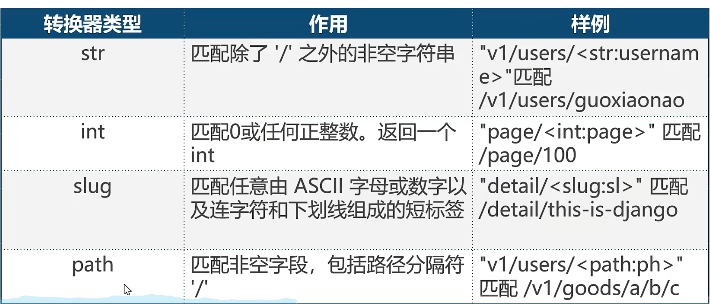
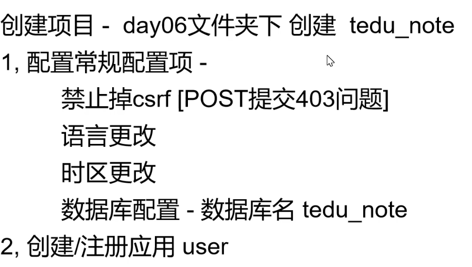

# 一 简介

- 大概了解
  - 2005年发布，采用纯Python开发
  - 重量级的Python web框架，Django配备了常用的大部分组件
- 包含组件
  - 基本配置文件/路由系统
  - 模型层(M)/模板层(T)/视图层(V)
  - Cookies和Session
  - 分页及发邮件
  - Admin管理后台

# 二 项目结构


## 2.1 快速搭建

- 创建

| Django版本 |                 Python版本                 |
| :--------: | :----------------------------------------: |
|    1.11    | 2.7, 3.4, 3.5, 3.6, 3.7 (added in 1.11.17) |
|    2.0     |             3.4, 3.5, 3.6, 3.7             |
|  2.1, 2.2  |               3.5, 3.6, 3.7                |
|    3.0     |               3.6, 3.7, 3.8                |

- 成功安装Django后，虚拟机终端会有django-admin命令
- 执行django-admin startproject 项目名 即可创建出对应项目文件夹
- 例如 终端执行 django-admin startproject mysite1


- 启动[测试开发阶段]
  - cd mysite1  进入到项目文件夹
  - 执行 python manage.py runserver 启动Django服务【默认8000端口 ，如果想要更换端口则可以 python manage.py runserver 端口号】
  - 浏览器访问 127.0.0.1:8000

- 关闭服务

  - 方式1：在runserver启动终端下

    执行Ctrl+c可关闭Django服务

  - 方式2：在其他终端下

    执行sudo lsof -i:8000 查询出Django的进程id

    执行kill -9 对应的Djangoid


## 2.2 结构解析


- db.sqlite3
  - 用不上
- manage.py
  - 保护项目管理的子目录，如
  - python manage.py runserver  启动服务
  - python manage.py startapp 创建应用
  - python manage.py migrate 数据库迁移
  - .....
  - 直接执行 python manage.py 可以列出所有的Django子命令


- 项目同名文件夹
  - \_\_init\_\_.py :python包的初始化文件
  - wsgi.py : web服务网关的配置文件 - Django正式启动时，需要用到
  - urls.py : 项目的主路由配置 - HTTP请求进入Django时，优先调用该文件
  - settings.py : 
    - 项目的配置文件 - 保护项目启动时需要的配置
    - 配置项分为 公有配置 和 自定义配置
    - 配置项格式: BASE_DIR = 'XXX'
    - 公有配置 - Django官方提供的基础配置
      - docs.djangoproject.com/en/2.2/ref/settings.com

## 2.3 settings.py

```python
# 项目的绝对路径
BASE_DIR = os.path.dirname(os.path.dirname(os.path.abspath(__file__)))


# 项目的启动模式
# True  调试模式 就是改代码立即生效，并且有报错页面
# False  正式模式  代码不会立即生效，无报错页面，Not Found
DEBUG = True

# 请求头里面host头
# 只有当请求头中host头的值属于这个列表才接收
# * 表示允许所有
# 如果要在局域网其他主机也能访问此主机的Django服务
# 启动方式如下：python manage.py runserver 0.0.0.0:5000
# 指定网络设备如果内网环境下其他主机想正常访问该站点，需要添加
# ALLOWED_HOSTS = ['内网ip']
ALLOWED_HOSTS = []
# 空列表表示 只有 127.0.0.1、localhost

# 语言信息配置  中文 zh-Hans
LANGUAGE_CODE = 'zh-Hans'
# 表示时区， 中国的东八区时间：Asia/Shanghai
TIME_ZONE = 'Asia/Shanghai'

INSTALLED_APPS - 指定当前项目中安装的应用列表
MIDDLEWARE - 用于注册中间件
TEMPLATES - 用于指定模板的配置信息
DATABASES - 用于指定数据库的配置信息
LANGUAGE_CODE - 用于指定语言配置
 - 英文 'en-us'
 - 中文 'zh-Hans'
```

# 三 URL和视图函数


## 3.1 URL

- 定义 - 统一资源定位符
- 作用 - 用来表示互联网上某个资源的地址
- URL语法
  - [] 表示可有可无
  - 协议://域名[:端口]/路由\[?get参数\]\[#信息片段\]

- 协议
  - http通过HTTP访问该资源
  - https通过安全的HTTPS访问该资源
  - file资源是本地计算机上的文件
- 主机名
  - 是指存放资源的服务器的域名系统(dns)主机名、域名、或IP地址

- port
  - 整数，可选，省略使用方案的默认端口
  - 各种出阿叔协议都有默认的端口号
-  path(路由地址)
  - 由0个或多个 / 符号隔开的字符串，一般用来表示主机上的一个目录或文件地址。路由地址决定了服务器端如何处理这个请求
- query(查询)
  - 可选，用于给动态网页传递参数，可有多个参数，用&符号隔开，每个参数的名和值用 = 符号隔开
- 信息片段
  - 字符串，用于指定网络资源中的片段，例如一个网页中有多个名词解释，可使用 信息片段 直接定位到某一个名词结束


## 3.2 处理URL请求

```python
浏览器 地址栏 -》 http://127.0,0.1:8000/page/2003/
1. Django从配置文件中 根据ROOT_URLCONF找到主路由文件；默认情况下，该文件在项目同名目录下的urlsl 例如mysite1/mysite1/urls.py
2. Django加载主路由文件中的 urlpatterns 变量[包含很多路由的数组]
3. 依次匹配 urlpatterns 中的 path，匹配到第一个合适的终端后续匹配
4. 匹配成功 -调用对应的视图函数处理请求，返回响应
5. 匹配失败 -返回404响应
```


## 3.3 视图函数

- 视图函数是用于接收一个浏览器请求(HttpRequest对象)并通过HttpResponse对象返回响应的函数。此函数可以接收浏览器请求并根据业务逻辑返回相应的响应内容给浏览器

- 语法

  ```python
  def xxx_view(request[,其他参数...]):
      return HttpResponse对象
  
  
  
  def page1_view(request):
      html = "<h1>这是第1个页面</h1>"
      return HttpResponse(html)
  ```

  

# 四 路由配置

## 4.1 path


- path(函数)
- 导入 - from django.urls import path
- 语法 - path(route,views,name=None)

- 参数
  - route:字符串类型，匹配的请求路径
  - views:指定路径所对应的视图处理函数的名称
  - name:为地址起别名，在模板中地址反向解析时使用


## 4.2 path转换器

- 语法：\<转换器类型:自定义名\>

- 作用：若转换器类型匹配到对应类型的数据，则将数据按照关键字传参的方式传递给视图函数

- ```python
  path('page/<int:page>',views.xxx)
  ```

  




## 4.3 re_path

- 在url的匹配过程中可以使用正则表达式进行精确匹配

- 语法

  - re_path(reg,view,name=xxx)

  - ```
    正则表达式为命名分组模式<?P<name>pattern>;匹配提取参数后用关键字传参方式传递给视图函数
    ```

  - 加减乘法计算

  - ```python
    re_path(r'^js/(?P<n1>\d{1,2})/(?P<m>[\+\-\*]+)/(?P<n2>\d{1,2})/$',views.math)
    
    
    def math(request, n1, n2, m):
        n1 = int(n1)
        n2 = int(n2)
        html = '<h1>%s</h1>'
        if m in ['-','+','*']:
            if m == "+":
                html %= (n1 + n2)
            elif m == '-':
                html %= (n1 - n2)
            else:
                html %= (n1 * n2)
        else:
            html %= ("运算符错误")
        return HttpResponse(html)
    ```

  - 年月日生日

  - ```python
    re_path(r'^birthday/(?P<Y>\d{4})/(?P<m>\d{1,2})/(?P<d>\d{1,2})$',views.day)
    
    def day(request,Y,m,d):
        html = f'生日为:{Y}年{m}月{d}日'
        return HttpResponse(html)
    ```

# 五 请求和响应

- 请求是指浏览器通过Http协议发送给服务器端的数据
- 响应是指服务器端接收到请求后做响应的处理后再回复给浏览器端的数据


## 5.1 请求中的方法

- get
  - 请求指定的页面信息，并返回实体主体
- head
  - 类似于get请求，只不过返回的响应中没有具体的内容，用于获取报头
- post
  - 向指定资源提交数据进行处理请求（例如提交表单和上传文件）。数据包含在请求体中。post请求可能会导致新的资源的建立和/或已有资源的修改

- put
  - 从客户端向服务器传送的数据取代指定的文档的内容
- delete
  - 请求服务器删除指定的页面

## 5.2 Django的请求

- 请求在Django中实则就是 视图函数的第一个参数，即HttpRequest对象
- Django接收到http协议的请求后，会根据请求数据报文创建HttpRequest对象
- HttpRequest对象 通过属性描述了请求的所有相关信息
  - path_info : URL字符串
  - method：字符串,表示HTTP的请求方法 如：GET POST
  - GET:QueryDict查询字典的对象，包含get请求方式的所有数据
  - POST:QueryDict查询字典的对象，包含post请求方式的所有数据
  - FILES:类似于字典的对象，包含所有的上传文件信息
  - COOKIES:字典，包含所有的cookie，键和值都为字符串
  - session：类似字典的对象，表示当前的会话
  - body：字符串，请求体的内容(post或put)
  - scheme : 请求协议('http'/'https')
  - get_full_path() : 请求的完整路径
  - META:请求中的元数据(消息头)
    - META['REMOTE_ADDR'] 客户端的ip地址


## 5.3 常见状态码

- 200 请求成功
- 301 永久重定向 - 资源(网页等) 被永久转移到其他URL
- 302 临时重定向
- 404 请求的资源(网页等) 不存在
- 500 内部服务器错误

## 5.4 Django中的响应对象

```python
构造函数格式:
    HttpResponse(content=响应体,content_type=响应体数据类型,status=状态码)
    
作用:
    向客户端浏览器返回响应，同时携带响应体内容
```


- HttpResponse子类


## 5.5 GET处理

- 无论是GET还是POST,统一都由视图函数接收请求，通过判断request.method区分具体的请求动作

- 样例

  ```python
  if request.method == 'GET':
      处理GET请求时的业务逻辑
  elif request.method == 'POST':
      处理POST请求的业务逻辑
  else:
      其他请求业务逻辑
  ```

- GET处理

  GET请求动作，一般用于向服务器获取数据

  能够产生GET请求的场景:

  - 浏览器地址中输入URL，回车后
  - <a href="地址"?参数=值&参数=值>
  - form表单中的method为get

- GET请求方式中，如果有数据需要传递给服务器，通常会用查询字符串传递

  - URL格式: xxx?参数名1=值1&参数名2=值2

  - 服务器接收参数，获得客户端请求GET请求提交的数据

  - 方法案例

    ```python
    request.GET['参数名'] # 优先接收第一个该参数名
    request.GET.get('参数名','默认值')
    request.GET.getlist('参数名')   # 获得的是一个列表，可以接收所有的这个key的value
    ```

    

## 5.6 POST处理

- POST请求动作，一般用于向服务器提交大量/隐私数据

- 客户端通过表单等POST请求将数据传递给服务器端，如

  ```html
  <from method='post' action="/login">
   
  </from>
  ```

- 服务器端接收参数

  通过request.method来判断是否为POST请求，如:

  ```python
  if request.method == 'POST':
      处理POST请求的数据并响应
  else:
      处理非POST 请求的响应
  ```

  使用post方式接收客户端数据

  ```python
  request.POST['参数名']
  request.POST.get('参数名','')
  request.POST.getlist('参数名')
  
  取消csrf验证，否则Django将会拒绝客户端发来的POST请求，报403响应
  ```

  取消csrf验证

  ```python
  - 禁止掉settings.py中MIDDLEWARE中的CsrfViewsMiddleWare的中间件
  
  ```

# 六 MTV简介

MTV代表Model-Template-View(模型-模板-视图)模式

- M 模型层  ：负责与数据库交互
- T  模板层  ：负责呈现内容到浏览器
- V  视图层  ：负责接收请求、获取数据、返回结果


# 七 T(模板层)

1. 模板是可以根据字典数据动态变化的html网页
2. 模板可以根据视图中传递的字典数据动态生成相应的HTML网页

## 7.1 模板配置

创建模板文件夹 <项目名> /templates

在settings.py中 TEMPLATES配置项

1. BACKEND:指定模板的引擎
2. DIRS:模板的搜索目录（可以是一个或者多个）
3. APP_DIRS:是否要在应用中的templates文件夹中搜索模板文件
4. OPTIONS:有关模板的选项

- 配置项中需要修改的部分

  ```python
  设置DIRS
  'DIRS':[os.path.json(BASE_DIR,'templates')]
  ```

  

## 7.2 模板加载

方法1 - 通过loader获取模板，通过HttpResponse进行响应

在视图函数中

```python
from django.template import loader
# 1.通过loader加载模板
t = loader.get_template('模板文件名')
# 2.将t转换成html字符串
html = t.render(字典数据)
# 3.用响应对象将转换的字符串内容返回给浏览器
return HttpResponse(html)
```

方法2 - 使用render() 直接加载并响应模板

在视图函数中

```python
from django.shortcuts import render
return render(request,'模板文件名',字典数据)
```

## 7.3 T和V交互

1. 视图函数中可以将Python变量封装到 字典 中 传递到模板

   ```python
   def xxx_view(request):
       dic = {
           "变量1":"值1",
           "变量2":"值2",
       }
       return render(reqeust,'xxx.html',dic) 
   ```

2. 模板中，我们可以用{{变量名}}的语法 调用视图传进来的变量

```python
dic = {
    'username':'乃荣',
    'age':18
}
return render(reqeust,'test_html.html',dic)

<h1>你好我叫{{username}},今年{{age}}岁</h1>
```

## 7.4 模板的变量

 能传递到模板中的数据类型

- str
- int
- list
- tuple
- dict
- func
- obj

在模板中的用法

- {{变量名}}
- {{变量名.index}}
- {{变量名.key}}
- {{对象.方法}}
- {{函数名}}

```python
def test_html2(reqeust):
    def say_hi():
        return '哈哈'
    class Dog:
        def say(self):
            return '汪汪汪'
    dic = {}
    dic['int'] = 88
    dic['str'] = '乃荣'
    dic['lst'] = ['Tom','Jack','Lily']
    dic['dict'] = {'a':9,'b':8}
    dic['func'] = say_hi
    dic['class_obj'] = Dog()
    return render(reqeust,'test_html_param.html',dic)

<h3>int 是 {{int}}</h3>
<h3>str 是 {{str}}</h3>
<h3>lst 是 {{lst}}</h3>
<h3>lst 是 {{lst.0}}</h3>   注意 列表的下标是用.0 
<h3>dict 是 {{dict}}</h3>
<h3>dict['a'] 是 {{dict.a}}</h3>
<h3>function 是 {{func}}</h3>
<h3>class_obj 是 {{class_obj.say}}</h3>
```

## 7.5 模板的标签

作用：将一些服务器端的功能嵌入到模板中，例如流程控制等

标签语法

```python

....

```


- if标签

  ```python
  
  ...
  
  ...
  
  ...
  
  ...
  
  ```

  注意

  ```
  1.if条件表达式里面可以用的运算符
    ==,!=,<,>,<=,>=,in,not in,is,is not,not,and,or
  2.在if标记中无法使用括号。如果您需要它们指示优先级，则应使用嵌套的if标记
  ```

  

- for标签

  ```python
  
  ...循环语句
  
  ...可迭代对象无数据时填充的语句
  
  ```

  内置变量 - forloop

  ```python
  counter			循环的当前迭代(从1开始索引)
  counter()		循环的当前迭代(从0开始索引)
  revcounter		counter值得倒叙
  revcounter()	revcounter值的倒叙
  first			如果这是第一次通过循环，则为真
  last			如果这是最后一次循环，则为真
  parentloop		当嵌套循环，parentloop表示外层循环
  ```

## 7.6 模板过滤器

- 定义：在变量输出时对变量的值进行处理

- 作用：可以通过使用 过滤器来改变变量的输出显示

- 语法：

  ```python
  {{变量|过滤器1:'参数值1'|过滤器2:'参数值2'...}}
  ```

- 常用过滤器

  ```python
  lower				字符串转小写
  upper				字符串转大写
  safe				会对该内容转义html和js代码
  add:"n"				将vaule的值增加n
  truncatechars:'n'	如果字符串字符多余指定的字符数量，那么会被截断，截断的字符串将可翻译的省略号序列...结尾
  ```

- 自定义过滤器

  ```python
  需要在应用中建立一个包
  app
   - templatetags
  	- my_tags.py   
  ```

  my_tags.py

  ```python
  from django import template
  
  register = template.Library()
  
  @register.filter # 这个装饰器的作用是把函数 变为 过滤器
  def multi(a,b):
      return a * b
  ```

  前端

  ```html
  想要使用自定义过滤器 必须引入
  
  
  <p>
      {{ 5|multi:3}} # 15
  </p>
  
  ps:重新导入过滤器需要重启django
  ```

- 自定义标签

  my_tags.py

  ```python
  from django import template
  
  register = template.Library()
  
  @register.simple_tag # 函数转标签
  def add_t(a,b,c):
      return a + b + c
  ```

  前端

  ```html
  
  
   # 结果就是1+2+3
  ```

  

## 7.7 模板继承

模板继承可以使父模板的内容重用，子模版直接继承父模板的全部内容并可以覆盖副模版中相应的块

语法 - 父模板中:

- 定义父模板中的块block标签
- 表示出哪些子模块中是允许被修改的
- block标签：在父模板中定义，可以在子模版中覆盖

```python
继承模板 extends 标签 (写在模板文件的第一行)

子模版 重写父模板的内容快

子模版块用来覆盖父模板中 block_name 块的内容

```


- 重写的覆盖规则
  - 不重写，将按照父模板的效s果显示
  - 重写，按照重写效果显示
- 注意
  - 模板继承时，服务器端的动态内容无法继承 ★★


# 八 url反向解析

- 代码中url出现位置

  - 模板【html中】 

    - ```xml
      <a href = 'url'>超链接</a>
      点击后 页面跳转url
      ```

    - ```xml
      <from action='url' method='post'></from>
      ```

  - 视图函数中 - 302 跳转 HttpResponseRedirect('url')

    - 将用户地址栏中你的地址跳转到url

- Url反向解析是指在视图或者模板中，用path定义的名称来**动态查找或计算出相应的路由**

  - path函数的语法

    ```python
    path(route,views,name='别名')
    ```

    ```python
    path('page',views.page_view,name='page_url')
    ```

  - 根据path中的'name' = 关键字传参给 url确定了一个唯一确定的名字，在模板或函数中，可以通过这个名字方向推断出此url信息

  - 模板中 - 通过url标签实现地址的反向解析

    ```python
    
    
    ex:
    
    
    ```

  - 视图函数使用

    ```python
    from django.urls import reverse
    url = reverse('别名',args=[],kwargs={})
    return HttpResonseRedirect(url)
    ```

    

    ```python
    def xxx(request,age):
        from django.urls import reverse
        url = reverse('base_index')
        return HttpResonseRedirect(url) # 302 跳转
    ```

# 九 静态文件

- 什么是静态文件

如：图片，css，js，音频，视频


## 9.1 静态文件配置

- 静态文件配置 - settings.py
  - 配置静态文件的访问路径【该配置默认存在】
  - 通过哪个url地址找静态文件
  - STATIC_URL = '/static/'
  - 说明
    - 指定访问静态文件时是需要通过 /static/xxx或http://127.0.0.1:8000/static/xxx
    - [xxx表示具体的静态资源位置]


- 配置静态文件的存储路径 STATICFILES_DIRS

- STATICFILES_DIRS保存的是静态文件在服务器端的存储位置

  ```PYTHON
  #file:setting.py
  STATICFILES_DIRS = (
  	os.path.join(BASE_DIR,'static'),
  )
  ```

## 9.2 静态文件访问

```python
方法一 直接写


方法二
img标签 geng
通过  标签访问静态文件
1.加载 static - 
2.使用静态资源 
3.样例
	
```


# 十 应用及分布式路由

## 10.1 什么是应用

- 应用在Django项目中是一个独立的业务模块，可以包含自己的路由，视图，模板，模型

  

## 10.2 创建应用

- 用manage.py 中的 子命令 startapp 创建应用文件夹

  ```shell
  python manage.py startapp music
  ```

- 在settings.py 的 INSTALLED_APPS 列表中配置安装此应用

- 配置案例

  ```python
  INSTALLED_APPS = [
      'USER',#用户信息模块
      'music',#音乐模块
  ]
  
  ex:
  # 配置Django应用的
  INSTALLED_APPS = [
      'django.contrib.admin',
      'django.contrib.auth',
      'django.contrib.contenttypes',
      'django.contrib.sessions',
      'django.contrib.messages',
      'django.contrib.staticfiles',
      'music',
  ]
  ```

  

- 应用结构解析
  - migrations   模型层--db
  - admin.py     管理后台
  - apps.py     应用下的相关配置
  - models.py   模型层入口   --db
  - tests.py     专门用来测试的
  - views.py    视图层

## 10.3 分布式路由

Django中，主路由配置文件(urls.py) 可以不处理用户具体路由，主路由配置文件的可以做请求的分支（分布式请求处理）。具体的请求可以由各自的应用来进行处理


## 10.4 配置分布式路由

- 主路由中调用include函数

  ```python
  from django.urls import path,re_path,include
  
  语法：include('app名字.url模块名')
  作用：用于将当前路由转到各个应用的路由配置文件的urlpatterns进行分布式处理
  
  ex:
      path('music/',include('music.urls'))
      
  现在 127.0.0.1:8000/music/index
  就是进入 music.urls里面结构如下
  
  
  music.urls.py
  # 注意手动创建的urls.py文件和主路由完全一样
  from django.urls import path
  from . import views
  urlpatterns = [
      patn('index',views.index_view),
  ]
  ```

## 10.5 应用下的模板

应用内部可以配置模板目录

- 应用下手动创建templates 文件夹
- settings.py中 开启 应用模板功能
  - TEMPLATE配置项中 的 'APP_DIRS' 值 为 True 即可

应用下templates 和 外层 templates 都存在时,Django的查找模板规则

- 优先查找外层templates目录下的模板
- 按INSTALLED_APPS配置下的 应用顺序 逐层查找

优先级解决办法

- 嵌套一层文件夹


# 十一 M(模型层)

模型层 - 负责跟数据库通信

## 11.1 配置mysql

- 安装mysqlclient [版本 mysqlclient 1.3.13以上]

  ```python
  python -m pip install mysqlclient==1.4.6
  ```

- 创建数据库

  ```python
  进入mysql
  create database 数据库名 default charset utf8
  通常数据库名跟项目名保存一致
  ```

- settings.py 里面进行数据库配置

  修改DATABASES配置项的内容，由sqlite3变为mysql

  ```python
  # 数据库配置
  DATABASES = {
      'default': {
          'ENGINE': 'django.db.backends.mysql',
          'NAME': 'mysite1', # 数据库名
          'USER': 'root', # 用户名
          'PASSWORD':'root', # 密码
          'HOST' : '127.0.0.1', # 谁的数据库
          'POST' : '3306' # 端口
      }
  }
  ```

## 11.2 模型类

- 模型是一个Python类，它是由django.db.models.Model派生出的子类。
- 一个模型类代表数据库中的一张数据表
- 模型类中每一个类属性都代表数据库中的一个字段
- 模型是数据交互的接口，是表示和操作数据库的方法和方式


模型类的创建

```python
首先模型类都是在 models.py文件里面
语法

from django.db import models
class 模型类名(models.Model):
    字段名 = models.字段类型(字段选项)
  	...
    
ex:
class Book(models.Model):
   title = models.CharField('书名',max_length=50,default='')
   price = models.DecimalField('价格',max_digits=7,decimal_places=2)

```


## 11.3 ORM框架

- ORM:对象关系映射，它是一种程序技术，它允许你使用类和对象对数据库进行操作，从而避免通过SQL语句操作数据库
- 作用
  - 建立模型类和表之间的对应关系，允许我们通过面向对象的方式来操作数据库
  - 根据设计的模型类生成数据库中的表格
  - 通过简单的配置就可以进行数据库的切换

- 优点
  - 只需要面向对象编程，不需要面向数据库编写代码
    - 对数据库的操作都转化成类属性和方法的操作
    - 不用编写各种数据库的sql语句
  - 实现了数据模型与数据库的解耦，屏蔽了不同数据库操作上的差异
    - 不再关注用的是mysql、oracle等数据库的内部细节
    - 通过简单的配置就可以轻松切换数据库，而不需要修改代码

- 缺点
  - 对于复杂业务，使用成本较高
  - 根据对象的操作转换成sql语句，根据查询的结果转化成对象，映射过程中存在性能损失


## 11.4 数据库迁移

```python
- 迁移是DJango同步您对模型所做更改(添加字段，删除模型等)到您数据库模式的方式

  - 生成迁移文件 - 执行 python manage.py makemigrations

    将应用下的models.py文件生成一个中间文件，并保存在migrations文件夹中

  - 执行迁移脚本程序 - 执行 python manage.py migrate

    执行迁移程序实现迁移。将每个应用下的migrations目录中的中间文件同步回数据库
```

## 11.5 ORM字段及选项

### 11.5.1 创建模型类流程

- 创建应用

- settings添加应用

- 在应用下的models.py中 编写模型类

  ```python
  from django.db import models
  class 模型类名(models.Model):
      字段名 = models.字段类型(字段选项)
  ```

- 迁移同步

  ```shell
  makemigrations & migrate
  ```

- ps

  ```python
  任何关于表结构的修改，务必在对应的模型类上修改
  例：为bookstore_book表 添加一个名为info的字段 varchar(100)
  
  解决方案
  	- 模型类中添加 对应 类属性
      - 执行数据库迁移
  ```

### 11.5.2 字段类型

```markdown
- BooleanField()
	数据库类型：tinyint(1)
    编程语言中：使用True或False来表示值
    数据库中： 使用1或0来表示具体的值
- CharField()
	数据库类型：varchar
	注意：必须要指定max_length参数值
- DateField()
	数据库类型：date
	作用：表示日期
	参数：
		1.auto_now：每次保存对象时，自动设置该字段为当前时间(True/False)
		2.auto_now_add：当对象第一次被创建时自动设置当前时间(True/False)
		3.default：设置当前时间（'2019-6-1'）
		以上三个参数只能多选一
- DateTimeField() ★
	数据库类型：datetime(6)
	作用：表示日期和时间
	参数同DateField
- FloatField()
	数据库类型：double
	编程语言中和数据库中都使用小数表示值
- DecimalField()
	数据库类型：decimal(x,y)
	编程语言中：使用小数表示该列的值
	在数据库中：使用小数
	参数：
		max_digth：位数总数，包括小数点后的位数。该值必须大于等于 decimal_places
		decimal_places：小数点后的数字数量（保留几位小数）
- EmailField()
	数据库类型：varchar
	编程语言和数据库中使用字符 串
- IntegerField()
	数据库类型：int
	编程语言和数据库中使用整数
- ImageField()
	数据库类型：varchar(100)
	作用：在数据库中为了保存图片的路径
	编程语言和数据库中使用字符串
- TextField()
	数据库类型：longtext
	作用：表示不定长的字符数据
```

### 11.5.3 字段选项

```python
- 字段选项，指定创建的列的额外的信息
- 允许出现多个字段选项，多个选项之间使用,隔开
- primary_key
	- 如果设置为True，表示该列为主键，如果指定一个字段为主键，则此数据库表不会创建id字段
- blank
	- 设置为True时，字段可以为空。设置为False时，字段是必须填写的
- null
	- 如果设置为True，表示允许空值
	- 默认为False，如果此选项为Fasle建议加入默认值
- default
	- 设置所在列的默认值，如果字段选项null=Fasle建议添加此项
- db_index
	- 如果设置为True，表示为该列增加索引
- unique
	- 如果设置为True，表示该字段在数据库中的值必须是唯一（不能重复）  也是索引，唯一索引
- db_column
	- 指定列的名称，如果不指定的话则采用属性名作为列名
- verbose_name
	- 设置此字段在admin界面上的名字
ex：
创建一个属性，表示用户名称，长度30个字符，必须是唯一的，不能为空，添加索引
name = models.CharField(max_length=30,unique=True,null=False,db_index=True)
```

### 11.5.4 Meta类

使用内部Meta类来给模型赋予属性，Meta类有很多内建的类属性，可对模型类做一些控制

```python
class Book(models.Model):
    title = models.CharField('书名',max_length=50,default='')
    price = models.DecimalField('价格',max_digits=7,decimal_places=2)
    info = models.CharField('信息',max_length=100,default='')
    class Meta:
        db_table = 'book'  # 不想要 app名_Book 可以设置 db_table
		
        verbose_name = '单数名' # 给模型对象的一个易于理解的名称(单数),用于显示在/admin管理界面
        verbose_name_plural = '复数名' # 该对象复数形式的名称(复数),用于显示在/admin管理界面
```

## 11.6 管理器对象

基本操作包括增删改查 -》 CRUD操作

CRUD核心 -》模型类.管理器对象

每个继承自 models.Model 的模型类，都会有一个objects对象被同样继承下来。这个对象叫管理器对象

数据库的增删改查可以通过模型的管理器实现

```python
class MyModel(models.model):
    ...
MyModel.objects.create(...) # objects 是管理器对象
```

## 11.7 创建数据

Django ORM 使用一种直观的方式把数据库表中的数据表示成Python对象

创建数据中每一条记录就是创建一个数据对象

- 方案1

  ```python
  MyModel.object.create(属性1=值1,属性2=值2,....)
  成功：返回创建好的实体对象
  失败：抛出异常
  
  ex
  b1 = Book.objects.create(title='Python',pub='清华大学出版社',price=20,market_price=25)
  ```

- 方案2

  ```python
  创建MyModel 实例对象，并调用save() 进行保存
  obj = MyModel(属性=值,属性=值)
  obj.属性=值
  obj.save()
  
  
  ex
  >>> b2 = Book(title = 'Django',pub='清华大学出版社',price=70,market_price=75)
  >>> b2.save()
  ```

  

- Django Shell

  在Django提供了一个交互式的操作项目叫Django Shell 它能够在交互模式用项目工程的代码执行相应的操作

  利用Django Shell 可以代替编写view的代码来进行直接操作

  > 注意：项目代码发现变化时，重写进入Django shell
  >
  > 启动方式:
  >
  > ​	python manage.py shell
  >
  > from bookstore.models import Book
  >
  > b1 = Book.objects.create(title='Python',pub='清华大学出版社',price=20,market_price=25)


## 11.8 查询数据

- 数据库的查询需要使用管理对象进行

- 通过MyModel.objects管理器方法调用查询方法

  ```python
  all()		查询全部记录，返回QuerySet查询对象
  get()		查询符合条件的单一记录
  filter()	查询符合条件的多条记录
  exclude()	查询符合条件之外的记录
  ```

- all()方法

  ```python
  MyModel.objects.all()
  作用：查询MyModel实体中所有的数据   #  select * from table
  返回值：QuerySet容器对象，内部存放MyModel实例
  from bookstore.models import Book
  books = Book.objects.all()
  for book in books:
      print('书名：',book.titile,'出版社：',book.pub)
  # ps 可以重写 Book类的 str方法，这样直接打印book就可以更舒服
  ```

- values('列1','列2'...)

  ```python
  MyModel.objects.values(...)
  作用：查询部分列的数据并返回 # select 列1,列2 from xxx
  返回值：QuerySet
  	返回查询结果容器，容器是一个字典
  >>> books = Book.objects.values('title','pub')
  >>> 
  >>> for book in books:
  ...     print(book)
  
  {'title': 'Python', 'pub': '清华大学出版社'}
  {'title': 'Django', 'pub': '清华大学出版社'}
  {'title': 'JQuery', 'pub': '机械工业出版社'}
  {'title': 'Linux', 'pub': '机械工业出版社'}
  {'title': 'HTML5', 'pub': '清华大学出版社'}
  
  ```

  

- values_list('列1','列2'...)

  ```python
  MyModel.objects.values_list(...)
  作用：返回元组形式的查询结果 # select 列1,列2 from xxx
  返回值：QuerySet容器对象，内部存放 '元组'
  	查询结果封装到元组中，再封装到QuerySet中
      
  >>> books = Book.objects.values_list('title','pub')
  >>> for book in books:
  ...     print(book) 
  ... 
  ('Python', '清华大学出版社')
  ('Django', '清华大学出版社')
  ('JQuery', '机械工业出版社')
  ('Linux', '机械工业出版社')
  ('HTML5', '清华大学出版社')
    
  ```

- order_by()

  ```python
  MyModel.objects.order_by('-列','列')
  作用：用sql语句ORDER BY 子句对查询结果进行根据某个字段进行排序
  说明：默认是按照升序排序，降序排序需要在列前增加 '-' 表示
  返回值：QuerySet里面的和all类似，结果是Book对象
  ```

- query属性

  ```python
  方便直接查看原生sql语句
  >>> a5 = Book.objects.order_by('price').values('title').query 
  >>> print(a5) 
  SELECT `book`.`title` FROM `book` ORDER BY `book`.`price` ASC
  
  ```

  

- filter(条件)

  ```python
  MyModel.objects.filter(属性1=值1,属性2=值2)
  作用：返回包含 条件 的全部的数据集
  返回值：QuerySet容器对象，内部存放 对象实例
  说明：当多个属性在一起时为 "与" 关系
  
  books = Book.objects.filter(pub="清华大学出版社")
  ```

- exclude(条件)

  ```python
  MyModel.objects.exclude(条件)
  作用：返回不包含此 条件 的 全部的数据集
  
  ex 查询清华大学出版社，定价等于50以外的全部图书
  books = Book.objects.exclude(pub='清华大学出版社',price=50)
  for i in books:
      print(i)
  ```

- get(条件)

  ```python
  MyModel.objects.get(条件)
  作用：返回满足条件的唯一一条数据
  说明：该方法只能返回一条数据，查询结果多余一条数据抛出异常，没有数据也会抛出异常
  ```

  

- 查询谓词

  ```python
  定义：做更灵活的条件查询时需要使用查询谓词
  说明：每一个查询谓词是一个独立的查询功能
  
  __exact:等值匹配
  	ex:Author.objects.filter(id__exact=1)
          
  __contains:包含指定值
      ex:Author.objects.filter(name_contains='w')
      # select * from author where name like "%w%"
  __startswith:以xxx开始
  __endswith:以xxx结束
  __gt:大于指定值
      ex:Author.objects.filer(age__gt=50)
      # select * from author where age > 50
  __gte:大于等于
  __lt:小于
  __lte:小于等于
      
  __in:查找数据是否在指定范围内
  	ex:Author.objects.filter(country__in=['中国','日本','韩国'])
      # select * from author where country in ('中国','日本','韩国')
  __range:查找数据是否在指定的区间范围内
      ex:Author.objects.filter(age__range=(35,50))
      # select ... where author between 35 and 50
  ```

## 11.9 更新数据

- 修改单个实体的某些字段值的步骤

  - 查

  ```python
  - 通过get()得到要修改的实体对象
  ```

  - 改

  ```python
  - 通过 对象.属性 的方式修改数据
  ```

  - 保存

  ```python
  - 通过 对象.save()保存数据
  ```

  

```python
b1 = Book.objects.get(id=1)
b1.price = 22
b1.save()
```


- 批量更新数据

  ```python
  直接调用QuerySet的update(属性=值)实现批量修改
  -ex
  # 将id大于的的图书价格改为0元
  books = Book.objects.filter(id__gt=3)
  books.update(price=0)
  
  # 所有书改100块钱
  books = Book.object.all()
  books.update(market_price=100)
  ```

## 11.10 删除数据

- 单个数据删除

  ```python
  1.查找查询结果对应的一个数据对象
  2.调用这个数据对象的delete()方法实现删除
  
  try:
      auth = Author.objects.get(id=1)
     	auth.delete()
  except:
      print('删除失败')
  ```

  

- 批量删除

  ```python
  1.查找查询结果集中满足条件的全部QuerySet查询对象
  2.调用查询集合对象的delete()方法实现删除
  # 删除全部坐着中，年龄大于65的全部信息
  auths = Author.objects.filter(age__gt=65)
  auths.delete()
  ```

- 伪删除

  ```python
  通常不会轻易在业务里把数据真正删掉，取而代之的是做伪删除，即在表中添加一个布尔型字段(is_active)，默认是True；执行删除时，将欲删除数据的is_active字段设置为False
  
  注意：用伪删除时，确保显示数据的地方，均加了is_active=True的过滤查询
  
  is_active = models.BooleanField('是否活跃',default=True)
  ```

## 11.11 F对象和Q对象

### 11.11.1 F对象

- 一个F对象代表数据库中某条记录的字段信息

- 作用

  - 通常是对数据库中的字段值在不获取的情况下进行操作
  - 用于类属性(字段)之间的比较

- 语法

  - ```python
    - from django.db.models.import F
    - F('列名')
    
    # 将book中零售价全部涨价10元
    
    Book.objects.all().update(
    	market_price=F('market_price') + 10
    )
    
    上面的方法性能更优秀，减少io操作
    books = Book.objects.all()
    for book in books:
        book.market_price = book.marget_price + 10
        book.save()
        
    
    # 列出哪些书的零售价高于定价
    >>> from django.db.models import F
    >>> from bookstore.models import *
    >>> books = Book.objects.filter(market_price__gt=F('price')) 
    >>> for book in books:
    ...     print(book) 
    ... 
    Python_清华大学出版社_10.00_25.00
    Django_清华大学出版社_70.00_75.00
    JQuery_机械工业出版社_11.00_85.00
    )
    ```

### 11.11.2 Q对象

当在获取查询结果集 使用复杂的逻辑或 | 、 逻辑非 ~ 等操作时可以借助于Q对象进行操作

```python
# 找出定价低于20元 或者 清华大学出版社的全部书
from django.db.models import Q
Book.objects.filter(Q(price__lt=20)|Q(pub="清华大学出版社"))

Q(条件1) | Q(条件2)    条件1成立或者条件2成立
Q(条件1) & Q(条件2)	   条件1和条件2同时成立
Q(条件1)&~Q(条件2)	   条件1成立且条件2不成立
```


## 11.12 聚合查询

- 聚合查询：对数据表中的一个字段的数据进行部分或者全部进行行统计查询
- 聚合查询可以分：整表聚合，分组聚合


- 整表聚合

  不带分组的聚合查询是指将全部数据进行集中统计查询

```python
聚合函数需要导入:
    from django.db.models import *
    聚合函数：Sum,Avg,Count,Max,Min
语法
	MyModel.objects.aggregate(结果变量名=聚合函数('列'))
    返回结果：结果变量名和值组成的字典
    格式为；{"结果变量名":值}
    
    
>>> books = Book.objects.aggregate(书的数量=Count('id'))    
>>> print(books) 
{'书的数量': 5}

```

- 分组聚合

  分组聚合是指通过计算查询结果中每一个对象所关联的对象集合，从而得出总计值（也可以是平均值和求和),即为查询集的每一项生成聚合

  ```python
  语法：QuerySet.annotate(结果变量名=聚合函数('列'))
  返回值：QuerySet
  
  
  步骤
  1.先用查询结果MyModel.objects.values 查找查询要分组聚合的列
  MyModel.objects.values('列1','列2')
  
  ex
  pub_set = Book.objects.values('pub')
  print(pub_set) 
  
  2.通过返回结果的QuerySet.annotate方法分组聚合得到分组结果
  QuerySet.annotate(名=聚合函数('列'))
  
  ex
  pub_count_set = pub_set.annotate(myCount=Count('pub'))
  print(pub_count_set)
  
  ps:分组后的 Filter相当于Having
  ```

## 11.13 原生数据库操作

Django也可以支持直接使用sql语句的方式通信数据库

- 查询：MyModel.objects.raw() 进行数据库查询

- 语法：MyModel.objects.raw(sql语句,参数拼接)

- 返回值：RawQuerySet 集合对象 【只支持基础操作，比如循环】

  ```python
  >>> books = Book.objects.raw('select * from book')        
  >>> for book in books:
  ...     print(book) 
  
  
  使用原生语句时候小心SQL注入
  定义：用户通过数据上传，将恶意的sql语句提交给服务器，从而达到攻击效果
  案例1：用户再搜索好友的表单里输入 1 or 1 = 1
  s1 = Book.objects.raw('select * from bookstore_book where id=%s'%('1 or 1 =1'))
  攻击结果：可查询出所有数据
  
  
  sql注入保护，使用第二个参数,Django会自动处理
  s1 = Book.objects.raw('select * from bookstore_book where id=%s',['1 or 1 = 1']
  ```

  

更独立的原生处理

```python
完全跨过模型类操作和数据库 
1.导入cursor所在的包
  from django.db import connection
2.创建cursor对象，在使用cursor对象，为保证在出现异常时能释放cursor资源，通常使用with语句进行创建操作
	from django.db import connection
	with connection.cursor() as cur:
        cur.execute('执行SQL语句','拼接参数')
```

# 十二 admin

- django提供了比较完善的后台管理数据库的接口，可供开发过程中调用和测试使用
- django会搜集所有已注册的模型类，为这些模型类提供数据管理界面，供开发者使用


## 12.1 admin配置

- 创建后台管理账号 - 该账号为管理后台最高权限账号

  ```shell
  python manage.py createsuperuser
  ```

  


## 12.2 注册自定义模型类

若要自己定义的模型类也能在 /admin 后台管理界中显示和管理，需要将自己的类注册到后台管理界面

注册步骤

```python
1.在应用app中的admin.py导入注册要管理的模型models类，
	如 from .models import Book
2.调用 admin.site.register 方法进行注册，
	如 admin.site.register(自定义模型类)
```


## 12.3 模型管理类

- 作用
  - 为后台管理界面添加便于操作的新功能
- 说明
  - 后台管理器类需继承自 django.contrib.admin里面ModelAdmin类 

```python
# 使用方法
1. 在<应用app>/admin.py 里定义模型管理类
class XXXXManager(admin.ModelAdmin)：
	....
    
2, 绑定注册模型管理器和模型类
from django.contrib import admin
from .models import *
admin.site.register(YYYY,XXXXManager) #绑定 YYYY模型
类与 管理器类 XXXXManager


ex
from django.contrib import admin
from .models import Book


class BookManager(admin.ModelAdmin):
    # 表示要显示哪些字段
    list_display = ['id','title','price','market_price']
    # 表示点哪些列可以进入修改页面，默认是id
    list_display_links = ['title','id']
    # 过滤器 分类 分组
    list_filter = ['pub']
    # 添加搜索框  ,以为title为搜索依据，模糊查询
    search_fields = ['title']
    # 添加可在列表页编辑的字段
    list_editable = ['price']

admin.site.register(Book, BookManager)


```

# 十三 关系映射

- 在关系型数据库中，通常不会把所有数据都放在同一张表中，不易于扩展，常见关系映射有
- 一对一映射
  - 一个身份证对应一个人
- 一对多映射
  - 一个班级可以有多个学生
- 多对多映射
  - 一个学生可以报多个课程，一个课程可以有多个学生

## 13.1 一对一

- 一对一是表现现实事物间存在的一对一的对应关系

- 如：一个人有一个唯一的指纹信息，唯一的身份证

- 语法：OneToOneField(类名,on_delete=xxx)

  ```python
  class A(model.Model):
      ...;
  class B(model.Model):
      属性 = models.OneToOneField(A,on_delete=xxx)
  ```

  

- 

- on_delete - 级联删除

  ```python
  1.models.CASEADE 级联删除。Django模拟SQL约束ON DELETE  # 共存亡
  CASEADE的行为，并删除包含ForeignKey的对象
  2.models.PROTECT 抛出ProtectedError 以阻止被引用对象的删除；[等同于mysql默认的RESTRICT] # 保护模式
  3.SET_NULL 设置ForeignKey null; 需要指定null=True
  4.SET_DEFAULT 将ForeignKey设置为其默认值；必须设置ForeignKey的默认值
  ```

  


- 创建数据

  - 无外键的模型类

    ```python
    author1 = Author.objects.create(name='王老师')
    ```

  - 有外键的模型类

    ```python
    wife1 = Wife.objects.create(name='王夫人',author=author1) # 关联王老师obj
    wife1 = Wife.objects.create(name='王夫人',author_id=1) # 关联王老师对应主键值
    ```

  - ex

    ```python
    >>> a1 = Author.objects.create(name='王老师')
    >>> w1 = Wife.objects.create(name='王夫人',author=a1
                                 
    >>> a2 = Author.objects.create(name='陈老师') 
    >>> w2 = Wife.objects.create(name='曹夫人',author_id=2);
    
    ```

- 查询数据

  - 正向查询：直接通过外键属性查询，称为正向查询

    ```python
    # 通过 wife  找 author
    from .models import Wife
    wife = wife.objects.get(name='王夫人');
    print(wife.name,'的老公是',wife.author.name )
    ```

    

  - 反向查询：没有外键属性的一方，可以调用反向属性查询到关联的另一方

    ```python
    # 方向关联属性为 '实例对象.引用类名(小写)' 如作家的反向引用为 作家对象.wife
    # 当反向引用不存在，则会异常
    author1 = Author.objects.get(name='王老师')
    author1.wife.name
    ```

## 13.2 一对多

一对多是表示现实事物间存在的一对多的对应关系

如：一个学习有多个班级，一个班级有多个学生

- 一对多需要明确具体角色，在多表上设置外键

语法：当一个A类对象可以关联多个B类对象时

```python
class A(model.Model):
    ...
    
class B(model.Model):
    属性 = models.ForeignKey("一"的模型类,on_delete=xx)
    
# ForeignKey必须指定on_delete模式
```

ex

```python
from django.db import models
class Publisher(models.Model):
    '''出版社【一】'''
    name = models.CharField('名称',max_length=50,unique=True)
    
class Book(models.Model):
    '''书【多】'''
    title = models.CharField('书名',max_length=50)
    publisher = ForeignKey(Publisher,on_delete=models.CASCADE)
    
    
```

- 创建数据

  先创建 一 再创建 多

  ```python
  from .models import *
  pub1 = Publisher.objects.create(name='清华大学出版社')
  Book.objects.create(title='c++',publisher=pub1)
  Book.objects.create(title='python',publisher_id=1)
  ```

  

- 查询数据

  正向查询[通过Book查询Publisher]

  ```python
  abook = Book.objects.get(id=1)
  print(abook.title,abook.publisher.name)
  ```

  反向查询[通过Publisher查询对应的所有的BOOK]

  ```python
  # 通过出版社查询对应的书
      pub1 = Publisher.objects.get(name ='清华大学出版社')
      books = pub1.book_set.all()
      for book in books:
          print(book.title,book.publisher.name)
  ```

  

## 13.3 多对多

- 用法示例

  - 一个作者可以出版多本图书

  - 一本图书可以被多名作者同时编写

    ```python
    class Author(models.Model):
        ....;
    class Book(models.Model):
        ....
        suthors = models.ManyToManyField(Author)
    ```


- 创建数据

  ```python
  # 方案1 先创建 author 再关联 book
  author1 = Author.objects.create(name='吕老师')
  author2 = Author.objects.create(name='王老师')
  # 吕老师和王老师同时写了一本python
  book11 = author1.book_set.create(title='Python')
  author2.book_set.add(book11)
  
  # 方案2 先创建book 再关联author ★
  book = Book.objects.create(title='python1')
  # 郭小闹和吕老师都参与了python1的创作
  author3 = book.authors.create(name='郭小闹')
  book.authors.add(author1)
  ```

  

- 

- 查询数据

  正向查询：有多对多属性的对象 查 另一方

  ​	通过Book 查询对应的所有的Author

  ​	此时多对多属性 等价于 objects

  ```python
  book.authors.all()  # 获取 book 对应的所有的 author的信息
  book.authors.filter(age__gt=80) # 获取book对应的坐着年龄大于80的坐着
  ```

  反向查询

  ​	利用Author查询对应的所有的Book

  ​	利用反向属性book_set

  ```python
  author.book_set.all()
  author.book_set.filter()
  ```

  

# 十四 会话

## 14.1 定义

- 从打开浏览器访问一个网站，到关闭浏览器结束此次访问，称之为一次会话
- Http协议是无状态的，导致会话状态难以保持
- Cookies和Session就是为了保持绘画状态而诞生的两个存储技术

## 14.2 Cookies

定义：Cookies是保存在客户端浏览器上的存储空间

Chormoe浏览器可能通过开发者工具的 Application 》》Storage》》Cookies 查看和操作浏览器端所有的Cookies值


- 特点
  - Cookies在浏览器上是 键值对 的形式存储，键值都是ASCII字符串形式，无法是中文
  - 存储的数据带有生命周期
    - 生命周期是自己设置说的算的
  - cookies中的数据是按域存储隔离的，不同的域之间无法访问
  - cookies的内部的数据会在每次访问此网址时都携带到服务器端，如果cookies过大会降低响应速度

- Cookies的使用 - 存储

  ```python
  HttpResponse.set_cookies(key,value='',max_age=None,expires=None)
  - key:cookie的名字;
  - value:cookie的值
  - max_age:cookie存活时间，秒为单位
  - expires:具体过期时间
  - 当不指定max_age和expires时，关闭浏览器时此数据失效
  
  ```

  案例

  - 添加cookie

  ```python
  def set_cookies(request):
  
      resp = HttpResponse('set cookies is ok')
      resp.set_cookie('root','123456',500)
      return resp
  ```

  - 修改cookie  - 和添加一样

  ```python
  def set_cookies(request):
  
      resp = HttpResponse('set cookies is ok')
      resp.set_cookie('root','654321',500)
      return resp
  ```

  - 删除cookie

  ```python
  HttpResponse.delete_cookie(key)
  - 删除指定的key的cookie。如果key不存在则什么也不发生
  ```

  - 获取Cookie

  ```python
  request.COOKIES 绑定的字典(dict)获取客户端的COOKIES数据
  value = request.COOKIES.get('cookies名','默认值')
  ```

  

cookie缺点：不安全，存浏览器上

## 14.3 Session


session定义: session是服务器上开辟一段空间用于保留浏览器和服务器交互时的重要数据

实现方式

- 使用session需要在浏览器客户端启动cookie，且在cookie中存储sessionid
- 每个客户端都可以在服务器端有一个独立的session
- 注意：不同的请求者之间不会共享这个数据，与请求者一一对应


- session初始配置

```python
# settings 中 配置 session
1. 向 INSTALLED_APPS 列表中添加
INSTALLED_APPS = [
    # 启动sessions应用
    'django.contrib.sessions',
]
2. 向 MIDDLEWARE 列表中添加
MIDDLEWARE = [
    # 启用 Session 中间件
    'django.contrib.sessions.middleware.SessionMiddleware'
]
```

- session的使用

```python
session对象是一个类似于字典的SeesionStore类型的对象，可以用类拟于字典的方式进行操作
session 能够存储如字符串，整型，字典，列表等。
1.保存 session 的值到服务器
	request.session['KEY'] = VALUE
2.获取session的值
	value = request.session['KEY']
    value = request.session.get['KEY',默认值]
    
3.删除session
	del request.session['KEY']
```

ex

```python
def set_session(request):
    request.session['uname'] = 'root'
    return HttpResponse('set session is ok')
def get_session(reqeust):
    value = reqeust.session.get('uname')
    return HttpResponse('session value is %s'%value)
```

settings.py中相关配置项

```python
1.SESSION_COOKIE_AGE
	作用：指定sessionid在cookies中的保存时长(默认两周)
    ex:SESSION_COOKIE_AGE = 60 * 60 * 24 * 7 * 2
2.SESSION_EXPIRE_AT_BROWSER_CLOSE = True
	设置只要浏览器关闭时，session就失效(默认为False)
ps：Django中的session数据存储在数据库中，所以使用session前需要确保已经执行过migrate
```

Django session的问题

- Django_session表是 单表设计；且该表 数据量持续增持【浏览器故意删掉 sessionid&过期数据未删除】
- 可以每晚执行 python manage.py clearsessions 【此命令删除已过期的session数据】


# 项目：云笔记


- 创建项目

  


- 注册密码

  ```python
  # 1. 两个密码得一致
  # 2. 当前用户名是否可用
  # 3. 密码加密
  #	a.定长输出：不管明文输入长度为多少，哈希值都是定长的，MD5 - 32位16进制
  #	b.不可逆：无法反向计算出 对应的 明文
  #	c.雪崩效应：输入改变，输出必然边
      m = hashlib.md5()
      m.update(password_1.encode())
      password_m = m.hexdigest()
      
  # 4. 插入数据
          try:
              user = User.objects.create(username=username,password=password_m)
          except Exception as e:
              print(f'--create user error {e}')
              return HttpResponse('用户名已注册')
  
  
  # 5. 免登录
          request.session['username'] = username
          request.session['uid'] = user.id
          return HttpResponse('注册成功')
  ```

- 登录

  ```python
  def login_view(request):
      if request.method == 'GET':
          # 检查登录状态，如果登陆了，显示 已登录
          if request.session.get('username') and request.session.get('uid'):
              return HttpResponse('已登陆')
          # 检查Cookies
          c_username = request.COOKIES.get('username')
          c_uid = request.COOKIES.get('uid')
          if c_username and c_uid:
              # 回写session
              request.session['username'] = c_username
              request.session['uid'] = c_uid
              return HttpResponse('已登陆')
  
  
          return render(request,"user/login.html")
      elif request.method == 'POST':
          # 处理数据
          username = request.POST['username']
          password = request.POST['password']
  
          try:
              user = User.objects.get(username=username)
          except Exception as e:
              print(f'--login user error {e}')
              return HttpResponse('用户名或密码错误')
  
          # 比对密码
          m = hashlib.md5()
          m.update(password.encode())
          if m.hexdigest() != user.password:
              return HttpResponse('用户名或密码错误')
  
          # 记录会话状态
          request.session['username'] = username
          request.session['uid'] = user.id
  
          resp = HttpResponse('---登录成功---')
          # 判断用户是否 点选了 记住用户名
          if 'remember' in request.POST:
              resp.set_cookie('username',username,3600*24*3)
              resp.set_cookie('uid',user.id,3600*24*3)
          return resp
  ```

  

- 退出登录

  ```python
  def logout_view(request):
      # 删除session
      del request.session['username']
      del request.session['uid']
      # 删除cookies
      obj = HttpResponseRedirect('/user/login')
      obj.delete_cookie('username')
      obj.delete_cookie('uid')
      return obj
  ```

# 十五 分页器

- 方法一

  ```python
  def index(request):
      p = int(request.GET.get('page'))
      page_count = 10  # 每页展示条数
      counts = User.objects.all().count()  # 取总数
      # math.ceil 向上取整
      page_lis = [i for i in range(1, math.ceil(counts / page_count) + 1)]
  
      users = User.objects.all()[p*10-10:p*10]
      print(page_lis)
      return render(request, 'user/page.html', locals())
  ```

- 方法二 使用Django特色分页器

  ```python
  def django_page(request):
      from django.core.paginator import Paginator
      try:
          p = int(request.GET.get('page'))
      except Exception:
          p = 1
      users = User.objects.all()
      paginator = Paginator(users,10)
      counts = paginator.num_pages
      if p == 1 or p ==2:
          page_list = [1,2,3,'...',counts]
      elif p == 3:
          page_list = [1,2,3,4,'...',counts]
      elif p in range(4,counts - 2):
          page_list = [1,'...',p-1,p,p+1,'...',counts]
      elif p == counts-2:
          page_list = [1,'...',p-1,p,p+1,p+2]
      elif p == counts-1 :
          page_list = [1, '...', p - 1, p, p + 1]
      elif p == counts :
          page_list = [1, '...', p - 1, p]
      else:
          page_list = [1, 2, 3, '...', counts]
      # 属性
      # object_list  返回所有页对象的列表
      # per_page 每页显示条目数量
      # count 数据总个数
      # num_pages 总页数
      # page_range 总页数的索引范围
      # 方法
      # page(第几页)
      # has_previous 上一页是否存在
      # has_next 下一页是否存在
      # privious_page_number 上一页的页码
      # next_page_number 下一页的页码
      users = paginator.page(p)
      return render(request,'user/django_page.html',locals())
  ```

  

- 前端

  ```html
  <nav>
      <ul class="page_list">
          
              <a href="?page={{ users.previous_page_number }}"><</a>
          
          
              
                  <a class="active" href="?page={{ page }}">{{ page }}</a>
              
                  <a href="?page={{ page }}">{{ page }}</a>
              
          
          
              <a href="?page={{ users.next_page_number }}">></a>
           
      </ul>
  </nav>
  ```

  

# 十六 forms组件

```python
from django import forms


class AddStudentForm(forms.Form):
    # 注意命名要和 前端传参的名字相同
    username = forms.CharField(min_length=2, max_length=12)  # 2-12个字
    password = forms.CharField(min_length=8,max_length=16) # 8=16个字
    # age = forms.IntegerField(min_value =0,max_value = 120)  年龄是0-120岁

def sign(request):
    if request.method == 'POST':
        form = AddStudentForm(request.POST) # form 是校验结果
        flag = form.is_valid() # 如果全部成功 返回true 不成功返回false
        if flag:
            # 成功
            username = form.cleaned_data['username']
            password = form.cleaned_data['password']
            User.objects.create(**(form.cleaned_data))
        # 不成功
        errors = form.errors
        print(form.errors)

    return render(request, 'user/sign.html', locals())


<form action="" method="post">
    
    <div>
        <label for="username">学生姓名</label>
        <input type="text" id="username" name="username">
        <span>{{ form.errors.username }}</span>
    </div>
        <div>
        <label for="password">学生密码</label>
        <input type="password" id="password" name="password">
        <p>{{ form.errors.password }}</p>
    </div>
    <input type="submit" value="注册">
</form>
```


