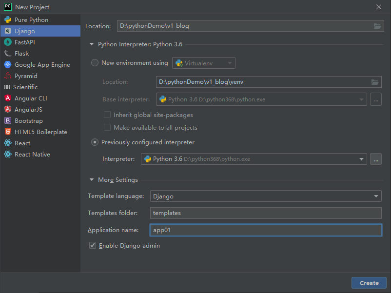
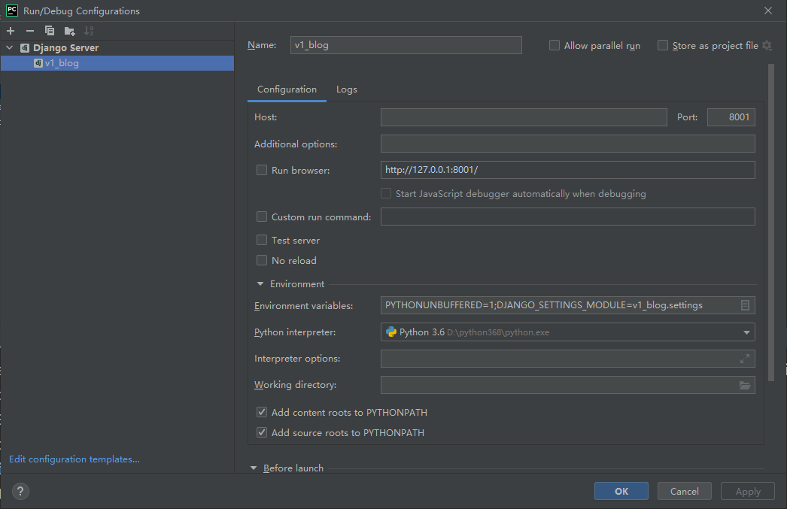
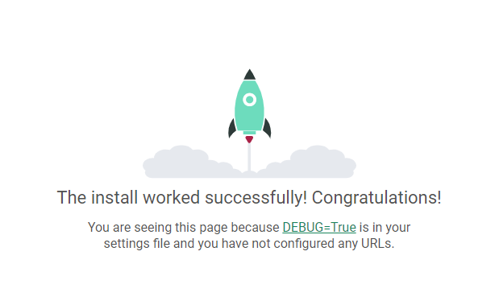

# 项目搭建

```
python3.6.8
django3.2.10
mysql5.7.26   实际是mysql5.6.50  # 会有一些区别，主要是有些类型没有，会在开发过程中进行规避
pycharm2021.3.3 专业版
```








引入pymysql

在app下的 init中

```python
import pymysql 
pymysql.install_as_MySQLdb()
```


settings.py

```python
# 用户扩展第三张表
# 用户创建第三张表
AUTH_USER_MODEL = 'app01.UserInfo'

DATABASES = {
    'default': {
        'ENGINE': 'django.db.backends.mysql',
        'NAME':'v1_blog', # 数据库名称
        'USER':'root', #用户名
        'PASSWORD':'root', # 密码
        'HOST':'127.0.0.1',
        'PORT':3306
    }
}

create database v1_blog

python manage.py makemigrations
python manage.py migrate      
```


scss的使用条件

```scss
1.安装node.js
2.安装scss
3.勾选配置
```


