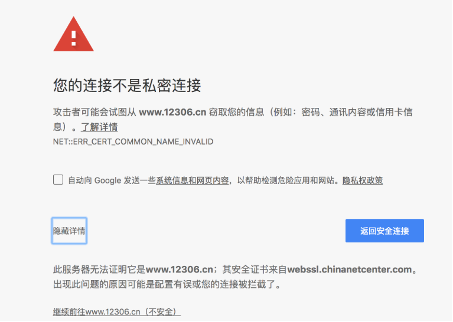

# requests基础

- requests模块的介绍：能够帮助我们发起请求获取响应
- requests的基本使用：`requests.get(url)`
- 以及response常见的属性：
  - `response.text` 响应体 str类型
  - `respones.content` 响应体 bytes类型
  - `response.status_code` 响应状态码
  - `response.request.headers` 响应对应的请求头
  - `response.headers` 响应头
  - `response.request._cookies` 响应对应请求的cookie
  - `response.cookies` 响应的cookie（经过了set-cookie动作）
- 掌握 requests.text和content的区别：text返回str类型，content返回bytes类型
- 掌握 解决网页的解码问题：
  - `response.content.decode()` 更推荐使用
  - `response.content.decode("UTF-8")`
  - `response.text`
- 掌握 requests模块发送带headers的请求：`requests.get(url, headers={})`
- 掌握 requests模块发送带参数的get请求：`requests.get(url, params={})`

## 多进程案例

```python
import os.path
import random
import time
from multiprocessing import Pool
import requests
from lxml import etree


headers = {
    'User-Agent': 'Mozilla/5.0 (Windows NT 6.1; Win64; x64) AppleWebKit/537.36 (KHTML, like Gecko) Chrome/104.0.0.0 Safari/537.36'
}

def get_img_src(page):
    '''
    抓取页面的图片的src
    :return:
    '''
    for i in range(1, page+1):
        url = f'https://www.pkdoutu.com/photo/list/?page={i}'
        print(f'抓取{url}页数据')
        res = requests.get(url, headers=headers)
        res.encoding = res.apparent_encoding
        tree = etree.HTML(res.text)
        # 抓取图片
        img_list = tree.xpath('//img[@referrerpolicy="no-referrer"]/@data-original')
        yield img_list

def download_img(url):
    '''
    下载图片
    :return:
    '''
    time.sleep(random.uniform(0, 1))
    img_res = requests.get(url, headers=headers)
    img_name = url.split('_')[-1]  # 通过图片url进行拆分，拿到图片名称和后缀
    path = 'img'
    # 判断路径是否存在，不存在则创建
    if not os.path.exists(path):
        os.mkdir(path)
    # 写入到文件中
    with open(os.path.join(path, img_name), 'wb') as f:
        f.write(img_res.content)


if __name__ == '__main__':
    pool = Pool()
    # 通过生成器get_img_src返回图片列表
    for url_list in get_img_src(2):
        for url in url_list:
            # 循环加入进程池
            pool.apply_async(download_img, args=(url, ))
    pool.close()
    pool.join()
    print('over')

```


## 多线程案例

### threading创建多任务

```python
import threading
import time


def run(i):
    print('子线程开始', threading.current_thread().name)
    print(f'{i}开始干活')
    time.sleep(3)
    print(f'{i}干活结束')


if __name__ == '__main__':
    t1 = time.time()
    # 存储线程对象
    t_list = []
    # 并发执行5个线程
    for i in range(1, 6):
        thr = threading.Thread(target=run, args=(i, ))
        # 线程对象添加到列表中
        t_list.append(thr)
    # 循环开启子线程      
    for t in t_list:
        t.start()
    # 循环阻塞子线程       为什么要搞在外面2个循环？ 因为整体开启和整体阻塞必须分开
    for i in t_list:
        i.join()
    print('over')
    print(time.time() - t1)


```

### 多线程解决数据错乱问题(锁)

多线程中，所有变量都由所有线程共享。所以，任何一个变量都可以被任意一个线程修改，因此，线程之间共享数

据最大的危险在于多个线程同时修改一个变量，容易把内容改乱了。

解决办法：

LOCK锁

概述

Lock锁是线程模块中的一个类，有两个主要方法：acquire()和release() 当调用acquire()方法时，它锁定锁的执行并阻塞锁的执行，直到其他线程调用release()方法将其设置为解锁状态。锁帮助我们有效地访问程序中的共享资源，以防止数据损坏，它遵循互斥，因为一次只能有一个线程访问特定的资源。


创建一个锁

```python
lock = threading.Lock()
lock.acquire()   #进行锁定  锁定成功返回True
lock.release()    #进行解锁
```

- 解决资源混乱

```python
import threading

Lock = threading.Lock()
i = 1
def fun1():
    global i
    if Lock.acquire():  # 判断是否上锁  锁定成功
        for x in range(1000000):
            i += x
            i -= x
        Lock.release()
    print('fun1-----', i)

def fun2():
    global i
    if Lock.acquire():  # 判断是否上锁  锁定成功
        for x in range(1000000):
            i += x
            i -= x
        Lock.release()
    print('fun2----', i)
  t1 = threading.Thread(target=fun1)
  t2 = threading.Thread(target=fun2)
  t1.start()
  t2.start()
  t1.join()
  t2.join()
  print('mian----',i)
```

- 简洁办法（更常用）

```python
import threading

i = 0
lock = threading.Lock()

def sum1():
    global i
    with lock:
        for x in range(1000000):
            i += x
            i -= x
    print('sum1', i)

def sum2():
    global i
    with lock:
        for x in range(1000000):
            i += x
            i -= x
    print('sum2', i)

if __name__ == '__main__':
    thr1 = threading.Thread(target=sum1)
    thr2 = threading.Thread(target=sum2)
    thr1.start()
    thr2.start()
    thr1.join()
    thr2.join()
    print('over')
```

### 定时线程Timer

- 概述

  Timer是Thread的子类，可以指定时间间隔后在执行某个操作

- 使用

  ```python
  import threading
  
  def go():
      print("走我了")
  
  # t = threading.Timer(秒数,函数名)
  t = threading.Timer(3,go)
  t.start()
  print('我是主线程的代码')
  ```

### 线程池ThreadPoolExecutor 

- 模**块**

  concurrent.futures

- **导入**  Executor[ɪɡˈzekjətər]

  ```python
  from concurrent.futures import ThreadPoolExecutor
  ```

- **方法**

  - submit(fun[, args])  传入放入线程池的函数以及传参
  - map(fun[, iterable_args])  统一管理

  **区别**：

  - submit与map参数不同  submit每次都需要提交一个目标函数和对应参数 map只需要提交一次目标函数 目标函数的参数 放在一个可迭代对象（列表、字典...）里就可以

  - 我的总结

    - submit 就是只能一次1个参数。所以一般会使用列表推导式 

      - [pool.submit(function,i) for i in 参数列表]

      - 当然也可以使用for循环增减可读性

        ```python
         # 逐一传参扔进线程池
            for i in name_list:
                pool.submit(go, i)
        ```

        

    - map 就是可以一次性传入多个参数，参数个数表示任务数量
      - pool.map(函数名,[参数列表])

**使用**

```python
from concurrent.futures import ThreadPoolExecutor
import time
# import threadpool
#线程池 统一管理 线程

def go(str):
    print("hello",str)
    time.sleep(2)
name_list = ["lucky","卢yuan凯","姚青","刘佳俊","何必喆"]
pool = ThreadPoolExecutor(5)  #控制线程的并发数
```

- 获得返回值

  - submit要配合as_completed()

    ```python
    import random
    from concurrent.futures import ThreadPoolExecutor, as_completed
    import time
    # import threadpool
    #线程池 统一管理 线程
    
    def go(str):
        print("hello", str)
        time.sleep(random.randint(1, 4))
        return str
    name_list = ["lucky","卢yuan凯","姚青","刘佳俊","何必喆"]
    pool = ThreadPoolExecutor(5)  #控制线程的并发数
    all_task = [pool.submit(go, i) for i in name_list]
    # 统一放入进程池使用
    for future in as_completed(all_task):
        print("finish the task")
        obj_data = future.result()
        print("obj_data is ", obj_data)
    ```

  - map就很简

    ```python
    for result in pool.map(go, name_list):
        print("task:{}".format(result))
    ```

- 使用wait等待线程池执行完后再继续执行

```python
from concurrent.futures import ThreadPoolExecutor, wait
import time

# 参数times用来模拟下载的时间
def down_video(times):
    time.sleep(times)
    print("down video {}s finished".format(times))
    return times
executor = ThreadPoolExecutor(max_workers=2)
#通过submit函数提交执行的函数到线程池中，submit函数立即返回，不阻塞
task1 = executor.submit(down_video, (3))
task2 = executor.submit(down_video, (1))
# done方法用于判定某个任务是否完成
print("任务1是否已经完成：", task1.done())
time.sleep(4)
print(wait([task1, task2]))
print('wait')
print("任务1是否已经完成：", task1.done())
print("任务1是否已经完成：", task2.done())
#result方法可以获取task的执行结果
print(task1.result())
```

### 抓取图片案例

```python
import requests
from lxml import etree
from concurrent.futures import ThreadPoolExecutor


def get_page_source(url):
    resp = requests.get(url)
    resp.encoding = 'utf-8'
    return resp.text


def parse_html(html):
    try:
        tree = etree.HTML(html)
        trs = tree.xpath("//table/tbody/tr")[1:]
        result = []
        for tr in trs:
            year = tr.xpath("./td[2]//text()")
            year = year[0] if year else ""
            name = tr.xpath("./td[3]//text()")
            name = name[0] if name else ""
            money = tr.xpath("./td[4]//text()")
            money = money[0] if money else ""
            d = (year, name, money)
            if any(d):
                result.append(d)
        return result
    except Exception as e:
        print(e)  # 调bug专用


def download_one(url, f):
    page_source = get_page_source(url)
    data = parse_html(page_source)
    for item in data:
        f.write(",".join(item))
        f.write("\n")


def main():
    f = open("movie.csv", mode="w", encoding='utf-8')
    lst = [str(i) for i in range(1994, 2022)]
    with ThreadPoolExecutor(10) as t:
        # 方案一
        # for year in lst:
        #     url = f"http://www.boxofficecn.com/boxoffice{year}"
        #     # download_one(url, f)
        #     t.submit(download_one, url, f)

        # 方案二
        t.map(download_one, (f"http://www.boxofficecn.com/boxoffice{year}" for year in lst), (f for i in range(len(lst))))


if __name__ == '__main__':
    main()
```

## 进程VS线程

- 多任务的实现原理

  首先，要实现多任务，通常我们会设计Master-Worker模式，Master负责分配任务，Worker负责执行任务，因此，多任务环境下，通常是一个Master，多个Worker。

  如果用多进程实现Master-Worker，主进程就是Master，其他进程就是Worker。

  如果用多线程实现Master-Worker，主线程就是Master，其他线程就是Worker。

- 多进程

  主进程就是Master，其他进程就是Worker

  - 优点

    稳定性高：多进程模式最大的优点就是稳定性高，因为一个子进程崩溃了，不会影响主进程和其他子进程。（当然主进程挂了所有进程就全挂了，但是Master进程只负责分配任务，挂掉的概率低）著名的Apache最早就是采用多进程模式。

  - 缺点

    创建进程的代价大：在Unix/Linux系统下，用fork调用还行，在Windows下创建进程开销巨大

    操作系统能同时运行的进程数也是有限的：在内存和CPU的限制下，如果有几千个进程同时运行，操作系统连调度都会成问题

- 多线程

  主线程就是Master，其他线程就是Worker

  - 优点

    多线程模式通常比多进程快一点，但是也快不到哪去

    在Windows下，多线程的效率比多进程要高

  - 缺点

    任何一个线程挂掉都可能直接造成整个进程崩溃：所有线程共享进程的内存。在Windows上，如果一个线程执行的代码出了问题，你经常可以看到这样的提示：“该程序执行了非法操作，即将关闭”，其实往往是某个线程出了问题，但是操作系统会强制结束整个进程

- 计算密集型 vs IO密集型

  - 计算密集型（多进程适合计算密集型任务）

    要进行大量的计算，消耗CPU资源，比如计算圆周率、对视频进行高清解码等等，全靠CPU的运算能力。这种计算密集型任务虽然也可以用多任务完成，但是任务越多，花在任务切换的时间就越多，CPU执行任务的效率就越低，所以，要最高效地利用CPU，计算密集型任务同时进行的数量应当等于CPU的核心数

  - IO密集型 （线程适合IO密集型任务）

    涉及到网络、磁盘IO的任务都是IO密集型任务，这类任务的特点是CPU消耗很少，任务的大部分时间都在等待IO操作完成（因为IO的速度远远低于CPU和内存的速度）。对于IO密集型任务，任务越多，CPU效率越高，但也有一个限度。常见的大部分任务都是IO密集型任务，比如Web应用

- GIL

  多线程存在GIL锁，同一时刻只能有一条线程执行；在多进程中，每一个进程都有独立的GIL，不会发生GIL冲突；但在这个例子中，爬虫属于IO密集型，多进程适用于CPU计算密集型，所以用时较长，速度慢于多线程并发。

## requests的post使用

```python
import requests
import json

headers = {"User-Agent": "Mozilla/5.0 (Windows NT 10.0; Win64; x64) AppleWebKit/537.36 (KHTML, like Gecko) Chrome/54.0.2840.99 Safari/537.36"}

url = 'https://ifanyi.iciba.com/index.php?c=trans&m=fy&client=6&auth_user=key_ciba&sign=99730f3bf66b2582'

data = {
    'from': 'zh',
    'to': 'en',
    'q': 'lucky 是一个帅气的老师'
}

res = requests.post(url, headers=headers, data=data)
# print(res.status_code)

# 返回的是json字符串 需要在进行转换为字典
data = json.loads(res.content.decode('UTF-8'))
# print(type(data))
print(data)
print(data['content']['out'])
```


## 代理的使用

- proxies的形式：字典

- 例如：

  ```json
  # 用到的库
  import requests
  # 写入获取到的ip地址到proxy
  # 一个ip地址
  proxy = {
      'http':'http://221.178.232.130:8080'
  }
  """
  # 多个ip地址
  proxy = [
    {'http':'http://221.178.232.130:8080'},
    {'http':'http://221.178.232.130:8080'}
  ]
  import random
  proxy = random.choice(proxy)
  """
  
  # 使用代理
  proxy = {
      'http': 'http://58.20.184.187:9091'
  }
  
  result = requests.get("http://httpbin.org/ip", proxies=proxy)
  
  print(result.text)
  ```


根据代理ip的匿名程度，代理IP可以分为下面三类：

- 透明代理(Transparent Proxy)：透明代理的意思是客户端根本不需要知道有代理服务器的存在，但是它传送的仍然是真实的IP。使用透明代理时，对方服务器是可以知道你使用了代理的，并且他们也知道你的真实IP。你要想隐藏的话，不要用这个。透明代理为什么无法隐藏身份呢?因为他们将你的真实IP发送给了对方服务器，所以无法达到保护真实信息。
- 匿名代理(Anonymous Proxy)：匿名代理隐藏了您的真实IP，但是向访问对象可以检测是使用代理服务器访问他们的。会改变我们的请求信息，服务器端有可能会认为我们使用了代理。不过使用此种代理时，虽然被访问的网站不能知道你的ip地址，但仍然可以知道你在使用代理，当然某些能够侦测ip的网页也是可以查到你的ip。（https://wenku.baidu.com/view/9bf7b5bd3a3567ec102de2bd960590c69fc3d8cf.html）
- 高匿代理(Elite proxy或High Anonymity Proxy)：高匿名代理不改变客户机的请求，这样在服务器看来就像有个真正的客户浏览器在访问它，这时客户的真实IP是隐藏的，完全用代理服务器的信息替代了您的所有信息，就象您就是完全使用那台代理服务器直接访问对象，同时服务器端不会认为我们使用了代理。IPDIEA覆盖全球240＋国家地区ip高匿名代理不必担心被追踪。

在使用的使用，毫无疑问使用高匿代理效果最好

从请求使用的协议可以分为：

- http代理
- https代理
- socket代理等

不同分类的代理，在使用的时候需要根据抓取网站的协议来选

发送对于url参数请求的2种方式

比如 'https://www.baidu.com/s?wd=python'

1 利用params参数发送带参数的请求

```python
# 最后有没有问号结果都一样
url = 'https://www.baidu.com/s?'

# 请求参数是一个字典 即wd=python
kw = {'wd': 'python'}

# 带上请求参数发起请求，获取响应
response = requests.get(url, headers=headers, params=kw)

# 当有多个请求参数时，requests接收的params参数为多个键值对的字典，比如 '?wd=python&a=c'-->{'wd': 'python', 'a': 'c'}

print(response.content)
```

2直接对`https://www.baidu.com/s?wd=python

```python
# 方式二：直接发送带参数的url的请求
import requests

headers = {"User-Agent": "Mozilla/5.0 (Windows NT 10.0; Win64; x64) AppleWebKit/537.36 (KHTML, like Gecko) Chrome/54.0.2840.99 Safari/537.36"}

url = 'https://www.baidu.com/s?wd=python'

# kw = {'wd': 'python'}

# url中包含了请求参数，所以此时无需params
response = requests.get(url, headers=headers)
```


## 携带cookie

## 爬虫中使用cookie的利弊

- 带上cookie的好处
  - 能够访问登录后的页面
  - 能够实现部分反反爬
- 带上cookie的坏处
  - 一套cookie往往对应的是一个用户的信息，请求太频繁有更大的可能性被对方识别为爬虫
  - 那么上面的问题如何解决 ?使用多个账号

## requests处理cookie的方法

使用requests处理cookie有三种方法：

> 1.cookie字符串放在headers中

```python
headers = {
"User-Agent":"Mozilla/5.0 (Macintosh; Intel Mac OS X 10_13_4) AppleWebKit/537.36 (KHTML, like Gecko) Chrome/65.0.3325.181 Safari/537.36",
"Cookie":" Pycharm-26c2d973=dbb9b300-2483-478f-9f5a-16ca4580177e; Hm_lvt_98b9d8c2fd6608d564bf2ac2ae642948=1512607763; Pycharm-26c2d974=f645329f-338e-486c-82c2-29e2a0205c74; _xsrf=2|d1a3d8ea|c5b07851cbce048bd5453846445de19d|1522379036"}

requests.get(url,headers=headers)
```


>  2.把cookie字典放传给请求方法的cookies参数接收

```python
cookies = {"cookie的name":"cookie的value"}
requests.get(url,headers=headers,cookies=cookies)
```


>  3.使用requests提供的session模块

之前使用手动的方式使用cookie，那么有没有更好的方法在requets中处理cookie呢？

requests 提供了一个叫做session类，来实现客户端和服务端的`会话保持`

会话保持有两个内涵：

- 保存cookie，下一次请求会带上前一次的cookie
- 实现和服务端的长连接，加快请求速度

***使用方法***

```python
session = requests.session()
response = session.get(url,headers)
```

session实例在请求了一个网站后，对方服务器设置在本地的cookie会保存在session中，下一次再使用session请求对方服务器的时候，会带上前一次的cookie

## 注意

cookie有过期时间 ，所以直接复制浏览器中的cookie可能意味着下一程序继续运行的时候需要替换代码中的cookie，对应的我们也可以通过一个程序专门来获取cookie供其他程序使用；当然也有很多网站的cookie过期时间很长，这种情况下，直接复制cookie来使用更加简单

## requests中cookirJar的处理方法

> 使用request获取的resposne对象，具有cookies属性，能够获取对方服务器设置在本地的cookie，但是如何使用这些cookie呢？

### 1.1 方法介绍

1. response.cookies是CookieJar类型
2. 使用requests.utils.dict_from_cookiejar，能够实现把cookiejar对象转化为字典

### 1.2 方法展示

```python
import requests

url = "http://www.baidu.com"
#发送请求，获取resposne
response = requests.get(url)
print(type(response.cookies))

#使用方法从cookiejar中提取数据  等同于  dict(response.cookies)
cookies = requests.utils.dict_from_cookiejar(response.cookies)
print(cookies)
```

输出为:

```python
<class 'requests.cookies.RequestsCookieJar'>
{'BDORZ': '27315'}
```

##### 注意：

在前面的requests的session类中，我们不需要处理cookie的任何细节，如果有需要，我们可以使用上述方法来解决

## requests处理证书错误

经常我们在网上冲浪时，经常能够看到下面的提示：




出现这个问题的原因是：ssl的证书不安全导致

那么如果在代码中请求会怎么样呢？

```python
import requests

url = "https://www.12306.cn/mormhweb/"
response = requests.get(url)
```

返回证书错误，如下：

```
ssl.CertificateError ...
```

* ***解决方案***

为了在代码中能够正常的请求，我们修改添加一个参数

```python
import requests

url = "https://www.12306.cn/mormhweb/"
response = requests.get(url, verify=False)
```


## 请求超时的使用

> 在平时网上冲浪的过程中，我们经常会遇到网络波动，这个时候，一个请求等了很久可能任然没有结果
>
> 在爬虫中，一个请求很久没有结果，就会让整个项目的效率变得非常低，这个时候我们就需要对请求进行强制要求，让他必须在特定的时间内返回结果，否则就报错

##### 3.1 超时参数使用方法如下：

```python
response = requests.get(url,timeout=3)
```

通过添加timeout参数，能够保证在3秒钟内返回响应，否则会报错

##### 注意：

这个方法还能够拿来检测代理ip的质量，如果一个代理ip在很长时间没有响应，那么添加超时之后也会报错，对应的这个ip就可以从代理ip池中删除

# xpath语法

XPath 是一门在 XML 文档中查找信息的语言。XPath 用于在 XML 文档中通过元素和属性进行导航。

- **路径表达式**

  | 表达式 | 描述                                                       |
  | :----- | :--------------------------------------------------------- |
  | /      | 从根节点选取。                                             |
  | //     | 从匹配选择的当前节点选择文档中的节点，而不考虑它们的位置。 |
  | ./     | 当前节点再次进行xpath                                      |
  | @      | 选取属性。                                                 |

  **实例**

  在下面的表格中，我们已列出了一些路径表达式以及表达式的结果：

  | 路径表达式              | 结果                                                         |
  | :---------------------- | :----------------------------------------------------------- |
  | /html                   | 选取根元素。注释：假如路径起始于正斜杠( / )，则此路径始终代表到某元素的绝对路径！ |
  | //li                    | 选取所有li 子元素，而不管它们在文档中的位置。                |
  | //ul//li                | 选择属于 ul元素的后代的所有 li元素，而不管它们位于 ul之下的什么位置。 |
  | 节点对象.xpath('./div') | 选择当前节点对象里面的第一个div节点                          |
  | //@href                 | 选取名为 href 的所有属性。                                   |

- **谓语（Predicates）**

  谓语用来查找某个特定的节点或者包含某个指定的值的节点。

  谓语被嵌在方括号中。

  **实例**

  在下面的表格中，我们列出了带有谓语的一些路径表达式，以及表达式的结果：

  | 路径表达式                         | 结果                                                         |
  | :--------------------------------- | :----------------------------------------------------------- |
  | /ul/li[1]                          | 选取属于 ul子元素的第一个 li元素。                           |
  | /ul/li[last()]                     | 选取属于 ul子元素的最后一个 li元素。                         |
  | /ul/li[last()-1]                   | 选取属于 ul子元素的倒数第二个 li元素。                       |
  | //ul/li[position()<3]              | 选取最前面的两个属于 ul元素的子元素的 li元素。               |
  | //a[@title]                        | 选取所有拥有名为 title的属性的 a元素。                       |
  | //a[@title='xx']                   | 选取所有 a元素，且这些元素拥有值为 xx的 title属性。          |
  | //a[@title>10]   `> < >= <= !=`    | 选取 a元素的所有 title元素，且其中的 title元素的值须大于 10。 |
  | /bookstore/book[price>35.00]/title | 选取 bookstore 元素中的 book 元素的所有 title 元素，且其中的 price 元素的值须大于 35.00。 |

- **选取未知节点**

  XPath 通配符可用来选取未知的 XML 元素。

  | 通配符 | 描述                                               |
  | :----- | :------------------------------------------------- |
  | *      | 匹配任何元素节点。  一般用于浏览器copy xpath会出现 |
  | @*     | 匹配任何属性节点。                                 |
  | node() | 匹配任何类型的节点。                               |

  **实例**

  在下面的表格中，我们列出了一些路径表达式，以及这些表达式的结果：

  | 路径表达式  | 结果                            |
  | :---------- | :------------------------------ |
  | /ul/*       | 选取 ul元素的所有子元素。       |
  | //*         | 选取文档中的所有元素。          |
  | //title[@*] | 选取所有带有属性的 title 元素。 |
  | //node()    | 获取所有节点                    |

  **选取若干路径**

  通过在路径表达式中使用“|”运算符，您可以选取若干个路径。

  **实例**

  在下面的表格中，我们列出了一些路径表达式，以及这些表达式的结果：

  | 路径表达式                       | 结果                                                         |
  | :------------------------------- | :----------------------------------------------------------- |
  | //book/title \| //book/price     | 选取 book 元素的所有 title 和 price 元素。                   |
  | //title \| //price               | 选取文档中的所有 title 和 price 元素。                       |
  | /bookstore/book/title \| //price | 选取属于 bookstore 元素的 book 元素的所有 title 元素，以及文档中所有的 price 元素。 |

- 逻辑运算

  - 查找所有id属性等于head并且class属性等于s_down的div标签

    ```python
    //div[@id="head" and @class="s_down"]
    ```

  - 选取文档中的所有 title 和 price 元素。

    ```python
    //title | //price
    ```

    注意: “|”两边必须是完整的xpath路径

- 属性查询

  - 查找所有包含id属性的div节点

    ```python
    //div[@id]
    ```

  - 查找所有id属性等于maincontent的div标签

    ```python
    //div[@id="maincontent"]
    ```

  - 查找所有的class属性

    ```python
    //@class
    ```

  - //@attrName

    ```python
    //li[@name="xx"]//text()  # 获取li标签name为xx的里面的文本内容
    ```

- 获取第几个标签  索引从1开始

  ```python
  tree.xpath('//li[1]/a/text()')  # 获取第一个
  tree.xpath('//li[last()]/a/text()')  # 获取最后一个
  tree.xpath('//li[last()-1]/a/text()')  # 获取倒数第二个
  ```

- 模糊查询

  - 查询所有id属性中包含he的div标签

    ```python
    //div[contains(@id, "he")]
    ```

  - 查询所有id属性中包以he开头的div标签

    ```python
    //div[starts-with(@id, "he")]
    ```

- 内容查询

  查找所有div标签下的直接子节点h1的内容

  ```python
  //div/h1/text()
  ```

- 属性值获取

  ```python
  //div/a/@href   获取a里面的href属性值
  ```

- 获取所有

  ```python
  //*  #获取所有
  //*[@class="xx"]  #获取所有class为xx的标签
  ```

- 获取节点内容转换成字符串

  ```python
  c = tree.xpath('//li/a')[0]
  result=etree.tostring(c, encoding='utf-8')
  print(result.decode('UTF-8'))
  ```


# 一些坑

## xpath解析出编码错误

报错信息

```log
ValueError: Unicode strings with encoding declaration are not supported. Please use bytes input or XML fragments without declaration.

```

实际上我指定了编码，但是这种方式仍然会报错

```python
import requests
from lxml import etree
url = "http://bbs.chinaunix.net/"
headers = {
    'User-Agent':'Mozilla/5.0 (Linux; Android 6.0; Nexus 5 Build/MRA58N) AppleWebKit/537.36 (KHTML, like Gecko) Chrome/125.0.0.0 Mobile Safari/537.36'
}

res = requests.get(url=url,headers=headers)
text = res.content.decode('utf-8')
tree = etree.HTML(text)
print(tree)
```

但是换一种方式就解决了,使用encode('utf-8')

后来知道他们的区别

decode用于将非Unicode编码的字符串转换为Unicode编码，而encode用于将Unicode编码的字符串转换为非Unicode编码。

*encode表示的是编码,decode表示的是解码*

所以用decode在这里更合适

解决代码

```python
import requests
from lxml import etree
url = "http://bbs.chinaunix.net/"
headers = {
    'User-Agent':'Mozilla/5.0 (Linux; Android 6.0; Nexus 5 Build/MRA58N) AppleWebKit/537.36 (KHTML, like Gecko) Chrome/125.0.0.0 Mobile Safari/537.36'
}

res = requests.get(url=url,headers=headers)
text = res.content.decode('utf-8').encode('utf-8')
tree = etree.HTML(text)
print(tree)
```

再次发现原因

我发现我换了一个请求头也解决了，可能是请求头的参数问题导致需要解码

```python
#我的
headers = {
    'User-Agent':'Mozilla/5.0 (Linux; Android 6.0; Nexus 5 Build/MRA58N) AppleWebKit/537.36 (KHTML, like Gecko) Chrome/125.0.0.0 Mobile Safari/537.36'
}
#正确的
headers = {
    'User-Agent': 'Mozilla/5.0 (Macintosh; Intel Mac OS X 10_15_7) AppleWebKit/537.36 (KHTML, like Gecko) Chrome/103.0.0.0 Safari/537.36'
}
```

原来是因为我伪装成手机端了，emmmmm

# 一些技巧

## 自动获取网页编码

使用[爬虫]()的时候，时常被编码问题困扰，可以通过打开检查，查看网页的源代码

打开head标签，能看到苹果网页是用[utf-8编码](https://so.csdn.net/so/search?q=utf-8编码&spm=1001.2101.3001.7020)格式  ，电影天堂的编码是[gb2312](https://so.csdn.net/so/search?q=gb2312&spm=1001.2101.3001.7020)

但还有一个方法，就是可以通过res.apparent_encoding查看是用什么标准编码的

所以这也是为什么爬虫里大多数会写 

**res.encoding = res.apparent_encoding**

就不用考虑网页文字编码的问题了

## 队列的使用queue

- 导入队列模块

  import queue

- 概述

  queue是python标准库中的线程安全的队列（FIFO）实现,提供了一个适用于多线程编程的先进先出的数据结构，即队列，用来在生产者和消费者线程之间的信息传递

- 基本FIFO队列

  queue.Queue(maxsize=0)

  FIFO即First in First Out,先进先出。Queue提供了一个基本的FIFO容器，使用方法很简单,**maxsize是个整数**，指明了队列中能存放的数据个数的上限。一旦达到上限，插入会导致阻塞，直到队列中的数据被消费掉。如果**maxsize小于或者等于0**，队列大小没有限制。

  举个栗子：

  ```python
    import queue
  
    q = queue.Queue()
  
    for i in range(5):
        q.put(i)
  
    while not q.empty():
        print q.get()
  ```

- 一些常用方法 

  - task_done()

    ​	意味着之前入队的一个任务已经完成。由队列的消费者线程调用。每一个get()调用得到一个任务，接下来的task_done()调用告诉队列该任务已经处理完毕。

    ​	如果当前一个join()正在阻塞，它将在队列中的所有任务都处理完时恢复执行（即每一个由put()调用入队的任务都有一个对应的task_done()调用）。

  - join()

    阻塞调用线程，直到队列中的所有任务被处理掉。

    只要有数据被加入队列，未完成的任务数就会增加。当消费者线程调用task_done()（意味着有消费者取得任务并完成任务），未完成的任务数就会减少。当未完成的任务数降到0，join()解除阻塞。

  - put(item[, block[, timeout]])

    将item放入队列中。

    - 如果可选的参数block为True且timeout为空对象（默认的情况，阻塞调用，无超时）。
    - 如果timeout是个正整数，阻塞调用进程最多timeout秒，如果一直无空空间可用，抛出Full异常（带超时的阻塞调用）。
    - 如果block为False，如果有空闲空间可用将数据放入队列，否则立即抛出Full异常
    - 其非阻塞版本为`put_nowait`等同于`put(item, False)`

  - get([block[, timeout]])

    从队列中移除并返回一个数据。block跟timeout参数同`put`方法

    其非阻塞方法为 `get_nowait()` 相当与 `get(False)`

  - empty()

    如果队列为空，返回True,反之返回False

### 