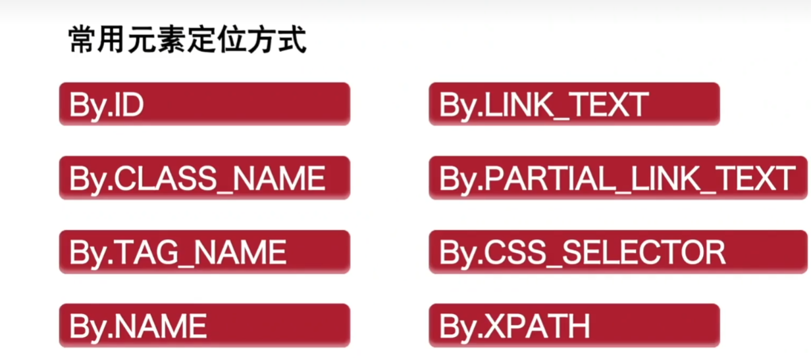
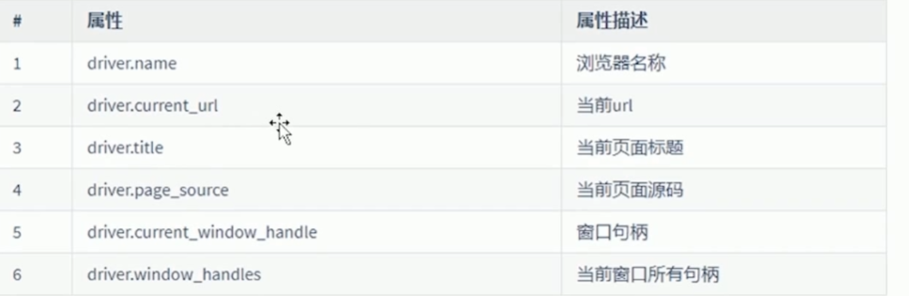
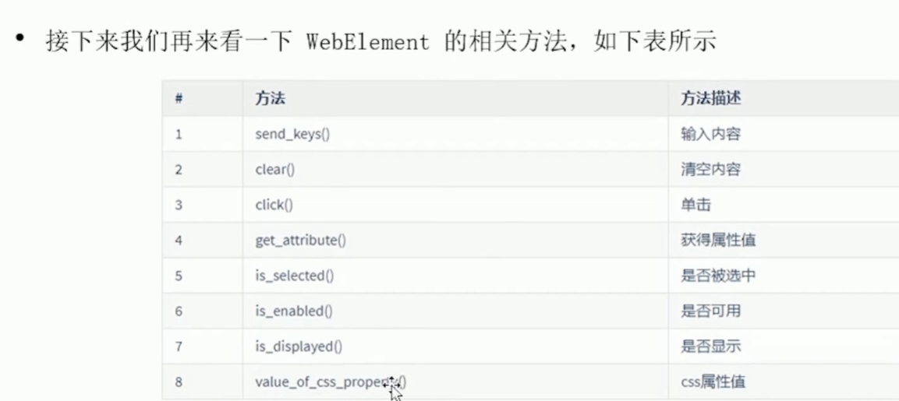

# Hello，Wrold

```python
import time
from selenium import webdriver
from selenium.webdriver.common.by import By
# 定义一个driver变量，实例化浏览器
driver = webdriver.Chrome()
# 使用get方法，访问网址
driver.get('https://www.bilibili.com/')
# 1.找到输入框的位置，输入软件测试老白
driver.find_element(By.CLASS_NAME,'nav-search-input').send_keys('乃荣') # send_keys 发送字符串
# 2.找到搜索框的位置，点击搜索
driver.find_element(By.CLASS_NAME,'nav-search-btn').click() # click 点击
time.sleep(2)
driver.close()
```

## 元素定位



```python
By.ID   
By.XPATH
By.CLASS_NAME
By.CSS_SELECTOR
By.NAME
By.TAG_NAME
```

如果CLASS_NAME中有多组数据的话，可以当做列表来进行切片索引获取

- LINK_TEXT: 定义a标签里面的文本
- PARTIAL_LINK_TEXT:包含 某文本的，搜索更模糊

## derver属性



## element方法




