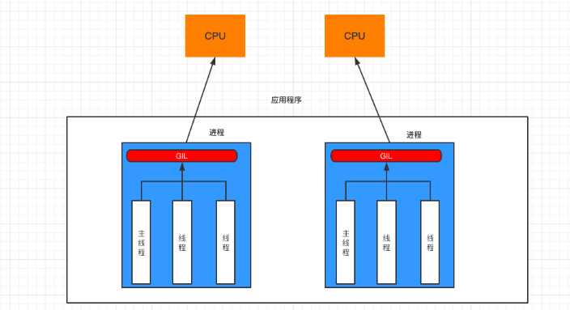

# 设计模式

设计模式是一种编程套路，可以极大方便程序的开发

最常见、最经典的设计模式就是 面向对象

除了面向对象外，还有许多的设计模式，比如

- 单例、工厂模式
- 建造者、责任链、状态、备忘录、解释器、访问者、观察者、中介、模版、代理模式
- 等等模式

本次学习主要学习单例模式和工程模式

## 单例模式

> 原生问题：
>
> ​        在Python中对一个类进行 多次不同的实例时，每个实例的内存地址是不一样的，是完全独立的对象。在有些场景中，我们需要一个类无论获取多少次实例，都是仅仅同一个具体的实例，可以用以节省内存开销。比如某些工具类，仅需要1个类的实例即可在各处使用

单例模式（Singleton Pattern）是一种常见的软件设计模式，该模式的主要作用是确保一个类只有1个实例存在

- 定义：保证一个类只有一个实例，并提供一个访问它的全局访问点
- 使用场景：当一个类只有一个实例，而客户可以从一个众所周知的访问点访问它时

> 代码

```py
<单例.py>
class strTools:
    def __init__(self):
        self._name = "工具"

    @property
    def name(self):
        return self._name
        
p = strTools()

<测试.py>
from 单例 import p
a = p
b = p
print(id(p))
print(id(a))
print(id(b))

```

> 结果
> 1660247401696
> 1660247401696
> 1660247401696

## 工厂模式


# 并发编程

## 进程和线程

> 进程
>
> 	- 是计算机资源分配的最小单元（进程为线程提供资源）
> 	- 一个进程可以有多个线程，同一个进程的线程互相共享资源
> 	- 进程的系统开销更大，每一个进程必须独立分配内存空间
>
> 线程
>
> - 是进程实际工作的最小单元
>
> - 是cpu调度的最小单元
> - 线程的开销相对更小，它们拥有独立的堆栈空间，但是数据段是共享的，所以线程的切换速度要比进程快的，但是安全性不如进程，因为进程有一个独立的空间

。操作系统中可以运行多个进程，即多进程运行

一个进程内可以运行多个线程，即多线程运行

从通信机制来说 线程更加方便

- 什么时候使用进程？
  - 如果需要稳定的安全状态，选用进程

- 什么时候使用线程
  - 如果需要频繁的创建和销毁，因为这2个动作代价更小
  - 线程的切换速度更快，如果需要大量的计算频繁的切换时用线程
  - 如果需要并行的操作，需要速度，线程更好

- 多线程应用场景
  - 高并发的时候，比如有2个任务task1和task2，使用多线程可以同时去执行task1和task2
- 多线程的优缺点
  - 优点
    - 可以把占据时间长的任务放到后台处理，不会影响主线程的使用
    - 可以使整个程序的运行速度更快
  - 缺点
    - 线程速度过多的话会影响性能，因为操作系统有一个上下文切换的概念，每次切换会有时间开销
    - 每个线程会占用内存资源，线程过多，内存资源占用大
    - 程序里面使用多线程可能会给程序带来意想不到的错误，包括对一些共享变量的操作和问题的排查会变得复杂

> 创建线程

```python
import threading

def func(a1,a2,a3):
    pass

t = threading.Thread(target=func,args=(11,22,33))
t.start()
```

> 创建进程

```python
import multiprocessing

def func(a1,a2,a3):
    pass

t = multiprocessing.Process(target=func,args=(11,22,33))
t.start()
```

## GIL锁

GIL, 全局解释器锁，是CPython解释器特有一个玩意，让一个进程中同一个时刻只能有一个线程可以被CPU调用



如果程序想利用 计算机的多核优势，让CPU同时处理一些任务，适合用多进程开发（即使资源开销大）。

如果程序不利用 计算机的多核优势，适合用多线程开发。


常见的程序开发中，计算操作需要使用CPU多核优势，IO操作不需要利用CPU的多核优势

- 计算密集型，用多进程，例如：大量的数据计算【累加计算示例】。
- IO密集型，用多线程，例如：文件读写、网络数据传输【下载抖音视频示例】。

- 累加计算示例（计算密集型）：

  - 串行处理

    ```python
    import time
    
    start = time.time()
    
    result = 0
    for i in range(100000000):
        result += i
    print(result)
    
    end = time.time()
    
    print("耗时：", end - start) # 耗时： 9.522780179977417
    ```

  - 多进程处理

    ```python
    import time
    import multiprocessing
    
    
    def task(start, end, queue):
        result = 0
        for i in range(start, end):
            result += i
        queue.put(result)
    
    
    if __name__ == '__main__':
        queue = multiprocessing.Queue()
    
        start_time = time.time()
    
        p1 = multiprocessing.Process(target=task, args=(0, 50000000, queue))
        p1.start()
    
        p2 = multiprocessing.Process(target=task, args=(50000000, 100000000, queue))
        p2.start()
    
        v1 = queue.get(block=True) #阻塞
        v2 = queue.get(block=True) #阻塞
        print(v1 + v2)
    
        end_time = time.time()
    
        print("耗时:", end_time - start_time) # 耗时: 2.6232550144195557
    ```

    当然，在程序开发中 多线程 和 多进程 是可以结合使用，例如：创建2个进程（建议与CPU个数相同），每个进程中创建3个线程。

```python
import multiprocessing
import threading


# 模拟 创建2个进程 3个线程
def thread_task(): #线程函数  被执行 2*3=6次
    pass


def task(start, end): # 进程函数
    t1 = threading.Thread(target=thread_task)  # 一次线程
    t1.start()

    t2 = threading.Thread(target=thread_task)   # 一次线程
    t2.start()

    t3 = threading.Thread(target=thread_task)   # 一次线程
    t3.start()


if __name__ == '__main__':
    p1 = multiprocessing.Process(target=task, args=(0, 50000000))   # 一次进程
    p1.start()

    p2 = multiprocessing.Process(target=task, args=(50000000, 100000000)) # 一次进程
    p2.start()

```

## 多进程

### 简单使用进程

- 单进程现象

  需要等待代码执行完后再执行下一段代码

  ```python
  import time
  
  def run1():
      while 1:
          print("lucky is a good man")
          time.sleep(1)
  
  def run2():
      while 1:
          print("lucky is a nice man")
          time.sleep(1)
  
  if __name__ == "__main__":
      run1()
      # 不会执行run2()函数，只有上面的run1()结束才能执行run2()
      run2()
  ```

- 启动进程实现多任务

  - multiprocessing模块

    跨平台的多进程模块，提供了一个Process类用来实例化一个进程对象

  - Process类

    作用：创建进程(子进程)

  - _\_name\_\_

    这是 Windows 上多进程的实现问题。在 Windows 上，子进程会自动 import 启动它的这个文件，而在 import 的时候是会执行这些语句的。如果你这么写的话就会无限递归创建子进程报错。所以必须把创建子进程的部分用那个 if 判断保护起来，import 的时候 `__name__` 不是 `__main__` ，就不会递归运行了。

    | 参数   | 说明                             |
    | ------ | -------------------------------- |
    | target | 指定进程执行的任务               |
    | args   | 给进程函数传递的参数，是一个元组 |

    注意：此时进程被创建，但是不会启动进程执行

  - **启动进程实现多任务**

    from multiprocessing import Process

    **创建子进程**

    P = Process(target=run,args=("nice",),name='当前进程名称')

    - target指定 子进程运行的函数
    - args 指定传递的参数 , 是元组类型
    - 启动进程：Process对象.start()

    **获取进程信息**

    - os.getpid()	 获取当前进程id号
    - os.getppid() 获取当前进程的父进程id号
    - multiprocessing.current_process().name   获取当前进程名称

    **父子进程的先后顺序**

    - 默认   父进程的结束不能影响子进程  让父进程等待子进程结束再执行父进程

    - p.join()  阻塞当前进程，直到调用join方法的那个进程执行完，再继续执行当前进程。

    - 全局变量在过个进程中不能共享

      **注意:** 在子线程中修改全局变量时对父进程中的全局变量没有影响

  - 示例代码

    ```python
    import time
    
    from multiprocessing import Process
    
    def run1(name):
        while 1:
            print("%s is a good man"%name)
            time.sleep(1)
    
    def run2():
        while 1:
            print("lucky is a nice man")
            time.sleep(1)
    
    if __name__ == "__main__":
        # 程序启动时的进程称为主进程(父进程)
        
        # 创建进程并启动
        p = Process(target=run1, args=("lucky",))
        p.start()
    
        # 主进程执行run2()函数
        run2()
    ```

- 主进程负责调度

  主进程主要做的是调度相关的工作，一般不负责具体业务逻辑

  ```python
  import time
  from multiprocessing import Process
  
  def run1():
      for i in range(7):
          print("lucky is a good man")
          time.sleep(1)
  
  def run2(name, word):
      for i in range(5):
          print("%s is a %s man"%(name, word))
          time.sleep(1)
  
  if __name__ == "__main__":
      t1 = time.time()
  
      # 创建两个进程分别执行run1、run2
      p1 = Process(target=run1)
      p2 = Process(target=run2, args=("lucky", "cool"))
  
      # 启动两个进程
      p1.start()
      p2.start()
  
      # 查看耗时
      t2 = time.time()
      print("耗时：%.2f"%(t2-t1))
  ```


但是这样会出现一个问题，会发现，主程序直接就运行print(‘耗时) 了，这是因为没有使用join阻塞，导致主进程其他的代码就先运行了。所以可以使用2个join让其等待一下，直到join的进程执行完再继续走主进程

- 主进程的结束不能影响子进程，所以可以等待子进程的结束再结束主进程，等待子进程结束，才能继续运行主进程

  p.join()  *阻塞当前进程，直到调用join方法的那个进程执行完，再继续执行当前进程。*

  ```python
  import time
  from multiprocessing import Process
  
  def run1():
      for i in range(7):
          print("lucky is a good man")
          time.sleep(1)
  
  def run2(name, word):
      for i in range(5):
          print("%s is a %s man"%(name, word))
          time.sleep(1)
  
  if __name__ == "__main__":
      t1 = time.time()
  
      p1 = Process(target=run1)
      p2 = Process(target=run2, args=("lucky", "cool"))
  
      p1.start()
      p2.start()
  
      # 主进程的结束不能影响子进程，所以可以等待子进程的结束再结束主进程
      # 等待子进程结束，才能继续运行主进程
      p1.join()
      p2.join()
  
      t2 = time.time()
      print("耗时：%.2f"%(t2-t1))
  ```

### 全局变量在多个子进程中不能共享

无论是 正常变量，还是列表，在子进程里面就是子进程的，无法影响外部进程的变量

**原因:**

​	在创建子进程时对全局变量做了一个备份,父进程中num变量与子线程中的num不是一个变量

```python
from multiprocessing import Process
#全局变量在进程中 不能共享
num = 10
def run():
    print("我是子进程的开始")
    global num
    num+=1
    print(num)
    print("我是子进程的结束")
if __name__=="__main__":
    p = Process(target=run)
    p.start()
    p.join()

    print(num)
```

尝试列表是否能共享

```python
from multiprocessing import Process
#全局变量在进程中 不能共享
mylist = []
def run():
    print("我是子进程的开始")
    global mylist
    mylist.append(1)
    mylist.append(2)
    mylist.append(3)
    print("我是子进程的结束")

if __name__=="__main__":
    p = Process(target=run)
    p.start()
    p.join()

    print(mylist)
```

### Pool启动大量进程☆

- 获取CPU核心数

  print('CPU number:' + str(multiprocessing.cpu_count()))

- 导入

  from multiprocesssing  import Pool

- 开启并发数

  pp = Pool([参数])   #开启并发数  默认是你的核心数

- 创建子进程,并放入进程池管理

  apply_async为非阻塞模式(并发执行)

  pp.apply_async(run,args=(i,))  #args参数 可以为元组 或者是列表[] 

- 关闭进程池

  pp.close()关闭进程池

- join()

  在调用join之前必须先调用close,调用close之后就不能再继续添加新的进程了

  pp.join()

  进程池对象调用join，会等待进程池中所有的子进程结束完毕再去执行父进程

```python
# Pool类：进程池类
from multiprocessing import Pool
import time
import random
import multiprocessing

def run(index):
    print('CPU number:' + str(multiprocessing.cpu_count()))
    print("子进程 %d 启动"%(index))
    t1 = time.time()
    time.sleep(random.random()* 5+2)
    t2 = time.time()
    print("子进程 %d 结束，耗时：%.2f" % (index, t2-t1))

if __name__ == "__main__":
    print("启动主进程……")

    # 创建进程池对象
    # 由于pool的默认值为CPU的核心数，假设有4核心，至少需要5个子进程才能看到效果
    # Pool()中的值表示可以同时执行进程的数量
    pool = Pool(2)
    for i in range(1, 7):
        # 创建子进程，并将子进程放到进程池中统一管理
        pool.apply_async(run, args=(i,))

    # 等待子进程结束
    # 关闭进程池：在关闭后就不能再向进程池中添加进程了
    # 进程池对象在调用join之前必须先关闭进程池
    pool.close()
    #pool对象调用join，主进程会等待进程池中的所有子进程结束才会继续执行主进程
    pool.join()

    print("结束主进程……")
```

如果进程函数是需要返回值的，用get方法

```python
from multiprocessing import Lock, Pool
import time

def function(index):
    print('Start process: ', index)
    time.sleep(2)
    print('End process', index)
    return index
  if name == 'main':
        pool = Pool(processes=3)
        for i in range(4):
            result = pool.apply_async(function, (i,))
            print(result.get()) #获取每个 子进程的返回值
        print("Started processes")
        pool.close()
        pool.join()
        print("Subprocess done.")	
```


总结：使用pool池的时候要记得 在后面使用 

- pool.close() 关闭进程池，表示不再接受新的任务。这一步是必要的，因为它告诉进程池你已经提交了所有的任务，可以开始执行这些任务了。
- pool.join() ，主进程可能会在子进程完成之前退出，从而导致子进程的输出没有机会被打印到控制台。

 

### pool.map

- 概述

如果你现在有一堆数据要处理，每一项都需要经过一个方法来处理，那么map非常适合

比如现在你有一个数组，包含了所有的URL，而现在已经有了一个方法用来抓取每个URL内容并解析，那么可以直接在map的第一个参数传入方法名，第二个参数传入URL数组。

- 实战

```python
  from multiprocessing import Pool
  import requests
  from requests.exceptions import ConnectionError
   
  def scrape(url):
      try:
          print(requests.get(url))
      except ConnectionError:
          print('Error Occured ', url)
      finally:
          print('URL', url, ' Scraped')
   
   
  if __name__ == '__main__':
      pool = Pool(processes=3)
      urls = [
          'https://www.baidu.com',
          'http://www.meituan.com/',
          'http://blog.csdn.net/',
          'http://xxxyxxx.net'
      ]
      pool.map(scrape, urls)
```

在这里初始化一个Pool，指定进程数为3，如果不指定，那么会自动根据CPU内核来分配进程数。

  然后有一个链接列表，map函数可以遍历每个URL，然后对其分别执行scrape方法。


### 进程间通信

- 队列共享


## 多线程

### threading创建多任务

```python
import threading
import time


def run(i):
    print('子线程开始', threading.current_thread().name)
    print(f'{i}开始干活')
    time.sleep(3)
    print(f'{i}干活结束')


if __name__ == '__main__':
    t1 = time.time()
    # 存储线程对象
    t_list = []
    # 并发执行5个线程
    for i in range(1, 6):
        thr = threading.Thread(target=run, args=(i, ))
        # 线程对象添加到列表中
        t_list.append(thr)
    # 循环开启子线程      
    for t in t_list:
        t.start()
    # 循环阻塞子线程       为什么要搞在外面2个循环？ 因为整体开启和整体阻塞必须分开
    for i in t_list:
        i.join()
    print('over')
    print(time.time() - t1)


```

### 多线程解决数据错乱问题(锁)

多线程中，所有变量都由所有线程共享。所以，任何一个变量都可以被任意一个线程修改，因此，线程之间共享数

据最大的危险在于多个线程同时修改一个变量，容易把内容改乱了。

解决办法：

LOCK锁

概述

Lock锁是线程模块中的一个类，有两个主要方法：acquire()和release() 当调用acquire()方法时，它锁定锁的执行并阻塞锁的执行，直到其他线程调用release()方法将其设置为解锁状态。锁帮助我们有效地访问程序中的共享资源，以防止数据损坏，它遵循互斥，因为一次只能有一个线程访问特定的资源。


创建一个锁

```python
lock = threading.Lock()
lock.acquire()   #进行锁定  锁定成功返回True
lock.release()    #进行解锁
```

- 解决资源混乱

```python
import threading

Lock = threading.Lock()
i = 1
def fun1():
    global i
    if Lock.acquire():  # 判断是否上锁  锁定成功
        for x in range(1000000):
            i += x
            i -= x
        Lock.release()
    print('fun1-----', i)

def fun2():
    global i
    if Lock.acquire():  # 判断是否上锁  锁定成功
        for x in range(1000000):
            i += x
            i -= x
        Lock.release()
    print('fun2----', i)
  t1 = threading.Thread(target=fun1)
  t2 = threading.Thread(target=fun2)
  t1.start()
  t2.start()
  t1.join()
  t2.join()
  print('mian----',i)
```

- 简洁办法（更常用）

```python
import threading

i = 0
lock = threading.Lock()

def sum1():
    global i
    with lock:
        for x in range(1000000):
            i += x
            i -= x
    print('sum1', i)

def sum2():
    global i
    with lock:
        for x in range(1000000):
            i += x
            i -= x
    print('sum2', i)

if __name__ == '__main__':
    thr1 = threading.Thread(target=sum1)
    thr2 = threading.Thread(target=sum2)
    thr1.start()
    thr2.start()
    thr1.join()
    thr2.join()
    print('over')
```

### 定时线程Timer

- 概述

  Timer是Thread的子类，可以指定时间间隔后在执行某个操作

- 使用

  ```python
  import threading
  
  def go():
      print("走我了")
  
  # t = threading.Timer(秒数,函数名)
  t = threading.Timer(3,go)
  t.start()
  print('我是主线程的代码')
  ```

### 线程池ThreadPoolExecutor 

- 模**块**

  concurrent.futures

- **导入**  Executor[ɪɡˈzekjətər]

  ```python
  from concurrent.futures import ThreadPoolExecutor
  ```

- **方法**

  - submit(fun[, args])  传入放入线程池的函数以及传参
  - map(fun[, iterable_args])  统一管理

  **区别**：

  - submit与map参数不同  submit每次都需要提交一个目标函数和对应参数 map只需要提交一次目标函数 目标函数的参数 放在一个可迭代对象（列表、字典...）里就可以

  - 我的总结

    - submit 就是只能一次1个参数。所以一般会使用列表推导式 

      - [pool.submit(function,i) for i in 参数列表]

      - 当然也可以使用for循环增减可读性

        ```python
         # 逐一传参扔进线程池
            for i in name_list:
                pool.submit(go, i)
        ```

        

    - map 就是可以一次性传入多个参数，参数个数表示任务数量
      
      - pool.map(函数名,[参数列表])

**使用**

```python
from concurrent.futures import ThreadPoolExecutor
import time
# import threadpool
#线程池 统一管理 线程

def go(str):
    print("hello",str)
    time.sleep(2)
name_list = ["lucky","卢yuan凯","姚青","刘佳俊","何必喆"]
pool = ThreadPoolExecutor(5)  #控制线程的并发数
```

- 获得返回值

  - submit要配合as_completed()

    ```python
    import random
    from concurrent.futures import ThreadPoolExecutor, as_completed
    import time
    # import threadpool
    #线程池 统一管理 线程
    
    def go(str):
        print("hello", str)
        time.sleep(random.randint(1, 4))
        return str
    name_list = ["lucky","卢yuan凯","姚青","刘佳俊","何必喆"]
    pool = ThreadPoolExecutor(5)  #控制线程的并发数
    all_task = [pool.submit(go, i) for i in name_list]
    # 统一放入进程池使用
    for future in as_completed(all_task):
        print("finish the task")
        obj_data = future.result()
        print("obj_data is ", obj_data)
    ```

  - map就很简

    ```python
    for result in pool.map(go, name_list):
        print("task:{}".format(result))
    ```

- 使用wait等待线程池执行完后再继续执行

```python
from concurrent.futures import ThreadPoolExecutor, wait
import time

# 参数times用来模拟下载的时间
def down_video(times):
    time.sleep(times)
    print("down video {}s finished".format(times))
    return times
executor = ThreadPoolExecutor(max_workers=2)
#通过submit函数提交执行的函数到线程池中，submit函数立即返回，不阻塞
task1 = executor.submit(down_video, (3))
task2 = executor.submit(down_video, (1))
# done方法用于判定某个任务是否完成
print("任务1是否已经完成：", task1.done())
time.sleep(4)
print(wait([task1, task2]))
print('wait')
print("任务1是否已经完成：", task1.done())
print("任务1是否已经完成：", task2.done())
#result方法可以获取task的执行结果
print(task1.result())
```

### 抓取图片案例

```python
import requests
from lxml import etree
from concurrent.futures import ThreadPoolExecutor


def get_page_source(url):
    resp = requests.get(url)
    resp.encoding = 'utf-8'
    return resp.text


def parse_html(html):
    try:
        tree = etree.HTML(html)
        trs = tree.xpath("//table/tbody/tr")[1:]
        result = []
        for tr in trs:
            year = tr.xpath("./td[2]//text()")
            year = year[0] if year else ""
            name = tr.xpath("./td[3]//text()")
            name = name[0] if name else ""
            money = tr.xpath("./td[4]//text()")
            money = money[0] if money else ""
            d = (year, name, money)
            if any(d):
                result.append(d)
        return result
    except Exception as e:
        print(e)  # 调bug专用


def download_one(url, f):
    page_source = get_page_source(url)
    data = parse_html(page_source)
    for item in data:
        f.write(",".join(item))
        f.write("\n")


def main():
    f = open("movie.csv", mode="w", encoding='utf-8')
    lst = [str(i) for i in range(1994, 2022)]
    with ThreadPoolExecutor(10) as t:
        # 方案一
        # for year in lst:
        #     url = f"http://www.boxofficecn.com/boxoffice{year}"
        #     # download_one(url, f)
        #     t.submit(download_one, url, f)

        # 方案二
        t.map(download_one, (f"http://www.boxofficecn.com/boxoffice{year}" for year in lst), (f for i in range(len(lst))))


if __name__ == '__main__':
    main()
```

## 进程VS线程

- 多任务的实现原理

  首先，要实现多任务，通常我们会设计Master-Worker模式，Master负责分配任务，Worker负责执行任务，因此，多任务环境下，通常是一个Master，多个Worker。

  如果用多进程实现Master-Worker，主进程就是Master，其他进程就是Worker。

  如果用多线程实现Master-Worker，主线程就是Master，其他线程就是Worker。

- 多进程

  主进程就是Master，其他进程就是Worker

  - 优点

    稳定性高：多进程模式最大的优点就是稳定性高，因为一个子进程崩溃了，不会影响主进程和其他子进程。（当然主进程挂了所有进程就全挂了，但是Master进程只负责分配任务，挂掉的概率低）著名的Apache最早就是采用多进程模式。

  - 缺点

    创建进程的代价大：在Unix/Linux系统下，用fork调用还行，在Windows下创建进程开销巨大

    操作系统能同时运行的进程数也是有限的：在内存和CPU的限制下，如果有几千个进程同时运行，操作系统连调度都会成问题

- 多线程

  主线程就是Master，其他线程就是Worker

  - 优点

    多线程模式通常比多进程快一点，但是也快不到哪去

    在Windows下，多线程的效率比多进程要高

  - 缺点

    任何一个线程挂掉都可能直接造成整个进程崩溃：所有线程共享进程的内存。在Windows上，如果一个线程执行的代码出了问题，你经常可以看到这样的提示：“该程序执行了非法操作，即将关闭”，其实往往是某个线程出了问题，但是操作系统会强制结束整个进程

- 计算密集型 vs IO密集型

  - 计算密集型（多进程适合计算密集型任务）

    要进行大量的计算，消耗CPU资源，比如计算圆周率、对视频进行高清解码等等，全靠CPU的运算能力。这种计算密集型任务虽然也可以用多任务完成，但是任务越多，花在任务切换的时间就越多，CPU执行任务的效率就越低，所以，要最高效地利用CPU，计算密集型任务同时进行的数量应当等于CPU的核心数

  - IO密集型 （线程适合IO密集型任务）

    涉及到网络、磁盘IO的任务都是IO密集型任务，这类任务的特点是CPU消耗很少，任务的大部分时间都在等待IO操作完成（因为IO的速度远远低于CPU和内存的速度）。对于IO密集型任务，任务越多，CPU效率越高，但也有一个限度。常见的大部分任务都是IO密集型任务，比如Web应用

- GIL

  多线程存在GIL锁，同一时刻只能有一条线程执行；在多进程中，每一个进程都有独立的GIL，不会发生GIL冲突；但在这个例子中，爬虫属于IO密集型，多进程适用于CPU计算密集型，所以用时较长，速度慢于多线程并发。


## 协程

### 概念

- 协程

  又称微线程(纤程)，是一种用户态的轻量级线程

- 子程序

  在所有的语言中都是层级调用的，比如A中调用B，B在执行过程中调用C，C执行完返回，B执行完返回，最后是A执行完毕。这是通过栈实现的，一个函数就是一个执行的子程序，子程序的调用总是有一个入口、一次返回，调用的顺序是明确的

- 理解协程

  普通理解：线程是系统级别的，它们是由操作系统调度。协程是程序级别，由程序员根据需求自己调度。我们把一个线程中的一个个函数称为子程序，那么一个子程序在执行的过程中可以中断去执行别的子程序，这就是协程。也就是说同一个线程下的一段代码1执行执行着就中断，然后去执行另一段代码2，当再次回来执行代码1时，接着从之前的中断的位置继续向下执行

- 优点

  a、最大的优势就是协程极高的执行效率。因为子程序切换不是线程切换，而是由程序自身控制，因此，没有线程切换的开销，和多线程比，线程数量越多，协程的性能优势就越明显。

  b、不需要多线程的锁机制，因为只有一个线程，也不存在同时写变量冲突，在协程中控制共享资源不加锁，只需要判断状态就好了，所以执行效率比多线程高很多。

- 缺点

  a、无法利用多核CPU，协程的本质是单个线程，它不能同时将多个CPU的多个核心使用上，失去了标准线程使用多CPU的能力。

  b、进行阻塞操作(操作IO)会阻塞整个程序

### asyncio模块

**概述**

- asyncio模块

  是python3.4版本引入的标准库，直接内置了对异步IO的操作

- 编程模式

  是一个消息循环，我们从asyncio模块中直接获取一个EventLoop的引用，然后把需要执行的协程扔到EventLoop中执行，就实现了异步IO

- 说明

  到目前为止实现协程的不仅仅只有asyncio,tornado和gevent都实现了类似功能

- 关键字的说明

  | 关键字      | 说明                                                         |
  | ----------- | ------------------------------------------------------------ |
  | event_loop  | 消息循环，程序开启一个无限循环，把一些函数注册到事件循环上，当满足事件发生的时候，调用相应的协程函数 |
  | coroutine   | 协程对象，指一个使用async关键字定义的函数，它的调用不会立即执行函数，而是会返回一个协程对象。协程对象需要注册到事件循环，由事件循环调用 |
  | task        | 任务，一个协程对象就是一个原生可以挂起的函数，任务则是对协程进一步封装，其中包含了任务的各种状态 |
  | async/await | python3.5用于定义协程的关键字，async定义一个协程，await用于挂起阻塞的异步调用接口 |

### asyncio单任务

```python
import asyncio
import time

async def run(x):
    print("waiting：%d"%x)
    await asyncio.sleep(x)
    print("结束run")

coroutine = run(2)
#创建任务
task = asyncio.ensure_future(coroutine)

loop = asyncio.get_event_loop()

# 将任务加入到消息循环
loop.run_until_complete(task)
```

带返回值的

```python
import time
import asyncio

async def run(url):
    print("开始向'%s'要数据……"%(url))
    # 向百度要数据，网络IO
    await asyncio.sleep(5)
    data = "'%s'的数据"%(url)
    print("给你数据")
    return data

# 定义一个回调函数
def call_back(future):
    print("call_back:", future.result())

coroutine = run("百度")
# 创建一个任务对象
task = asyncio.ensure_future(coroutine)

# 给任务添加回调，在任务结束后调用回调函数
task.add_done_callback(call_back)

loop = asyncio.get_event_loop()
loop.run_until_complete(task)
```

### asyncio多任务

3.7之前

```python
import time
import asyncio


async def run(url):
    print("开始向'%s'要数据……" % (url))
    await asyncio.sleep(2)
    data = "'%s'的数据" % (url)
    return data


def call_back(future):
    print("call_back:", future.result())


if __name__ == "__main__":
    loop = asyncio.get_event_loop()
    tasks = []
    t1 = time.time()

    for url in ["百度", "阿里", "腾讯", "新浪"]:
        coroutine = run(url)
        # task = asyncio.ensure_future(coroutine)
        task = loop.create_task(coroutine)
        task.add_done_callback(call_back)
        tasks.append(task)
    # 同时添加4个异步任务
    loop.run_until_complete(asyncio.wait(tasks))

    t2 = time.time()
    print("总耗时：%.2f" % (t2 - t1))

```

3.7之后

```python
  import time
  import asyncio


  async def run(url):
      print("开始向'%s'要数据……" % (url))
      await asyncio.sleep(2)
      data = "'%s'的数据" % (url)
      return data


  def call_back(future):
      print("call_back:", future.result())


  async def main():
      tasks = []
      t1 = time.time()
      for url in ["百度", "阿里", "腾讯", "新浪"]:
          coroutine = run(url)
          task = asyncio.create_task(coroutine)
          task.add_done_callback(call_back)
          tasks.append(task)
      # 同时添加4个异步任务
      await asyncio.wait(tasks)
      t2 = time.time()
      print("总耗时：%.2f" % (t2 - t1))

  if __name__ == "__main__":
      # asyncio.run(main())
      loop = asyncio.get_event_loop()
      loop.run_until_complete(main())
```

### wait返回值

```python
import asyncio
import random


async def run(i):
    print('协程开始', i)
    await asyncio.sleep(random.randint(1, 5))
    print('协程结束', i)
    return i

async def main():
    tasks = []  # 装当前task任务
    for i in range(1, 5):
        task = asyncio.create_task(run(i))
        tasks.append(task)
    done, pending = await asyncio.wait(tasks)
    # 循环以及完成任务的协程 获取返回值
    for d in done:
        print('返回值', d.result())

if __name__ == '__main__':
    loop = asyncio.get_event_loop()
    loop.run_until_complete(main())
```

### gather返回值

```python
import asyncio
import random


async def run(i):
    print('协程开始', i)
    await asyncio.sleep(random.randint(1, 5))
    print('协程结束', i)
    return i

async def main():
    tasks = []  # 装当前task任务
    for i in range(1, 5):
        task = asyncio.create_task(run(i))
        tasks.append(task)
    done = await asyncio.gather(*tasks)
    # 循环以及完成任务的协程 获取返回值
    for d in done:
        print('返回值', d)

if __name__ == '__main__':
    loop = asyncio.get_event_loop()
    loop.run_until_complete(main())
```

### gather外部返回值

```python
import asyncio
import random


async def run(i):
    print('协程开始', i)
    await asyncio.sleep(random.randint(1, 5))
    print('协程结束', i)
    return i

async def main():
    tasks = []  # 装当前task任务
    for i in range(1, 5):
        task = asyncio.create_task(run(i))
        tasks.append(task)
    return await asyncio.gather(*tasks)


if __name__ == '__main__':
    loop = asyncio.get_event_loop()
    done = loop.run_until_complete(main())
    # 循环以及完成任务的协程 获取返回值
    for d in done:
        print('返回值', d)
```

### wai外部返回值

```python
import asyncio
import random


async def run(i):
    print('协程开始', i)
    await asyncio.sleep(random.randint(1, 5))
    print('协程结束', i)
    return i

async def main():
    tasks = []  # 装当前task任务
    for i in range(1, 5):
        task = asyncio.create_task(run(i))
        tasks.append(task)
    return await asyncio.wait(tasks)


if __name__ == '__main__':
    # loop = asyncio.get_event_loop()
    # done, pending = loop.run_until_complete(main())
    done, pending = asyncio.run(main())
    # 循环以及完成任务的协程 获取返回值
    for d in done:
        print('返回值', d.result())
```

### 添加回调函数拿返回值

```python
import asyncio
import random


async def run(i):
    print('协程开始', i)
    await asyncio.sleep(random.randint(1, 5))
    print('协程结束', i)
    return i

def call_back(f):
    print('返回值------', f.result())

async def main():
    tasks = []  # 装当前task任务
    for i in range(1, 5):
        task = asyncio.create_task(run(i))
        task.add_done_callback(call_back)
        tasks.append(task)
    return await asyncio.gather(*tasks)


if __name__ == '__main__':
    loop = asyncio.get_event_loop()
    done = loop.run_until_complete(main())
    # 循环以及完成任务的协程 获取返回值
    for d in done:
        print('返回值', d)
```

