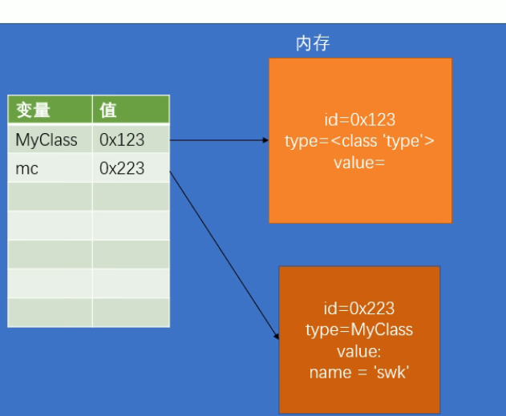

#  一 对象

## 1.1 对象是什么

- 对象是内存中专门用来存储数据的一块区域

- 对象中可以存放各种数据（比如：数字、布尔值、代码）

- 对象由三部分组成
  - 对象的标识(id)
  - 对象的类型(type)
  - 对象的值(value)

## 1.2 面向对象OOP

- Python是一门面向对象的编程语言
- 所谓的面向对象的语言，简单理解就是Python中的所有操作都是通过对象来进行的

- 面向过程的编程的语言
  - 面向过程指的是将我们程序的逻辑分解为一个一个的步骤
  - 通过对每个步骤的抽象，来完成程序

# 二 类

## 2.1 类的简介

目前所学的对象都是Python所提供的内置对象，我们开发者常常需要自定对象

- 类，简单理解就相当于一个图纸。在程序中我们需要根据类来创建对象

- 类就是对象的图纸！
- 也称对象是类的实例
- 如果多个对象是通过一个类创建的，我们称这些对象是一类对象
- 例如 int() float() bool() str() .... 这些都是类
- a = int(10)   a 就是 int类的实例

- 自己定义的类都需要使用大写开头，一般使用大驼峰命名法


语法

```python
# 定义一个简单的类
# 使用class关键字来定义类，语法和函数很像
class 类名([父类]):
    代码块
    
    
class MyClass():
    pass
# 使用MyClass创建一个对象
mc = MyClass() # 使用类来创建对象，就像调用一个函数一样
mc_2 = MyClass()
mc_3 = MyClass()
mc_4 = MyClass()
# 上面四个是一类对象


```

- 如何检测一个对象是一个类的实例？

```python
# 如何检测一个对象是否是类的实例？ isinstance()
print(isinstance(mc,MyClass))
```

## 2.2 对象的创建流程

- 类其实也是一个对象，类是type类型的对象，定义类实际上就是定义了一个type类型的对象
- 如果没有父类的话，class 类名: 括号可以省略

```python
流程
Class MyClass:
    pass
mc = MyClass()

1.创建一个变量mc
2.在内存中创建一个新对象有这三大值
     id = 0x223
     type = Myclass
     value = pass
3.将对象的id赋值给变量
     mc的地址 = 0x223
```

- 可以向对象中添加变量，对象中的变量称为属性

```python
# 语法：对象.属性名 = 属性值
mc = MyClass()
mc.name = '孙悟空'
print(mc.name) # 这个孙悟空就在mc的对象里面
```




## 2.3 类的定义

- 类和对象都是对现实生活中或程序中的内容的抽象
- 实际上所有的事物都由两部分组成：
  - 数据(属性)
  - 行为(方法)
- 在类的代码块中，我们可以定义变量和函数
  - 变量会成为属性
  - 函数会称为方法
  - 并且都会是这个对象的公共属性

> 注意：方法调用时，第一个参数由解析器自动传递，所以定义方法时，至少要定义一个形参

```python
class Person:
    name = '孙悟空'
    age = 18

    def say_hello(self):
        print('你好！')
p1 = Person()
p2 = Person()
p1.say_hello()
```

## 2.4 属性和方法

- 实例为什么能访问类中的属性和方法？
  - 类中定义的属性和方法都是公共的，任何该类实例都可以访问
  - 属性和方法查找的流程
    - 当调用一个对象的属性时，解析器会先在当前对象中寻找是否存在
      - 如果有，则返回当前对象的属性值
      - 如果无，则去当前对象的类对象中去寻找，如果有则返回类对象的属性值。如果没有报错


- 类对象和实例对象都可以保存属性(方法)
  - 如果这个属性(方法)是所有的实例共享的，则应该将其保存到类对象中
  - 如果这个属性(方法)是某个实例独有，则应该保存到实例对象中

- 一般情况下，属性保存到实例对象中
- 方法保存到类对象中

- 在方法中不能直接访问类中的属性

```python
class Person:
    name = 'swk'

    def say_hello(self):
        # 方法每次被调用时，解析器都会自动传递第一个实参
        # 这个实参就是实例本身，所以一般会命名为 self 表示自己 调用者本身
        print(f'你好！我是{self.name}')


p1 = Person()
p2 = Person()
p1.name = '孙悟空'
p2.name = '沙和尚'
print(p1.name,p2.name)
p1.say_hello()
p2.say_hello()
```

## 2.5 \_\_init\_\_

 ```python
    # 在类中可以定义一些特殊方法(魔法方法)
    # 特殊方法都是以__开头，__结尾的方法
    # 特殊方法不需要我们自己调用,不用尝试去调用特殊方法
    # 特殊方法会在特殊的时刻自动调用
    # 学习特殊方法：
    #   1.特殊方法什么时候调用
    #   2.特殊方法有什么作用
    
    创建对象的流程(新)
    1.创建一个变量
    2.在内存中创建一个新对象
    3.执行类中的代码块 (只在类定义的时候执行一次)
    4.__init__(self)方法执行 	
    5.将对象的id赋值给变量
 ```

```python
class Person:
    # init会在对象创建以后立刻执行
    # init可以用来向新创建的对象中初始化属性
    # 调用类创建
    def __init__(self,name):
        # 通过self向新建的对象中初始化属性
        self.name = name

    def say_hello(self):
        print(f'大家好,我是{self.name}')


p1 = Person('猪八戒')
p1.say_hello()

```

# 三 封装

## 3.1 骗人式封装

封装是面向对象的三大特性之一

封装指的是隐藏对象中一些不希望被外部所访问到的属性或方法


```python
# 使用封装，确实增加了类的定义的复杂程度，但是它也确保了数据的安全性
# 1 隐藏了属性名，使调用者无法随意的修改对象中的属性
# 2 增加了getter和setter方法，很好的控制的属性是否是只读的
#      如果希望属性是只读的，可以直接去掉setter方法
#      如果希望属性不能被外部访问，则可以直接去掉getter方法
# 3 使用setter方法设置属性，可以增加数据的验证，确保数据的值是正确的
# 4 使用getter方法获取属性，使用setter方法设置属性
#		可以在读取属性和修改属性的同时做一些其他的处理
# 5 使用getter方法可以表示一些计算的属性
class Dog:
    def __init__(self, name):
        self.hidden_name = name

    def say_hello(self):
        print(f'大家好，我是{self.hidden_name}')

    def get_name(self):
        return self.hidden_name
    def set_name(self,name):
        self.hidden_name = name

d = Dog('旺财')
d.set_name('小黑')
print(d.get_name())

```

## 3.2 简化骗人封装

```python
# 可以位对象的属性使用双下划线开头，__xxx
# 双下划线开头的属性，是对象的隐藏属性，隐藏属性只能在类的内部访问，无法通过对象访问
# 隐藏属性只不过是python自动位属性改了一个名字，实际上是将名字修改为了， _类名__属性名 比如 __name -> _Person__name
class Person:
    def __init__(self, name):
        self.__name = name

    def get_name(self):
        return self.__name

    def set_name(self, name):
        self.__name = name
p1 = Person('孙悟空')
print(p1._Person__name)
```


## 3.3 放弃治疗封装

> 使用\_\_开头的属性，实际上依然可以在外部被访问，所以这种方式我们一般不用 
>
> 一般我们将一些私有属性(不希望被外部访问的属性)以_开头
>
> 一般情况下，使用_开头的属性都是私有属性，没有特殊需要不要修改私有属性

## 3.4 getset装饰器

```python
class Person:
    def __init__(self, name):
        self._name = name

    # property装饰器，用来将get方法，转化为对象的属性
    # 添加为property装饰器以后，就可以像调用属性一样调用get方法
    # 使用property装饰的方法，必须和属性名一样
    @property
    def name(self):
        return self._name

    @name.setter
    def name(self, name):
        self._name = name


p = Person('猪八戒')
p.name = '孙悟空'
print(p.name)
```

# 四 继承

## 4.1 继承的实现

- 通过继承可以使得一个类获取到其他类的属性和方法
- 在定义类时，可以在类名后的括号中指定当前类的父类(超类、基类、super)
  - 子类可以直接继承父类的所有属性和方法

- 在创建类时，如果省略了父类，则默认父类为object
  - object是超类，所有类都继承了object
  - issubclass(儿子,爸爸) 检查一个类是否是另一个类的子类

- 继承的好处
  - 通过继承可以直接让子类获取到父类的方法或属性，避免编写重复性的代码，并且也符合OCP原则

```python
class Animal:
    """
        动物会 run,sleep
    """

    def run(self):
        print('动物会跑~~~')

    def sleep(self):
        print('动物睡觉~~~')


class Dog(Animal):
    """
        狗会 run,sleep,bark
    """

    def brak(self):
        print('汪汪汪~~~')
class Hashiqi(Dog):
    def fangsha(self):
        print('我是一只傻傻的哈士奇')

r = Hashiqi()
r.fangsha()
```

## 4.2 方法重写

当我们调用一个对象方法时

- 会优先去当前对象中寻找是否具有该方法，如果有则直接调用
- 如果没有，则去当前对象的父类中寻找，如果父类没有则去爷爷那里找
- 如果还没有，就一直找一直找，找到最后Object还没有就报错

```python
class A(object):
    def test(self):
        print('AAA')

class B(A): 
    def test(self):
        print('AAA')
class C(B):
    def test(self):
        print('AAA')

c = C()
c.test()
```

## 4.3 super()

```python
class Animal:
    def __init__(self, name):
        self._name = name

    def run(self):
        print('动物会跑~~~')

    def sleep(self):
        print('动物睡觉~~~')

    @property
    def name(self):
        return self._name

    @name.setter
    def name(self, name):
        self._name = name

# 父类中的所有方法都会被子类继承，包括特殊方法，也可以重写特殊方法
class Dog(Animal):
    def __init__(self,name,age):
        # 希望可以直接调用父类的 __init__ 来初始化父类中的属性
        # super() 可以用来获取当前类的父类，并且通过super()返回父类方法时,不需要self
        super().__init__(name)
        self._age = age
    def brak(self):
        print('汪汪汪~~~')

    def run(self):
        print('狗跑~~~')

    @property
    def age(self):
        return self._age

    @age.setter
    def age(self, age):
        self._age = age
d = Dog('旺财',18)
d.name = '小黑'
print(d.name)
print(d.age)
```


## 4.4 多重继承

```python
class A(object):
    def test(self):
        print('AAA')


class B(object):
    def test(self):
        print('BBB')


# 在Python中是支持多重继承的，也就是我们可以为一个类同时指定多个父类
#   可以在类名的()后边添加多个类，来实现多重继承
#   多重继承，会使子类同时拥有多个父类，并且获取到所有父类中的方法
#   在开发中没有特殊情况不要多重继承，因为多重继承会让代码更复杂
#   如果多个父类中会有同名的方法，则在第一个父类中找，然后找第二个，前面会覆盖后面
class C(A,B):
    pass


# __bases__ 这个属性可以获得当前类的所有父类
print(C.__bases__)
```

# 五 多态

多态从字面理解就是多种形态

狗(狼狗、藏獒、哈士奇、狮子狗)

一个对象可以以不同的形态去呈现

 ```python
class A:
    def __init__(self,name):
        self._name = name

    @property
    def name(self):
        return self._name
    @name.setter
    def name(self,name):
        self._name = name
class B:
    def __init__(self,name):
        self._name = name

    @property
    def name(self):
        return self._name
    @name.setter
    def name(self,name):
        self._name = name

class C:
    pass
a = A('孙悟空')
b = B('猪八戒')
c = C()
# 定义一个函数
def say_hello(obj):
    """
        对于say_hello()这个函数来说，只要对象含有name属性，就可以作为参数传递
        这个函数并不会考虑对象的类型，只要有name属性即可
    """
    print(f'你好{obj.name}')
def say_hello2(obj):
    """
        对于say_hello2做了类型检查，只要obj是A的实例，才可以正常使用
        这个函数违法了多态
        违法多态的函数，只适用于一种类型的对象，无法处理其他类型的对象，这样导致这个函数适用性差
    """
    if isinstance(obj,A):
        print(f'你好{obj.name}')
say_hello2(c)

# len()
# 之所以一个对象能通过len()来获取长度，是因为对象中具有一个特殊方法__len__
# 换句话说，只要对象具有__len__特殊方法，就可以通过len()来获取他的长度
 ```

# 六 类属性和类方法

```python
class A(object):
    # 类属性，直接在类中定义的属性是类属性
    # 类属性可以通过类或者类的实例访问到
    # 类属性只能通过类对象来修改，无法通过实例对象修改
    count = 0

    def __init__(self):
        # 实例属性，只能通过实例对象来访问和修改，类对象无法访问和修改
        self.name = '孙悟空'

    # 实例方法
    # 在类中定义，以self为第一个参数的方法都是实例方法
    # 实例方法在调用时，python会将调用对象作为self传入
    # 实例方法可以通过实例和类去调用
    #   当通过类调用时候，不会自动传递self，此时必须手动传递self
    #   当通过实例调用时候，会自动传递self
    def test(self):
        print('这是test方法~~~ ', self)

    # 类方法
    # 在类内部使用 @classmethod 来修饰的方法属于类方法
    # 类方法的第一个参数是cls，也会被自动传递，cls就是当前的类对象
    # 类方法和实例方法的区别：实例方法第一个是self，类方法第一个是：cls
    # 类方法可以通过类取调用，也可以通过实例调用，没区别
    @classmethod
    def test_2(cls):
        print('这是test_2方法，他是类方法', cls)

    # 静态方法
    # 在类中使用 @staticmethod 来修饰的方法属于静态方法
    # 静态方法不需要任何默认参数，静态方法可以通过类和实例取调用
    # 静态方法，基本上是一个和当前类无关的方法，她只是一个保存到当前类中的函数
    # 静态方法一般都是一些工具方法，和当前类无关
    @staticmethod
    def test_3():
        print('test_3执行')


a = A()
A.count = 10
print('A', A.count)
print('a', a.count)

a = A()
A.test(a)
A.test_2()
A.test_3()
```

# 七 自带的类属性

```python
Object.__name__  # 类的名字
Object.__doc__  # 类的文档字符串
Object.__bases__ # 类所有的父类构成的一个原子
Object.__dict__  # 类的字典属性
```

# 八 类命名空间何对象命名空间

创建一个类就会创建一个名称空间，用来存储类中定义的所有名字，这些名字称为类的属性

类的属性有两种：

- 静态属性：定义在类中的变量

  - 类的静态属性是共享给所有对象的

    就是说内存地址一定都是相同的

- 动态属性：定义在类中的方法

  - 类的动态属性是绑定到所有对的

    就是说每个对象的动态属性内存地址是不同的


- 面向对象的组合用法
  - 在一个类中以另一个类的对象作为数据属性，称为类的组合

# 九 特殊方法

特殊方法也可以叫魔法方法也可以叫魔术方法

特殊方法一般不需要手动调用，需要在一些特殊情况自动执行

## 7.1 \_\_del\_\_

del是一个特殊方法，它会在对象被垃圾回收前调用

## 7.2 \_\_str\_\_

```
当打印一个对象的时候，实际上打印的是对象中的特殊方法 __str__
```

```python
class Person(object):
    """
        人类
    """
    def __init__(self,name,age):
        self.name = name
        self.age = age
    def __str__(self):
        return 'Person [name=%s , age=%d]'%(self.name,self.age)
# 创建两个Person类的实例
p1 = Person('孙悟空',18)
p2 = Person('猪八戒',28)

print(p1) # 当打印一个对象的时候，实际上打印的是对象中的特殊方法 __str__
```

## 7.3 \_\_repr\_\_

对当前对象使用repr()函数时调用

他的作用是指定对象在 交互模式中 直接输出的效果

```python
class Person(object):
    """
        人类
    """

    def __init__(self, name, age):
        self.name = name
        self.age = age

    def __str__(self):
        return 'Person [name=%s , age=%d]' % (self.name, self.age)

    def __repr__(self):
        return 'Hello'


# 创建两个Person类的实例
p1 = Person('孙悟空', 18)
p2 = Person('猪八戒', 28)

print(repr(p1))

```

## 7.4 自定义比较

```python
object.__lt__(self,other) 小于
object.__le__(self,other) 小于等于
object.__eq__(self,other) 等于
object.__ne__(self,other) 不等于
object.__gt__(self,other) 大于
object.__ge__(self,other) 大于等于
```

```python
class Person(object):
    def __init__(self, name, age):
        self.name = name
        self.age = age
    # __gt__ 会在对象做大于比较的时候调用，该方法的返回值将会作为比较的结果
    # 他需要两个参数，一个self表示当前对象，other表示和当前对象比较的对象
    # self > other
    def __gt__(self, other):
        return self.age > other.age

# 创建两个Person类的实例
p1 = Person('孙悟空', 38)
p2 = Person('猪八戒', 28)

print(p2 > p1)
```


## 7.5 \_\_bool\_\_

```python
class Person(object):
    def __init__(self, name, age):
        self.name = name
        self.age = age
   # 可以通过__bool__ 来改变bool的转换规则
    def __bool__(self):
        return self.age > 30 # 如果年龄大于17 就转换为True
# 创建两个Person类的实例
p1 = Person('孙悟空', 38)
p2 = Person('猪八戒', 28)

print(bool(p1))
print(bool(p2))
```

 


# 十 异常

程序在运行过程当中，不可避免的会出现一些错误，比如：

- 使用了没有赋值的变量
- 使用了不存在的索引
- 除以0
- ...

这些错误在程序中，被称之为异常。

程序运行中遇见了异常，程序就会立即终止

## 处理异常

程序运行时出现异常，目的并不是让程序终止

Python是希望再出现异常时，我们可以编写代码来对异常进行处理

```python
try语句

try:
    代码块(可能出现错误的语句)
except:
    代码块(出现错误以后的处理方式)
else:
    代码块(没出错时要执行的语句)
    
将可能出错的代码放入到try语句，没错就正常执行，出错就执行except的代码
避免一个异常导致整个程序终止
```

## 异常传播

- 当在函数中出现异常时，如果在函数中对异常进行了处理，则异常不会再继续传播
  - 如果函数中没有对异常进行处理，则异常会继续向函数**调用处**传播
  - 如果函数调用处处理了异常，则不再传播
  - 直到传播了全局作用域(主模块)如果依然没有处理，则程序终止，并显示异常信息

## 完整

```python
try:
    代码块(可能出现错误的语句)
except 异常类型1 as 异常名1:
    代码块(出现错误以后的处理方式)
except 异常类型2 as 异常名2:
    代码块(出现错误以后的处理方式)
else:
    代码块(没出错时要执行的语句)
finally:
    代码块(该代码总会执行)

```


# 11 文件操作seekTell


```
seek(要切换的位置，计算位置方式)
	- 计算位置方式
		- 0 从头开始算 默认值
		- 1 从当前位置开始算
		- 2 从最后位置开始算
tell() 查看当前在哪个位置
```


