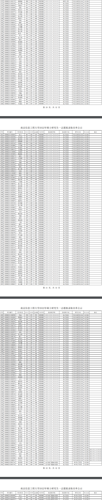

目标 专硕

```
英语(二)  65
数学(二)  130
政治		65
专业		120
```


# 南京

## 南京信息工程大学

层次：双一流

计算机科学与技术：B

软件工程：C+

毕业薪资：起20w+


2022年考研情况

```
计算机科学与技术(学)081200
复试线：最低分：306分   中位数：330分    最高分395
软件工程(学)083500
复试线：287分		中位数：325分    最高分393

电子信息(专)
复试线：最低分：315分   
招收最低分：315分  平均分:352  中位数:346.5   最高分: 426 建议目标：355分

考试科目：
①101思想政治理论 100   60
②204英语（二）  100    60
③302数学（二）  150    120
④816数据结构    150    120

```




代码分析

.txt

```
1373 103002211103318 伏宇翔 423 249 672 085400 计算机学院、软件学院、网络空间安全学院 电子信息不区分研究方向全日制1374 103002211108385 刘振宇 417 250 667 085400 计算机学院、软件学院、网络空间安全学院 电子信息不区分研究方向全日制1375 103002211103459 孙乾 426 239 665 085400 计算机学院、软件学院、网络空间安全学院 电子信息不区分研究方向全日制1376 103002211109308 周亮宇 394 269 663 085400 计算机学院、软件学院、网络空间安全学院 电子信息不区分研究方向全日制1377 103002211103377 李玲露 408 254 662 085400 计算机学院、软件学院、网络空间安全学院 电子信息不区分研究方向全日制1378 103002211103496 王思拓 381 280 661 085400 计算机学院、软件学院、网络空间安全学院 电子信息不区分研究方向全日制1379 103002211103609 张志萌 415 245 660 085400 计算机学院、软件学院、网络空间安全学院 电子信息不区分研究方向全日制1380 103002211103524 席晴予 411 249 660 085400 计算机学院、软件学院、网络空间安全学院 电子信息不区分研究方向全日制1381 103002211103416 罗帆 403 254 657 085400 计算机学院、软件学院、网络空间安全学院 电子信息不区分研究方向全日制1382 103002211106032 杨帆 399 258 657 085400 计算机学院、软件学院、网络空间安全学院 电子信息不区分研究方向全日制1383 103002211103628 朱安静 398 258 656 085400 计算机学院、软件学院、网络空间安全学院 电子信息不区分研究方向全日制1384 103002211103508 王智麟 387 265 652 085400 计算机学院、软件学院、网络空间安全学院 电子信息不区分研究方向全日制1385 103002211105595 林志海 396 254 650 085400 计算机学院、软件学院、网络空间安全学院 电子信息不区分研究方向全日制1386 103002211103289 陈正嘉 386 258 644 085400 计算机学院、软件学院、网络空间安全学院 电子信息不区分研究方向全日制1387 103002211103589 张竞一 384 259 643 085400 计算机学院、软件学院、网络空间安全学院 电子信息不区分研究方向全日制1388 103002211103376 李力 378 263 641 085400 计算机学院、软件学院、网络空间安全学院 电子信息不区分研究方向全日制1389 103002211103366 金正勇 370 271 641 085400 计算机学院、软件学院、网络空间安全学院 电子信息不区分研究方向全日制1390 103002211100668 陈坤 375 266 641 085400 计算机学院、软件学院、网络空间安全学院 电子信息不区分研究方向全日制1391 103002211105589 陈媛媛 387 253 640 085400 计算机学院、软件学院、网络空间安全学院 电子信息不区分研究方向全日制1392 103002211110566 李嘉兴 392 248 640 085400 计算机学院、软件学院、网络空间安全学院 电子信息不区分研究方向全日制1393 103002211107946 叶加乐 383 257 640 085400 计算机学院、软件学院、网络空间安全学院 电子信息不区分研究方向全日制1394 103002211103434 乔建权 380 260 640 085400 计算机学院、软件学院、网络空间安全学院 电子信息不区分研究方向全日制1395 103002211103606 张媛媛 391 248 639 085400 计算机学院、软件学院、网络空间安全学院 电子信息不区分研究方向全日制1396 103002211103268 陈超 382 257 639 085400 计算机学院、软件学院、网络空间安全学院 电子信息不区分研究方向全日制1397 103002211103460 孙锐 371 268 639 085400 计算机学院、软件学院、网络空间安全学院 电子信息不区分研究方向全日制1398 103002211103381 李文阳 363 276 639 085400 计算机学院、软件学院、网络空间安全学院 电子信息不区分研究方向全日制1399 103002211103647 邹杰 382 256 638 085400 计算机学院、软件学院、网络空间安全学院 电子信息不区分研究方向全日制1400 103002211103355 吉茹 379 259 638 085400 计算机学院、软件学院、网络空间安全学院 电子信息不区分研究方向全日制1401 103002211106922 李锦 376 262 638 085400 计算机学院、软件学院、网络空间安全学院 电子信息不区分研究方向全日制1402 103002211103293 程遥 388 249 637 085400 计算机学院、软件学院、网络空间安全学院 电子信息不区分研究方向全日制1403 103002211103582 曾晨 377 259 636 085400 计算机学院、软件学院、网络空间安全学院 电子信息不区分研究方向全日制1404 103002211106932 孙灿宇 372 263 635 085400 计算机学院、软件学院、网络空间安全学院 电子信息不区分研究方向全日制1405 103002211110855 张杭 391 243 634 085400 计算机学院、软件学院、网络空间安全学院 电子信息不区分研究方向全日制1406 103002211103586 张道龙 374 259 633 085400 计算机学院、软件学院、网络空间安全学院 电子信息不区分研究方向全日制1407 103002211103386 梁志伟 377 256 633 085400 计算机学院、软件学院、网络空间安全学院 电子信息不区分研究方向全日制1408 103002211109583 张浩哲 380 249 629 085400 计算机学院、软件学院、网络空间安全学院 电子信息不区分研究方向全日制1409 103002211106457 卢宇航 370 259 629 085400 计算机学院、软件学院、网络空间安全学院 电子信息不区分研究方向全日制1410 103002211103629 朱陈陈 377 251 628 085400 计算机学院、软件学院、网络空间安全学院 电子信息不区分研究方向全日制1411 103002211103368 李臣斌 371 255 626 085400 计算机学院、软件学院、网络空间安全学院 电子信息不区分研究方向全日制1412 103002211103362 蒋丽雯 378 248 626 085400 计算机学院、软件学院、网络空间安全学院 电子信息不区分研究方向全日制1413 103002211103547 许海 369 257 626 085400 计算机学院、软件学院、网络空间安全学院 电子信息不区分研究方向全日制1414 103002211103576 于致远 374 251 625 085400 计算机学院、软件学院、网络空间安全学院 电子信息不区分研究方向全日制1415 103002211106930 乔巍 369 255 624 085400 计算机学院、软件学院、网络空间安全学院 电子信息不区分研究方向全日制1416 103002211100153 刘洪鑫 373 251 624 085400 计算机学院、软件学院、网络空间安全学院 电子信息不区分研究方向全日制1417 103002211108771 张成娟 348 272 620 085400 计算机学院、软件学院、网络空间安全学院 电子信息不区分研究方向全日制1418 103002211103443 沈昊 367 253 620 085400 计算机学院、软件学院、网络空间安全学院 电子信息不区分研究方向全日制1419 103002211109202 揭谦 348 271 619 085400 计算机学院、软件学院、网络空间安全学院 电子信息不区分研究方向全日制1420 103002211100485 叶威良 364 255 619 085400 计算机学院、软件学院、网络空间安全学院 电子信息不区分研究方向全日制1421 103002211103643 朱玉 361 258 619 085400 计算机学院、软件学院、网络空间安全学院 电子信息不区分研究方向全日制1422 103002211103550 许金龙 341 278 619 085400 计算机学院、软件学院、网络空间安全学院 电子信息不区分研究方向全日制1423 103002211103288 陈莹莹 350 269 619 085400 计算机学院、软件学院、网络空间安全学院 电子信息不区分研究方向全日制1424 103002211103557 颜佩漪 344 275 619 085400 计算机学院、软件学院、网络空间安全学院 电子信息不区分研究方向全日制1425 103002211103316 冯逸凡 354 264 618 085400 计算机学院、软件学院、网络空间安全学院 电子信息不区分研究方向全日制1426 103002211103406 卢培森 373 244 617 085400 计算机学院、软件学院、网络空间安全学院 电子信息不区分研究方向全日制1427 103002211103314 房羽洋 345 272 617 085400 计算机学院、软件学院、网络空间安全学院 电子信息不区分研究方向全日制1428 103002211109612 山慧敏 345 272 617 085400 计算机学院、软件学院、网络空间安全学院 电子信息不区分研究方向全日制1429 103002211110440 吕路莹 364 252 616 085400 计算机学院、软件学院、网络空间安全学院 电子信息不区分研究方向全日制1430 103002211103469 陶恩屹 365 251 616 085400 计算机学院、软件学院、网络空间安全学院 电子信息不区分研究方向全日制1431 103002211103617 赵易 350 266 616 085400 计算机学院、软件学院、网络空间安全学院 电子信息不区分研究方向全日制1432 103002211109251 王智彬 378 236 614 085400 计算机学院、软件学院、网络空间安全学院 电子信息不区分研究方向全日制1433 103002211103412 吕佳 347 267 614 085400 计算机学院、软件学院、网络空间安全学院 电子信息不区分研究方向全日制1434 103002211103401 刘威 349 265 614 085400 计算机学院、软件学院、网络空间安全学院 电子信息不区分研究方向全日制1435 103002211103324 高园元 367 247 614 085400 计算机学院、软件学院、网络空间安全学院 电子信息不区分研究方向全日制1436 103002211103546 徐悦 351 262 613 085400 计算机学院、软件学院、网络空间安全学院 电子信息不区分研究方向全日制1437 103002211106018 黄方彬 355 258 613 085400 计算机学院、软件学院、网络空间安全学院 电子信息不区分研究方向全日制1438 103002211109422 杜娟 353 260 613 085400 计算机学院、软件学院、网络空间安全学院 电子信息不区分研究方向全日制1439 103002211110340 杨艳 340 272 612 085400 计算机学院、软件学院、网络空间安全学院 电子信息不区分研究方向全日制1440 103002211106673 周雷 370 242 612 085400 计算机学院、软件学院、网络空间安全学院 电子信息不区分研究方向全日制1441 103002211107665 王子纯 344 268 612 085400 计算机学院、软件学院、网络空间安全学院 电子信息不区分研究方向全日制1442 103002211108682 姚彦梦 350 259 609 085400 计算机学院、软件学院、网络空间安全学院 电子信息不区分研究方向全日制1443 103002211103300 丁林森 343 266 609 085400 计算机学院、软件学院、网络空间安全学院 电子信息不区分研究方向全日制1444 103002211100078 蔡子泓 344 265 609 085400 计算机学院、软件学院、网络空间安全学院 电子信息不区分研究方向全日制1445 103002211109459 赵星源 358 251 609 085400 计算机学院、软件学院、网络空间安全学院 电子信息不区分研究方向全日制1446 103002211103286 陈晓安 357 252 609 085400 计算机学院、软件学院、网络空间安全学院 电子信息不区分研究方向全日制1447 103002211105592 韩志冬 352 257 609 085400 计算机学院、软件学院、网络空间安全学院 电子信息不区分研究方向全日制1448 103002211107926 曾饮思 346 262 608 085400 计算机学院、软件学院、网络空间安全学院 电子信息不区分研究方向全日制1449 103002211106266 仇建华 324 284 608 085400 计算机学院、软件学院、网络空间安全学院 电子信息不区分研究方向全日制1450 103002211109922 郭鹏程 346 261 607 085400 计算机学院、软件学院、网络空间安全学院 电子信息不区分研究方向全日制1451 103002211103480 王霍宇 360 247 607 085400 计算机学院、软件学院、网络空间安全学院 电子信息不区分研究方向全日制1452 103002211109207 姚梦非 354 253 607 085400 计算机学院、软件学院、网络空间安全学院 电子信息不区分研究方向全日制1453 103002211103310 杜明谦 337 269 606 085400 计算机学院、软件学院、网络空间安全学院 电子信息不区分研究方向全日制1454 103002211103627 周子渊 357 249 606 085400 计算机学院、软件学院、网络空间安全学院 电子信息不区分研究方向全日制1455 103002211103605 张远 354 252 606 085400 计算机学院、软件学院、网络空间安全学院 电子信息不区分研究方向全日制1456 103002211103402 刘西应 353 252 605 085400 计算机学院、软件学院、网络空间安全学院 电子信息不区分研究方向全日制1457 103002211103417 马杰 363 242 605 085400 计算机学院、软件学院、网络空间安全学院 电子信息不区分研究方向全日制1458 103002211103470 陶诗雨 324 281 605 085400 计算机学院、软件学院、网络空间安全学院 电子信息不区分研究方向全日制1459 103002211109647 刘健 348 256 604 085400 计算机学院、软件学院、网络空间安全学院 电子信息不区分研究方向全日制1460 103002211106299 张伟 347 257 604 085400 计算机学院、软件学院、网络空间安全学院 电子信息不区分研究方向全日制1461 103002211106460 强旭艳 348 256 604 085400 计算机学院、软件学院、网络空间安全学院 电子信息不区分研究方向全日制1462 103002211103303 丁睿 343 260 603 085400 计算机学院、软件学院、网络空间安全学院 电子信息不区分研究方向全日制1463 103002211106928 潘李 346 256 602 085400 计算机学院、软件学院、网络空间安全学院 电子信息不区分研究方向全日制1464 103002211103379 李荣标 348 254 602 085400 计算机学院、软件学院、网络空间安全学院 电子信息不区分研究方向全日制1465 103002211110618 李源 353 249 602 085400 计算机学院、软件学院、网络空间安全学院 电子信息不区分研究方向全日制1466 103002211109542 李智慧 345 257 602 085400 计算机学院、软件学院、网络空间安全学院 电子信息不区分研究方向全日制1467 103002211106279 季龙 347 254 601 085400 计算机学院、软件学院、网络空间安全学院 电子信息不区分研究方向全日制1468 103002211103555 严志超 334 267 601 085400 计算机学院、软件学院、网络空间安全学院 电子信息不区分研究方向全日制1469 103002211106468 周浩 354 247 601 085400 计算机学院、软件学院、网络空间安全学院 电子信息不区分研究方向全日制1470 103002211103497 王苏勋 332 268 600 085400 计算机学院、软件学院、网络空间安全学院 电子信息不区分研究方向全日制1471 103002211103544 徐欣雨 340 260 600 085400 计算机学院、软件学院、网络空间安全学院 电子信息不区分研究方向全日制1472 103002211106029 邱文倩 338 262 600 085400 计算机学院、软件学院、网络空间安全学院 电子信息不区分研究方向全日制1473 103002211103271 陈庚彪 347 252 599 085400 计算机学院、软件学院、网络空间安全学院 电子信息不区分研究方向全日制1474 103002211103273 陈加乐 344 255 599 085400 计算机学院、软件学院、网络空间安全学院 电子信息不区分研究方向全日制1475 103002211103549 许健 341 257 598 085400 计算机学院、软件学院、网络空间安全学院 电子信息不区分研究方向全日制1476 103002211109210 张裕 349 249 598 085400 计算机学院、软件学院、网络空间安全学院 电子信息不区分研究方向全日制1477 103002211103276 陈京祥 341 256 597 085400 计算机学院、软件学院、网络空间安全学院 电子信息不区分研究方向全日制1478 103002211110586 郭战 360 236 596 085400 计算机学院、软件学院、网络空间安全学院 电子信息不区分研究方向全日制1479 103002211103333 郭宇轩 358 238 596 085400 计算机学院、软件学院、网络空间安全学院 电子信息不区分研究方向全日制1480 103002211106300 张雨亭 346 250 596 085400 计算机学院、软件学院、网络空间安全学院 电子信息不区分研究方向全日制1481 103002211103642 朱永昕 357 238 595 085400 计算机学院、软件学院、网络空间安全学院 电子信息不区分研究方向全日制1482 103002211110111 丁闯 345 250 595 085400 计算机学院、软件学院、网络空间安全学院 电子信息不区分研究方向全日制1483 103002211108769 车国亮 336 259 595 085400 计算机学院、软件学院、网络空间安全学院 电子信息不区分研究方向全日制1484 103002211103501 王旭东 345 250 595 085400 计算机学院、软件学院、网络空间安全学院 电子信息不区分研究方向全日制1485 103002211103542 徐静雯 348 246 594 085400 计算机学院、软件学院、网络空间安全学院 电子信息不区分研究方向全日制1486 103002211103467 唐梦琦 358 236 594 085400 计算机学院、软件学院、网络空间安全学院 电子信息不区分研究方向全日制1487 103002211100307 李轩慧 316 278 594 085400 计算机学院、软件学院、网络空间安全学院 电子信息不区分研究方向全日制1488 103002211103591 张锐 352 242 594 085400 计算机学院、软件学院、网络空间安全学院 电子信息不区分研究方向全日制1489 103002211103441 佘冰涛 345 249 594 085400 计算机学院、软件学院、网络空间安全学院 电子信息不区分研究方向全日制1490 103002211105268 马晓捷 336 257 593 085400 计算机学院、软件学院、网络空间安全学院 电子信息不区分研究方向全日制1491 103002211100465 孙文馨 367 226 593 085400 计算机学院、软件学院、网络空间安全学院 电子信息不区分研究方向全日制1492 103002211100298 李焱 338 255 593 085400 计算机学院、软件学院、网络空间安全学院 电子信息不区分研究方向全日制1493 103002211103428 庞敬法 318 275 593 085400 计算机学院、软件学院、网络空间安全学院 电子信息不区分研究方向全日制1494 103002211108730 许梦 328 264 592 085400 计算机学院、软件学院、网络空间安全学院 电子信息不区分研究方向全日制1495 103002211106293 徐梓棋 336 255 591 085400 计算机学院、软件学院、网络空间安全学院 电子信息不区分研究方向全日制1496 103002211103581 岳鹏飞 338 252 590 085400 计算机学院、软件学院、网络空间安全学院 电子信息不区分研究方向全日制1497 103002211108133 孟儒君 337 253 590 085400 计算机学院、软件学院、网络空间安全学院 电子信息不区分研究方向全日制1498 103002211103551 薛圣炜 332 257 589 085400 计算机学院、软件学院、网络空间安全学院 电子信息不区分研究方向全日制1499 103002211103382 李亚轩 340 249 589 085400 计算机学院、软件学院、网络空间安全学院 电子信息不区分研究方向全日制1500 103002211103397 刘欢 335 254 589 085400 计算机学院、软件学院、网络空间安全学院 电子信息不区分研究方向全日制1501 103002211105610 朱文涛 327 262 589 085400 计算机学院、软件学院、网络空间安全学院 电子信息不区分研究方向全日制1502 103002211100176 杨宁 343 245 588 085400 计算机学院、软件学院、网络空间安全学院 电子信息不区分研究方向全日制1503 103002211106917 何俊杰 320 268 588 085400 计算机学院、软件学院、网络空间安全学院 电子信息不区分研究方向全日制1504 103002211107669 赵业康 353 235 588 085400 计算机学院、软件学院、网络空间安全学院 电子信息不区分研究方向全日制1505 103002211110899 刘梓麟 338 249 587 085400 计算机学院、软件学院、网络空间安全学院 电子信息不区分研究方向全日制1506 103002211108680 李志青 330 257 587 085400 计算机学院、软件学院、网络空间安全学院 电子信息不区分研究方向全日制1507 103002211106912 曹儒商 342 245 587 085400 计算机学院、软件学院、网络空间安全学院 电子信息不区分研究方向全日制1508 103002211107924 姜金叶 335 252 587 085400 计算机学院、软件学院、网络空间安全学院 电子信息不区分研究方向全日制1509 103002211108653 张钏钰 331 256 587 085400 计算机学院、软件学院、网络空间安全学院 电子信息不区分研究方向全日制1510 103002211100457 张权淏 341 245 586 085400 计算机学院、软件学院、网络空间安全学院 电子信息不区分研究方向全日制1511 103002211103390 凌翔宇 334 252 586 085400 计算机学院、软件学院、网络空间安全学院 电子信息不区分研究方向全日制1512 103002211103436 任继港 325 261 586 085400 计算机学院、软件学院、网络空间安全学院 电子信息不区分研究方向全日制1513 103002211103282 陈帅之 320 265 585 085400 计算机学院、软件学院、网络空间安全学院 电子信息不区分研究方向全日制1514 103002211103559 杨帆 353 232 585 085400 计算机学院、软件学院、网络空间安全学院 电子信息不区分研究方向全日制1515 103002211109486 谢佳薇 337 248 585 085400 计算机学院、软件学院、网络空间安全学院 电子信息不区分研究方向全日制1516 103002211103473 童恩睿 323 262 585 085400 计算机学院、软件学院、网络空间安全学院 电子信息不区分研究方向全日制1517 103002211106302 周啸文 349 235 584 085400 计算机学院、软件学院、网络空间安全学院 电子信息不区分研究方向全日制1518 103002211100347 李雯 329 255 584 085400 计算机学院、软件学院、网络空间安全学院 电子信息不区分研究方向全日制1519 103002211103506 王英 326 258 584 085400 计算机学院、软件学院、网络空间安全学院 电子信息不区分研究方向全日制1520 103002211107663 林毅 334 250 584 085400 计算机学院、软件学院、网络空间安全学院 电子信息不区分研究方向全日制1521 103002211103535 徐偲淇 334 249 583 085400 计算机学院、软件学院、网络空间安全学院 电子信息不区分研究方向全日制1522 103002211103475 王方 349 234 583 085400 计算机学院、软件学院、网络空间安全学院 电子信息不区分研究方向全日制1523 103002211100258 郭阳阳 340 243 583 085400 计算机学院、软件学院、网络空间安全学院 电子信息不区分研究方向全日制1524 103002211103297 戴兴杰 316 267 583 085400 计算机学院、软件学院、网络空间安全学院 电子信息不区分研究方向全日制1525 103002211109062 车嘉航 316 267 583 085400 计算机学院、软件学院、网络空间安全学院 电子信息不区分研究方向全日制1526 103002211106031 孙煊哲 344 238 582 085400 计算机学院、软件学院、网络空间安全学院 电子信息不区分研究方向全日制1527 103002211100434 周韬 337 244 581 085400 计算机学院、软件学院、网络空间安全学院 电子信息不区分研究方向全日制1528 103002211106927 刘梦婷 335 246 581 085400 计算机学院、软件学院、网络空间安全学院 电子信息不区分研究方向全日制1529 103002211109318 段为国 320 261 581 085400 计算机学院、软件学院、网络空间安全学院 电子信息不区分研究方向全日制1530 103002211103313 范雅静 320 261 581 085400 计算机学院、软件学院、网络空间安全学院 电子信息不区分研究方向全日制1531 103002211103553 闫鹏飞 334 247 581 085400 计算机学院、软件学院、网络空间安全学院 电子信息不区分研究方向全日制1532 103002211103648 邹思伟 319 262 581 085400 计算机学院、软件学院、网络空间安全学院 电子信息不区分研究方向全日制1533 103002211108136 许亚楠 334 246 580 085400 计算机学院、软件学院、网络空间安全学院 电子信息不区分研究方向全日制1534 103002211106665 梁文丰 323 256 579 085400 计算机学院、软件学院、网络空间安全学院 电子信息不区分研究方向全日制1535 103002211109203 金方鹏 338 241 579 085400 计算机学院、软件学院、网络空间安全学院 电子信息不区分研究方向全日制1536 103002211103603 张宇轩 316 263 579 085400 计算机学院、软件学院、网络空间安全学院 电子信息不区分研究方向全日制1537 103002211105603 孙阳 336 242 578 085400 计算机学院、软件学院、网络空间安全学院 电子信息不区分研究方向全日制1538 103002211106289 王凡 321 257 578 085400 计算机学院、软件学院、网络空间安全学院 电子信息不区分研究方向全日制1539 103002211106270 高宇轩 343 235 578 085400 计算机学院、软件学院、网络空间安全学院 电子信息不区分研究方向全日制1540 103002211103438 桑慧楠 334 244 578 085400 计算机学院、软件学院、网络空间安全学院 电子信息不区分研究方向全日制1541 103002211103454 苏冰梅 327 251 578 085400 计算机学院、软件学院、网络空间安全学院 电子信息不区分研究方向全日制1542 103002211103455 孙超 335 242 577 085400 计算机学院、软件学院、网络空间安全学院 电子信息不区分研究方向全日制1543 103002211103360 姜浩东 328 249 577 085400 计算机学院、软件学院、网络空间安全学院 电子信息不区分研究方向全日制1544 103002211103622 周吉 323 254 577 085400 计算机学院、软件学院、网络空间安全学院 电子信息不区分研究方向全日制1545 103002211106461 秦子航 340 236 576 085400 计算机学院、软件学院、网络空间安全学院 电子信息不区分研究方向全日制1546 103002211106021 李林飞 326 250 576 085400 计算机学院、软件学院、网络空间安全学院 电子信息不区分研究方向全日制1547 103002211106281 任智杰 315 261 576 085400 计算机学院、软件学院、网络空间安全学院 电子信息不区分研究方向全日制1548 103002211103597 张文浩 337 239 576 085400 计算机学院、软件学院、网络空间安全学院 电子信息不区分研究方向全日制1549 103002211103541 徐靖靖 335 240 575 085400 计算机学院、软件学院、网络空间安全学院 电子信息不区分研究方向全日制1550 103002211103552 薛宇恒 330 245 575 085400 计算机学院、软件学院、网络空间安全学院 电子信息不区分研究方向全日制1551 103002211103619 郑玉烨 319 256 575 085400 计算机学院、软件学院、网络空间安全学院 电子信息不区分研究方向全日制1552 103002211108386 王亮 330 245 575 085400 计算机学院、软件学院、网络空间安全学院 电子信息不区分研究方向全日制1553 103002211100247 张莎莎 335 239 574 085400 计算机学院、软件学院、网络空间安全学院 电子信息不区分研究方向全日制1554 103002211106660 陈韦龙 333 241 574 085400 计算机学院、软件学院、网络空间安全学院 电子信息不区分研究方向全日制
```

.py

```python
from pprint import pprint

f = open('nj_nxd.txt', 'r', encoding='utf-8')
data = f.read()
data = data.split('电子信息不区分研究方向全日制')
data = list(filter(lambda x: len(x) > 0, data))


fs = []
for li in data:
    sql_data = li.split(' ')
    # 序号，考生编号，考生姓名，初试成绩，复试成绩，总成绩，专业代码，拟录取学院
    # 0     1        2         3       4      5        6        7
    arr = [sql_data[0],sql_data[2],sql_data[3]]
    fs.append(arr[2])
    # print(arr)
fs = list(map(lambda x:int(x),fs))
fs.sort(reverse=True)
pprint(fs)
n_max = fs[0]
n_min = fs[-1]
n_avg = sum(fs)/len(fs)
if len(fs) % 2 ==0:
    n_mid = (fs[len(fs)//2] + fs[len(fs)//2]-1)/2
else:
    n_mid = fs[len(fs)//2]
print(f'最高分:{n_max}\n最小分:{n_min}\n平均分:{n_avg}\n中位数:{n_mid}')
```


## 南京师范大学


# 北京

中国矿业大学


# 上海

上海科技大学

