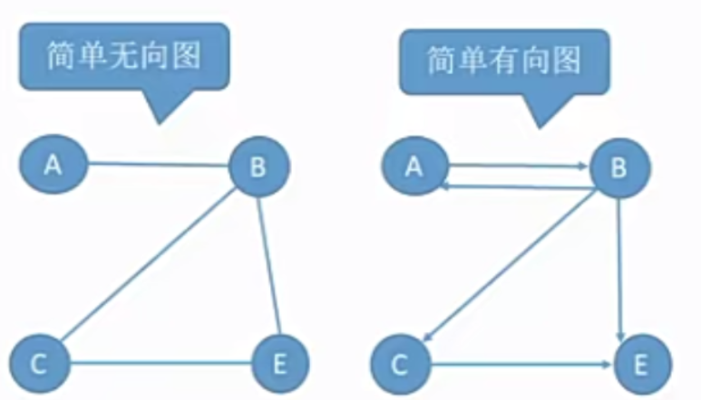

# 六 图

## 1.图的基本概念

**图的定义**

**图G**由**顶点集V**和**边集E**组成，记作 **G=(V,E)**, 其中**V(G)**表示图G中**顶点的有限非空集**；**E(G)**表示图G中**顶点之间的关系（边）集合**。若 V={v1,v2,.....,vn}, 则用 **|v|** 表示图G中 **顶点的个数**，也称为**图G的阶**，E = { (u,v) | u∈V,v∈V }

用 **|E|**表示图G中 **边的条数**

> 注意：线性表可以是空表，树可以是空树，但图不可以是空，即**V一定是非空集**，但是图的边可以是空集

**图逻辑结构的应用**

车站，地图，微信好友关系，微博粉丝关系。。。

**无向图、有向图**

- 若E是**无向边(简称边)**的有限集合时，则图G为**无向图**.边是顶点的无序对，**记为(v,w)或(w,v)**,因为**(v,w)=(w,v)**,其中v、w是顶点。可以说顶点w和顶点v互为邻接点。边(v,w)依附于顶点w和v，或者说边(v,w)和顶点v、w相关联。

  ```python
  G2 = (V2,E2)
  V2 = {A,B,C,D,E}
  E2 = {(A,B),(B,D),(B,E),(C,D),(C,E),(D,E)}
  ```

  

  

- 若E是**有向边(也称弧)**的有限集合时，则图G为**有向图**。弧是顶点的有序对，记为**<v,w>**, 其中v、w是顶点。v称为**弧尾**,w称为**弧头**,  <v,w> 称为从**顶点v到顶点w的弧** , 也称为 **v邻接到w ， 或者 w临界自v**。 **<v,w> ≠ <w,v>**

  ```python
  G1 = (V1,E1)
  V1 = {A,B,C,D,E}
  E1 = {<A,B>,<A,C>,<A,D>,<A,E>,<B,A>,<B,C>,<B,E>,<C,D>}
  ```

  

  

**简单图、多重图**

- 简单图：①不存在重复边；②不存在顶点到自身的边

  

- 多重图：图G中某两个结点之间的边数多于一条，又允许顶点通过同一条边和自己关联，则G为多重图

  》 注意：数据结构课程只探讨 **简单图**  

  


**顶点的度、入度、出度**

- 对于**无向图**：**顶点v的度**是指依附于该顶点的边的条数，记为**TD(v)**
  - 所有顶点的度之和 = 边的数量 x 2
- 对于**有向图**：
  - 入度：以顶点v为终点的有向边的数目，记作**ID(v)**
  - 出度：以顶点v为起点的有向边的数目，记作**OD(v)**
  - 顶点v的度：等于其 入度和出度之和，记作**TD(v) = ID(v) + OD(v)**
  - 所有顶点的入读之和 = 所有顶点的出度之和 = 弧的条数


**顶点-顶点的关系描述**

- 路径——顶点vp到顶点vq之间的一条路径是指顶点序列  vp,v1,v2,v3,...,vm.vq

  

- 回路——**第一个顶点和最后一个顶点相同**的路径称为**回路**或**环**

- 简单路径——在路径序列中，顶点不重复出现的路径称为**简单路径**
- 简单回路——除第一个顶点和最后一个顶点外，其余顶点不重复出现的回路称为**简单回路**
- 路径长度——两个顶点之间的边数目
- 点到点的举例——从顶点u出发到顶点v的**最短路径**若存在，则**此路径的长度称为u到v的距离**。若从u到v根本**不存在路径**，则**记该距离为无穷（∞）**

- 无向图中，若从顶点v到顶点w有路径存在，则称v和w是**连通**的

- 有向图中，若从顶点v到顶点w和从顶点w到顶点v之间都有路径，则称这两个顶点是**强联通**

  


**连通图、强连通图**


- 无向图中。若图G中任意两个顶点都是连通的，则称图G为**连通图**，否则称为**非连通图**
- 有向图中。若图中任意一对顶点都是强连通的，则称此图为**强连通图**

- 连通图常用考点：对于n个顶点的无向图G
  - 若G是**连通图**，则**最少**有**n-1**条边
  - 若G是**非连通图**，则**最多**可能有条边
- 强连通图常用考点：对于n个顶点的有向图G
  - 若G是**强连通图**，则**最少**有n条边


**研究图的局部——子图**

- 设有两个图 G=(V,E) 和 G1=(V1,E1),若**V1是V的子集**，且**E1是E的子集**，则称**G1是G的子图**

- 若有满足V(G1)=V(G)的子图G1,则称其为G的**生成子图**。  包含相同的顶点

  

  


**连通分量**

**无向图**中的**极大连通子图**称为**连通分量**。

> 子图必须连通，且包含尽可能多的顶点和边

 

**有向图**中的**极大联通子图**称为有向图的**强连通分量**


**生成树**

连通图的**生成树**是**包含图中全部顶点的一个极小连通子图**（边尽可能的少，但要保持连通）


- 若图中定点数为n，则它的生成树含有n-1条边。对生成树而言，若砍去它的一条边，则会变成非连通图，若加上一条边则会形成一个回路


**生成森林**

在**非连通图**中，**连通分量的生成树**构成了非连通图的**生成森林**


**边的权、带权图/网**


- 边的权——在一个图中，每条边都可以标上具有某种含义的数值，该数值称为该边的**权值**
- 带权图/网——边上带有权值的图称为**带权图**，也称**网**

- 带权路径长度——当图是带权图时，一条**路径上所有边的权值之和**，称为该路径的带权路径长度


**几种特殊形态的图**

- 无向完全图——无向图中任意两个顶点之间都存在边

  - 若无向图的顶点树 |v| = n , 则 |E| ∈ [0,C(2,n)] = [0,n(n-1)/2]

  

- 有向完全图——有向图中任意两个顶点之间都存在方向相反的两条弧

  

- 稀疏图——边数很少的图

  


- 稠密图——边数很多的图

  


树其实就是 不存在回路，且连通的 无限图

- n个顶点的树，必有n-1条边

常见考点：n个顶点的图，**若 |E|> n -1 ，则一定有回路**


## 2.试题精选

```json
值得反复练习{
    1.A
    4.C
    6.C
    7.A
	8.D
    11.D
    12.B
    13.C
    15.C
    18.C
}

分析:{
    1:A
    	路径的定义：路径是指由 顶点和相邻顶点序偶 构成的边的序列
    	序偶是指 带了方向的指向关系，   
    	B：路径不是由顶点构成的，而是由边构成的。
    	C：边说法不清，是什么样的边构成的？ 是由“顶点和相邻顶点序偶” 构成的
    	
    	
    2:D
    	边数和顶点的关系
    	顶点太多，边太少会导致无法连通
    	顶点太少，边太多会导致有环成生
    	这个临界点最完美的情况就是   边数 = 顶点数 - 1  （可以做到连通且无环，但是注意不是一定）
    	
    3:B,
    	不论是什么优先搜索，只要是连通图，就一定能全访问到
    4:
    	A:图的边数是可以小于定点数的。更不要说二者区别，不是数量上的区别了
    	B:边集和顶点存在不对应的情况，V` 和{E`} 都不一定是个图，更不要说是不是子图的
		C:无向图的极大连通子图称为连通分量
		D:不准确。如果不是连通图，从某一顶点出发不能访问到任意顶点。
    5:CD,
		A:强连通有向图是指，任意顶点一定可以到任意顶点，这说明了顶点和顶点之间肯定有路径，但是不是说直达。
			就比如我可以从美国到俄罗斯到中国的 公路，但是没有美国直接到中国的 公路
		B:这个离谱了，不解释
		C:
			有向完全图：每两个顶点之间都有两条方向相反的边连接的图。
			强连通有向图：每两个顶点之间都有路径。
			有向完全图一定是强连通的,但强连通不一定是有向完全图
		D:
			不一定是个子集，甚至不一定是个图
    6.
		条件：28条边，非连通，无向
		求至少多少个顶点

		利用结论：无向完全图有 n(n-1)/2 条边
		那这里用这种 完全图的 临界条件
		首先解方程
		n(n-1)/2 = 28 => n = 8
		所以可以知道，8个结点的时候，28条边正好是完全图形态，		
		8个顶点正好实现28条边
		那么 8+1=9 ，正好实现非连通，最少顶点数
	7.A
		记住结论
		如果是连通无向图，其边至少有 n-1个。  仅相邻的2个顶点都有1条边的情况
		如果是强连通有向图，其边至少有n个。  最少情况就是上面的情况，再加条边是首尾的。形成一个环
	8.D
		解题思想： 无向图中，一条边一定对应着2个度， 因为一条边的两边肯定是结点，对于2个结点来说这个边都是1度，所以一条边一定是2度。那么有23条边，就说明了总度数是46.
		46 = 4*5 + 3*4 + 2*x
		解得 x = 7
		7+5+4 = 16
	9.D
		特殊值法，或者看下图
}
```


```python
10. D
	解题思想：要求6个顶点，有多少边一定是连通图，其实也就是求5个顶得最多条边是多少条
    使用公式: n(n-1)/2 => 5*4/2 = 10
    所以5个顶点的完全情况是10条边
    那么当有6个顶点的时候，有11条边，一定是连通的
11 D
	I. 连通分量：极大连通子图
    	如果本身就是连通图，则本身就是连通分量
        如果本身是非连通图，各个连通图作为其连通分量
        生成树：在极小连通子图的基础上，保证了包含图的全部顶点
        故Ⅰ错了，生成树是极小的概念，不是极大。
    Ⅱ. 生成树肯定是无环的 对了
    Ⅲ. 
    	极小连通子图：保证了连通，又有着最少边数
     	生成树：在极小连通子图的基础上，保证了包含图的全部顶点
12.B
	每断一条边就是一个生成树，既然是环了，那n个顶点就是n条边
    所以断n条边就是n个树
```


```python
13.C ★
	在树的世界中，除了根节点的其他每个结点都有一条边用于连接其与其双亲结点，
    也就是说，如果森林中没有根节点的话，顶点数=边数
    而一个 根节点 会导致定点数比边数大1
```


```python
14.A
	无向连通图
	Ⅰ: 所有顶点的度之和为偶数
        对的，一条边一定会诞生2个度，所以始终是2的倍数
     Ⅱ：错的，易错
    	注意是 ≥ n-1  不是 ＞ n-1  妈的坑
      Ⅲ：肯定错
15.C
	7个顶点，无论如何都是连通的
    那就是6个顶点的边塞满
    n(n-1)/2 => 6*5/2=15
    故15+1 = 16 只要是7个顶点那就加1个边都一定是连通的，且边最少
    
16.C
	A：简单路径：顶点不重复出现
       简单回路：除第一个顶点和最后一个顶点外，其余顶点布重复
    B：稀疏图：边数远小于 n-1
       邻接矩阵：对任意结点组合之间都有存储便是否存在
        邻接表：仅存储存在的边
    C：有回路的图是不存在拓扑序列的。
17.C
	由图是非对称可知是有向图，总度=出度+入度
    第一组行列的和是2+1=3
    第二组行列的和是2+2=4
    第三组行列的和是1+1=2
    第四组行列的和是2+1=3
    
18.C
	32=4*3+3*4 +x
    8 = x
    想得到定点数最少，而剩下的每个顶点最多为2，那么就让它的度为2就好了。
    所以x改为2x
    8 = 2x => x=4
    故剩下的顶点为2个就是4
    4+3+4=11
    
```


