# 基本概念

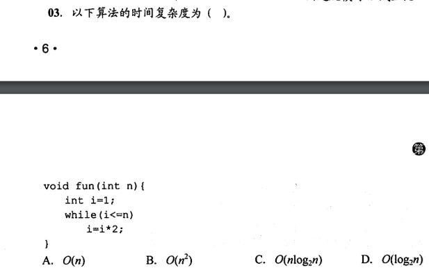

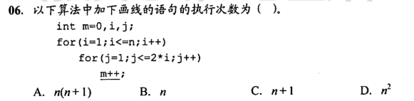

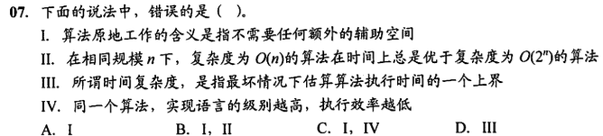

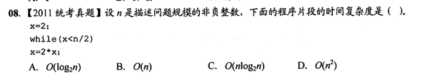

```python
这里注意 x < 而不是 <=
所以这里应该设 x*=2 的执行次数为t 这里是没问题的
则有  2^(t+1) < n/2 而不是 2^t < n/2
解的 t < log2(n/2)-1  然后就是数学运算得出
log2n - 2  

推推对数运算  log2(n/2)-1 = log2n-2

```

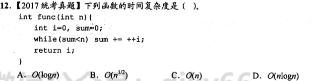

```python
★
这个题目的突破口在于要看出 i 的最终值 就是数量级，所以感觉看这种数据结构绝对不是什么套路是最好的，还是要看懂算法的本质
判断表达式是  sum<n
那先求sum和i的关系，循环可以知道sum最开始是0
所以sum = 0 + 1+2+3+4+5+....i = (0+i)(i-1) / 2
又因为 sum < N =>   i(i-1)/2 < N
由于关于的是数量级，所以左边可以看成 i^2 < N => i < N^(1/2)
```

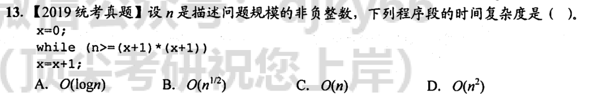

```python
这个题我记得以前是用正常的做法做出来的，设参数然后计算
不过现在的讲解是很容易
首先观察条件表达式是 n>=(x+1)^2
由于是数量级可以直接看成 x^2 <= n
化简一下可以知道 上界就是 n^(1/2)
里面是 x=x+1 可以知道本题的时间复杂度就是 n^(1/2)

总结：这个做法还是很有技巧性，直接把(x+1)^2 看成 x^2
```

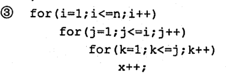

```python
这个题目的话，要求能算级数
级数要记得2个特别的
i 就是n^2   i^2就是 n^3
```

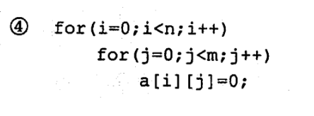

```python
内外无关，直接n*m次
O(mn)
```

# 线性表

## 顺序表

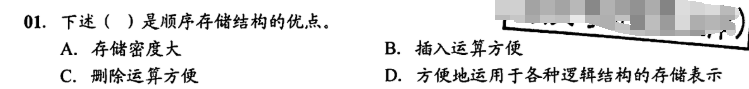

```c
选A
顺序表不要像链表一样存放指针域，因此存储密度大
B和C就不用多说了这些都是链表的优点
D的话，如果要实现树形结构，顺序表显然不如链表 表示的方便
```

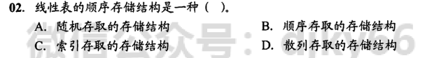

```python
选A
易错选B，注意！存取方式通常是指读写方式。
        	顺序表是可以支持随机存取的。根据 起始地址加上元素的序号。可以很方便的访问任意一个元素。这就是随机存取的概念
```

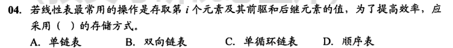

```python
题干要求是最快存取 i-1 i i+1
ABC3个链表，只能从头结点依次顺序查找，时间复杂度是O(n)
**只有**顺序表 可以根据序号随机存取，时间复杂度为O（1）
```

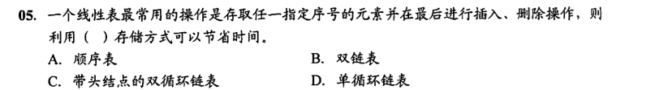

```python
        5.A
        	只有顺序表可以按照序号随机存取，且最后进行插入和删除操作时不需要移动任何元素
```

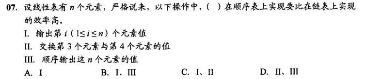

```PYTHON
★C
        	交换第3个元素和第4个元素的值，顺序表仅需3次操作
        	链表则需要分别找到两个结点前驱，第4个结点断链后再插入到第2个结点后，效率较低
        	对于 顺序输出n个值   。 需要顺序访问每个元素，时间复杂度相同
```

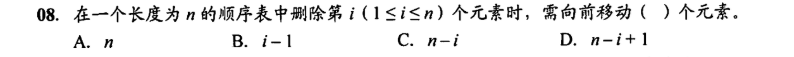

```PYTHON
        8.C
        	眼瞎，注意是顺序表的长度-i
```

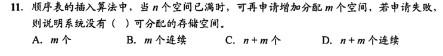

```PYTHON
★★★★ D
顺序表需要连续的存储空间，所以在申请存储空间的时候也一定是申请连续的存储空间
然后将 线性表 原来的 n个元素 复制到 新申请的 n+m个连续的存储空间的前n个单元
```

## 顺序表和链表

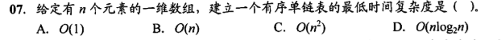

```python
D
若先建立链表，然后依次插入建立有序表，则每插入一个元素就需要遍历链表寻找插入位置，即直接插入排序，时间复杂度为O（n^2)
若先将数组排序，然后建立链表，建立链表的时间复杂度为O（n）
数字排序的最好复杂度为O（nlog2n），总时间复杂度为(nlog2n)
```

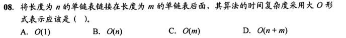

```python
C
      先遍历长度为m的单链表，找到该单链表的尾结点，然后将其next指向另一个单链表的首结点，其时间复杂度为O（m），因为需要遍历到尾结点，所以时间复杂度就是他的长度m
```

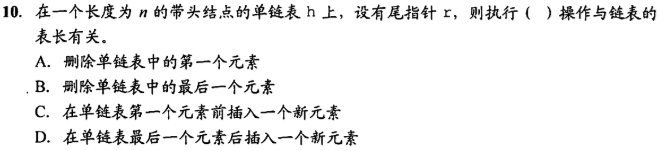

```python
    10.B
    	A:单链表又有头结点，跟表长无关
        B:删除最后一个元素，需要得到它的前一个结点。所以需要从头开始遍历
        C:不解释，有头结点
        D:在最后的元素后面新加，由于已经有 尾指针了，不需要从头开始遍历
```

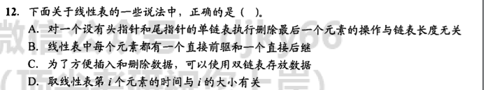

```python
C
    A:删除最后一个元素，需要得到它的前一个结点。所以需要从头开始遍历
    B:不解释
    C:不解释
    D:这个要看是不是顺序存储结构
```

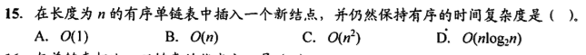

```python
B
设单链表递增有序，首先要在单链表中找到第一个大于x的结点的直接前驱p，在p之后插入该结点。
查找的时间复杂度为O（n），插入的时间复杂度为O（1），总时间复杂度为O(n)
```

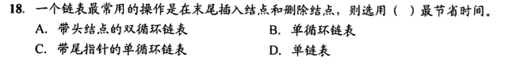

```c
A
容易错选C
在链表的末尾插入和删除一个结点时，需要修改其相邻结点的指针域。而寻找尾结点及尾结点的前驱结点时，只有带头结点的双循环链表要的时间最少
如果是C的话，它无法快速找到 尾指针的前驱结点，因为删除操作需要用到前一个
```

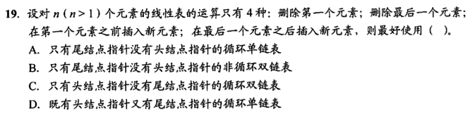

```python
C
易错A
由于删除最后一个元素，需要用到最后一个元素的前一个结点，这就涉及到访问前驱了。所以双链表更好
为什么可以不要尾结点呢？由于是 循环双链表，然后又有头结点，头结点的上个就是尾结点
```

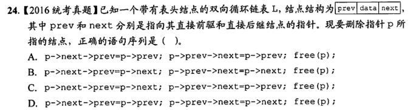

```PYTHON
D
错选B,纯粹是看错了，这题很简单，画图

```

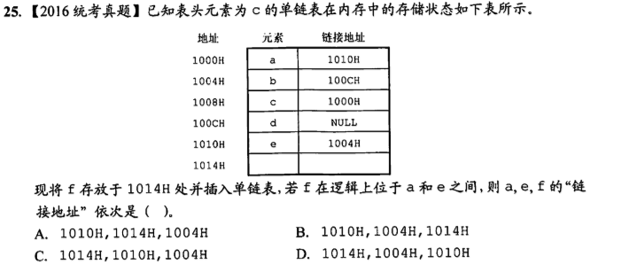

```python
D
妈的玩套路，做题目认真点
a     f     e
1014 1010 1004
所以直接就选了C， 但是题目问 a e f的分别地址，结果当然就是 1014 1004 1010了 
```

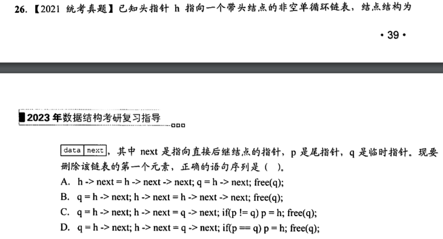

```python
D
选是选对了，但是不自信，我不理解为什么 C是错的，我感觉C也可能是对了，我只是因为觉得D更可能是对的 才选了D
这是运气和直感，不是绝对的掌握，C为什么是错的呢？
```

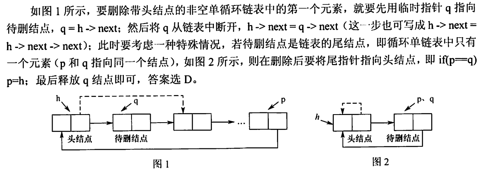

```python
主要点在if后会有 p=h这个操作
如果说 p!=q的话 不需要p=h
只有 p==q的情况才需要，图已经很清楚了
```

# 栈、队列


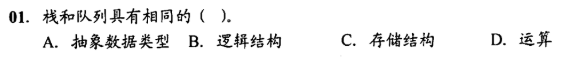

```python
B 
栈和队列的逻辑结构是相同的，都是线性表，只是它们对数据的运算不同
```


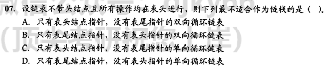


```python
C
 我觉得链栈只能用单向链表存储，都怪没认真听把。
 其实对于双向链表， 链栈也是可以实现的。
 对于双向循环链表，不管是表头指针还是表尾指针，都可以很方便地找到表头结点，方便在表头做插入或删除操作。而单循环链表通过尾指针可以很方便地找到表头结点，但通过头指针找尾结点需要遍历一次链表。对于C，插入和删除结点后，找尾结点需要花费O（n）的时间
```

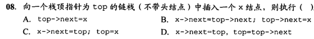


```python
c
  易错B
  注意，栈只能说是从头的前面插，而不是后面
  B的话 只能说是在头的后面插入，栈没有这种操作，那就不是栈了。还有就是要改变top指针
```

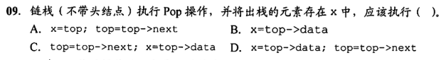

```python
D
  可能会纠结A，因为x是存储一个元素的操作，而不是存储一个结点
```

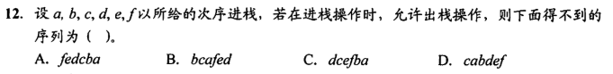


```python
D
	根据先进后出的特点，且在进栈操作的同时 允许 出栈操作，显然D中c最先出栈
    则此时栈内的元素必定是ab，但是由于a比b要先进栈，故要晚出栈。对于某个出栈的元素，在它之前进栈却晚出栈的元素必定是按逆序出栈的，其余答案均可能出现的情况
    ★ 此题也可采用给序列逐个带入的方法来确定是否有对应的进出栈序列
```

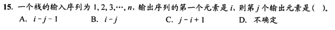

```python
D
	当第i个元素第一个出栈时，则i之前的元素可以依次排在i之后出栈，但剩余的元素可以在此时进栈并且也会排在i之前的元素出栈，所以j个出栈的元素是不确定的	
```

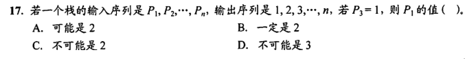


```PYTHON
C
	画图，一定不可能是2
    入栈是P1,P2,...PN 由于P3 = 1 ,所以p1 p2 p3 连续入栈后，第一个出栈元素是P3，说明p1p2是顺序进栈。
    所以p2必定在p1之前出栈。而第二个出栈就是2，所以不可能p1是2.
    D就不解释了。。。
```

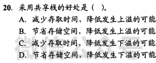

```c
B
	存取栈中的元素都只需要O(1)的时间，所以减少存取时间无从谈起，排除AC，另外，栈的插入和删除操作都是在栈顶进行的。
	所以栈 不可能下溢。排除CD
	
	
```

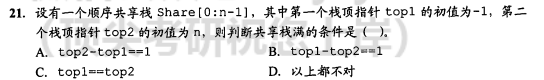

```
A
		这个公式画画图就可以了
		Top1+1=Top2 =》top2-top1=1
```

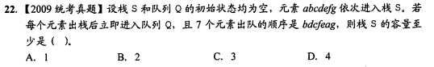

```python
C
	错了，还没学过队列，就害怕了，但是这个题和队列没关系
    其实非常简单，接题目就是把对应出栈的一个过程列表画出来，就知道栈内最多的时候有3个，所以至少要3个容量
    以下是图解
```

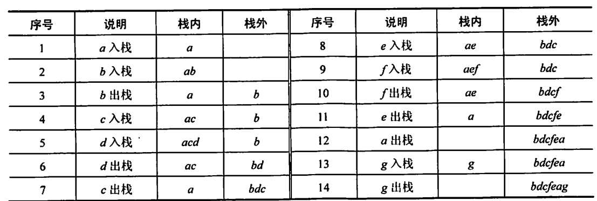

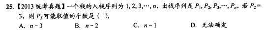

```python
C
	除了3本身其他都可以取
    所以是n-1
    结论得出可以 设n=5 再举例
```

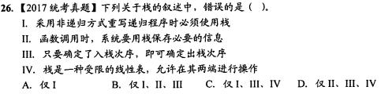

```python
C
	觉得第二个是对的，只是觉得
    三四必然是错的。所以选了C 侥幸对了
    分析
    	I：计算斐波拉契数列迭代实现只需要一个循环即可
        Ⅱ：函数调用时，系统都是使用栈保存必要的信息
```

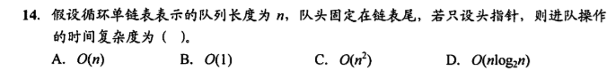

```c
A ★
	本题的数据结构是采用了  循环单链表，并且 只有头指针，没有头结点和尾指针。
	所以在只带头指针的循环单链表中要寻找 表尾结点，需要时间复杂度O(n).
```

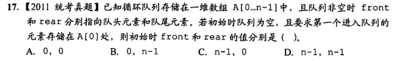

```C
B
	第一个元素进入队列后存储在A[0]处，===》推出此时 front=0  rear=0 【因为题目说非空时front和rear指的就是队头和队尾元素】
    由于是做的入队操作，所以 rear=(rear+1)%n=0  ==> rear 之前是 n-1
    入队操作，改变的是rear，不会改变front.故front原本的值也是0
```

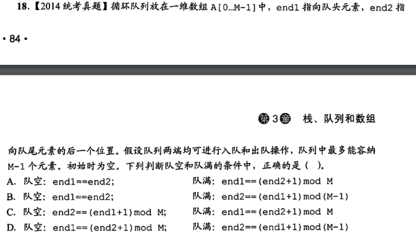

```python
A
	队空都是  front=rear
    注意这里队满有坑，公式的 front=(rear+1) %MaxSize
    即使他说了 最多能容纳M-1个元素，但是注意MaxSize指的是空间大小 就是M-1+1=M
```

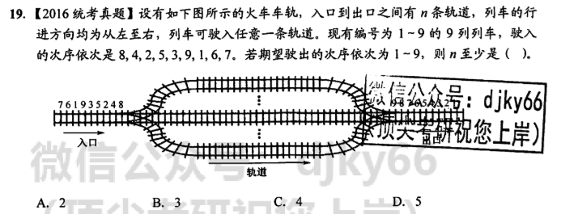


```PYTHON
C 好题目，值得多次思考

  98
7654
  32
   1
这样的四条轨道是最优次数
规律：
	先按照842539167的插
    ①
    	8
    ②
    	8
        4 # 因为4比8小，所以要开新列 如果跟8同列，一定是8比4先出， 这不符合出队顺序从小到大
    ③
    	8
        4
        2 #同理  2比前2条都小，开新轨道
    ④
    	8
       54 # 5比4和2都要大，优先插更大的4后面
        2
    ⑤
    	8
       54
       32 # 3比2大，比8和5小
    ⑥
       98 #9比8大
       54
       32
    ⑦
       98
       54
       32
        1 # 1比9，5，3都小，开新轨道
    ⑧
       98
      654 # 6比5，3，1都大，优先插最近的后面
       32
        1
    ⑨
       98
     7654 # 7比6,3,1大，优先插在6后面
       32
        1
```

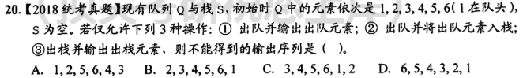

```python
C，好题 ，画图排除
	A:①①②②①①③③
    B:②①①①①①③
    D:②②②②②②③③③③③③
```

# 栈、队列应用

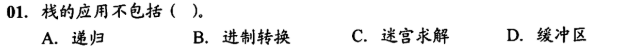

```python
栈的应用包括：递归、进制转换、迷宫求解，括号匹配、表达式求值、浏览器 
```

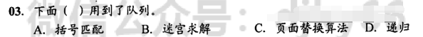

```python
队列的应用：页面替换算法、队列、图的广度优先搜索、树的层序遍历
```

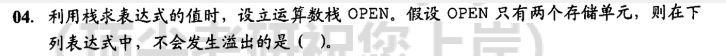

```python
错选D  ★ 要会画2个栈来记录
        利用栈求表达式的值时，可以分别设立运算符栈和运算数栈，其原理不变。选项B中A入栈，B入栈，计算的R1,
        C入栈，计算的R2，D入栈，计算的R3，由此的栈深为2.
        ACD依次计算栈深为4、3、3，因此选B
```

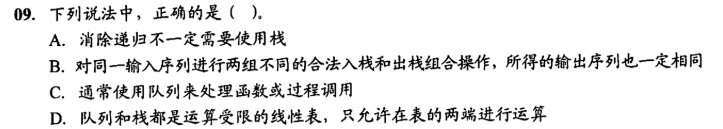


```python
A: 斐波拉契数列可以通过判断语句来实现
    B: 不解释
        C: 栈
            D: 栈只有一端可以
```

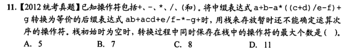

```python
A
    	重要题，画图
```


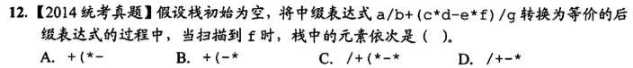

```python
B
    	重要题，画图
```

# 数组和特殊矩阵 ★ ★ ★ 


```python
C
    	梯形法：(上底+下底) x 高 x 1/2
        (1,1)
        (2,1)(2,2)
        (3,1)(3,2)(3,3)
        ....
        (n,1)(n,2)(n,3)(n,4)....(n,n)
        
        上底 = 1
        下底 = n
        高  = n
        => (1+n)n/2
```


```python
A
    	梯形法：(上底+下底) x 高 x 1/2
```


```python
D
    	要弄清楚起始地址，注意用三存储单元
```


```python
B
    	画图
        注意：三对角矩阵
        	先算其只有3个的行
            然后加上首或尾是只有2个的。这个画图观察
            最后判断是否要加1，看下标是从0开始还是从1开始
```


```python
    c
```


```python
B
    难，需要反复练习
```


```python
B
    注意，下面部分 是 30,29   30,30 30,30 不要加2了
    还有就是下标是从0开始的不用加一
```


```python
A
    易错题：注意 第五行应该是12 - 4
    建议可以推
    1:12
    2:11
    3:10
    4:9
    5:8
```


```python
c
    非常好的题目
```


```python
B
    易错题
    为什么最后是加5不是加6？
    
    通过3N+4去验证确实得不到220
    但是考试很容易301就填了
    结果如果直接算301要记得减一，因为是从0开始的
```


# 串的模式匹配


```python
C
    	注意，next数组是否整体加1都正确，需要根据题意分析
    	实际在KMP算法中，为了使公式简洁，计算简单，如果串的位序都是从1开始的
    	则next数组需要整体加1，如果串的位序是从0开始的，则next数组不需要整体加1
    	而这里的答案是整体-1
```

# 树与二叉树

## 树的基本概念


```python
A
    	n = x + 1
    	x = n - 1
```


```python
A
    	A: 树最高是n-3
    		取极限情况就是每层都只有1个，然后最后会有4个
    		0
    		0
    		0
    		..
    		0
    		0000
    		要画图，可以得到是n-3是这种最高的情况
    		所以B也错误
    	C：最多有4^(i-1)
    	错选D，树的度为4只能说明存在某结点正好（也最多）有4个孩子结点，D错误。
    	这个在混淆概念，不是得每层4个，而是说一定会有一个结点有4个儿子，不能说层
```


```python
A
    	画图
    	A：至少有h+3个结点
    		0
    		0
    		..
    		0000  h+3
   		BCD错误 最多是4^(i)个结点，指数关系
```


```python
B
    	求叶节点个数
    	问度为0的结点有多少个
    	结论：总结点数=总度数+1
    	=》 总结点数=122+1=123
    	然后再减去题目告诉你的
    	度为4的有20个
    	度为3的有10个
    	度为2的有1个
    	度为1的有10个
    	123-41=82
```

