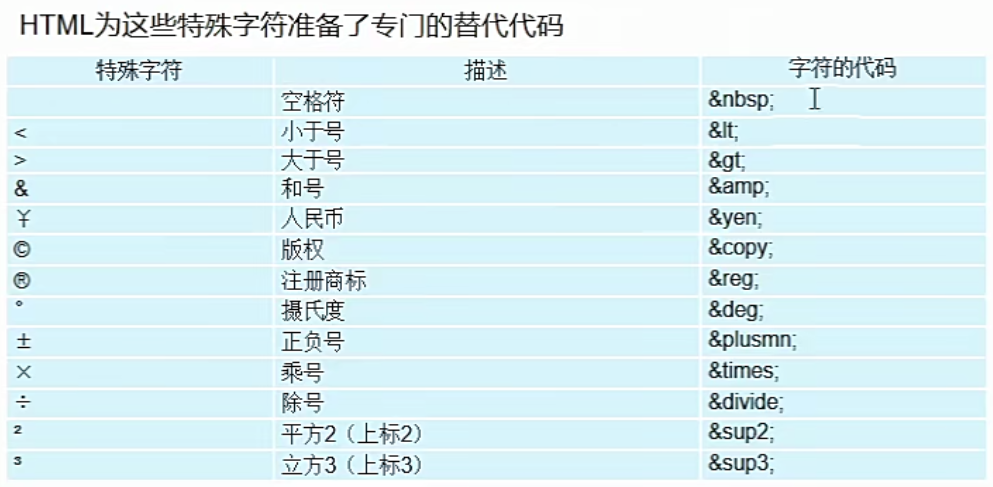

# 一 WEB简介

- 浏览器
	- ie:trident 内核
	- firefox:gecko 内核
	- opear:webkit 内核
	- safari:webkit 内核
	- chrome:webkit 内核一个分支 blink内核
- web标准
	- 结构：HTML用一股描述网页的结构
	- 表现：CSS用于控制页面的元素的样式[对网页进行装饰]
	- 行为：JavaScript用于响应用户操作[网页的动态效果]

- HTML
	- 超文本标记语言
	- 负责网页的三个要素之中的结构
	- HTML使用**标签**的形式来标识网页中的不同组成部分
	- 所谓超文本指的是**超链接**，使用超链接可以让一个页面跳转另一个页面

# 二 Hbuilder使用


# 三 HTML_CSS

## 3.1 简介

HTML:超文本标记语言，主要是通过HTML标记对网页中的文本、图片、按钮等内容进行描述

- HTML基本标签

```html
<!DOCTYPE html>   <!-文档类型的声明->
<html>
	<head>
		<meta charset="utf-8">
		<title></title>
	</head>
	<body>
	</body>
</html>
```

```xml
html:网站的跟标签，所有其他的标签都被包含
head:头部标签，关于网页的一些配置信息
<meta charset="utf-8">: 字符集设置或者叫编码设置

    
seo搜索引擎优化
<meta name="keywords" content="乃荣,博客,cnr"/>
<meta name="description" content="一枚小菜鸡的博客"/>
让爬虫搜索到的关键词和描述信息
    
title:标签标签
body:主题标签，所有在浏览器中显示的其他的内容和标签都包含
```


- 编码设置
	- gb2313 简单中文 包括6763个汉字
	- BIG5 繁体中文
	- GBK 包含全体中文字符，是gb2313的扩展，并且支持繁体字，兼容GB2312
	- UTF-8 包含全世界所有国家需要用到的字符

## 3.2 标签简介

- 标签的类型

```xml
- 双标签：有开始有闭合，例如:<html></html>
- 单标签(自结束标签)：例如:<meta> <meta />
```

- 标签的包含关系

```
嵌套关系：包好的关系，是祖先和后代之间的关系
并列关系：同级关系，是兄弟之间的关系
快捷键：ctrl + k 整理代码格式
```

## 3.3 常用标签1

### 3.3.1 标题

```html
<h1>
    标题
</h1>
```

### 3.3.2 段落

```html
<p>
    段落段落
    段落段落
    段落段落
</p>
```

### 3.3.3 水平线

```python
<hr />
```

### 3.3.4 换行

```
<br />
```

### 3.3.5 图片

```html

<!-- 
图片标签:
属性:属性名对应属性值的形式，也叫键值对，key/value,k/v
<人 姓名="乃荣" 性别="男" 身高="196"/>
src:图片的路径
width:图片的宽度 单位是像素，当单独分别设置宽度或者高度时，宽高会跟着等比缩放
height:一样
border:图片边框
title:提示文本
alt:替换文本 ： 当图片没有的时候会出现这个文字替换
-->


```

### 3.3.6 超链接

```html
<!-- a标签的属性：
href：网页的路径
target: _self 默认值 从当前选项卡直接跳转到目标页
		_blank 重新打开一个选项卡跳转到目标页
-->
<a href="./05超链接2.html" target="_self">去第二个网页</a>
<a href="./05超链接2.html" target="_blank">去第二个网页</a>


空链接和描点链接
href = #  默认跳转到页面顶端
href = ## 想要空链接没反应，我们通常写2个#

描点链接，跳转到指定地方 ， 设置一个id，  a标签就 #id
<p>段落</p>
<p>段落</p>
<font id = "one" color="yellowgreen">第一层</font>
<p>段落</p>
<p>段落</p>
<a href="#one">去第一层</a> 
```

### 3.3.7 背景图属性

```html
属性
背景色 bgcolor = "yellow"
背景图 backgroud = "url"
插入图和背景图的去别：插入图是img标签，标签在网页中是占位置的,背景图是属性，
属性是不占位置的，我们可以认为这个背景图就是一个丰富多彩的颜色
背景图的尺寸与标签的尺寸无关
```

### 3.3.8 列表

无序列表

```html
<!-- 
无序列表：是被一组ul管理，li列表项，ul只能包含li，li可以包含其他标签
-->
<ul>
    <li>电脑</li>
    <li>格子衫</li>
    <li>帽子</li>
    <li>假发</li>
    <li>
        <h1>伴侣</h1>
    </li>
    <li>
        <a href="##">车</a>
    </li>
</ul>
```

有序列表

```html
<ol>
    <li>电脑</li>
    <li>格子衫</li>
    <li>帽子</li>
    <li>假发</li>
    <li>
        <h1>伴侣</h1>
    </li>
    <li>
        <a href="##">车</a>
    </li>
</ol>
```

### 3.3.9 表格

```html
标签：
table 表格标签
tr 行标签
td 单元格标签 列默认是以当前列最宽的为准
th 表头标签
caption 表格标题

属性：
border 边框
width 宽度
height 高度
cellspacing 单元格与单元格之间的间距
align left(默认)居左/center(居中)
colspan 跨列合并单元格
rowspan 跨行合并单元格

<table border="1" width = 800px height = 300px cellspcing=0 align="center">
    <caption>学生详情：</caption>
    <tr align="center">
        <th>姓名</th>
        <th>年龄</th>
        <th>性格</th>
        <th>爱好</th>
    </tr>
    <tr align="center">
        <td >小明</td>
        <td>20</td>
        <td>开朗</td>
        <td>跑路</td>
    </tr>
    <tr align="center">
        <td>小妹</td>
        <td>17</td>
        <td>忧伤</td>
        <td>忧郁</td>
    </tr>
    <tr align="center">
        <td>李明</td>
        <td>18</td>
        <td>闷骚</td>
        <td>英语</td>
    </tr>
</table>
```


- 表格二

	

	```html
			<table border="1" align="center" width="600" height="300" cellspacing="0">
				<caption>
					<h1>课程表</h1>
				</caption>
				<tr align="center" bgcolor="red">
					<td>项目</td>
					<td colspan="5">上课</td>
					<td colspan="2">周末</td>
				</tr>
				<tr align="center" bgcolor="skyblue">
					<td>星期</td>
					<td>星期一</td>
					<td>星期二</td>
					<td>星期三</td>
					<td>星期四</td>
					<td>星期五</td>
					<td>星期六</td>
					<td>星期天</td>
				</tr>
				<tr align="center">
					<td rowspan="4">上午</td>
					<td>语文</td>
					<td>数学</td>
					<td>化学</td>
					<td>生物</td>
					<td>物理</td>
					<td>电竞</td>
					<td rowspan="4">休息</td>
				</tr>
				<tr align="center">
					<td>语文</td>
					<td>数学</td>
					<td>化学</td>
					<td>生物</td>
					<td>物理</td>
					<td>电竞</td>
				</tr>
				<tr align="center">
					<td>语文</td>
					<td>数学</td>
					<td>化学</td>
					<td>生物</td>
					<td>物理</td>
					<td>电竞</td>
				</tr>
				<tr align="center">
					<td>语文</td>
					<td>数学</td>
					<td>化学</td>
					<td>生物</td>
					<td>物理</td>
					<td>电竞</td>
				</tr>
				<tr align="center">
					<td rowspan="2">下午</td>
					<td>语文</td>
					<td>数学</td>
					<td>化学</td>
					<td>生物</td>
					<td>物理</td>
					<td>电竞</td>
					<td rowspan="2">休息</td>
				</tr>
				<tr align="center">
					<td>语文</td>
					<td>数学</td>
					<td>化学</td>
					<td>生物</td>
					<td>物理</td>
					<td>电竞</td>
				</tr>
			</table>
	```

### 3.3.10 表单

```html
表单标签：
lable 标题
属性:
for 关联表单中的id值
input
属性:
type
text 输入框
password 密码框
radio 单选按钮
属性:
name 是组的概念，将多个单选的name设置相同的名称，实现单选效果
checked 默认选中 第一种checked="checked" 第二种 checked=""
第三种 checked
checkbox 复选框
属性
checked 默认选中 第一种checked="checked" 第二种 checked=""
第三种 checked
button 普通按钮
submit 提交按钮
reset  重置按钮
select 下拉菜单
标签
option 下拉项
optgroup 下拉组
属性
label 下拉组标题

属性 
selected 默认选中 三种写法和checked一样
textarea 文本框
form 提交表单
属性
action 提交地址
method 提交方式 get/post
button 按钮
属性
type
button 普通按钮
submit(默认值) 条件按钮
reset 重置按钮
```

```html
		 <form action="http://www.baidu.com" method="get">
			<label for="txt1">姓名:</label>
			<input type="text" id="txt1"/>
			<br><br>
			<label for="txt2">密码:</label>
			<input type="password" id="txt2" />
			<br><br>
			性别:<input type="radio" name="gender" id="male"/><label for="male">男</label>
			<input type="radio" name="gender" id="famale" checked="checked"/><label for="famale">女</label>
			<br><br>
			学历:<input type="radio" name="edu" />本科
			<input type="radio" name="edu"/>小学
			<input type="radio" name="edu"/>幼儿园
			<br><br>
			您的国籍是：
			<select>
						 <option>中国</option>
						 <option selected="selected">日本</option>
						 <option>美国</option>
						 <option>韩国</option>
			</select>
			<select>
						 <optgroup label="亚洲">
							 <option>中国</option>
							 <option selected="selected">日本</option>
							 <option>美国</option>
							 <option>韩国</option>
						 </optgroup>
						 <optgroup label="欧洲">
							 <option>法国</option>
							 <option>德国</option>
							 <option selected="selected">意大利</option>
							 <option>法国</option>
						 </optgroup>
			</select>
			<br><br>
			您的兴趣爱好是：
			<input type="checkbox" />抽象
			<input type="checkbox" />喝酒
			<input type="checkbox" id="hair" checked /><label for="hair">烫头</label>
			<br><br>
			公司简介：
			<br><br>
			<textarea></textarea>
			<br><br>
			<input type="button" value="按钮"/>
			<input type="submit" value="提交" /> 
			<input type="reset" value="重置" />
			<button type="submit">按钮</button>
		 </form>
```

### 3.3.11 语义标签

```html
<!-- 
语义：标签基本都具备一定语义，爬虫会根据语义标签来获取文本信息

右侧除了具备显示效果之外更强调语义
-->
<b>加粗</b><strong>加粗</strong>
<i>倾斜</i><em>倾斜</em>
<u>下划线</u><ins>下划线</ins>
<s>删除线</s><del>删除线</del>
```

### 3.3.12 特殊字符



## 3.4 CSS基础上

CSS通常称为CSS样式表或层叠样式表，主要用于设置HTML页面中的文本内容（字体、大小、对齐方式等）、图片的外形（宽高、边框样式、边距等）以及版本的布局等外观显示样式。

CSS以HTML位基础，提供了丰富的功能，如字体、颜色、背景的控制及整体排版等，

而且还可以针对不同的浏览器设置不同的样式。

```html
<style type="text/css">
    /* css是属性的方式 */
    /* css位置 */
    /* 标签选择器 */
    h1 {
        /* 字体颜色 */
        color: red;
        /* 字号 chrome默认字号是16px */    
        font-size: 60px;
        /* 字体 chrome默认字体是微软雅黑*/
        font-family:  "宋体";
        /* 居中 */
        text-align: center;
    }
    p{
        color: blue;
        font-size: 14;
        /* 加粗  默认值是400  ，效果值是100.400.700*/
        font-weight: 700;
        /* 首行缩进 em单位  1em等于当前一个字号的大小 */
        text-indent: 2em;
    }
</style>
```

### 3.4.1 设置颜色的方式

```html
/* 颜色：红绿蓝 取值范围 [0,255] */
/* 第一种：单词的方式 */
/* color:blue; */
/* 第二种：十进制的方式 */
/* color: rgb(120,255,0); */
/* 第三种：十六进制的方式 */
/* color:#f40 */
```

### 3.4.2 盒子三属性

盒子：指的就是标签，在网页中都是一个一个大大小小的盒子组成

```html
div{
    /* 宽度 */
    width:200px;
    /* 高度 */
    height:200px;
    /* 背景色 */
    background: yellowgreen;
}
```

### 3.4.3 显示模式

```html
/* 
显示模式：
块级显示模式：独占一行，设置宽高起作用，在没有设置固定宽度时，和父元素的宽度一样 ☆
块元素：html,body,div,h1-h6,p,ul,ol,li,dl,dt,dd,hr,form

行内显示模式：一行有多个，设置宽高不起作用，尺寸由内容决定，在没有内容时，宽高是0
当行内元素有一个及以上空格时，显示效果之前会有一个默认的间距
行内元素：span,a,b,strong,i,em,u,ins,s,del

行内块显示模式：一行有多个，设置宽高起作用
行内块元素：img,表单标签
*/

显示模式转换
    其他显示模式转换成行内块模式:display:inline-block
    其他显示模式转换成块显示模式:display:block
```

### 3.4.4 标签选择器和类选择器

```html
/* 标签选择器    标签名{属性..........} */
/* 类选择器
定义类名称：用点开头+类名称
调用类名：用标签的class属性等于类名

类名的命名规范：不能用数字开头，可以用字母，下划线，数字，中划线自由组成
建议驼峰命名
*/
/* 定义类名称 */
.zz{
color:blue;
font-size: 30px;
}
.stu{
color: red;
font-size: 20;
}
```

### 3.4.5 多类名调用

```html
/* 
代码冗余：当一个代码片段重复性的复制张贴时候会造成代码执行的效率降低。
多类名调用：标签可以调用多个类名，类名之间用空格隔开
*/

<span class="blue font150">G</span>
<span class="red font150">o</span>
<span class="ygreen font150">o</span>
<span class="green font150">g</span>
<span class="y font150">l</span>
<span class="r font150">e</span>
```

### 3.4.6 id选择器

```html
id选择器
定义id名称:用#开头+id名称
调用id名称:id属性等于id名称，命名规范和类名是一样的

类名就像人的名字可以重复
id名字就像人的身份证是唯一的，通常是给js调用

#one{
color:red
}
<div id="one">我是一个DIV</div>
<div id="one">我是一个DIV</div>
```

### 3.4.7 css书写位置

```html
<style type="text/css">
    /* 第一种 内嵌式 ，将CSS代码嵌入到html文件中，css代码和html代码相对分离，代码耦合度相对较低
    在工作中偶尔使用
    */
    .one{
        color: red;
    }
</style>


<!-- 第二种：行内式  将css代码写在html中，两种代码掺和，代码耦合度很高，会有代码冗余，难维护-->
<!-- <div class="one" style="width: 100px;height: 100px;background: yellow;">我是div</div> -->
		   

<!-- 第三种方式：外链式 是将css代码单独写在css文件中，css代码和html代码绝对分离，代码耦合度极低
在工作中经常使用-->
<link rel="stylesheet" type="text/css" href="one.css"/>
```

### 3.4.8 css层叠性

```python
/* 
css层叠性：不同属性都可以实现,相同属性,在权重相同时后定义的会层叠(覆盖)先定义的
在权重不同时，谁的权重高，实现谁的

权重：
!import > 行内样式 > id选择器 > 标签选择器 > 类选择器
权重值小的范围越大，权重值越大的，范围越小
*/
```

### 3.4.9 块元素的默认宽度

```html
块元素的默认宽度：块元素在不设置固定宽度时，宽度和父元素一样
```

### 3.4.10 text-align=center

```html
text-align=center ：让标签中的文本，行内元素，行内块元素居中，但是不能让块元素居中

如果希望文本，行内元素，行内块元素水平居中，要给他们的父元素设置text-alingn:center
```

### 3.4.11 后代选择器

```html
基础选择器：标签选择器 类选择器 ID选择器
复合选择器：将基础选择器结合使用
		后代选择器 ： 选择器 选择器   用空格表示后代
.h5 .teacher{
color: red;
}
.h5 div h3{
color: blue;
}
.h5 h3{
color: #9ACD32;
}


<!DOCTYPE html>
<html>
	<head>
		<meta charset="utf-8">
		<title></title>
		<style type="text/css">
			.h5 .teacher {
				color: red;
			}

			.h5 div h3 {
				color: blue;
			}

			.h5 h3 {
				color: #9ACD32;
			}
			.java i{
				color: red;
			}
			i{
				color: #0000FF;
			}
			.java h3 i {
				color: yellow;
			}
			.java h3 .xr{
				color: #008000;
			}
		</style>
	</head>
	<body>
		<div class="h5">
			<h1 class="teacher">老刘</h1>
			<h3>前端组长</h3>
			<h3>前端学员</h3>
			<h3>前端学员</h3>
			<h3>前端学员</h3>
			<div>
				<h3>插班生1</h3>
			</div>
			<div>
				<h3>插班生2</h3>
			</div>
		</div>
		<div class="java">
			<h1 class="teacher">老王</h1>
			<h3>
				java组长
				<i>前女友</i>
				<i class="xr">现女友</i>
			</h3>
			<h3>java学员</h3>
			<h3>java学员</h3>
			<h3>java学员</h3>
		</div>
	</body>
</html>

```

### 3.4.12 css继承性

```html
/* 
css继承性：标签可以继承父辈元素关于设置文本的属性,继承是绝对优先的，比的
不是权重，是相对覆盖
*/
.box{
color: red;
font-size: 60px;
width: 500px;
height: 300px;
}
p{
color: yellow;
}
```

### 3.4.13 状态伪类

```html
/* 
状态伪类:
*/
/* 未访问状态 */
a:link{
    color: red;
}
/* 访问后状态 */
a:visited{
    color: yellowgreen;
}
/* 鼠标移入状态 */
a:hover{
    color: blue;
}
/* 鼠标按下状态 */
a:active{
    color: yellow;
}


/* 常用两种状态伪类 */
/* 默认状态 */
.chao{
    font-size: 60px;
    color: green;
}
/* 鼠标移入状态 */
.chao:hover{
    color: red;
}
```

### 3.4.14 行高和文本垂直居中

```html
/* 
行高：设置文本在元素中垂直方向的位置,当盒子没有设置固定高度时，高度会随着行高的变化而变化，高度
就是行高的值，因为文本默认要保持垂直居中盒子。当盒子设置固定高度时，高度不会随着行高的变化而变化。
反推：当希望一个元素中的文本垂直居中这个元素时，行高要等于盒子的高度
*/
div{
    background:pink;
    /* text-align: center; */
    line-height: 100px;
    height: 50px;
}
```

### 3.4.15 行间距

```python
/* 

文本分为四条线： 顶线，中线，基线，底线
行间距就是顶线到顶线的距离 或者说是  基线到基线的距离
*/
p{
    font-size: 40px;
    background: pink;
    line-height: 100px;
}
```

### 3.4.16 复合属性_font

```css
/* font的单属性 */
/* font-size: 40px; */
/* font-weight: 700; */
/* 设置倾斜 */
/* font-style: italic; */
/* 设置字体 */
/* font-family: "宋体"; */
/* line-height: 500px; */

/* font的复合属性 */
/* 是否倾斜 是否加粗 字号/行高 字体 */
font: italic 700 40px/500px "宋体";
font: 700 40px/500px "宋体";
/* 当单属性和复合属性同时存在时，要先写复合属性再写单属性，否则会被复合属性中你的值覆盖掉 */
```

### 3.4.17 复合属性_bordr

```css
.box{
    width: 200px;
    height: 200px;
    background: pink;
    /* border 边框单属性 */
    /* border-width: 5px; */
    /* 边框样式 solid实线 dashed虚线 dotted点状线 */
    /* border-style: dashed; */
    /* 边框颜色 */
    /* border-color: red; */

    /* 边框复合属性 */
    /* 粗细   样式   颜色 */
    /* border: 5px solid blue; */

    /* 左边框 */
    border-left: 5px solid red;
    /* 上边框 */
    border-top: 8px dashed black;
    /* 右边框 */
    border-right: 10px solid yellow;
    /* 下边框 */
    border-bottom: 4px solid yellowgreen;

    /* 设置边框没有 */
    border-bottom: none;
}
```

### 3.4.18 复合属性_background

```css
.box{
    width: 1000px;
    height: 700px;
    border: 1px solid black;

    /* background 单属性 */
    /* 背景色 */
    background-color:pink;
    /* 背景图 */
    background-image: url(../../day1/06网页跳转案例/img/liuzhiyuan.jpg);
    /* 平铺方式 */
    /* repeat 平铺(default) repeat-x 水平平铺 repeat-y 垂直平铺 no-repeat 不平铺*/
    background-repeat: no-repeat;

    /* 背景图在元素中的位置 */
    /* 水平位置 垂直位置    正往右下，也可以用center等单词*/ 
    background-position: 500px 300px ;

    /* 复合属性 */
    /*  背景色  背景图  平铺方式  水平位置 垂直位置 */
    background: blue url(../../day1/06网页跳转案例/img/liuzhiyuan.jpg) no-repeat center center;
}
```

### 3.4.19 盒子模型_padding

```css
/* 
盒子模型之内边距padding:设置盒子与内容之间的间距，当盒子设置内边距后，会撑大盒子的尺寸，
为了保证盒子尺寸不变，又需要有内边距的效果，要相应的从盒子的宽高减去撑大的尺寸

盒子在网页中的尺寸 = content区域(设置的宽高) + padding区域 + border 区域
*/
.box{
    width: 200px;
    height: 200px;
    background: pink;
    /* 左内边距 */
    /* padding-left: 10px; */
    /* 上内边距 */
    /* padding-top: 10px; */
    /* border: 10px solid red; */

    /* 内边距的复合属性 */
    /* 一个值 上下左右全是19*/
    padding: 10px;
    /* 两个值  上下10 左右20*/
    padding: 10px 20px;
    /* 三个值 上 左右 下*/
    padding: 10px 20px 30px;
    /* 四个值 上 右 下 左*/
    padding: 10px 20px 30px 40px;

}
.box .phone{
    width: 50px;
    height: 100px;
    background: yellow;
}


/* 
padding减宽度的场景：当块元素没有设置固定宽度时，宽度和父元素一样时，
给该元素这只水平方向的padding时，不会撑盒子，会从content自动减去padding值
宽度的尺寸是不变的
当块元素设置固定宽度时，此时设置水平方向的padding，盒子的尺寸会变大
*/
.box{
    height: 400px;
    background: pink;
}
.phone{
    height: 200px;
    background:red;
    font-size: 60px;
    font-weight: 700;
    padding-left: 100px;
}
```

### 3.4.20 盒子模型_margin

```css
/* 
外边距margin：是设置盒子与盒子之间的间距
*/
.box{
    width: 200px;
    height: 200px;
    background-color: pink;
    /* 左外边距 */
    margin-left: 100px;
    /* 上外边距 */
    margin-top:100px;
    /* 右边距 */
    margin-left: 100px;

    /* 复合属性 margin 四个值写法和顺序同padding一样*/
```

## 3.5 CSS基础中

### 3.5.1 外边距塌陷

```css
/* 
外边距塌陷：嵌套的两个块元素，给子元素设置向上的外边距，此时父元素会跟着掉下来
形成了外边距塌陷
解决方案：
1.给父元素设置上边框
2.给父元素设置overflow属性
3.给父元素设置浮动
4.给子元素设置浮动
*/
.box{
    width: 200px;
    height: 200px;
    background: pink;
    /* padding-left: 50px; */

    /* 方案一 */
    /* transparent 透明色 */
    /* border-top: 1px solid transparent; */

    /* 方案二 */
    overflow: hidden; 

}
.box .phone{
    width: 50px;
    height: 100px;
    background: blue;
    color: yellowgreen;
    margin-left: 50px;
    /* margin-top: 50px; */
}
```

### 3.5.2 overflow属性

```css
/* 溢出属性 
hidden 将超出的属性进行隐藏
scrool 竖着和横着都有滚动
auto 竖着滚动
*/

换行相关
/* 强制换行 */
word-break: break-all;
/* 强制不换行 */
white-space:nowrap
/* 字间距 */
letter-spacing: 10px;
```

### 3.5.3 块元素水平居中

```css
margin: 0 auto;
外边距水平居中:margin: 0 auto   ,水平左右外边距自适应
```

### 3.5.4 并集选择器

```css
/* 并集选择器：将多个选择器用逗号隔开，实现共同的属性 */
.box span,p,h1{
    border: 1px solid red;
}
```

### 3.5.5 CSS初始化

```css
/* 
清楚标签默认样式：标签会自带一些属性，需要对这些属性进行清零或者初始化工作
*/
/* 第一种 ，工作中项目不要使用*/
/* 星号是通配符，表示所有的html标签 */
*{
    margin: 0;
    padding: 0;		
}
/* 第二种 指定标签，工作中用这种*/
body,h1,h2,h3,h4,h5,h6,ul,ol,dl,dt,dd,p{
    margin: 0;
    padding: 0;
}
```


### 3.5.6 img底部留白


```python
img底部留白：由于img是行内块元素，底部和文本的基线对齐，所以会有一部分留白

解决方案：
1.转成块
display:block
2.字号改为0
```


### 3.5.7 浮动

```css
/* 
三种显示模式：块，行内块，行 被称为标准流
浮动：是一个属性float，浮动是一个脱离标准流的状态，也叫浮动流
当元素设置浮动后，按照标签的书写顺序，依次排列在包含块(父元素)的左上
*/
```

### 3.5.8 行内块和行内元素横线布局的问题

```
三种显示模式：块，行内块，行 被称为标准流
浮动：是一个属性float，浮动是一个脱离标准流的状态，也叫浮动流
当元素设置浮动后，按照标签的书写顺序，依次排列在包含块(父元素)的左上

行内块和行内元素横线布局问题

行内块布局问题：代码换行会有默认间距，行内块是alone基线对齐，当
给元素设置垂直方向的内外边距时，会影响周围的元素

行内元素布局问题：代码换行会有默认间距，行内元素是along基线对齐的，
当给元素设置垂直方向的内外边距时，由于受基线对齐的限制，垂直方向的内外边距是不起作用的

浮动横线布局：没有代码换行的间距，设置自身内外边距不会影响周围的元素
```

### 3.5.9 浮动布局

```css
浮动造成的影响：当子元素是浮动时，父元素没有设置固定高度，由于子元素飘起来的状态
父元素会认为没有内容撑开自身的高度，此时造成高度塌陷，父元素的高度是0

浮动元素最终是给父元素造成的影响
解决方案：
1.给父元素设置overflow属性   不是最好的，因为overflow同时还有溢出隐藏功能
2.额外标签法则  clear:both  清除之前的浮动造成的影响，让浮动元素占领位置
3.父元素调用clearFix类名（最好的）
此方法最好不用
4.给元素设置浮动   

.clearFix::after{
    content: "";
    display: block;
    clear: both;
}

浮动元素不在具备之前的显示模式，在不设置宽高时，是由内容决定

浮动元素当父元素的宽度不够时，会自动换行

```

### 3.5.10 浮动实现文本环绕

```css
/* 
浮动在最初是为了实现文本环绕效果
浮动实现文本环绕效果：
当元素设置浮动后，后面的文本不会被浮动元素盖住，而是对浮动元素进行文本环绕
*/

```

 ### 3.5.11 一级后代选择器

```css
.box>ul>li{
    border:1px solid red;
}
```

### 3.5.12 省略号代替溢出

```css
/* 用省略号代替溢出部分 */
text-overflow: ellipsis;
```


### 3.5.13 内联框架 

```html
		<!-- 
		 src 指定要引入的网页的路径
		 frameborder 指定内联框架的边框
		 -->
		<iframe src="https://www.baidu.com" frameborder="0"></iframe>
```

### 3.5.14 音视频播放

```css
<!-- audio 标签用来向页面中引入一个外部的音频文件 
音视频文件引入时，默认情况下不允许用户自己控制播放停止
属性：
controls 用户控制播放
autoplay 自动播放
但是目前大部分浏览器都不会自动对音乐进行播放
loop 音乐是否循环播放
-->
<audio src="source/周杰伦晴天.mp3" controls="" >点击播放</audio>

<!-- 
除了通过src来指定外部文件的路径，还可以通过source来指定
-->
<audio controls="">
<source src="source/周杰伦晴天.mp3"></source>
</audio>
```

### 3.5.15 属性选择器

```css
/*
	p[属性名]  选择含有指定属性的元素
	p[属性名=属性值] 选择含有指定属性和属性值的元素
	p[属性名^=属性值] 选择属性值以指定值开头的元素
	p[属性名$=属性值] 选择属性值以指定值结尾的元素
*/
```

### 3.5.16 伪类选择器

```css
伪类：不存在的类，特殊的类
	- 用来描述一个元素的特殊状态
		- 比如 第一个子元素、被点击的元素、鼠标移入的元素...
	- 伪类一般情况下都是使用:开头
		:first-child 第一个子元素
		:last-child 最后一个元素
		:nth-child(n) 选中第n个元素
			特殊值 n 表示全部选中
				 2n 或者 even 表示选中偶数个
				 2n+1 或者 odd 表示选中奇数个
			- 以上这些伪类都是根据所有的子元素进行排序
		:first-of-type
		:last-of-type
		:nth-of-type
			- 跟上面类似，但是是同类型排序的
		:not() 否定伪类
			- 将符合条件的元素从选择器中去除
			- li:not(:nth-child(3)) # 除了第三以外
```

### 3.5.17 伪元素

```css
尾元素，表示页面中一些特殊的并不真实存在的元素（特别的位置）
	尾元素使用 :: 开头
	:: first-letter 表示第一个字母
p::first-letter{
    font-size: 50px;
}
p::first-line{
    color: red;
}
p::selection{ 
    background-color: #FFFF00; 
}

::before 元素的开始
::after 元素的最后
before和after必须结合content属性来使用
```

### 3.5.18 文档流

```css
文档流（normal flow）
	- 网页是一个多层的结构，一层叠一层
	- 通过css可以分别为每一层来设置样式
	- 用户只能看到最顶上的一层
	- 这些层中，最底下的层称为文档流，文档流是网页的基础
		我们创建的元素默认都是在文档流中进行排序
	- 对于我们来说元素主要2个状态
		在文档流中
		不在文档流中(脱离文档流)
	- 元素在文档流中有什么特色的？
		- 块元素
			- 块元素在页面中独自一行
			- 默认宽度是父元素的全部（撑满父元素）
			- 默认高度是被内容撑开(子元素)
		- 行内元素
			- 行内元素不会独占页面的一行，只占自身的大小
			- 行内元素在页面中左向右水平排列，如果一行之中不能容纳所有的行内元素，则含内元素会换行
			- 行内元素的默认宽度和高度都是被内容撑开的


```


## 3.6 CSS基础下

### 3.6.1 相对定位

```css
定位 position
	- 定位是一种更加高级的布局手段
	- 通过定位可以将元素摆放到页面的任意位置
	- 使用position属性来设置定位
		可选值:
			static 默认值,元素是禁止的没有开启定位
			relative 开启元素相对定位
			absolute 开启元素绝对定位
			fixed 开启元素固定定位
			sticky 开启元素粘滞定位
	- 相对定位
		- 当元素的position属性值设置为relative则开启相对定位
		- 相对定位特点
			1.元素开启相对定位，如果不设置偏移量元素不会发生任何变化
			2.相对定位是参照元素在文档流中的位置来偏移的
	- 偏移量(offset)
		- 当元素开启定位，可以通过偏移量来设置元素的位置
			top
				- 定位元素和定位位置上边的距离
			bottom
				- 定位元素和定位位置下边的距离
			left
				- 定位元素和定位位置左边的位置
			right
				- 定位元素和定位位置右边的位置 
```

### 3.6.2 绝对定位

```html
绝对定位
	- 当元素的position属性值设置为absolute时,则开启了元素的绝对定位
	- 绝对定位的特点
		1.开启绝对定位后，如果不设置偏移元素的位置不会发生变化
		2.开启绝对定位后，元素会从文档流中脱离
		3.绝对定位会改变元素的性质，行内变成块，块的宽高被内容撑开
		4.绝对定位会使元素提升一个层级
		5.绝对定位元素是相对于其包含块进行定位的
		包含块
			- 正常情况下：
				包含块就是离当前元素最近的祖先块元素
			- 绝对定位情况下：
				包含块就是离它最近的开启了定位的祖先元素，只要position不是static 都开启了定位
				如果所有祖先元素都没开定位，则相对于根元素
```

### 3.6.3 固定定位

```python
固定定位
	- 将元素的position属性设置为fixed则开启了元素固定定位
    - 固定定位也是一种绝对定位，所以固定定位大部分特点和绝对定位一样
    	唯一不同的是固定定位永远参照游览器的视口进行定位
        固定定位的元素不会随网页的滚动条滚动
        
```

### 3.6.4 粘滞定位

```python
position:sticky
粘滞定位和相对定位的特点基本一致
不同的是粘滞定位可以在元素到达某个位置时将其固定
```

### 3.6.5 元素层级

```css
对于开启定位的元素，可以通过z-index属性来指定元素的层级
z-index需要一个整数来作为参数，值更大说明层级更高
	元素的层级越高越优先显示
假如三个值都一样，则优先显示源码靠下元素
父亲的元素层级再怎么样，也不会盖住后代
```


