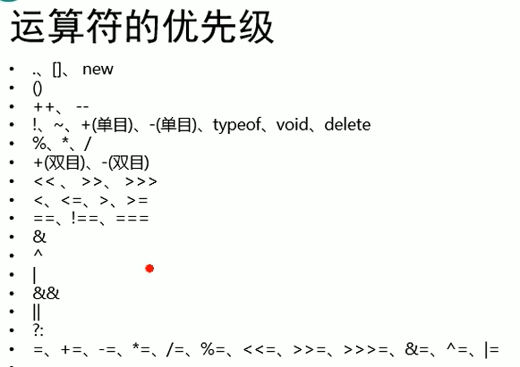
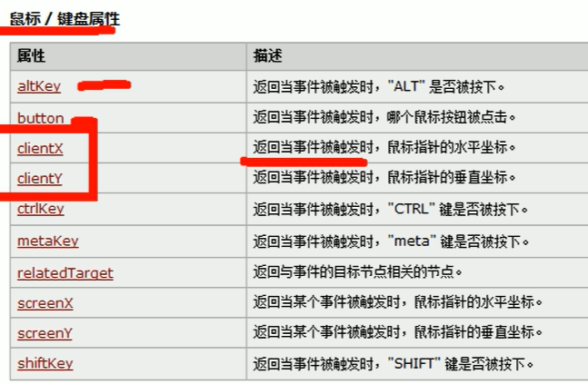
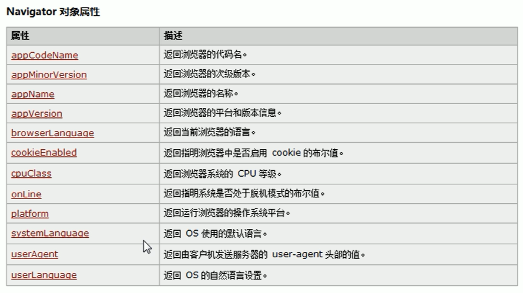
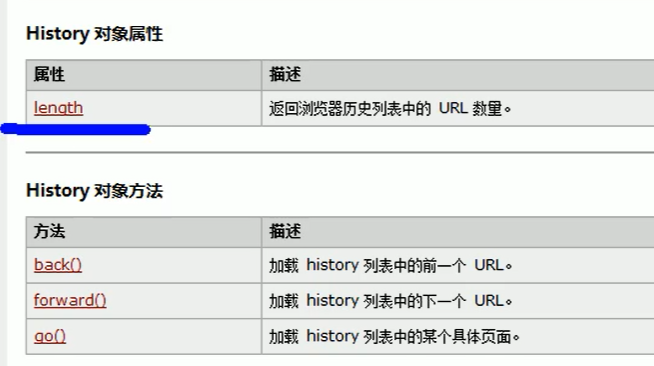
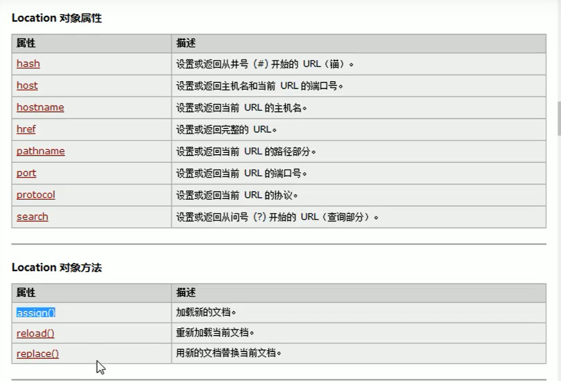
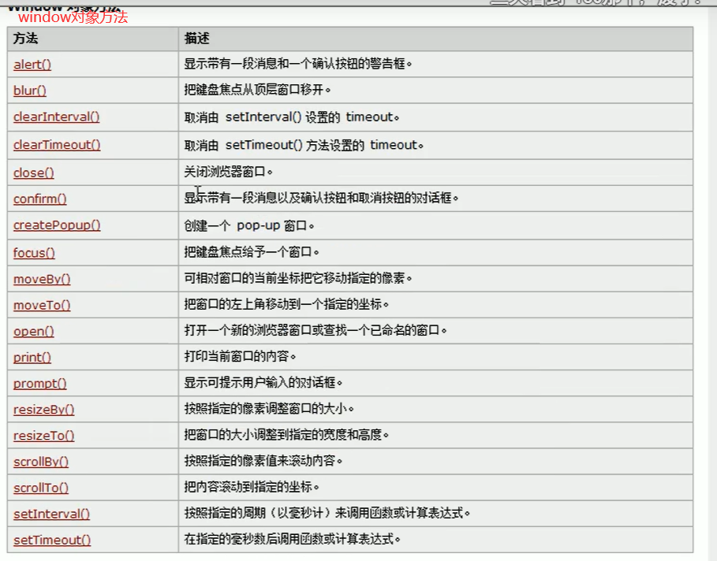
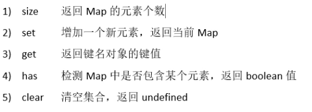

# 一 JS简介

- JS的特点
	- 解释型语言
	- 类似于C和JAVA的语法结构
	- 动态语言
	- 基于原型的面向对象

- helloworld

	```js
	// 弹窗输出
	alert("这是我的第一行JS")
	
	// body输出
	document.write("看我出不出来")
	
	// 控制台输出
	console.info("hello,world")
	```

- js代码编写位置

	```html
	<!-- 
	可以将js代码编写到标签的onclick属性中 
	当我们点击按钮时，js代码才会执行
	-->
	<button onclick="alert('讨厌别点人家')">点我一下</button>
	
	<!-- 
	可以将js代码写在超链接的href属性中，当点击超链接会执行js
	-->
	<a href="javascript:alert('点我')">你也点我一下</a>
	
	
	<!--
	可以将js代码编写到外部js文件中，然后通过script标签引入 
	耦合度低
	
	-->
	<script type="text/javascript" src="js/hello.js" ></script>
	
	
	
	<!--  JS代码需要编写到script标签中  -->
	<script type="text/javascript">
	    // alert("这是我的第一行JS")
	
	    // 让计算机在页面中输出一个内容
	    document.write("看我出不出来")
	    console.info("hello,world")
	</script>
	```

# 二 基本语法与数据类型

## 2.1 注释

```html
<script type="text/javascript">
    /*
            多行注释
            js注释
            和java类似
     */

    //  单行注释，真是和java一模一样
</script>
```

## 2.2 输出

```html
注意事项：
	1.js严格区分大小写
	2.js每一条语句有分号结尾
		不写也分号浏览器会自动添加，但是浪费系统资源
		而且有一些浏览器会加错，所以分号必须写
	3.js会忽略多个空格和换行，所以可以利用空格和换行对代码进行格式化(美化)

<script type="text/javascript">
    console.log("hello")
</script>
```

## 2.3 字面量和变量

```js
字面量：一些不可改变的值
	比如 1 2 3 4 5 "hello"
	字面量都是可以直接使用，但是一般都不会直接使用字面量
变量：变量可以用来保存字面量，而且变量的值是可以任意改变的
	变量更加方便我们使用，所以开发中会直接通过变量保存字面量

声明变量
在js中使用var关键字来声明一个变量
var a;
```

## 2.4 标识符

```js
标识符
js中所有的可以由自主命名的都叫标识符
标识符命名规则
1.标识符只能由字母、数字、下划线、$ 组成
2.不能由数字开头
3.不能使用ES关键字或保留字命名
```

## 2.5 基本数据类型

数据类型指的是 字面量 的类型

JS六个数据类型

1. 字符串 String
2. 数值 Number
3. 布尔值 Boolean
4. 空值 Null
5. 未定义 Undefined
6. 对象 Object

String Number Boolean Null Undefined 属于基本数据类型

Object属于引用类型

### 2.5.1 String

```python
# String字符串
 - 在js中使用字符串需要用引号括起来
 - 使用双引号或者单引号都行，避免混合使用
var str = "hello"
console.log(str)

在字符串中可以使用\ 作为转义字符
表示一些特殊字符可以使用转义符
\n
\t
\\
\"
\'
```

### 2.5.2 Number

```python
js中所有的数值都是Number类型
包括 整数和浮点数

运算符:typeof:用来检查一个变量的类型
语法:typeof 变量
    
    
JS中可以表示数字的最大值
Number.MAX_VALUE

Number.MIN_VALUE #注意这个是表示 ->0+ 最小的值


如果使用Number表示的数字超过了最大值，返回无穷大
Infinity  Infinity也是Number类型

NaN 是一个特殊的数字，表示Not A Numnber（不是一个数字）
NaN 也是Number类型

JS里面整数的运算基本可以保证精准
```

### 2.5.3 Boolean

```scala
Boolean 布尔值
布尔值只有两个 true or false

console.info(123 + 456)
var a = true + 1;
console.info(typeof a);
console.info(typeof true);

布尔值可以和数字运算
true 1
false 0
但是计算完的结果后会是number类型而不是boolean
```

### 2.5.4 Null和Undefined

```scala
var a = null;
console.log(typeof a);
typeof检查null值，返回的是object

Undefined 类型的值只有一个 undefined 表示未定义
typeof检查undefined值，返回的是Undefined
```

## 2.6 类型转换

```scala
强制类型转换
	- a类型强转b类型

其他 -> String
	方式一:
		调用toString()方法
		注意：null和undefined没有toString()
	方式二:
		调用String()函数


其他 -> number
	true -> 1
	false -> 0
	null -> 0
	undefined -> NaN
	总结：除了Undefined转NaN，其余都是1or0
	方式一:
		调用Number()函数
		var a = true;
        console.log(Number(a));
        
        var a = "1";
        console.log(Number(a)+1);
	方式二:
		这种方式专门用来对付字符串
		parseInt() 字符串->整数
		parseFloat() 字符串->浮点数
对于 var a = "123px1"
方法一 转化会变成NaN
方法二 会帮忙提取出顺序数字123，对于字符串兼容更强
		方法二对非String使用
		会先将其转为String，然后转数字
		var a = 198.23;
		a = parseInt(a); # 小数转整数

其他 -> Boolean
	使用Boolean()函数
		数字 -> Boolean		
            除了0和NaN 都是true
		字符串 -> Boolean
			除了空串,其余都是true
		null和undefined -> False
总结常见的False
0、NaN、''、null、undefined
```

| 值                       | 字符串操作环境            | 数字运算环境             | 逻辑运算环境 | 对象操作环境 |
| :----------------------- | :------------------------ | :----------------------- | :----------- | :----------- |
| undefined                | "undefined"               | NaN                      | false        | Error        |
| null                     | "null"                    | 0                        | false        | Error        |
| 非空字符串               | 不转换                    | 字符串对应的数字值       | True         |              |
| 空字符串                 | 不转换                    | 0                        | false        | String       |
| 0                        | "0"                       | 不转换                   | false        | Number       |
| NaN                      | "NaN"                     | 不转换                   | false        | Number       |
| Infinity                 | "Infinity"                | 不转换                   | true         | Number       |
| Number.POSITIVE_INFINITY | "Infinity"                | 不转换                   | true         | Number       |
| Number.NEGATIVE_INFINITY | "-Infinity"               | 不转换                   | true         | Number       |
| Number.MAX_VALUE         | "1.7976931348623157e+308" | 不转换                   | true         | Number       |
| Number.MIN_VALUE         | "5e-324"                  | 不转换                   | true         | Number       |
| 其他所有数字             | "数字的字符串值"          | 不转换                   | true         | Number       |
| true                     | "true"                    | 1                        | 不转换       | Boolean      |
| false                    | "false"                   | 0                        | 不转换       | Boolean      |
| 对象                     | toString()                | value()或toString()或NaN | true         | 不转换       |
| Symbol                   | toString()                | Error                    | true         | Symbol       |
| BigInt                   | toString()                | 不转换                   | 除0n都是true | BigInt       |


# 三 运算符

```scala
运算符也叫操作符
比如：typeof就是运算符，可以获得值的类型
```

## 3.1 算术运算符

```js
+
    数字进行正常加法计算
	字符串进行拼接
    2+NaN; NaN
    2+null; 2
    2+undefined; NaN
    2+NaN; NaN
    2+"NaN"; 2NaN
    2+true; 3
	任何值和字符串加,会转为字符串拼接，可以更方便的转字符串类型
-
    数字进行正常减法计算
	任何类型会自动转为number，包括字符串
    1-"5" ; -4
*
    数字进行正常乘法计算
    任何类型会自动转为number，包括字符串
/
    数字进行正常除法计算
	任何类型会自动转为number，包括字符串
%
    数字进行正常取余计算
	任何类型会自动转为number，包括字符串
    
总结：除了+ 任何算术运算符都会转number
技巧："1"-0 直接转成数字1  （隐式类型转换）
可以通过给值 -0 *1 /1 将其转Number
可以通过给值 +""      将其转String
```

## 3.2 一元运算符

```js
一元运算符：只需要一个操作数

+  正号
-  负号

可以做隐式转换，任意转为Number
console.log(+123);123
console.log(-123);-123
console.log(+true);1
console.log(+"123");123
console.log(+undefined);NaN
console.log(+null);0
console.log(+"");0
console.log(+"12aa");NaN
console.log(1 + +"2" + 3);6
```

## 3.3 自增和自减

```js
a++  // a=a+1
a-- //  a=a-1
--a
++a

注意它没有隐式转换，只有整数可以使用
```

## 3.4 逻辑运算符

```js
三种逻辑运算符
&& 且 
|| 或
!  非

可以隐式转换
console.log(!""); t
console.log(!"asdasd"); f
console.log(!0); t
console.log(!1); f
console.log(!null); t
console.log(!NaN); t
console.log(!undefined);t

console.log(undefined || "啦啦啦"); # 啦啦啦

```

## 3.5 赋值运算符

```js
= : 右边赋值给左边
+=
-=
*=
。。。
```

## 3.6 比较运算符

```js
>
<
>=
<=
==
===
关系运算符=》命题=》布尔值=》true || false

如果比较的是字符串，则比较ascii码值

使用==的时候，如果两边类型不同，会将其转成同一个类型
"1" == 1 =》 1 == 1  大部分情况是转数字
true == "1" => 1 == 1 => true


undefined 衍生自 null
所以这两个值做相等判断时，会返回true
undefined == null => true

NaN 不跟任何值相等
NaN == NaN 都是False
要通过 isNaN()函数来判断一个值是否为NaN
isNaN("b") # true 隐形转换 

!= 不等于
和==一样会做一些转换

=== 全等
	用来判断两个值是否全等，它和==类似，但是它没有隐式转换
	两个值类型不同，直接false
!== 不全等
	用来判断两个值是否不全等，它和!=类似，但是它没有隐式转换
	两个值类型不同，直接true
```

## 3.7 三元运算符

```js
, 可以分割多个语句，一般声明多个变量使用
var a=1,b=2,c=3;

语法:
	a>b?a:b
var a=20;
var b=30;
a > b ? alert(a):alert(b);

var max = a > b ? a:b;
console.info(max);
```

## 3.8 运算符优先级



# 四 流程控制

通过流程控制语句可以控制程序执行流程

语句的分类

- 条件判断语句
- 条件分支语句
- 循环语句

## 4.1 代码块

```js
js中可以使用{}来为语句进行分组
	同一个{}中的语句称为是一组语句
    要么都执行，要么都不执行
    一个{}中的语句称为一个代码块
js中的代码块，只具有分组的作用，无其他作用
	代码块内部的内容，在外部是完全可见的
{
	alert("hello");
    console.log("你好");
    ducument.write('语句')；
}
```

## 4.2 条件判断语句

```js
使用条件判断语句可以在执行某个语句之前进行判断
如果条件成立才会执行语句，条件不成立则语句不执行

if语句
语法一:
if(条件表达式)
	语句
    
var a = 10;
if (a>10)
    alert("a比10大~~~");
	alert("谁也管不了我");
if 语句只能控制紧随其后的那个语句
所以它没法管 谁也管不了我
做法：加代码块


if(条件表达式){
    语句
}

语法二
if(条件表达式){
    语句
}else{
    语句
}
    
语法三
if(条件表达式){
    语句
}else if(条件表达式){
    语句
}else if(条件表达式){
    语句
}else{
 	语句   
}
    
    
prompt()可以弹出一个提示框，该提示框会带有一个文本框
	- 用户可以在文本框中输入内容，该函数需要一个字符串作为参数
	- 该字符串将会作为提示框的提示文字
	- 用户输入的内容将会返回为字符串
```

## 4.3 条件分支语句

```js
条件分支语句也叫switch语句
语法：
switch(条件表达式){
	case 表达式：
        语句
        break;
    case 表达式：
        语句
        break;
    default:
        语句
        break;
}

```

## 4.4 while循环

```js
向页面输出连续的数字
do...while语句在执行时，会先执行循环体
	循环体执行以后，再对while的条件表达式判断
    如果结果为true，则继续执行循环体，执行完毕继续依次推


while(){
      
      }

do{
    
}while()
```

## 4.5 for循环

```js

for(var i = 0;i < 10 ; i++){
    alert(i);
}

for循环中三部分可以省略,写在外部
var i = 0;
for(;i<10;){
    alert(i++);
}

死循环
for(;;){
    alert("hello")
}
```

## 4.6 break和continue

```python
break关键字可以用来退出switch或者循环语句
break:退出整个循环
continue:退出本次循环
```


## 4.7 循环名label

```js
可以为循环创建一个label标识当前的循环
label：循环语句
使用break语句时候，可以在break后跟着一个label
这样break将会结束指定的循环，而不是最近的

outer:
for(var i = 0;i<5;i++){
    for(var j =0,j<5;j++){
        break outer; # 直接退出外部循环
    }
}
```

## 4.8 计时器

```
console.time() # 可以用来开启计时器
他需要一个字符串作为参数，这个字符串将会作为计时器的标识

console.time("test");
代码块
console.timeEnd("test") # 用来停止计时器，也需要计时器名字

```

# 五 对象

## 5.1 对象简介

```js
对象属于一种复合的数据类型，在对象中可以保存多个不同数据类型的属性

对象的分类：
1.内建对象
	- 由 ES 标准中定义的对象，在任何的ES的实现中都可以使用
    - 比如：Math String Number Boolean Function..
2.宿主对象
	- 由 JS 的运行环境提供的对象，目前来讲主要是由浏览器提供的对象
    - 比如 BOM DOM
    - console.log()
	- document.write()
3.自定义对象
	- 由 开发人员 自己创建的对象
```


## 5.2 对象基本操作

```js
// 使用new关键字调用的函数，是构造函数constructor
// 构造函数是专门用来创建对象的函数

var obj = new Object();
console.log(typeof obj);
console.log(obj);

// 在对象中保存的值称为属性
// 向对象添加属性
//   语法：对象.属性名 = 属性值;

// 向obj中添加一个name属性
obj.name = "孙悟空";
obj.gender = "男";
obj.age = 18;
console.log(obj);

// 读取对象中的属性
//	语法：对象.属性名
//  如果读取的对象中没有这个属性，不会报错，放回undefined
console.log(obj.name);
console.log(obj.age);
console.log(obj.gender);
console.log(obj.class);

// 修改对象的属性值，和添加一样
obj.name = "猪八戒";
obj.gender = "女";
obj.age = 20;
console.log(obj);

// 删除对象的属性
//	语法：delete 对象.属性名


使用字面量来创建一个对象
var obj = {};
console.log(obj);
var obj2 = {name:"乃荣",age:18,gender:"男"}
```

## 5.3 属性名和属性值

```
对象的属性名不强制要求标识符的规范
如果要使用特殊的属性名，不能使用.的方式来操作
需要使用另一种方式
语法：对象['属性名'] = 属性值
obj["123"] = 789
取得时候也得这么取

使用[]操作属性更加的灵活，在[]中可以直接传递一共变量，这样变量值是多少就会读取那个属性

属性值
JS对象的属性值可以是任意的类型，甚至是一个对象


in 运算符
	通过该运算符可以检查一共对象中是否含有指定的属性
		如果有则放回True，没有则放回False
	语法
		"属性名" in 对象
```

## 5.4 引用数据类型

```
基本数据类型
	String Number Boolean Null Undefined
引用数据类型
	Object
var a = new Obejct();
var b = a;
a['name'] = 'cnr'
console.log(b);
# b也会一起修改赋值
```

## 5.5 方法

```js
var obj = new Object();
obj.name = "孙悟空";
obj.age = 18;


如果把函数作为对象的属性则可以叫做方法
var obj = new Object();
obj.name = "乃荣";
obj.age = 18;
obj.sayName = function(){
    console.info("我的名字是:"+this.name);
}

obj.sayName();
console.log(obj);
```

## 5.6 枚举对象中的属性

```
对象是可以直接遍历的
但是它是 for in 语句和python有一点像，但是它是在括号里面，并且这个i得自己var哦！
默认遍历出来的是 属性名
for(var i in obj){
	console.log(i);
}
如何遍历对象？
for(var i in obj){
	console.log(i,obj[i]);
	
}
```

## 5.7 this

```js
解析器在调用函数每次都会像函数内部传递进一个隐含的参数
这个隐含的参数就是this,this指向的是一共对象
这个对象是函数执行的上下文对象
根据函数的调用方式不同，this会指向不同的对象
	1.以函数的形式调用，this永远都是window
    2.以方法的形式调用，this永远都是当前方法的对象

function fun(a,b){
    console.log("a = "+a+", b = "+b);
    console.log(this);
}
fun();

var obj = {
    name:"顺悟空",
    sayName:fun
};
obj.sayName();
```

## 5.8 工厂方式创建对象

```js
var obj = {
    name:"孙悟空",
    age:18,
    gender:"男",
    sayName:function(){
        alert(this.name)
    }
}
var obj2 = {
    name:"猪八戒",
    age:28,
    gender:"男",
    sayName:function(){
        alert(this.name)
    }
}
var obj3 = {
    name:"沙和尚",
    age:38,
    gender:"男",
    sayName:function(){
        alert(this.name)
    }
}

这样比较辛苦，用工厂模式

// 通过该方法可以大批创建类似的对象
function createPersion(name,age,gender){
	//创建一个新的对象
    var obj = new Object()
    obj.name = name;
    obj.age = age;
    obj.gender = gender;
    obj.sayName = function(){
        alert(this.name);
    }
    return objl
}

var obj2 = createPersion("猪八戒",28,"男");
var obj3 = createPersion("白骨精",18,"女");
var obj4 = createPersion("蜘蛛精",16,"女");
console.info(obj2);
console.info(obj3);
console.info(obj4);

```

## 5.9 构造函数

```js
使用工厂模式创建的对象，使用的构造函数都是Object
所以创建的对象都是Object这个类型
就导致无法区分多种不同类型的对象

构造函数就是一个普通函数，创建方式和普通函数一样
不同的是构造函数习惯上首字母大写

构造函数和普通的区别就是调用方式不同
普通函数是直接调用，构造函数需要使用new关键字来调用

构造函数的执行流程:
	1.立即创建一个新的对象
	2.将新建的对象设置为函数中this,在构造函数中可以使用this来引用新建的对象
	3.逐行执行函数中的代码
	4.将新建的对象作为返回值
	
构造函数可以当作是类    
使用同一个构造函数创建的对象，称为一类对象，也将一个构造函数称为一个类
per 叫做 persion类 的实例
function Person(name,age,gender){
    this.name = name;
    this.age = age;
    this.gender = gender;
    this.sayName = function(){
        console.info(this.name);
    }
}
var per = new Person("孙悟空",20,"男");
console.log(per);
per.sayName();

// 使用 instanceof 可以检查一个对象是否是一个类的实例
console.log(per instanceof Person);


this的情况
1.当以函数的形式调用时，this是window
2.当以方法的形式调用时，谁调方法this是谁
3.当以构造函数的形式调用时，this就是新创建的那个对象

目前存在一个问题，上面直接在构造函数里面创建了一个sayName方法
这样会导致，构造函数每执行一次会创建一个新的sayName方法
说明所有实例的sayName都是唯一的，这样就导致了构造函数执行一次就会创建一个新的方法，执行10000次就会创建10000个方法。但是这10000个方法又是一模一样的，属于浪费行为。如何让所有实例共享同一个方法啊？

☆：将sayName方法在构造函数内定义 ，在全局作用域实现
function Person(name,age,gender){
    this.name = name;
    this.age = age;
    this.gender = gender;
    this.sayName = fun;
}
function fun(){
    alert("Hello，我是："+this.name)
}

```

## 5.10 原型

```js
原型 prototype
只要是函数，解析器都会向函数添加一个属性prototype
	这个属性对应一个对象，这个对象就是原型对象
如果函数作为普通函数调用prototype没有任何作用
当函数作为构造函数调用时，它所创建的对象都会有一个隐含的属性
	指向该构造函数的原型对象，我们可以通过__proto__访问该属性

原型对象就相当于一个公共区域，所有同一类的实例都可以访问到原型对象
	可以将对象中共有的内容，统一设置到原型对象中，所有实例都可以直接继承这个属性

以后创建构造函数时，可以将对象中共有属性和方法，统一添加到构造函数的原型对象中

// 注意 原型对象也有原型对象
// Object对象的原型没有原型，如果在Object中依然没找到，则undefined，反正可以找到Object这个超级爷爷
// ☆
// 方法补充：对象.hasOwnProperty() 检查对象中是否含有该属性
// 使用该方法只有当前对象自身含有的属性才会返回true


function Person(name,age){
    this.name = name
    this.age = age
}
Person.prototype.sayName = function(){
    console.log("我的名字是:",this.name);
}

var per = new Person("孙悟空",18);
var per2 = new Person("猪八戒",28);
var per3 = new Person("沙和尚",38);
console.log(per);
console.log(per2);
console.log(per3);
per.sayName();
per2.sayName();
per3.sayName();
```

## 5.11 toString

```python
当直接在页面中打印一个对象时，实际上输出的对象的toString()方法的返回值
如果希望在输出对象时，不输出[object Object] 可以添加一个toString方法

function Person(name,age,gender){
    this.name = name;
    this.age = age;
    this.gender = gender;
}
var per = new Person("孙悟空",18,'男');
Person.prototype.toString = function(){
    return "我是一个快乐的对象";
}
// var result = per.toString();
// console.log(result)
console.log(per);
```

## 5.12 垃圾回收

```js
当一个对象没有引用计数，此时会被当做垃圾回收
```


# 六 函数

## 6.1 函数定义

```python
函数
	- 函数也是一个对象
	- 函数中可以封装一些功能(代码)，重复调用
	- 创建一给二回熟对象
	var func = new Function();
var fun = new Function("console.log('hello 这是第一个函数')")
	- 调用函数：函数对象()
fun()
	- 开发中很少使用构造函数来写函数对象
    - 使用函数声明来从创建函数
    语法
    function 函数名([形参1,形参2,...形参N]){
        
        
    }
    写法二
    function fun2(){
        console.log("sb");
    }
    fun2()
    
    写法三 匿名函数
    var fun3 = function(){
        console.log("dsb");
    }
```

## 6.2 函数参数

```
js的实参传递可以不用根据形参的数量来
调用函数时，解析器不会检查实参的数量和类型
多余实参不会被赋值
如果实参的数量少于形参的数量，则没有对应实参的形参将会是undefined
其余跟python一样
```

## 6.3 返回值

```
reutrn 返回值  # 可以返回一切甚至是函数
如果没有返回值，则是 undefined
```

## 6.4 立即执行函数

```js
(function(){
    alert("我是一个匿名函数~~~");
})()

缺点：只能执行一次
```

## 6.5 作用域

```
和python一样，两种特别的作用域
1.全局作用域
	- 直接编写在script比标签中的js代码，都在全局作用域
	- 生命周期：页面打开出生，页面关闭销毁
	- 全局作用域有一个对象window，可以直接使用
		- window代表一共浏览器窗口，由浏览器创建可以直接使用
		- 事实上全局变量都会保存到window里面，成为window对象里面的属性
2.函数作用域
	- 在函数function中的变量
	- 生命周期：函数调用出生，调用结束销毁
	- 每调用一次函数，都是全新的函数作用域，是独立的
	
	
	
	
变量声明提前
	- 使用var关键字声明的变量，会在所有代码被执行之前声明
        console.log(a);
        var a = 123;
        并不会报错！但是undefinend，在var a = 123 时赋值
        如果声明变量时候不用var关键字，则会直接报错
函数声明提前
	- 使用  function 函数名(){}  语法创建的函数
		它会在所有代码执行之前就被创建，所以可以在函数声明前调用
	- 使用  var  函数名 = function(){} 语法创建的函数
		他会被提前创建，但是会是undefined，无法调用
	
	
var a = 123
function fun(){
	a = 456
}
fun()
alert(a); 456  注意js中，局部修改全局变量不加var就可以了不用global
```

## 6.6 call和apply

```
         * call()和apply()
         *  - 这两个方法都是函数对象的方法，需要通过函数对象来调用
         *  - 当对函数调用call()和apply()都会调用函数执行
         *  - 调用call和apply 可以将一个对象指定为第一个参数
         *      -   此时这个对象会成为函数的this
         *      call() 方法可以将实参在对象之后依次传递
         *          fun.call(obj,2,3)
         *      apply() 方法需要将实参封装到一个数组中统一传递
         *          fun.apply(obj,[2,3])
```

## 6.7 arguments

```js
* arguments
    * 在函数调用时，浏览器会自动传递两个隐含的参数
    * 1.函数的上下文对象this
        * 2.封装实参的对 arguments
            *  - arguments是一个类数组对象,它也可以通过索引来操作数据，也可以获取长度
            *  - 在调用函数时，我们所传递的实参都会封装到arguments中
            *  - arguments有一个属性callee
            *      这个属性对应一个函数对象，就是当前正在执行的函数的对象
            *    
            *  - 
            */
function fun(){
    console.log(arguments.length);
    console.log(arguments);
}
fun(1,2,3,4);
```


# 七 数组

## 7.1 数组简介

```js
数组也是一个对象
也是用来存储一些值
不同的是普通对象使用字符串作为属性名
而数组会使用索引来访问值

索引：
	从0开始的整数就是所以
数组的存储性能比普通对象要好

数组的创建
var arr = new Array();

数组添加元素
语法：数组[索引] = 值
arr[0] = 1;

js的数组越界并不会报错，而是返回undefined

// 数组的长度（对于连续的数组是元素的个数，对于不连续的是 最大索引+1）  所以尽量创建连续的数组
arr.length  # 注意length是属性，不是方法

length可以直接修改，修改后会影响数组的数值

// 向数组的最后一个位置添加元素
arr[arr.length] = 70;
arr[arr.length] = 80;
arr[arr.length] = 90;
console.log(arr);

// 使用字面量来创建数组
语法：[]
var arr = [];
console.log(typeof arr)

// 使用字面量创建数组可以直接指定元素
var arr = [1,2,3,4,5,10];

// 使用构造函数也可以指定元素创建数组
但是这么做如果你只有一个参数，就会被单做是数组的长度
var arr = new Array(1,2,3,4); 

// 数组的元素可以是任意类型，甚至是对象
```

## 7.2 四个方法

```js
1.push() // 方法可向数组的末尾添加一个或多个元素，并返回新的长度
2.pop() // 该方法可以删除数组的最后一个元素，并返回删除的元素
3.unshift() // 和push差不多，向开头添加一个或多个元素，并返回新的长度
4.shift() // 该方法可以删除数组的第一个元素，并返回删除的元素
```

## 7.3 数组遍历

```js
console.log("==================");
for(var i in arr){
    console.log(arr[i]);
} 
console.log("==================");
for(var i = 0;i<arr.length;i++){
    console.log(arr[i]);
}
console.log("==================");


# 使用 forEach 遍历
arr.forEach(fn)方法需要一个函数作为参数，
	- 像这种函数，由我们创建但是不由我们调用的，称为回调函数
	- 数组中有几个元素，函数就会执行几次
	- fn这个函数的参数就代表arr的每一个元素
arr.forEach(function(a){
    console.info(a);
})
arr.forEach(function(value,index,c){
    console.info(value,index,c);
})
	- 回调函数中总共会有3个参数
	- 第一个：元素值
	- 第二个：索引
	- 第三个：数组本身
```

## 7.4 slice和splice

```js
var arr = ['孙悟空','猪八戒','沙和尚','唐僧','白骨精'];

/**
         * slice(start,end)
         *  - 可以用来从数组提取指定元素,类似于python的切片,它也是包头不包尾的
         *  - 第二个参数可以省略不写，表示结尾
         *  - 索引可以传递负值，负值下标和python一样
         * 
         */
console.log(arr.slice(0,2));
/**
         * splice
         * - 可以用于删除数组中的指定元素
         * - 会影响原数组，将指定切片从原数组中删除
         * - 有返回值，返回值是被删除元素
         *      第三个及以后
         *          可以传递一些新的元素，这些元素将会自动替换删除的元素
         */
arr.splice(0,2)
console.log(arr);
```

## 7.5 数组去重

```js

var arr = [1,2,3,2,2,1,3,4,2,5];

for(var i = 0;i<arr.length;i++){
    for(var j = i + 1 ;j<arr.length;j++){
        if (arr[i] == arr[j]){
            arr.splice(j,1);
            j--
        }
    }
}
console.log(arr);
```

## 7.6 常用方法

```js
        var arr = ['猪八戒','孙悟空','沙和尚'];
        var arr2 = ['白骨精','玉兔精','蜘蛛精'];
        /**
         * concat(*args) 连接多个数组，并将新的数组返回
         *      - 该方法不影响原数组
         */
        console.log(arr.concat(arr2,arr2));


        /**
         * join(str)
         *      - 该方法可以将数组转为字符串,数组由指定str拼接,默认是逗号
         */
        console.log(arr.join(""));
        console.log(arr.join());
        
        /**
         * reverse(arr)
         *       - 该方法用来反转数组(前边的去后边，后边的去前边，注意不是排序)
         *       - 修改原数组
         */
        console.log(arr);
        arr.reverse();
        console.log(arr);

        /**
         * sort(arr)
         *      - 该方法对元素进行大小排序 ，比python的垃圾一点，它是按照编码排序的，既是是数字也是按照编码排序
         *      - 需要修改排序规则，添加回调函数
         *          回调函数中需要定义两个形参
         *          浏览器将会分别使用数组中的元素作为实参去调用回调函数
         *          浏览器会根据回调函数的返回值来决定元素的顺序
         *              如果返回一个大于0，则元素会交换位置
         *              如果返回一个小于0，则元素位置不变
         *              如果返回一个等于0，则元素位置不变
         *      - 修改原数组
         */
        arr = [6,5,3,2,-1,11]
        console.log(arr);
        arr.sort(function(a,b){
            return a-b; # 或者 b - a
        });
        console.log(arr);
```

# 八 常用对象

## 8.1 Date

```js
        /**
         * Date对象
         *  - 在JS中使用Date对象来表示一个时间
         * 
         */ 
        //创建一个Date对象
        //如果直接使用构造函数创建一个Date对象，则会封装为当前代码执行的时间
        var d = new Date();
        console.log(d);

        //创建一指定的时间对象
        //需要在构造函数中传递一个表示时间的字符串作为参数
        //日期的格式 月份/日/年 时:分:秒
        var d2 = new Date('12/03/2016 11:30:10');
        console.log(d2);

        // getDate() 获得当前对象是几号
        var date = d.getDate();
        console.log(date);

        // getDay() 获得一周中的第几天
        var date = d.getDay();
        console.log(date);

        // getMonth() 获得几月
        var date = d.getMonth();
        console.log(date);

        // getFullYear() 获得年份
        var date = d.getFullYear();
        console.log(date);

        // getTime() 获得时间戳
        var date = d.getTime();
        console.log(date);
```

## 8.2 Math

```js
        /**
         * Math
         *  - Math和其他的对象不同，它不是一个构造函数
         *      它属于一个工具类不用创建对象，它里边封装了数学运算的工具
         * 
         * Math.abs() 求绝对值
         * Math.max(a,b) 求最大值
         * Math.ceil() 向上取整
         * Math.floor() 向下取整
         * Math.round() 四舍五入
         * Math.random() 返回0~1的随机数
         * Math.pow(x,y) 返回x的y次方
         * Math.sqrt() 开平方根
         */
```

## 8.3 包装类

```js
        /**
         * 基本数据类型
         *  String Number Boolean Null Undefined
         * 引用数据类型
         *  Object
         * 在JS中为我们提供了三个包装类，通过这三个包装类可以将基本数据类型的数据转换为对象
         *  String()
         *      - 可以将基本数据类型转换为String对象
         *  Number()
         *      - 可以将基本数据类型转换为Number对象
         *  Boolean()
         *      - 可以将基本数据类型转换为Boolean对象
         * 
         *  在实际开发中，不会使用基本数据类型的对象，因为在和引用类型比较的时候逻辑是不存在的
         * 
         *  好处，
         */ 

         // 创建一个Number类型的对象
         var num = new Number(3);
         console.log(num);
         console.log(typeof num);
         var str = new String("hello");
         console.log(str);
         console.log(typeof str);
         var bool = new Boolean(true);
         console.log(bool);
         console.log(typeof bool);

         //向numb中添加一个属性
         num.hello = 'abcdefg';
         var a = 3;
         a.hello = "你好";
         console.log(a.hello);
         console.log(num.hello);
```

## 8.4 String

```python
/**
* 在底层字符串是以字符数组的形式保存的
* ["H","e","l"]
* 
* charAt() 返回指定索引的字符
* charCodeAt() 返回指定索引的字符的编码
* fromCharCode() 可以根据字符编码去获取字符
*      rusult = String.fromCharCode(65) # result:A
* 
* concat() 连接多个字符串 ， 作用和+号一样
*      result = str.concat("你好","再见")
* indexof(x,start) 检索一个字符串中是否含有指定子串x,有则返回下标，没有返回-1   start表示从哪里开始查找
* lastindexof(x)  该方法作用和上面一样，但是是从后门开始找的
* slice(start,end) 可以用来截取指定的内容，不会影响字符串。           可以传递负数索引
* substring(start,end) 可以用来截取字符串，和slice类型   不同的是不能接收负数。
* substr(start,length) 也是用来截取字符串，但是第二个参数不同，意思是截取长度
* split()  字符串转数组，默认是以空格切分的
* toUpperCase()  字母转大写    
* toLowerCase()  字母转小写
*/
```

## 8.5 正则表达式

```js
<script>
    /**
         * 语法：
         *  方法一：使用构造函数创建
         *   var 变量 = new RegExp("正则表达式","匹配模式")  匹配模式有默认值
         * 
         *  方法二：使用字面量创建正则表达式
         *   var 变量 = /正则表达式/匹配模式
         * 
         * 匹配模式:
         *  i  忽略大小写
         *  g  全局匹配模式
         * 
         * 方法:
         *  正则表达式的方法
         *      test()
         *          检测一个字符串是否符合正则表达式的规则
         *          可以检测一个字符串中是否含有该规则
            字符串可以接收正则表达式的方法

         *      str.split()
         *          其实字符串中的split可以直接传递正则表达式也能拆分  str.split(/[A-z]/) 非常灵活
         *      str.search()
         *          可以搜索字符串中是否有指定内容，有就返回第一次的索引，没有返回-1，可以接收正则表达式
         *      str.match()
         *          从第一个字符串中将符合条件的内容提取出来
         *      str.replace()
         *          将指定的正则表达式进行替换
         */

var reg = new RegExp("a",'i');
var result = reg.test("bcbcA");
console.log(result);

var reg = /a/i
var rusult = reg.test("bcbcA");
console.log(rusult);

//创建正则表达式，检查字符串是否有a或b   | 表示或者的意思  a|b  或者是字符集 [ab]
var reg = /[ab]/;
console.log(reg.test('bcd'));

//检查是否有字母
var reg = /[A-z]/;
console.log(reg.test('Z'));

</script>
```


# 九 DOM

##  9.1 基本概念

```
什么是DOM
- DOM 全称Document Object Model 文档对象模型
- JS中通过DOM来对HTML文档进行操作。只要立即了DOM久可以随心所欲的操作WEB页面
- 文档
	- 文档表示的是整个HTML网页文档
- 对象
	- 对象表示将网页中的每一个部分都转换为了一个对象
- 模型
	- 使用模型来表示对象之间的关系，这样方便我们获取对象

什么是节点
- 节点Node，是构成我们网页的最基本的组成部分，网页中的每一个部分都可以成为一个节点
- 比如：html标签、属性、文本、注释、整个文档等都是一个节点
- 虽然都是节点，但是实际上他们的具体类型是不同的
- 比如：标签是元素节点、属性是属性节点、文本是文本节点、文档是文档节点
- 节点的类型不同，属性和方法也都不尽相同
- 常用四类节点
	-	文档节点
	-	元素节点
	-	属性节点
	-	文本节点
```

```
节点的属性
- 文档节点：#ducument 9 null
- 元素节点：标签名 	   1 null
- 属性节点：属性名     2 属性值
- 文本节点：#text     3 ★文本内容
```

## 9.2 事件

```js
事件
- 事件，就是文档或浏览器窗口中发生的一些特定的交互瞬间，比如，点击按钮、鼠标移动、关闭窗口。。
- JavaScript 与 HTML 之间的交互是通过事件实现的
- 

onclick:鼠标单击
ondblclick:鼠标双击
onmousermove:鼠标移动

<button id="btn">我是一个按钮</button>
<script>
    /**
    * 浏览器已经为我们提供文档节点对象，这个对象是window属性
    * 可以在页面中直接使用，文档节点代表的是整个网页
    * 
    */
    // console.log(document);
    //获取到button对象
    // var btn = document.getElementById("btn");
    //修改按钮的文字
    // btn.innerHTML = '123';

    //可以为按钮的对应事件绑定处理函数的形式来响应事件
    var btn = document.getElementById("btn");
    //绑定单击事件  
    btn.onclick = function(){
    	alert("你还点~~~");
    }
</script>
```

## 9.3 文档的加载

```js
浏览器加载一个页面时，是按照自上向下的顺序加载的
	读取一行就运行一行
    如果script标签写在head里面，在代码执行的时候，页面还没有加载
    所以建议script写在body的最后，这样是为了在页面加载完之后执行js 
```

## 9.4 dom基本方法和属性

```
- 通过document对象调用
1.getElementById()
	- 通过id属性获取一个元素节点对象
2.getElementsByTagName()
	- 通过标签名获取一组元素节点对象
3.getElementsByName
	- 通过name属性获取一组元素节点对象
4.childNodes 属性
	- 表示当前结点的所有子节点
	4.1 children 获得所有子元素
5.firstChild 属性
	- 表示当前结点的第一个子节点
	5.1 firstElementChild 获得第一个子元素
6.lastChild 属性
	- 表示当前结点的最后一个子节点
	6.1 lastElementChild 获得最后一个子元素
7.parentNode 属性
	- 表示当前节点的父节点
8.previousSibling 属性
    previousElementSibling; // 获得前一个兄弟元素
	- 表示当前节点的前一个兄弟节点
9.nextSibling 属性
	- 表示当前节点的后一个兄弟节点
10.innerHTML 属性
	- 获取元素内部的所有内容
11.innerText 属性
	- 获取元素内部的文本内容
12.body 属性
	- document可以直接获取body标签对象
13.documentElement 属性
	- 保存的是html根标签对象
14.getElementsByClassName() 方法
	- 根据class属性值查询一组元素元素节点对象
15 querySelector() 方法
	- 需要一个选择器的字符串作为参数，可以根据一个css选择器来查询一个元素节点对象
	- 如果有多个满足条件的只会返回第一个
16 querySelectorAll() 方法
	- 该方法和15一样，可以返回所有满足的
```

## 9.5 选框属性

```
通过选框的checked属性可以来获取或设置多选框的选中状态 true或者f
- checked 多选框属性状态
```

## 9.6 增删改

```js
document.createElement()
	- 创建一个元素节点对象
	- 需要一个标签名作为参数，根据标签名创建元素节点对象
	- 并将创建好的对象作为返回值返回
document.createTextNode()
	- 创建一个文本节点对象
	- 需要一个字符串作为参数，根据字符串创建文本节点对象
	- 并将创建号的对象作为返回值返回
appendChild()
	- 向一个父节点中添加一个新的子节点
	- 用法：父节点.appendChild(子节点);
insertBefore()
	- 可以在指定的子节点前插入新的子节点
	- 语法：
		父节点.insertBefore(新节点,旧节点)
replaceChild()
	- 可以使用指定的子节点替换已有的子节点
	- 语法：父节点.replaceChild(新,旧)
removeChild()
	- 可以删除一个子节点
	- 语法:父节点.removeChild(子节点)
常用语法
	子节点.parenNode.removeChild(子节点)

```

## 9.7 细节总结

```
1
点击超链接以后，超链接会跳转页面，这是超链接的默认行为
但是此时我们不希望出现默认行为，可以通过在响应函数的最后return，false来取消默认
2.弹出带有确定和取消的提示框
confirm() 需要一个字符串作为提示文字参数  返回true或者false

3.for循环会在页面加载完成之后立即执行
而响应函数会在超链接被点击时才执行
当响应函数执行时，for循环早已执行完毕
```


## 9.8 操作css

```
通过js修改元素的样式
语法:元素.style.样式名 = 样式值

注意：Css属性带—的转为驼峰命名法
无法直接读取css的原来属性
```

读取当前css

```js
ie:元素.currentStyle.样式名
其他:window.getComputedStyle()这个方法来获取元素当前的样式
	第一个参数：要获取样式的元素
    第二个参数：可以传递一个伪元素，一般不用，传null
    window.getComputedStyle(box1).width
注意这2个方法都是只读的，不能修改，修改还是需要元素.style.样式名
```

```css
clientWidth
clientHeight
	这两个属性可以获取元素的可见宽度和高度
	这些属性是不带px的，返回是数字
	会获取元素的宽度和高度，包括内容区和内边距
	这是只读的不可以改
offsetWidth
offsetHeight
	获取元素的整个宽度和高度
	这是只读的不可以改
offsetParent
	可以获取当前元素的定位父元素
	会获取到离当前元素最近的开启了定位的祖先元素
```

## 9.9 事件对象

事件对象 

 - 当事件的响应函数被触发时，浏览器每次都会将事件对象作为实参传递进响应函数
   	- 在事件对象中封装了当前事件相关的一切信息，比如：鼠标的坐标 键盘哪个按键被按下 鼠标滚轮的方向。。

```
onmousemove
	- 该事件将会在鼠标在元素中移动时触发

```

event



pageX和pageY相对于页面的xy

event.target表示触发事件的对象 

​	target.className 表示class的值

- 事件冒泡
  - 所谓的冒泡指的是事件的向上传导，当后代事件触发时，其祖父元素的相同事件也会被触发
  - 在开发中，大部分的冒泡都是很有用的
  - 如果不希望发送事件冒泡，可以通过事件对象取消冒泡
  - event.cancelBubble = true


- 事件委派
  - 我们希望，只绑定一次事件，即可应用到多个元素上，即使元素是后添加的
  - 可以将其绑定给元素的父元素
  - 这样当后代元素的事件触发时候，会一直冒泡到祖先元素从而通过祖先元素的响应函数来处理事件，这样可以提高程序的性能，减少绑定次数

- 事件绑定

  - 使用 对象.事件 = 函数的形式绑定响应函数

  - 他只能同时为一个元素的一个事件绑定一个响应函数

  - 不能绑定多个，如果绑定了多个，后面会覆盖前面的

  - addEventListener()

    - 通过这个方法也可以为元素绑定响应函数

    - 参数：

      1. 事件的字符串，不要on
      2. 回调函数，当事件触发时，函数会调用
      3. 是否在捕获阶段触发事件，需要一个布尔值，一般都传false-

    - ```js
      var btn01 = document.getElementById('btn01');
      btn01.addEventListener('click',function(){
          alert(1)
      },false)
      btn01.addEventListener('click',function(){
          alert(2)
      },false)
      ```

    - 可以同时绑定多个响应函数不会覆盖

- bind实现

  ```js
  function bind(obj,eventStr,callback){
      if(obj.addEventListener){
          //大部分浏览器兼容的方式
          obj.addEventListener(eventStr,callback,false);
      }else{
          //ie8 及其以下
          obj.attachEvent("on"+eventStr,function(){
              callback.call(obj);
          });
      }
  }
  ```

- 事件的传播三个阶段

  1. 捕获阶段

     在捕获阶段时从最外层的祖先元素，向目标元素进行事件的捕获，但是默认此时不会触发事件

  2. 目标阶段

     事件捕获到了目标元素，捕获结束开始在目标元素上执行事件

  3. 冒泡阶段

     事件从目标元素向祖先元素传递，依次触发祖先元素上的事件

    如果希望捕获阶段就触发事件，将addEventListener的第三个参数设置为true

## 9.10 拖拽

```js
// 完成可以使用拖拽box1元素
/*
             拖拽流程：
                1.当鼠标在被拖拽元素按下时开始拖拽   onmousedown
                2.当鼠标移动时，被拖拽的元素跟着鼠标移动    onmousemove
                3.当鼠标松开时，固定在当前位置，结束拖拽  onmouseup
            */
var box1 = document.getElementById('box1');
box1.onmousedown = function (event) {
    event = event || window.event;
    var ol = event.clientX - box1.offsetLeft;
    var ot = event.clientY - box1.offsetTop;
    document.onmousemove = function (event) {
        event = event || window.event;
        var left = event.clientX - ol;
        var top = event.clientY - ot;
        box1.style.left = left + "px";
        box1.style.top = top + "px";
    }
    document.onmouseup = function(){
        // 取消 ommousemove
        document.onmousemove = null;

        //取消document.onmouseup事件
        document.onmouseup = null;
    }

}

```

## 9.11 滚动

```js

/*
                当鼠标滚轮向下移动时候，box1边长
                当向上移动时候，box1变短
            */
var box1 = document.getElementById('box1');
//为box1绑定一个鼠标滚轮事件
//onmousewheel会在鼠标滚动时触发，但是火狐不支持该属性
//火狐中需要使用一个DOMMouseScroll 来绑定滚动事件
//该事件需要addEventListener()函数来绑定

box1.onmousewheel = function(event){
    event = event || window.event;
    //判断鼠标的滚动方向 上+ 下-  只看正负不看大小
    //其他浏览器使用wheelDelta
    //火狐中使用detail来判断方向 上- 下+
    if (event.wheelDelta >= 0 | event.detail < 0){
        box1.style.height = box1.clientHeight - 14 + "px";
    }else{
        box1.style.height = box1.clientHeight + 14 + "px";
    }
    //假如是通过addEventListener()方法绑定的响应函数，默认取消
    //不能使用return false，用event.preventDefault()

    // 希望不要窗口也跟着滚动
    return false;
}
```

## 9.12 键盘事件

```js
/*
                键盘事件
                onkeydown
                    - 按键被按下
                onkeyup
                    - 按键被松开

                键盘事件一般都会绑定给一些可以获取焦点的对象
            */
document.onkeydown = function(event){
    event = event || window.event;
    // keyCode 来获取按键的编码
    // key     来获取按键的名字
    // altKey  判断alt
    // ctrlKey 判断CTRL
    // shiftKey 判断shift
    console.log(event.key);
}
var in1 = document.getElementById('in1');
in1.onkeydown = function(event){
    event = event || window.event;
    console.log(event.keyCode)
    //    return false
}
```

# 十 BOM

## 10.1 简介

```
BOM
	- 浏览器对象模型
	- BOM可以使我们通过JS来操作浏览器
	- 在BOM中我们提供了一组对象，用来完成对浏览器的操作
	- BOM对象
		- Window
			- 代表的是整个浏览器的窗口，同时window也是网页中的全局对象
		- Navigator
			- 代表的当前浏览器的信息，通过该对象可以来识别不同的浏览器
		- Location
			- 代表的当前浏览器的地址栏，通过Location可以获取地址信息，或者操作浏览器跳转页面
		- History
			- 代表的浏览器的历史记录，可以通过该对象来操作浏览器的历史记录
			- 由于隐私保护，该对象不能获取到具体的历史记录，只能操作浏览器向前或向后翻页
			- 而且该操作只在当前范围生效
		- Screen
			- 代表用户的屏幕信息，通过该对象可以获取用户的显示器的相关信息


这些BOM对象在浏览器中都是作为window对象的属性保存的，可以通过window对象来使用，也可以直接使用
```


## 10.2 Navigator

代表的当前浏览器的信息，通过该对象可以来识别不同的浏览器

由于历史原因，Navigator对象中你的大部分属性都已经不能帮助我们识别浏览器了



没什么用

## 10.3 History

可以用来操作浏览器向前或者向后翻页




length : 可以获取看了几个页面

back():退回到上个页面，作用和浏览器的后退一样

forward():前进，作用和浏览器的前进一样

go():跳转指定页面，需要整数参数

​	1 向前跳转1个

​	2 向前跳转2个

​	-1 向后跳转1个

## 10.4 Location

该对象中封装了浏览器地址栏的信息

直接打印localtion会获取当前页面的完整路径

如果直接将localtion属性修改为一个完整路径或者相对路径则页面会自动跳转到该路径，并且会生产历史记录



assign():用来跳转页面，作用和直接修改localtion一样

reload():等价于F5 ,可以传递true，强制清空缓存刷新

replace():使用新页面替换旧页面，没有历史记录

# 十一 定时器



```js
var count = document.getElementById('count');
// 希望一段程序可以间隔时间执行一次
i = 0;
// 创建定时器  可以将一个函数每隔一个时间执行一次  单位毫秒 1000ms = 1s
// 返回值 Number类型的数据
// 这个数字用来作为定时器的唯一标识
setInterval(function(){
    count.innerHTML = ++i;

    // 清除定时器
    if (i==50){
        clearInterval(1)
    }
},100) 
```

自动切图

```js
var btn01 = document.getElementById('btn01');
var btn02 = document.getElementById('btn02');
var count2 = 0;
btn01.onclick = function(){
    // 图片自动切换
    var img1 = document.getElementById('img1');

    // 创建一个数组保存图片路径
    clearInterval(count2);
    var imgArr = ['img/1.jpg','img/2.jpg','img/3.jpg','img/4.jpg','img/5.jpg']
    var index = 0
    count2 = setInterval(function(){
        img1.src = imgArr[index % imgArr.length];
        index++;
    },1000)
};
btn02.onclick = function(){
    clearInterval(count2);
}

```

# 十二 class操作

```js
// 判断一个元素中是否含有指定的属性值
function hasClass(obj,cn,){
    // var reg = /^b2$/;
    var reg = new RegExp("\\b"+cn+"\\b");
    return reg.test(obj.className);
}

// obj 谁要添加class
// cn class的名字
function addClass(obj,cn,){
    if (!hasClass(obj,cn)){
        obj.className += " cn"
    }
}

// 删除一个元素指定的class属性
function removeClass(obj,cn){
    var reg = new RegExp("\\b"+cn+"\\b");
    obj.className = obj.className.replace(res,"");

}

// 切换一个类
// 如果元素具有该类则删除，如果元素中没有该类，则添加
function toggleClass(obj,cn){
    // 判断obj中是否还有cn
    if (hasClass(obj,cn)){
        // 有 则删除
        removeClass(obj,cn);
    }else{
        addClass(obj,cn);
    }
}
```

# 十三 json

```js
/**
         * JSON
         *  - js中的对象只有js自己认识，其他的语言都不认识
         *  - JSON就是一个特殊格式的字符串，这个字符串可以被任意的语言所识别
         *      并且可以转换为任意语言中的对象，JSON在开发中主要用于不同语言中的数据的交互和传递
         * JSON的分类
         *  - 1.对象{}
         *  - 2.数组[]
         * JSON中允许的值
         *  - 1.字符串
         *  - 2.数值
         *  - 3.null
         *  - 4.布尔值
         *  - 5.对象 （普通对象）
         *  - 6.数组
         */ 

var obj = '{"name":"孙悟空","age":18,"gender":"男"}';
// js 中将json转型js对象
// 使用内置对象 JSON - 他可以将JSON对象转JS对象，也可以将JS对象转JSON对象
var json_data = JSON.parse(obj); // JSON -> JS
console.info(json_data);
var json  = JSON.stringify(json_data); // JS -> JSON
console.log(json);

// eval() 
// 这个函数可以用来执行 字符串形式的js代码，并将执行结果返回
// 如果使用eval 将 字符串中还有{}，{}不会当作对象，是当作代码块
// 如果不希望当代码块，需要在字符串前后再加一个括号({'name':'乃荣'})
```

# 十四 ES6(上)

## 14.1 ES简介

ES是脚本语言的**规范**，而平时经常编写的JS是ES的一种实现，所以ES的新特性其实指的就是JS的新特性

优点：

	1. 语法简介，功能丰富
 	2. 框架开发应用

## 14.2 let

```js
// 声明变量
let a;
let b, c, d;
let e = 100;
let f = 521, g = 'i love you ', h = [];
//1. 变量不能重复声明
// let star = '罗志祥';
// let star = '小猪'
//2. 块儿级作用域  全局，函数，eval  只在代码块中有效
{

}
//3.不存在变量提升 ,不允许在变量声明之前使用变量
console.log(song);
var song = '恋爱达人';
console.log(aa);
let aa = '11';

//4.不影响作用域链,变量是用内往外
{
    let school
    }
```

## 14.3 const

const 常量

```js
const SCHOOL = '中职通';

// 1. 一定要赋值初始值
const A
// 2.潜规则：一般用大写
// 3.常量的值无法修改
// 4.块儿级作用域
// 5.对于数组和对象的元素修改，不算做对常量的修改，不会报错 -- 引用类型

```

## 14.4 解构赋值

类似于python的解包

```js
// 数组解构
const F4 = ['a','b','c','d'];
let [a,b,c,d] = F4;
console.log(a);
console.log(b);
console.log(c);
console.log (d);
// 对象解构
const zhao = {
    name:'乃荣',
    age:'18',
    jn:function(){
        console.log('我会python');
    }
}
let {name,age,jn} = zhao;
jn();
console.log(name,age);
```

## 14.5 模板字符串

```js
//es6引入新的声明字符串的方式
//1.语法
let str = `我也是一个字符串哦`;
console.log(str);

//2. 内容中可以直接换行
let str2 = `床前明月光,
疑是地上霜。`
console.log(str2);

//3. 变量拼接
let lovest = '乃荣';
let out = `${lovest}是python程序员`
console.log(out);
```

## 14.6 对象简洁

```js
// es6 允许在大括号里面，直接写入变量和函数，作为对象的属性和方法
let name = '乃荣';
let change = function(){
    console.log("哦吧");
};
const school = {
    name,
    change,
};
console.log(school);
school.change();
```


## 14.7 箭头函数

```js
// es6 允许使用 箭头 => 定义函数
// 声明一个函数
let fn = function(a,b){
    return a+b;
};
let fn2 = (a,b) => {
    return a+b;
};
console.log(fn(1,2));
console.log(fn2(1,2));

// 箭头函数的特性
// 1.this是静态的  this始终指向函数声明时所在作用域下的this的值
function getName(){
    console.log(this.name);
};
let getName2 = () =>{
    console.log(this.name);
}

window.name = "乃荣";
const school = {
    name : '哦豁'
}
//直接调用
getName();
getName2();
//方法调用
getName.call(school);
getName2.call(school)
// 2.不能作为构造函数实例化对象
let Person = (name,age) =>{
    this.name = name;
    this.age = age;
}
// let me = new Person('乃荣',18); // 会报错
// console.log(me);

// 3.不能使用arguments变量
let fn3 = () =>{
    // console.log(arguments);
}

// 4.箭头函数的简写
//    a.形参只有一个可以省略小括号
let fn4 = a =>{
    return a+a;
}
console.log(fn4(9));
//    b.当代码体只有一条语句可以省略花括号,此时return必须省略
let fn5 = a => a+a;
console.log(fn5(10));
```

案例

```js
// 需求一 点击div 2s后颜色变为红色
let box1 = document.getElementById('box1');

box1.addEventListener("click",function(){
    // 保存this的值
    let _this = this;
    // 定时器
    setTimeout(()=>{
        _this.style.background = 'blue';
    },2000)
})
// 需求二 从数组中返回偶数的元素

const arr = [1,6,9,10,100,25];
const result = arr.filter((x)=>x%2==0);
console.log(result);
```

## 14.8 函数参数

### 14.8.1 默认值参数

```js
// es6 允许给函数参数默认值
// 1.形参初始值
// 注意 默认值参数一般放最后
            function add(a,b,c=5){
                return a+b+c;
            }
            console.log(add(1,2,3));
这个和python一样
//2. 与解耦赋值结合
function connect({host="127.0.0.1",username,password,part}){
    console.log(host);
    console.log(username);
    console.log(password);
    console.log(part);
    
}
connect({
    host:'123.com',
    username:'root',
    password:'root',
    port:3306
})
```

### 14.8.2 可变参数(装包)

```js
//es6 中 用3个点....  注意可变参数也要放最后
function date(...args){
    console.log(args);
}
```

### 14.8.3 解包

```js
// ...扩展运算符能将数组转换为逗号的 参数序列
// 声明一个数组
const tyboys  = ['王俊凯','孙悟空','易烊千玺'];
function test(a,b,c){
    console.log(a);
    console.log(b);
    console.log(c);
}
test(...tyboys);

//1. 数组的合并
const kuaizi = ['罗豪','乃荣'];
const lp = ['儿子','爸爸'];
const hb = [...kuaizi,...lp];
console.log(hb);
```

## 14.9 Symbol

ES6引入了一种新的原始数据类型Symbol表示独一无二的值，它是JS语言的第七种数据类型，是一种类似字符串的类型

Symbol特点

- 值是唯一的，用来解决命名冲突的问题
- 值不能与其他数据进行运算
- 定义的对象属性不能使用for...in循环遍历，但是可以使用Reflect.ownkeys来获取对象的所有键名

```js
//创建Symbol
let s = Symbol();
console.log(s,typeof s);
let s2 = Symbol('乃荣');
console.log(s2,typeof s2)
let s3 = Symbol('乃荣');
console.log(s2 == s3 ) // s2 s3是对象是引用类型，比较的是地址
let s4 = Symbol.for('乃荣');  // 函数对象创建
console.log(s4,typeof s4);

// Symbol 表示独一无二的值，给对象添加属性和值
let game ={};
game.Symbol = '123';

let methods = {
    up:Symbol(),
    down:Symbol()
};
game[methods.up] = function(){console.log('我可以改变形状');}
game[methods.down] = () =>{console.log('我可以快速下降');}
// console.log(game[methods.up]());
// console.log(game[methods.up]);

let youxi = {
    name:'狼人杀',
    [Symbol('say')]:()=>{
        console.log('我可以发言');
    },
    [Symbol('zibao')]:()=>{
        console.log('我可以自爆');
    }
}
```

## 14.10 迭代器

迭代器是一种接口，为各种不同的数据结构提供统一的访问机制。任何数据结构只要部署Iterator接口，就可以完成遍历操作

1）es6创造了一种新的遍历方式 for...of循环，iterator接口主要提供for..of循环

2）原生具备iterator接口的数据（可用for of遍历）

​	a) Array

​	b) Arguments

​	c) Set

​	d) Map

​	e) String

​	f) TypeArray

​	g) NodeList

3) 工作原理

​	a）创建一个指针对象，指向当前数据结构的起始位置

​	b）第一次调用对象的next方法，指针自动指向数据结构的第一次成员

​	c）接下来不断调用next方法，指针一直往后移动，直到指向最后一个成员

​	d）每调用next方法返回一个包含value和done属性的对象

注：需要自定义遍历数据的时，要想到迭代器

```js
const arr = ['孙悟空','猴子','妖怪'];

for(let v of arr){
    console.log(v);
}
// 本质
console.log(arr);
console.log(arr[Symbol.iterator]);
let iterator = arr[Symbol.iterator]();
console.log(iterator.next());
console.log(iterator.next());
console.log(iterator.next());
console.log(iterator.next());
```

- 自定义遍历数据

  ```js
  const benji = {
      name:'51班',
      stus:[
          '乃荣',
          '小川',
          '木槿'
      ],
      [Symbol.iterator](){
          let index = 0;
          return {
              next:() => {
                  if (index < benji.stus.length){
                      const result =  {value:this.stus[index],done:false};
                      index++;
                      return result;
                  }else{
                      return {value:undefined,done:true};
                  }
              }
          }
      }
  }
  // benji[Symbol.iterator] = Symbol.iterator;
  for(let v of benji){
      console.log(v);
  }
  ```

## 14.11 生成器

```js
// 生成器本质也是一个函数
// 异步编程，纯回调函数 node fs ajax mongodb
function * gen(){
    yield `东东 is orange cat`;
    yield `丁丁 is hate orange cat`;
}
let iterator = gen();
console.log(iterator.next())
console.log(iterator.next())
```

# 十五 ES6(下)

## 15.1 set

es6提供了新的数据结构Set(集合)。它类似于数组，特点是去重

集合也实现了迭代器接口，可以进行for。。of遍历

```js
// 声明一个set
let s = new Set();
let s2 = new Set(['大事','小事','小事','坏事']);
console.log(s2.size);
//新增
s2.add('好事');
//删除
s2.delete('大事');
//检测
console.log(s2.has('好事'));
//清空
// s2.clear()
for(let i of s2){
    console.log(i);
}

// 数组去重
let s3 = [1,2,3,4,5,6,7,7,7,7];
s3 = [...new Set(s3)];
console.log(s3);
```

## 15.2 map

es6提供了map数据结构，类似于对象，也是键值对的集合，但是键的范围不限于字符串，各种类型的值包括对象，都可以当作key，map也实现了迭代器，可以通过for of遍历



```js
// 声明map
let m = new Map();
// 添加
m.set(1,2)
console.log(m);
console.log(m.get(1));
```

## 15.3 class

es6提供了更传统语言的写法，引入了class类这个概念，作为对象的模板，通过class关键字，可以定义类。

es6的class可以看作只是一个语法糖，他的绝大部分功能，es5都可以做到，新的class写法只是让对象原型的写法更加清晰、更加面向对象编程的语法而已

知识点：

1. class声明类
2. constructor 定义构造函数初始化
3. extends 继承父类
4. super 调用父类构造方法
5. static 定义静态方法和属性
6. 父类方法可以重写

```js
//手机
function Phone(brand,price){
    this.brand = brand;
    this.price = price;
}
//对象添加方法
Phone.prototype.call = function(){
    console.log('我可以打的电话');
}

//实例化对象
let ph = new Phone('苹果',6399);
ph.call()


class MyPhone{


    //构造方法 名字固定.自动执行
    constructor(brand,price){

        this.brand=brand;
        this.price=price;


    };

    //方法必须使用该语法
    call(){
        console.log(`我的手机型号是${this.brand}`);
    };
};

let onePlus = new MyPhone('华为',5999);
onePlus.call();
```

- 静态属性

```js
class CNR{
    //静态属性
    static name = "乃荣";
    get_name(){
        console.log(`我的名字是${name}`);
    }
}
console.log(CNR.name);
```

- 继承

```js
class Father{
    
}
class Son extends Fahter{
    // 子类继承父类
}

//super关键字
用于访问和调用对象父类上的函数，可以调用父类的构造函数，也可以调用父类的普通函数

class Father{
    constructor(x,y){
        this.x = x;
        this.y = y;
    }
    sum(){
        return this.x + this.y;
    }
}
class Son extends Father{
    constructor(x,y){
        super(x,y);
    }

}
let son = new Son(1,2);
console.log(son.sum());
```

- get和set

```js
class Phone{
    get price(){
        return this.price;
    };
    set price(newPrice){
        
    }
}
```

## 15.4 模块化

模块化：指的是一个大的程序文件，拆分成许多小的文件，然后将小文件组合起来

- 模块化的好处
  - 防止命名冲突
  - 代码复用
  - 高维护性
- 模块化产品
  - CommonJS
  - AMD
  - CMD


- 模块化语法

  - export:用于规定模块的对外接口
  - import:用于输入其他模块提供的功能

  a.js

  ```js
  // 分别暴露
  export let school = `乃荣`;
  export let school2 = `小川`;
  
  // 统一暴露
  let name = '阿爸';
  let age = 18;
  export{name,age};
  ```

  b.js

  ```html
  <script type='module'>
  	// 引入 a.js模块的内容
      import * as m1 from "a.js";
      console.log(m1)
      
      
      import {name,age} from "a.js";
      
  </script>
  ```

  


