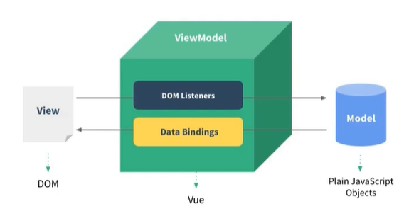
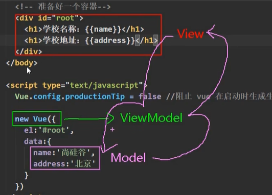

# 一 基本概念

- vue是什么
  
  - 一套用于**构建用户界面**的**渐进式**JavaScript框架
- vue的特点
  - 采用**组件化**模式，提高代码复用率、且让代码更好维护
  - **声明式**编码，让编码人员无需直接操作DOM,提高开发效率
  - 使用**虚拟DOM**+优秀的**Diff算法**,尽量复用DOM节点

- 快速上手

  ```html
  <script src="../../js/vue.js"></script>
  <script>
      Vue.config.productionTip = false;
  </script>
  
  <div id="root">
      <h1>Hello,{{name}}</h1>
  </div>
  <script>
          //1.创建Vue实例   传一个配置对象参数
          new Vue({
          el:'#root', // el用于指定当前Vue实例为哪个容器服务，值通常为css选择器字符串
          data:{// data中用于存储数据，数据供el所指定的容器去使用
              'name':'乃荣a',
          },
      }); 
  
  </script>
  ```

- 初识VUE

  ```
  初识VUE:
  	1.想让Vue工作，就必须创建一个Vue实例，且要传入一个配置对象;
  	2.root容器里的代码依然符合html规范，只不过混入了一些特殊的vue语法
  	3.root容器里面的代码被称为[vue模板]
  ```

# 二 基本语法

## 2.1 两大类

```js
vue模板语法有两大类
1.插值语法:
	功能:用于解析标签体内容
    写法:{{xxx}} xxx是js表达式，且可以直接读取到data中的所有属性
2.指令语法:
	功能:用于解析标签(包括：标签属性、标签体内容、绑定事件....)
	举例:v-bind:href = 'xxx'  或 简写为 :href = 'xxx' 
	备注:vue有很多指令，且形式都是v-???? ，此时只是拿v-bind举例
```

案例

```js
<div class="root">
    <h1>插值语法</h1>
<h3>Hello,{{name}}</h3>
<hr />
    <h1>指令语法</h1>  <!-- :转为js表达式 v-bind: 转为js表达式-->
<a :href="school.url">点我去{{school.name}}学习</a>
</div>
<script>
    //1.创建Vue实例   传一个配置对象参数
    new Vue({
    el:'.root', // el用于指定当前Vue实例为哪个容器服务，值通常为css选择器字符串
    data:{// data中用于存储数据，数据供el所指定的容器去使用
        name:'乃荣',
        school:{
            name:'尚硅谷',
            url:'http://www.atguigu.com',
        }
    },

}); 


el还有一种写法
可以给Vue的实例化对象再  v.$mount("#root") 激活

data也还有一种写法
data:function(){
    return{
        name:'乃荣'
    }
}
```

## 2.2 数据绑定

```
vue有2种数据绑定的方式
	1.单向绑定(v-bind):数据只能从data流向页面
	2.双向绑定(v-model):数据不仅能从data流向页面，还可以从页面流向data
		备注：
			1.双向绑定一般都应用在表单类元素上(input,select等)
			2.v-model:value 可以简写为 v-model 因为v-model默认收集的就是value值
			
普通写法：
    单向数据绑定：<input type="text" v-bind:value="name">
    双向数据绑定：<input type="text" v-model:value="name">
简写写法
    单向数据绑定：<input type="text" :value="name">
    双向数据绑定：<input type="text" v-model="name">
```

## 2.3 MVVM

M:模型：对于data中的数据

V:视图：模板

VM:视图模板: Vue实例对象





## 2.4 数据代理

### 2.4.1 Object.defineProperty 

Object.defineProperty 实现 双向绑定

```js
let number = 18;
let person = {
    name :'张三',
    sex:'男'
}

// 使用Object.defineProperty 添加的属性，默认 不可枚举 不可修改，若想枚举 enumerable:true
Object.defineProperty(person,'age',{
    // value:18,
    enumerable:true, // 控制可以枚举，默认是false
    // writable:true, // 设置可以修改 默认 false
    configurable:true, // 设置可以删除 默认 false

    //当有人读取person的age属性时候，get函数会自动调用,返回值就是age的值 就是value
    get(){
        return number;
    },
    //当有人修改person的age护送下时，set函数会自动调用，且会收到修改的具体值
    set(value){
        number = value;  
    }
})
```

### 2.4.2 数据代理理解

数据代理：通过一个对象代理对另一个对象中属性的操作(读/写)

```js
let obj ={x:100};
let obj2 = {y:200};

Object.defineProperty(obj2,'x',{
    get(){
        return obj.x;
    },
    set(value){
        obj.x = value;
    }
})
```


VUE中的数据代理

```js
1.Vue中的数据代理:
	通过vm对象来代理data对象中属性的操作(读写)
2.Vue中的数据代理的好处：
	通过方便的操作data中的数据
3.基本原理：
	通过Object.defineProperty()把data对象中所有属性添加到vm上.
    为每一个添加到vm上的属性，都指定一个getter/setter.
    再getter/sertter内部去操作(读写)data中对于的属性

```

## 2.5 事件处理

### 2.5.1 基本使用


```
事件的基本使用:
	1.使用v-on:xxx 或 @xxx 绑定事件，其中xxx是事件名
	2.事件的回调需要配置再methods对象中，最终会在vm上
	3.methods中配置的函数，不要用箭头函数，否则this就不会是vm
	4.methods中配置的函数，都是被vue所管理的函数，this的指向是vm 或 组件实例对象
	5.@click='demo' 和 @click="demo($event)" 效果一致，但后者可以传参
```

### 2.5.2 事件修饰符

```html
vue中的事件修饰符
	1.prevent: 阻止默认事件(常用)
	2.stop：阻止事件冒泡(常用)
	3.once：事件只触发一次(常用)
	4.capture:使用事件的捕获默认
	5.self：只有event.target是当前操作的元素时才触发事件
	6.passive：事件的默认行为立即执行，无需等待事件回调执行完毕
    
<!-- @xxx.prevent 表示 event.preventDefault  -->
        <a href="http://www.baidu.com" @click.prevent = "showInfo">点我提示信息</a>


<!-- @xxx.stop   -->
<div class="demo1" @click="showInfo">
    <button @click.stop="showInfo">点我提示信息</button>
</div>

<!-- 只触发一次 -->
<button @click.once="showInfo">点我提示信息</button>
```

### 2.5.3 键盘事件

```js
@keyup # 按下
@keydown # 松开

vue中常用的按键别名
回车 => enter
删除 => delete
退出 => esc
空格 =》 space
换行 => tab
上 =》 up
下 =》 down
左 =》 left
右 =》 right

用法:@keyup.enter="showInfo"
```

## 2.6 计算属性与监视

 ### 2.6.1 计算属性

相比插件事件可以减少缓存消耗

```js
computed:{
    fullName:{
        // 当有人读取fullName时，get会被调用
        get(){
            return this.firstName + this.lastName
        },
        set(value){
            let x = value.split("-")[0];
            let y = value.split("-")[1];
            this.firstName = x;
            this.lastName = y;
        }
    }
}
```

简写(一般情况下不需要set)

```js
computed:{
    // 简
    fullName:function(){
        return this.firstName + this.lastName;
    }
}
```

### 2.6.2 监视属性-watch

```js

```


