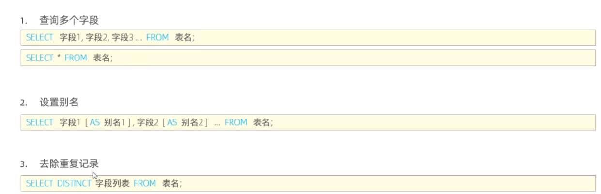

# 基础

## 使用方面

### 启动和停止

> 1.自己开服务
>
> cmd -> services.msc ->Mysql服务名

> 2.shell
>
> 启动：net start mysql80
>
> 停止：net stop mysql80

### 客户端连接

> 1.Mysql提供的客户端命令行工具

> 2.Mysql [-h 127.0.0.1] [-p 3306] -u root - p

### 关系型数据库

概念：建立在关系模型基础上，由多张相互连接的二维表组成的数据库

## SQL

SQL分类


###  DDL

#### 数据库操作


#### 表操作


#### 表修改


### DML


#### 增


#### 改


#### 删


### DQL

#### 基本查询



#### 条件查询


#### 聚合函数


#### 分组查询


#### 排序


#### 分页查询


### 面试:DQL执行顺序


### DCL


#### 管理用户

1.查询用户

```sql
USE mysql;
select * from user;
```

2.创建用户

```sql
create user '用户名'@'主机名' identified by '密码'
```

3.修改用户密码

```sql
alter user '用户名'@'主机名' identified with mysql_native_password by '新密码'
```

4.删除用户

```sql
drop user'用户名'@'主机名'
```


案例

```sql
-- 创建用户 itcast 只能够在当前主机localhost访问，密码123456
create user 'itcast'@'localhost' identified by '123456';
-- 创建用户 heima 可以在任意主机访问该数据库，密码123456
create user 'heima'@'%' identified  by '123456';
-- 修改用户 heima 的访问密码为 1234
alter user 'heima'@'%' identified with mysql_native_password by '1234';
-- 删除itcast@localhost用户
drop user 'itcast'@'localhost';
```

#### 权限控制


案例

```sql
-- 查询权限
show grants for 'heima'@'%';
-- 授予权限
grant all on sys.* to 'heima'@'%';
-- 撤销权限
revoke all on sys.* from 'heima'@'%';
```


## 函数

### 字符串


### 数值函数


### 日期函数


### 流程函数


## 约束

- 概述：约束是作用于表中字段的规则，用于限制存储在表中的数据

- 目的：保证数据库中数据的正确性、有效性和完整性

- 分类：

  

### 案例


### 外键约束

概念：用来让两张表的数据之间建立连接，从而保证数据的一致性和完整性

语法


- 删除/更新行为

  


## 子查询

- 概率：嵌套查询


	

### 标量子查询

- 子查询返回的结构是单个值（数字，日期，字符串），最简单的形式

- 常用的操作符： = <> > >= < <=

```mysql
-- 查询销售部所有员工
select * from emp where dept_id = (select id from dept where name = '销售部');
```

```mysql
-- 查询在 方东白 入职之后的员工信息
select 	* from emp where entrydate > (select entrydate from emp where name = '方冬白');
```

### 列子查询

- 子查询返回的结果是一列（可以是多行）


- 案例


### 行子查询


### 表子查询


## 事务

- 简介：事务是一组操作的集合，它是一个不可分割的工作单位，事务会把所有的操作作为一个整体一起向系统提交或撤销操作请求，即这些操作要么同时成功，要么同时失败。

### 操作

- 方式一

- 查看/设置 事务提交方式

  ```mysql
  select @@autocommit;
  set @@autocommit = 0;  
  -- 1 表示自动提交
  -- 0 表示手动提交 需要commmit
  ```

- 提交事务

  ```mysql
  commit;
  ```

- 回滚事务
  ```mysql
  rollback;
  ```

- 方式二

- 开启事务

  ```mysql
  start transaction 或 begin
  ```

- 提交事务

  ```mysql
  commit;
  ```

- 回滚事务

  ```mysql
  rollback;
  ```

- 案例

```mysql
create table account(
    id int auto_increment primary key comment '主键ID',
    name varchar(10) comment '姓名',
    money int comment '余额'
) comment '账户表';

insert into account(id,name,money) values(null,'张三',2000),(null,'李四',2000);


-- 恢复数据
update account set money = 2000 where name = '张三' or name = '李四';

select @@autocommit;
set @@autocommit = 0; -- 设置为手动提交

-- 转账操作
-- 1. 查询张三账户余额
select * from account where name = '张三';
-- 2. 将张三账户余额-1000
update account set money = money - 1000 where name = '张三';

-- 3. 将李四账户余额+1000
update account set money = money / 0 where name = '李四';
update account set money = money + 1000 where name = '李四';

commit;
rollback;


-- 方式二
start transaction;
-- 转账操作
-- 1. 查询张三账户余额
select * from account where name = '张三';
-- 2. 将张三账户余额-1000
update account set money = money - 1000 where name = '张三';

-- 3. 将李四账户余额+1000
update account set money = money / 0 where name = '李四';
update account set money = money + 1000 where name = '李四';

commit;
rollback;
```


### 四大特性（ACID）

- 原子性：事务不可以再分割，要么全部成功，要么全部失败
- 一致性：事务完成时，必须所有的数据都保持一致的状态

- 隔离性：数据库系统提供的隔离机制，保证事务在不受外部并发操作影响的独立环境下运行
- 持久性：事务一旦提交或者回滚，它对数据库中的数据改变是永久的


### 并发事务问题

- 脏读：一个事务读到 另一个未完成事务所修改的数据 （未提交commit)
- 不可重复读：一个事务先后读取同一条记录，但两次读取的数据不同，称之为不可重复读
- 幻读：一个事务按照条件查询数据时，没有对应的数据行，但是在插入数据时，又发现这行数据已经存在，好像出现了“幻影”

### 事务隔离级别


- 隔离级别操作

```mysql
-- 查看事务隔离级别
select @@transaction_isolation;

-- 设置事务隔离级别
set [session|global] transaction isolation level {read uncommitted|read committed|...|...}
```


# 进阶

## Mysql体系结构


图了解一下就好

## 存储引擎

- 简介
  
- 存储引擎是Mysql体系结构中的核心部分，是Mysql数据库中 建立索引、存储数据、更新/查询数据等技术的实现方式。存储引擎是**基于表**的，而不是基于库的，所以存储引擎也可以被称为**表类型**
  
- 创建表指定引擎(默认INNODB)

  

- 查看当前数据库支持的引擎

  ```mysql
  show engines;
  ```

- 存储引擎的特点
  - InnoDB：是一种高可靠和高性能的通用存储引擎，在Mysql5.5后是默认的存储引擎
    - 特点
    - DML操作遵循ACID模型，支持**事务**  (DML是增删改查语句；ACID是事务四大特性)
    - **行级锁**，提高并发访问性能
    - 支持 **外键** FOREIGN KEY约束，保证数据的完整性和正确性
  - MyISAM：MyISAM是MySQL早期的默认存储引擎
    - 特点
    - 不支持事务，不支持外键
    - 支持表锁，不支持行锁
    - 访问**速度快**
    - 文件
    - xxx.sdi 存储表结构信息
    - xxx.MYD 存储数据
    - xxx.MYI 存储索引

  - Memory：存储在内存中，由于受硬件问题、或断电问题的影响，只能将表作为临时表或缓存使用
    - 特点
    - **内存存放**
    - **hash索引**（默认）
    - 文件
    - xxx.sdi


- 特点一图流


## 场景选择

- InnoDB：如果应用对**事务**完整性要求比较高，在并发条件下要求数据的一致性，数据操作除了插入和查询，还包括**很多更新、删除**，那么会是比较合适的选择

- MyISAM：如果应用是以**读取和插入操作为主**，只有很少的时候更新和删除，并且对事务和并发性要求不高，那么选择这个非常合适
- MEMORY：将数据保存在内存中，访问速度快，通常**用于临时表及缓存**。MEMORY的缺陷就是对表的大小有限制，太大的表无法缓存在内存中，而且无法保障数据的安全性；redis就是这个


## 索引

不再是暴力搜索，而是使用数据结构去提高查找效率

- 优点
  - 更高效率的去搜索数据，降低数据的IO成本
  - 通过索引列对数据进行排序，降低数据排序的成本，降低cpu的消耗
- 缺点
  - 索引列也是要占用空间的
  - 索引大大提高了查询效率，同时却也降低更新表的速度
  - 空间换时间

### 索引结构

索引在第三层 存储引擎实现

不同的存储引擎有着不同的结构，主要包含以下层


支持情况


- 二叉树

  

  -  缺点：顺序插入时，会形成一个链表，查询性能会降低，层级越深速度越慢


#### B树

（多路平衡查找树）

- 以一颗最大度数为 5 的 B树为例


#### B+树

- 以一颗最大度数为 4 的 B+树为例


- 比B树的主要区别
  - 所有结点都会出现在叶子结点
  - 叶子结点会形成一个单向链表
- Mysql对B+树做了优化，对原来的单向链表改成了双向循环链表
  - 提高区间访问速度

#### Hash


### 索引分类


聚集索引：叶子结点下面是整行数据

二级索引：叶子结点下面是ID

> 

> 先通过二级索引，拿到对应Arm的ID, 因为要返回*，所以再使用聚集索引通过ID返回整行数据

### 索引语法

- 创建索引

  ```mysql
  create [unique|fulltext] index index_name on table_name (index_col,name,...)
  ```

- 查看索引

  ```mysql
  show index from table_name;	
  ```

- 删除索引

  ```mysql
  drop index index_name on table_name;
  ```

  

  